# Bitacora de creación del backend manual

## FASE 1 — 00_BASE_INIT_NESTJS

### 1.1 — Crear carpetas padre y permisos

Preparacion de la ruta de trabajo en WSL

``` bash
mkdir -p /home/betto_ubuntu/ia-lab/dw-2026-bettoo02/projects/app-Arrendo360
chmod -R 755 /home/betto_ubuntu/ia-lab/dw-2026-bettoo02/projects/app-Arrendo360
```


### 1.2 — Instalar Nest CLI (si no existe)

El CLI genera `main.ts`, `app.module.ts`, `tsconfig`, scripts npm, etc.

``` bash
npm install -g @nestjs/cli
nest --version
```


### 1.3 — Crear proyecto NestJS

Usamos el nombre `backend` (workspace didáctico). Responde las preguntas del CLI (package manager: npm).

``` bash
cd /home/betto_ubuntu/ia-lab/dw-2026-bettoo02/projects/app-Arrendo360
nest new backend
cd backend
```


### 1.4 — Crear `.env` mínimo (puerto)

El puerto `3002` evita choques con el 3000. Más adelante el `.env` crecerá con BD.

``` bash
cat > .env <<'EOF_BACKEND'
PORT=3002
NODE_ENV=development
EOF_BACKEND
```


## FASE 2 — `01_BASE_DEPS_Y_PUERTO`

### 2.1 — Dependencias de producción

Config, Swagger, JWT/Passport, Sequelize + drivers de 4 motores, validación, bcrypt y utilidades HTTP.

``` bash
npm install @nestjs/config @nestjs/swagger @nestjs/jwt @nestjs/passport @nestjs/mapped-types \
  passport passport-jwt sequelize sequelize-typescript mysql2 pg tedious oracledb \
  class-validator class-transformer bcrypt reflect-metadata express compression helmet
```


### 2.2 — Dependencias de desarrollo

Tipados y sequelize-cli para herramientas de BD.

``` bash
npm install -D @types/bcrypt @types/passport-jwt sequelize-cli
```


### 2.3 — Script para liberar puerto (evita EADDRINUSE)

Si reinicias Nest sin matar el proceso anterior, Node lanza `listen EADDRINUSE`. Este script lee `PORT` del `.env` y libera el puerto en Linux/WSL.

``` bash
mkdir -p scripts
cat > scripts/free-port.js <<'EOF_BACKEND'
/**
 * Libera el puerto configurado en .env (PORT) antes de arrancar Nest.
 * Evita EADDRINUSE cuando queda una instancia previa de start:dev.
 */
import { execSync } from 'child_process';
import fs from 'fs';
import path from 'path';
import { fileURLToPath } from 'url';
 
const __filename = fileURLToPath(import.meta.url);
const __dirname = path.dirname(__filename);
 
function readPortFromEnv() {
  const envPath = path.join(__dirname, '..', '.env');
  let port = 3002;
 
  if (fs.existsSync(envPath)) {
    const content = fs.readFileSync(envPath, 'utf8');
    const match = content.match(/^\s*PORT\s*=\s*(\d+)\s*$/m);
    if (match) {
      port = parseInt(match[1], 10);
    }
  }
 
  if (process.env.PORT) {
    port = parseInt(process.env.PORT, 10) || port;
  }
 
  return port;
}
 
function freePort(port) {
  try {
    // Linux/WSL: mata el proceso que escucha en el puerto
    execSync(`fuser -k ${port}/tcp`, { stdio: 'ignore' });
    console.log(`✅ Puerto ${port} liberado`);
  } catch {
    // No había proceso escuchando: ok
    console.log(`ℹ️  Puerto ${port} disponible`);
  }
}
 
const port = readPortFromEnv();
freePort(port);
EOF_BACKEND
```


### 2.4 — Actualizar scripts npm en package.json

Integra `free:port` en `start:dev` / `start:debug`. Aplica el cambio con Node para no editar JSON a mano.

``` bash
node <<'EOF_BACKEND'
const fs = require('fs');
const pkg = JSON.parse(fs.readFileSync('package.json', 'utf8'));
pkg.scripts = {
  ...pkg.scripts,
  'free:port': 'node scripts/free-port.js',
  'start:dev': 'npm run free:port && nest start --watch',
  'start:debug': 'npm run free:port && nest start --debug --watch',
};
fs.writeFileSync('package.json', JSON.stringify(pkg, null, 2) + '\n');
console.log('✅ package.json scripts actualizados');
EOF_BACKEND
```


### 2.5 — Verificar arranque base

Debe levantar el Hello World de Nest en el puerto del `.env`.

``` bash
npm run start:dev
# Ctrl+C cuando veas el log de arranque
curl -s http://localhost:3002 || true
```


------------------------------------------------------------------------

## FASE 3 — `02_BASE_ESTRUCTURA_CA`

### 3.1 — Crear árbol base de carpetas

Aún no hay código de dominio. Solo directorios y módulos vacíos de features para anclar imports futuros.

``` bash
mkdir -p src/config/{app,database,environment,logger,swagger}
mkdir -p src/common/{constants,decorators,enums,exceptions,filters,guards,interceptors,interfaces,pipes,types,utils,validators}
mkdir -p src/infrastructure/database/{sequelize,migrations,seeders}
mkdir -p src/infrastructure/logging
mkdir -p src/features/shipping/{companies,contacts,addresses,shipments,packages,tracking-events,couriers,routes,rates,delivery-proofs,invoices}/{application/{dto,mappers,use-cases},domain/{entities,enums,exceptions,interfaces,services,validators},infrastructure/persistence/{models,repositories,migrations,seeders},presentation/http/{controllers,decorators,serializers,swagger},tests}
cat > src/features/shipping/shipping.module.ts <<'EOF_BACKEND'
import { Module } from '@nestjs/common';

@Module({
  imports: [],
  exports: [],
})
export class ShippingModule {}
EOF_BACKEND
```

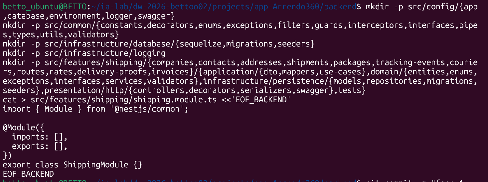

### 3.2 — Recordatorio de responsabilidades

| Carpeta           | Responsabilidad                              |
|-------------------|----------------------------------------------|
| `config/`         | Cómo se configura la app (env, jwt, swagger) |
| `common/`         | Piezas transversales reutilizables           |
| `infrastructure/` | Detalles técnicos (Sequelize, bcrypt, JWT)   |
| `features/*`      | Dominios (business/auth) con CA interna      |

**Error típico:** poner `@Table` de Sequelize dentro de `domain/entities`.

------------------------------------------------------------------------

## FASE 4 — `03_BASE_ENTORNO_ENV`

### 4.1 — Crear `.env.example` y actualizar `.env` completo

El `.env` real NO se sube a Git. Usa BD dedicada `enlace_express`.

**Contrato multi-base**

- `DB_DIALECT` = `mysql` \| `postgres` \| `mssql` \| `oracle` (elige qué motor corre).
- MySQL: `DB_MYSQL_HOST`, `DB_MYSQL_PORT`, `DB_MYSQL_USERNAME`, `DB_MYSQL_PASSWORD`, `DB_MYSQL_NAME`.
- PostgreSQL: `DB_POSTGRES_*` (puerto lab 5432).
- SQL Server: `DB_MSSQL_*` (puerto lab 1433, usuario `sa`).
- Oracle: `DB_ORACLE_*` + `DB_ORACLE_CONNECT_STRING` (puerto lab 1521).
- Para cambiar de motor, cambia **solo** `DB_DIALECT`. No uses `DB_HOST` / `DB_USERNAME` genéricos.

``` bash
cat > .env.example <<'EOF_BACKEND'
# ==========================================
# APP
# ==========================================
PORT=3002
NODE_ENV=development

# ==========================================
# DATABASE
# ==========================================
# Selector del motor en ejecución (un solo valor):
# mysql | postgres | mssql | oracle
DB_DIALECT=mysql

# --- MYSQL ---
DB_MYSQL_HOST=172.28.196.208
DB_MYSQL_PORT=3306
DB_MYSQL_USERNAME=beto
DB_MYSQL_PASSWORD=1231
DB_MYSQL_NAME=Arrendo360

# --- POSTGRES ---
DB_POSTGRES_HOST=172.28.196.208
DB_POSTGRES_PORT=5432
DB_POSTGRES_USERNAME=beto
DB_POSTGRES_PASSWORD=1231
DB_POSTGRES_NAME=Arrendo360

# --- MSSQL (SQL Server) ---
DB_MSSQL_HOST=172.28.196.208
DB_MSSQL_PORT=1433
DB_MSSQL_USERNAME=beto
DB_MSSQL_PASSWORD=Betoland@20
DB_MSSQL_NAME=Arrendo360

# --- ORACLE ---
DB_ORACLE_HOST=172.28.196.208
DB_ORACLE_PORT=1521
DB_ORACLE_USERNAME=system
DB_ORACLE_PASSWORD=1231
DB_ORACLE_NAME=Arrendo360
DB_ORACLE_CONNECT_STRING=172.28.196.208:1521/XEPDB1

EOF_BACKEND
```

``` bash
cp .env.example .env
# Laboratorio: DB_DIALECT + un bloque por motor (MYSQL/POSTGRES/MSSQL/ORACLE).
# Cambia solo el bloque del motor que uses. Mantén DB_*_NAME=Arrendo360
```

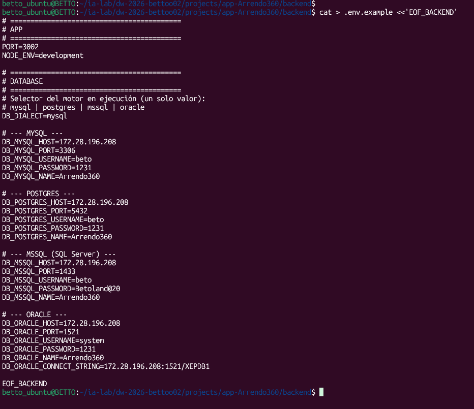

### 4.2 — Interface de entorno

Tipos TypeScript de las variables de entorno (APP, DB) y enum de dialectos.

**Archivo:** `src/config/environment/env.interface.ts`

``` bash
mkdir -p src/config/environment
cat > src/config/environment/env.interface.ts <<'EOF_BACKEND'
export enum Environment {
  Development = 'development',
  Production = 'production',
  Test = 'test',
}

export enum DatabaseDialect {
  MySQL = 'mysql',
  Postgres = 'postgres',
  MSSQL = 'mssql',
  Oracle = 'oracle',
}

export interface AppConfig {
  port: number;
  nodeEnv: Environment;
}

export interface DatabaseConfig {
  dialect: DatabaseDialect;
  host: string;
  port: number;
  username: string;
  password: string;
  database: string;
  connectString?: string;
}

export interface EnvironmentConfig {
  app: AppConfig;
  database: DatabaseConfig;
}
EOF_BACKEND
```

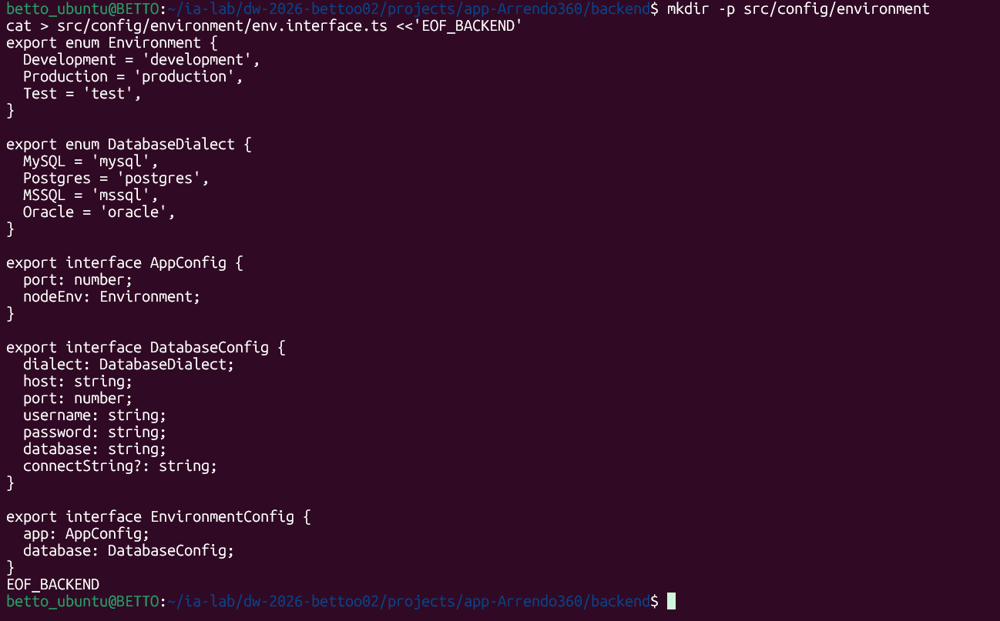

### 4.3 — Validación de entorno con class-validator

Si falta DB_DIALECT es inválido, o el bloque del motor activo está vacío, el boot falla con mensaje claro.

**Archivo:** `src/config/environment/env.validation.ts`

``` bash
mkdir -p src/config/environment
cat > src/config/environment/env.validation.ts <<'EOF_BACKEND'
import { plainToInstance } from 'class-transformer';
import {
  IsEnum,
  IsNumber,
  IsOptional,
  IsString,
  Max,
  Min,
  validateSync,
} from 'class-validator';
import {
  assertActiveDialectCredentials,
  resolveDialectCredentials,
} from './db-env';
import { DatabaseDialect, Environment } from './env.interface';

export class EnvironmentVariables {
  @IsEnum(Environment)
  @IsOptional()
  NODE_ENV: Environment = Environment.Development;

  @IsNumber()
  @Min(0)
  @Max(65535)
  @IsOptional()
  PORT: number = 3002;

  @IsEnum(DatabaseDialect)
  DB_DIALECT: DatabaseDialect;

  @IsString()
  @IsOptional()
  DB_MYSQL_HOST?: string;

  @IsNumber()
  @IsOptional()
  DB_MYSQL_PORT?: number;

  @IsString()
  @IsOptional()
  DB_MYSQL_USERNAME?: string;

  @IsString()
  @IsOptional()
  DB_MYSQL_PASSWORD?: string;

  @IsString()
  @IsOptional()
  DB_MYSQL_NAME?: string;

  @IsString()
  @IsOptional()
  DB_POSTGRES_HOST?: string;

  @IsNumber()
  @IsOptional()
  DB_POSTGRES_PORT?: number;

  @IsString()
  @IsOptional()
  DB_POSTGRES_USERNAME?: string;

  @IsString()
  @IsOptional()
  DB_POSTGRES_PASSWORD?: string;

  @IsString()
  @IsOptional()
  DB_POSTGRES_NAME?: string;

  @IsString()
  @IsOptional()
  DB_MSSQL_HOST?: string;

  @IsNumber()
  @IsOptional()
  DB_MSSQL_PORT?: number;

  @IsString()
  @IsOptional()
  DB_MSSQL_USERNAME?: string;

  @IsString()
  @IsOptional()
  DB_MSSQL_PASSWORD?: string;

  @IsString()
  @IsOptional()
  DB_MSSQL_NAME?: string;

  @IsString()
  @IsOptional()
  DB_ORACLE_HOST?: string;

  @IsNumber()
  @IsOptional()
  DB_ORACLE_PORT?: number;

  @IsString()
  @IsOptional()
  DB_ORACLE_USERNAME?: string;

  @IsString()
  @IsOptional()
  DB_ORACLE_PASSWORD?: string;

  @IsString()
  @IsOptional()
  DB_ORACLE_NAME?: string;

  @IsString()
  @IsOptional()
  DB_ORACLE_CONNECT_STRING?: string;
}

function formatValidationErrors(
  errors: ReturnType<typeof validateSync>,
): string {
  return errors
    .map((error) => {
      const constraints = error.constraints
        ? Object.values(error.constraints).join(', ')
        : 'valor inválido';
      return `${error.property}: ${constraints}`;
    })
    .join('; ');
}

export function validate(config: Record<string, unknown>): EnvironmentVariables {
  const validatedConfig = plainToInstance(EnvironmentVariables, config, {
    enableImplicitConversion: true,
    exposeDefaultValues: true,
  });

  const errors = validateSync(validatedConfig, {
    skipMissingProperties: false,
  });

  if (errors.length > 0) {
    throw new Error(
      `Error de configuración: variable(s) crítica(s) inválida(s) o ausente(s). ${formatValidationErrors(errors)}. Copia .env.example a .env y completa el bloque del motor elegido (DB_DIALECT).`,
    );
  }

  assertActiveDialectCredentials(resolveDialectCredentials(validatedConfig));

  return validatedConfig;
}
EOF_BACKEND
```

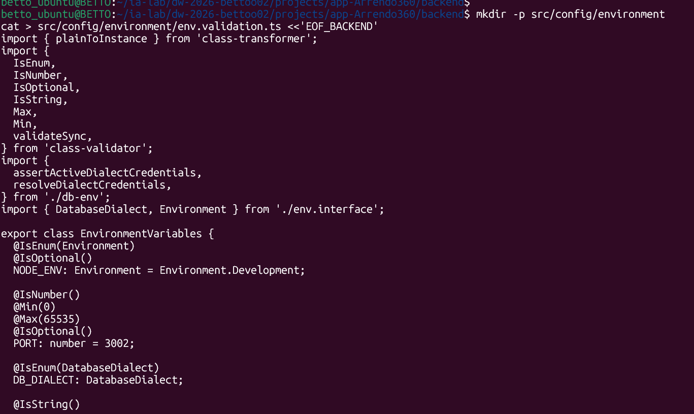

### 4.4 — Resolver de credenciales por motor

Lee el bloque DB_MYSQL\_\* / DB_POSTGRES\_\* / DB_MSSQL\_\* / DB_ORACLE\_\* según DB_DIALECT.

**Archivo:** `src/config/environment/db-env.ts`

``` bash
mkdir -p src/config/environment
cat > src/config/environment/db-env.ts <<'EOF_BACKEND'
import { DatabaseConfig, DatabaseDialect } from './env.interface';

export const DEFAULT_DB_PORTS: Record<DatabaseDialect, number> = {
  [DatabaseDialect.MySQL]: 3306,
  [DatabaseDialect.Postgres]: 5433,
  [DatabaseDialect.MSSQL]: 1433,
  [DatabaseDialect.Oracle]: 1521,
};

export type DialectEnvSource = {
  DB_DIALECT: DatabaseDialect;
  DB_MYSQL_HOST?: string;
  DB_MYSQL_PORT?: string | number;
  DB_MYSQL_USERNAME?: string;
  DB_MYSQL_PASSWORD?: string;
  DB_MYSQL_NAME?: string;
  DB_POSTGRES_HOST?: string;
  DB_POSTGRES_PORT?: string | number;
  DB_POSTGRES_USERNAME?: string;
  DB_POSTGRES_PASSWORD?: string;
  DB_POSTGRES_NAME?: string;
  DB_MSSQL_HOST?: string;
  DB_MSSQL_PORT?: string | number;
  DB_MSSQL_USERNAME?: string;
  DB_MSSQL_PASSWORD?: string;
  DB_MSSQL_NAME?: string;
  DB_ORACLE_HOST?: string;
  DB_ORACLE_PORT?: string | number;
  DB_ORACLE_USERNAME?: string;
  DB_ORACLE_PASSWORD?: string;
  DB_ORACLE_NAME?: string;
  DB_ORACLE_CONNECT_STRING?: string;
};

function toPort(value: string | number | undefined, fallback: number): number {
  if (typeof value === 'number' && Number.isFinite(value)) {
    return value;
  }
  if (typeof value === 'string' && value.trim() !== '') {
    const parsed = parseInt(value, 10);
    if (Number.isFinite(parsed)) {
      return parsed;
    }
  }
  return fallback;
}

function text(value: string | undefined): string {
  return value?.trim() ?? '';
}

export function resolveDialectCredentials(
  env: DialectEnvSource,
): DatabaseConfig {
  const dialect = env.DB_DIALECT;
  const port = DEFAULT_DB_PORTS[dialect];

  switch (dialect) {
    case DatabaseDialect.MySQL:
      return {
        dialect,
        host: text(env.DB_MYSQL_HOST),
        port: toPort(env.DB_MYSQL_PORT, port),
        username: text(env.DB_MYSQL_USERNAME),
        password: text(env.DB_MYSQL_PASSWORD),
        database: text(env.DB_MYSQL_NAME),
      };
    case DatabaseDialect.Postgres:
      return {
        dialect,
        host: text(env.DB_POSTGRES_HOST),
        port: toPort(env.DB_POSTGRES_PORT, port),
        username: text(env.DB_POSTGRES_USERNAME),
        password: text(env.DB_POSTGRES_PASSWORD),
        database: text(env.DB_POSTGRES_NAME),
      };
    case DatabaseDialect.MSSQL:
      return {
        dialect,
        host: text(env.DB_MSSQL_HOST),
        port: toPort(env.DB_MSSQL_PORT, port),
        username: text(env.DB_MSSQL_USERNAME),
        password: text(env.DB_MSSQL_PASSWORD),
        database: text(env.DB_MSSQL_NAME),
      };
    case DatabaseDialect.Oracle:
      return {
        dialect,
        host: text(env.DB_ORACLE_HOST),
        port: toPort(env.DB_ORACLE_PORT, port),
        username: text(env.DB_ORACLE_USERNAME),
        password: text(env.DB_ORACLE_PASSWORD),
        database: text(env.DB_ORACLE_NAME),
        connectString: text(env.DB_ORACLE_CONNECT_STRING) || undefined,
      };
    default:
      throw new Error(
        `Error de configuración: DB_DIALECT inválido. Use mysql, postgres, mssql u oracle.`,
      );
  }
}

export function assertActiveDialectCredentials(config: DatabaseConfig): void {
  const prefix: Record<DatabaseDialect, string> = {
    [DatabaseDialect.MySQL]: 'DB_MYSQL',
    [DatabaseDialect.Postgres]: 'DB_POSTGRES',
    [DatabaseDialect.MSSQL]: 'DB_MSSQL',
    [DatabaseDialect.Oracle]: 'DB_ORACLE',
  };
  const tag = prefix[config.dialect];
  const missing: string[] = [];

  if (!config.host) missing.push(`${tag}_HOST`);
  if (!config.username) missing.push(`${tag}_USERNAME`);
  if (!config.database) missing.push(`${tag}_NAME`);
  if (config.dialect === DatabaseDialect.Oracle && !config.connectString) {
    missing.push('DB_ORACLE_CONNECT_STRING');
  }

  if (missing.length > 0) {
    throw new Error(
      `Error de configuración: variable(s) crítica(s) inválida(s) o ausente(s) para ${config.dialect}: ${missing.join(', ')}. Completa el bloque de ese motor en .env (no commitees secretos).`,
    );
  }
}
EOF_BACKEND
```

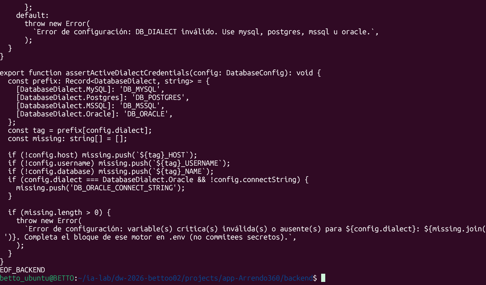

### 4.5 — Factory registerAs de entorno

Expone `environment.*` vía ConfigService (`registerAs`).

**Archivo:** `src/config/environment/env.config.ts`

``` bash
mkdir -p src/config/environment
cat > src/config/environment/env.config.ts <<'EOF_BACKEND'
import { registerAs } from '@nestjs/config';
import { resolveDialectCredentials } from './db-env';
import { Environment } from './env.interface';
import { validate } from './env.validation';

export const ENV_CONFIG_NAME = 'environment';

export const envConfig = registerAs(ENV_CONFIG_NAME, () => {
  const validated = validate(process.env);

  return {
    app: {
      port: validated.PORT,
      nodeEnv: validated.NODE_ENV ?? Environment.Development,
    },
    database: resolveDialectCredentials(validated),
  };
});
EOF_BACKEND
```

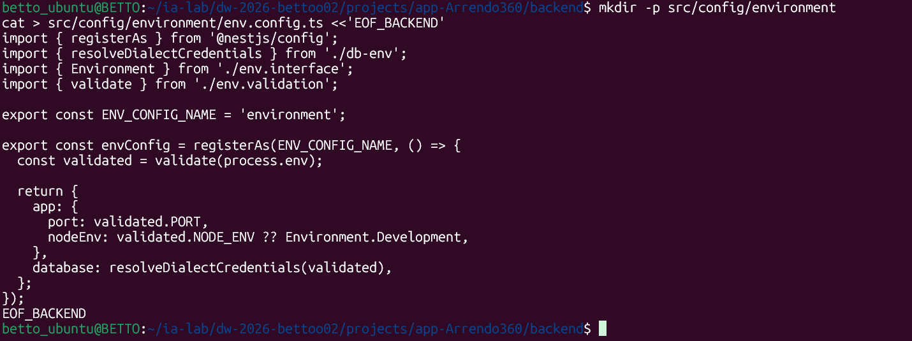

## FASE 5 — `04_BASE_DATABASE_SEQUELIZE`

### 5.1 — Constante SEQUELIZE_TOKEN

Token DI para inyectar la instancia Sequelize en repositorios.

**Archivo:** `src/common/constants/database.constants.ts`

``` bash
mkdir -p src/common/constants
cat > src/common/constants/database.constants.ts <<'EOF_BACKEND'
export const SEQUELIZE_TOKEN = 'SEQUELIZE';
EOF_BACKEND
```

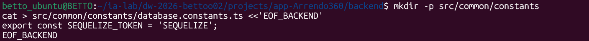

### 5.2 — Tipos auxiliares de database config

Tipos auxiliares del bloque config/database (legado/compat).

**Archivo:** `src/config/database/database.types.ts`

``` bash
mkdir -p src/config/database
cat > src/config/database/database.types.ts <<'EOF_BACKEND'
import { Options as SequelizeOptions } from 'sequelize';

export type DialectOptions =
  | { dialect: 'mysql'; options?: SequelizeOptions }
  | { dialect: 'postgres'; options?: SequelizeOptions }
  | { dialect: 'mssql'; options?: SequelizeOptions }
  | { dialect: 'oracle'; options?: SequelizeOptions };
EOF_BACKEND
```

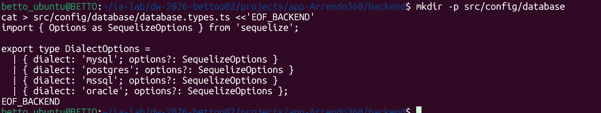

### 5.3 — database.config.ts

Factory registerAs opcional para namespace `database` (complementa environment).

**Archivo:** `src/config/database/database.config.ts`

``` bash
mkdir -p src/config/database
cat > src/config/database/database.config.ts <<'EOF_BACKEND'
import { registerAs } from '@nestjs/config';
import { resolveDialectCredentials } from '../environment/db-env';
import { DatabaseDialect } from '../environment/env.interface';

export const DATABASE_CONFIG_NAME = 'database';

const dialectModuleMap: Record<DatabaseDialect, string> = {
  [DatabaseDialect.MySQL]: 'mysql2',
  [DatabaseDialect.Postgres]: 'pg',
  [DatabaseDialect.MSSQL]: 'tedious',
  [DatabaseDialect.Oracle]: 'oracledb',
};

export const databaseConfig = registerAs(DATABASE_CONFIG_NAME, () => {
  const dialect =
    (process.env.DB_DIALECT as DatabaseDialect) || DatabaseDialect.MySQL;
  const credentials = resolveDialectCredentials({
    DB_DIALECT: dialect,
    ...process.env,
  });

  return {
    ...credentials,
    dialectModulePath: dialectModuleMap[dialect],
    autoLoadModels: true,
    synchronize: process.env.NODE_ENV !== 'production',
    logging: process.env.NODE_ENV === 'development' ? console.log : false,
  };
});
EOF_BACKEND
```

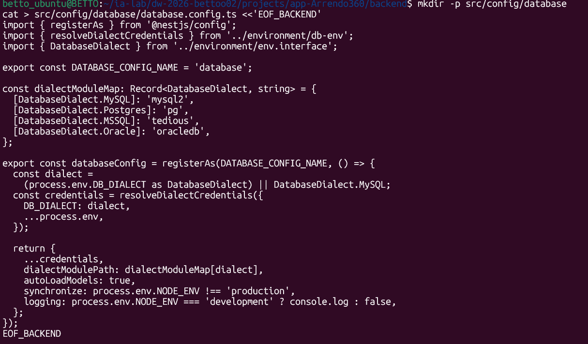

### 5.4 — database.module.ts / providers

Módulo de configuración de BD (forFeature). Los providers quedan vacíos a propósito.

**Archivo:** `src/config/database/database.module.ts`

``` bash
mkdir -p src/config/database
cat > src/config/database/database.module.ts <<'EOF_BACKEND_IA'
import { Module } from '@nestjs/common';
import { ConfigModule } from '@nestjs/config';
import { databaseConfig } from './database.config';

@Module({
  imports: [ConfigModule.forFeature(databaseConfig)],
  exports: [ConfigModule],
})
export class DatabaseConfigModule {}
EOF_BACKEND_IA
```

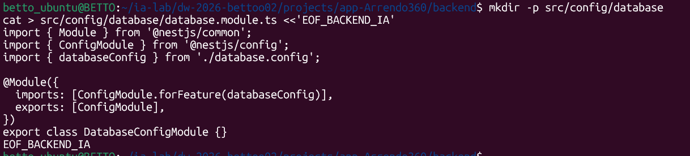

### 5.5 — database.providers.ts

Placeholder de providers de config/database.

**Archivo:** `src/config/database/database.providers.ts`

``` bash
mkdir -p src/config/database
cat > src/config/database/database.providers.ts <<'EOF_BACKEND'
export const DATABASE_PROVIDERS = [];
EOF_BACKEND
```

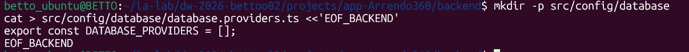

### 5.6 — Opciones Sequelize por dialecto

Arma host/port/user/password/logging con el bloque del motor seleccionado por DB_DIALECT.

**Archivo:** `src/infrastructure/database/sequelize/sequelize.options.ts`

``` bash
mkdir -p src/infrastructure/database/sequelize
cat > src/infrastructure/database/sequelize/sequelize.options.ts <<'EOF_BACKEND_IA'
import { SequelizeOptions } from 'sequelize-typescript';
import { resolveDialectCredentials } from '../../../config/environment/db-env';
import { DatabaseDialect } from '../../../config/environment/env.interface';

export function getSequelizeOptions(
  dialect: DatabaseDialect,
): Partial<SequelizeOptions> {
  const credentials = resolveDialectCredentials({
    DB_DIALECT: dialect,
    ...process.env,
  });

  const base: SequelizeOptions = {
    dialect: dialect as SequelizeOptions['dialect'],
    host: credentials.host,
    port: credentials.port,
    username: credentials.username,
    password: credentials.password,
    database: credentials.database,
    logging: process.env.NODE_ENV === 'development' ? console.log : false,
    define: {
      underscored: false,
      freezeTableName: true,
    },
  };

  switch (dialect) {
    case DatabaseDialect.MSSQL:
      return {
        ...base,
        dialectOptions: {
          options: {
            encrypt: true,
            trustServerCertificate: true,
          },
        },
      };
    case DatabaseDialect.Oracle:
      return {
        ...base,
        dialectOptions: {
          connectString: credentials.connectString,
        },
      };
    default:
      return base;
  }
}
EOF_BACKEND_IA
```

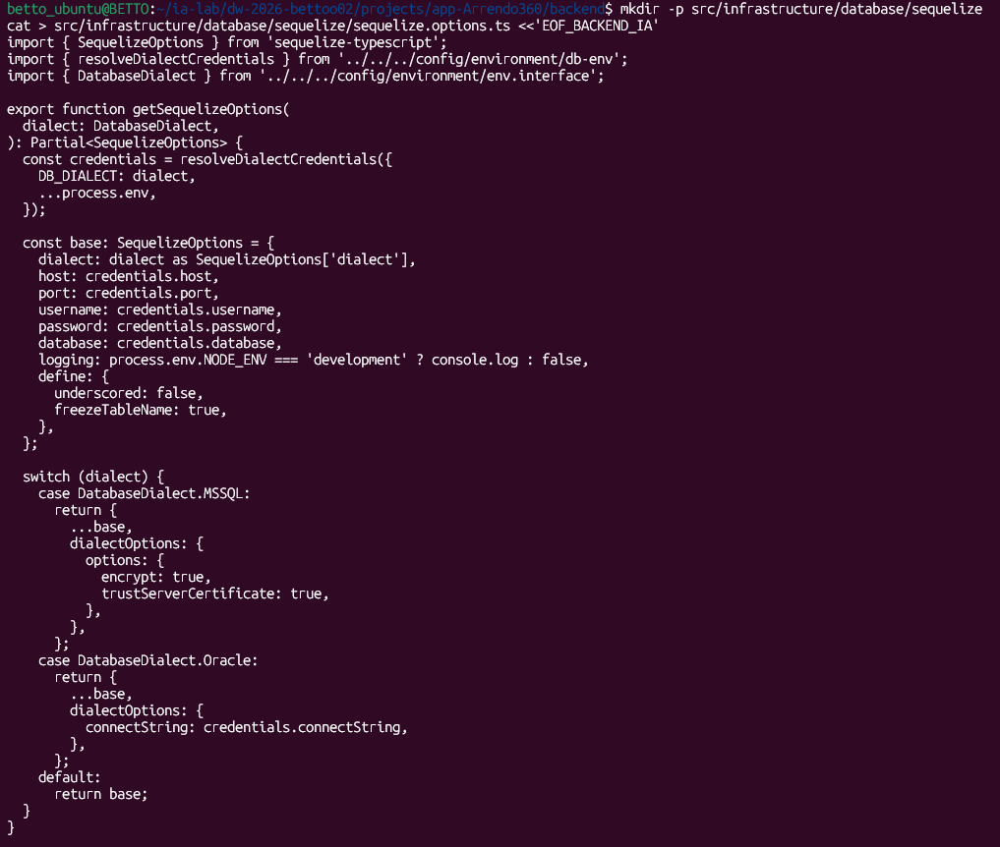

### 5.7 — Factory Sequelize (sin modelos aún)

Crea la instancia Sequelize. `ALL_MODELS` empieza vacío: se llena al crear cada entidad.

**Archivo:** `src/infrastructure/database/sequelize/sequelize.factory.ts`

``` bash
mkdir -p src/infrastructure/database/sequelize
cat > src/infrastructure/database/sequelize/sequelize.factory.ts <<'EOF_BACKEND_IA'
import { Sequelize } from 'sequelize-typescript';
import { DatabaseDialect } from '../../../config/environment/env.interface';
import { getSequelizeOptions } from './sequelize.options';


export const ALL_MODELS = [
  // (aún sin modelos — se agregan por feature)
];

export async function createSequelizeInstance(
  dialect: DatabaseDialect,
): Promise<Sequelize> {
  const options = getSequelizeOptions(dialect);

  let dialectModule: any;

  switch (dialect) {
    case DatabaseDialect.MySQL:
      dialectModule = require('mysql2');
      break;
    case DatabaseDialect.Postgres:
      dialectModule = require('pg');
      break;
    case DatabaseDialect.MSSQL:
      dialectModule = require('tedious');
      break;
    case DatabaseDialect.Oracle:
      dialectModule = require('oracledb');
      break;
    default:
      throw new Error(`Dialecto no soportado: ${dialect}`);
  }

  const sequelize = new Sequelize({
    ...options,
    dialectModule,
    models: ALL_MODELS,
  } as any);

  try {
    await sequelize.authenticate();
    console.log(`✅ Conexión exitosa a ${dialect.toUpperCase()}`);
  } catch (error: any) {
    console.error(
      `❌ Error conectando a ${dialect.toUpperCase()}:`,
      error.message,
    );
    throw error;
  }

  if (process.env.NODE_ENV !== 'production') {
    await sequelize.sync({ alter: false });
    console.log('✅ Tablas sincronizadas');
  }

  return sequelize;
}
EOF_BACKEND_IA
```

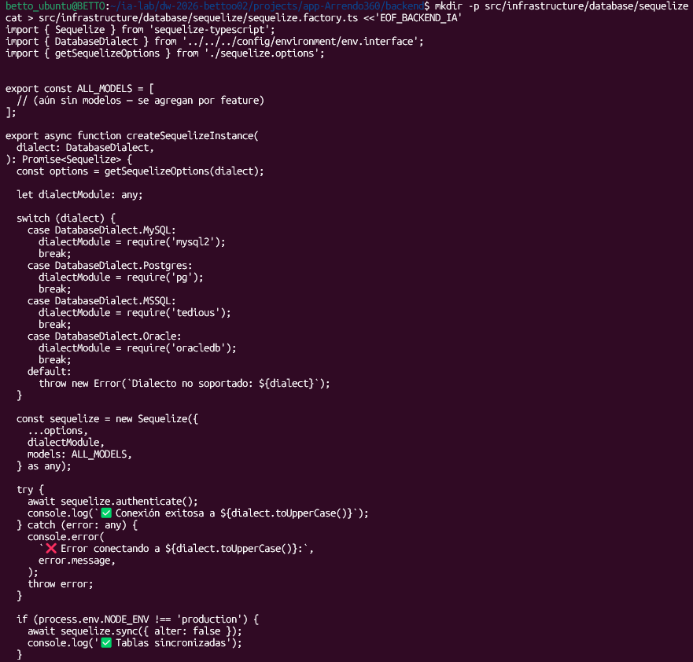

### 5.8 — DatabaseSeederService (sin seeders aún)

Hook OnModuleInit para seeders. Todavía no llama a ningún seeder de feature.

**Archivo:** `src/infrastructure/database/seeders/database-seeder.service.ts`

``` bash
mkdir -p src/infrastructure/database/seeders
cat > src/infrastructure/database/seeders/database-seeder.service.ts <<'EOF_BACKEND_IA'
import { Injectable, Logger, OnModuleInit } from '@nestjs/common';


/**
 * Ejecuta seeders en orden de dependencias.
 * Solo en entornos no productivos.
 */
@Injectable()
export class DatabaseSeederService implements OnModuleInit {
  private readonly logger = new Logger(DatabaseSeederService.name);

  async onModuleInit(): Promise<void> {
    if (process.env.NODE_ENV === 'production') {
      return;
    }

    try {
      // sin seeders aún
      this.logger.log('✅ Seeders ejecutados');
    } catch (error: any) {
      this.logger.error(`❌ Error en seeders: ${error.message}`, error.stack);
      throw error;
    }
  }
}
EOF_BACKEND_IA
```

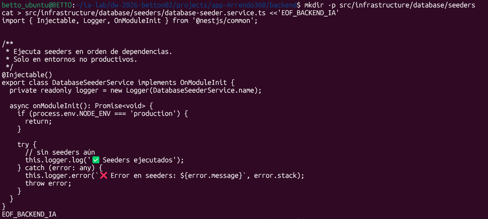

### 5.9 — Módulo global Sequelize

Módulo `@Global()` que provee `SEQUELIZE_TOKEN` + ejecuta seeders.

**Archivo:** `src/infrastructure/database/sequelize/sequelize.module.ts`

``` bash
mkdir -p src/infrastructure/database/sequelize
cat > src/infrastructure/database/sequelize/sequelize.module.ts <<'EOF_BACKEND_IA'
import { Module, Global } from '@nestjs/common';
import { ConfigService } from '@nestjs/config';
import { Sequelize } from 'sequelize-typescript';
import { DatabaseDialect } from '../../../config/environment/env.interface';
import { SEQUELIZE_TOKEN } from '../../../common/constants/database.constants';
import { createSequelizeInstance } from './sequelize.factory';
import { DatabaseSeederService } from '../seeders/database-seeder.service';

@Global()
@Module({
  providers: [
    {
      provide: SEQUELIZE_TOKEN,
      useFactory: async (configService: ConfigService): Promise<Sequelize> => {
        const dialect = configService.get<DatabaseDialect>(
          'environment.database.dialect',
          DatabaseDialect.MySQL,
        );
        return createSequelizeInstance(dialect);
      },
      inject: [ConfigService],
    },
    DatabaseSeederService,
  ],
  exports: [SEQUELIZE_TOKEN],
})
export class SequelizeDatabaseModule {}
EOF_BACKEND_IA
```

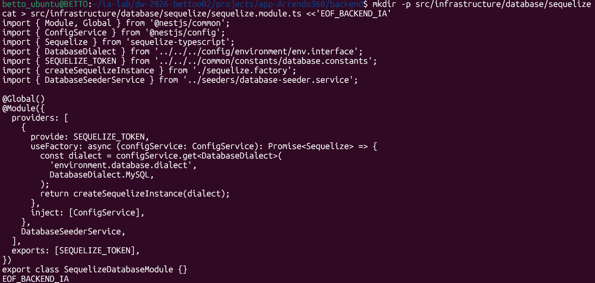

### 5.10 — Verificar conexión a BD

Crea la BD vacía `Arrendo360` en el motor que indica `DB_DIALECT`. Aún no hay tablas de negocio. Si falla el authenticate, corrige el **bloque de ese motor** en `.env` (no el de otro).

``` bash
npm run start:dev
```

**MYSQL**

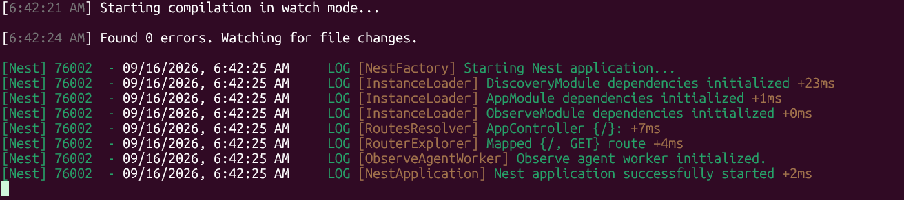

**POSTGRES**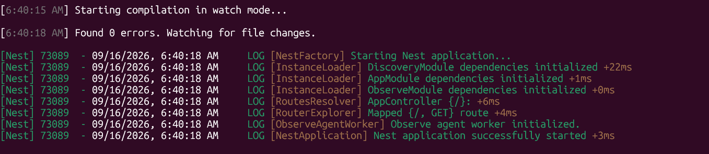

**MS SQL SERVER**

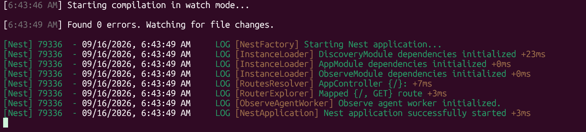

**ORACLE**

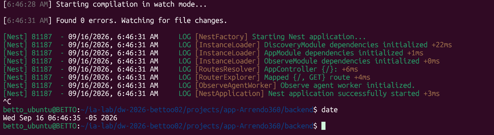
