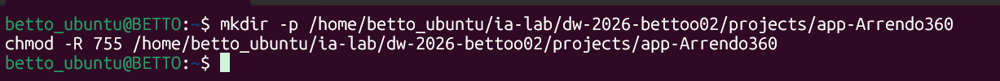
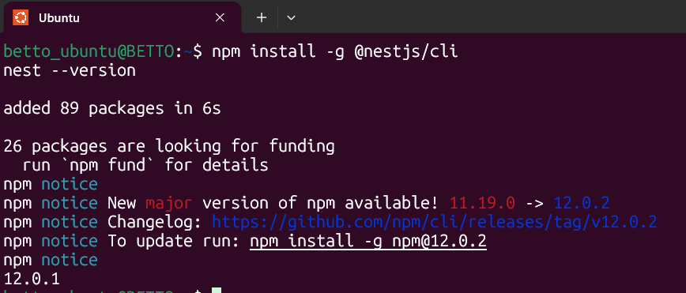
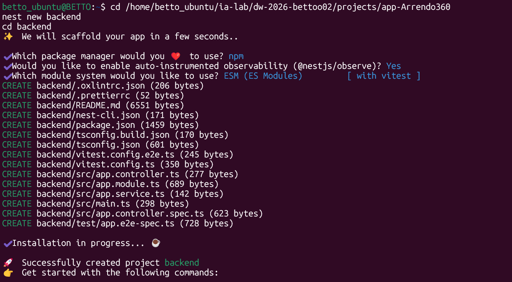
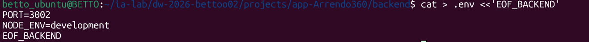
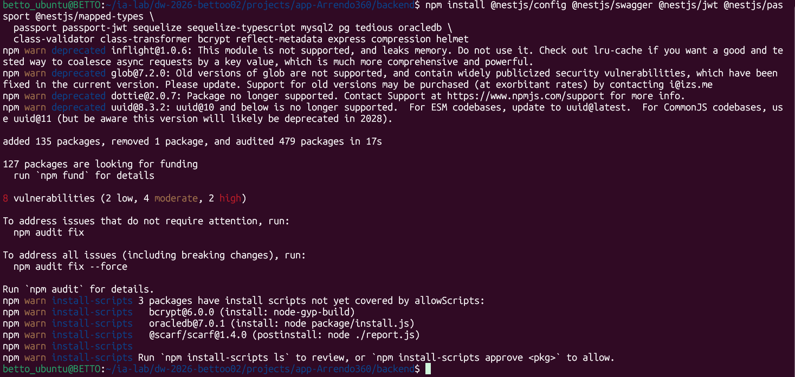
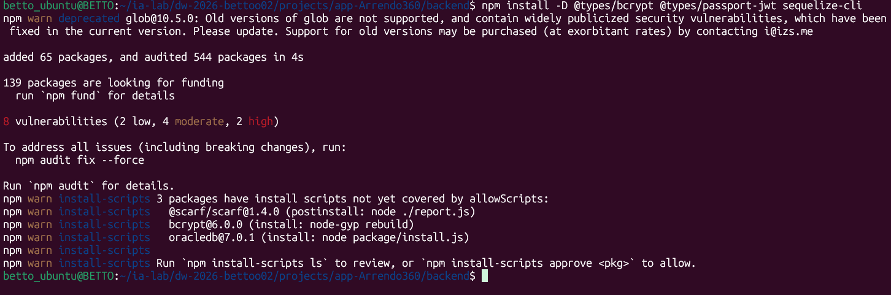
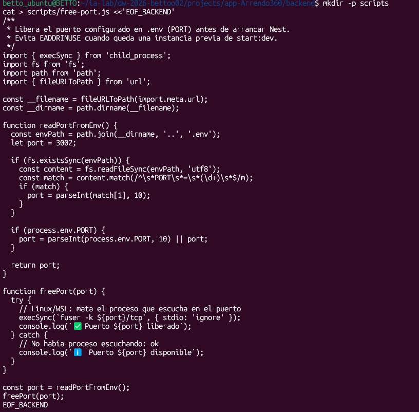
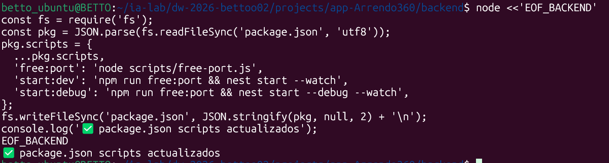
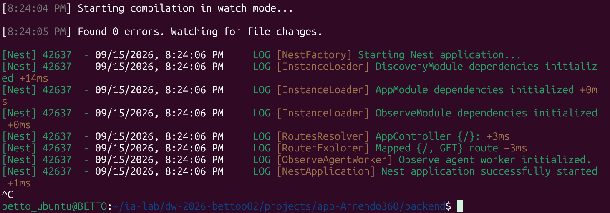

# Bitacora de creación del backend manual

## FASE 1 — 00_BASE_INIT_NESTJS

### 1.1 — Crear carpetas padre y permisos

Preparacion de la ruta de trabajo en WSL

``` bash
mkdir -p /home/betto_ubuntu/ia-lab/dw-2026-bettoo02/projects/app-Arrendo360
chmod -R 755 /home/betto_ubuntu/ia-lab/dw-2026-bettoo02/projects/app-Arrendo360
```



### 1.2 — Instalar Nest CLI (si no existe)

El CLI genera `main.ts`, `app.module.ts`, `tsconfig`, scripts npm, etc.

``` bash
npm install -g @nestjs/cli
nest --version
```



### 1.3 — Crear proyecto NestJS

Usamos el nombre `backend` (workspace didáctico). Responde las preguntas del CLI (package manager: npm).

``` bash
cd /home/betto_ubuntu/ia-lab/dw-2026-bettoo02/projects/app-Arrendo360
nest new backend
cd backend
```



### 1.4 — Crear `.env` mínimo (puerto)

El puerto `3002` evita choques con el 3000. Más adelante el `.env` crecerá con BD.

``` bash
cat > .env <<'EOF_BACKEND'
PORT=3002
NODE_ENV=development
EOF_BACKEND
```



## FASE 2 — `01_BASE_DEPS_Y_PUERTO`

### 2.1 — Dependencias de producción

Config, Swagger, JWT/Passport, Sequelize + drivers de 4 motores, validación, bcrypt y utilidades HTTP.

``` bash
npm install @nestjs/config @nestjs/swagger @nestjs/jwt @nestjs/passport @nestjs/mapped-types \
  passport passport-jwt sequelize sequelize-typescript mysql2 pg tedious oracledb \
  class-validator class-transformer bcrypt reflect-metadata express compression helmet
```



### 2.2 — Dependencias de desarrollo

Tipados y sequelize-cli para herramientas de BD.

``` bash
npm install -D @types/bcrypt @types/passport-jwt sequelize-cli
```



### 2.3 — Script para liberar puerto (evita EADDRINUSE)

Si reinicias Nest sin matar el proceso anterior, Node lanza `listen EADDRINUSE`. Este script lee `PORT` del `.env` y libera el puerto en Linux/WSL.

``` bash
mkdir -p scripts
cat > scripts/free-port.js <<'EOF_BACKEND'
/**
 * Libera el puerto configurado en .env (PORT) antes de arrancar Nest.
 * Evita EADDRINUSE cuando queda una instancia previa de start:dev.
 */
import { execSync } from 'child_process';
import fs from 'fs';
import path from 'path';
import { fileURLToPath } from 'url';
 
const __filename = fileURLToPath(import.meta.url);
const __dirname = path.dirname(__filename);
 
function readPortFromEnv() {
  const envPath = path.join(__dirname, '..', '.env');
  let port = 3002;
 
  if (fs.existsSync(envPath)) {
    const content = fs.readFileSync(envPath, 'utf8');
    const match = content.match(/^\s*PORT\s*=\s*(\d+)\s*$/m);
    if (match) {
      port = parseInt(match[1], 10);
    }
  }
 
  if (process.env.PORT) {
    port = parseInt(process.env.PORT, 10) || port;
  }
 
  return port;
}
 
function freePort(port) {
  try {
    // Linux/WSL: mata el proceso que escucha en el puerto
    execSync(`fuser -k ${port}/tcp`, { stdio: 'ignore' });
    console.log(`✅ Puerto ${port} liberado`);
  } catch {
    // No había proceso escuchando: ok
    console.log(`ℹ️  Puerto ${port} disponible`);
  }
}
 
const port = readPortFromEnv();
freePort(port);
EOF_BACKEND
```



### 2.4 — Actualizar scripts npm en package.json

Integra `free:port` en `start:dev` / `start:debug`. Aplica el cambio con Node para no editar JSON a mano.

``` bash
node <<'EOF_BACKEND'
const fs = require('fs');
const pkg = JSON.parse(fs.readFileSync('package.json', 'utf8'));
pkg.scripts = {
  ...pkg.scripts,
  'free:port': 'node scripts/free-port.js',
  'start:dev': 'npm run free:port && nest start --watch',
  'start:debug': 'npm run free:port && nest start --debug --watch',
};
fs.writeFileSync('package.json', JSON.stringify(pkg, null, 2) + '\n');
console.log('✅ package.json scripts actualizados');
EOF_BACKEND
```



### 2.5 — Verificar arranque base

Debe levantar el Hello World de Nest en el puerto del `.env`.

``` bash
npm run start:dev
# Ctrl+C cuando veas el log de arranque
curl -s http://localhost:3002 || true
```



------------------------------------------------------------------------

## FASE 3 — `02_BASE_ESTRUCTURA_CA`

### 3.1 — Crear árbol base de carpetas

Aún no hay código de dominio. Solo directorios y módulos vacíos de features para anclar imports futuros.

``` bash
mkdir -p src/config/{app,database,environment,logger,swagger}
mkdir -p src/common/{constants,decorators,enums,exceptions,filters,guards,interceptors,interfaces,pipes,types,utils,validators}
mkdir -p src/infrastructure/database/{sequelize,migrations,seeders}
mkdir -p src/infrastructure/logging
mkdir -p src/features/shipping/{companies,contacts,addresses,shipments,packages,tracking-events,couriers,routes,rates,delivery-proofs,invoices}/{application/{dto,mappers,use-cases},domain/{entities,enums,exceptions,interfaces,services,validators},infrastructure/persistence/{models,repositories,migrations,seeders},presentation/http/{controllers,decorators,serializers,swagger},tests}
cat > src/features/shipping/shipping.module.ts <<'EOF_BACKEND'
import { Module } from '@nestjs/common';

@Module({
  imports: [],
  exports: [],
})
export class ShippingModule {}
EOF_BACKEND
```
