# Bitacora de creación del backend manual

# Bitácora de Creación y Acoplamiento del Backend — Arrenda360

### Plataforma de Administración Inmobiliaria Integral (Inmuebles, Contratos, Cobros, Mantenimiento y Distribución)

> **Contexto del Proyecto Arrenda360:** **Arrenda360** es una solución empresarial diseñada para la administración integral de bienes raíces: gestión de inmuebles de múltiples propietarios, contratos de arrendamiento, cánones mensuales, recaudos y dispersión de fondos hacia los propietarios, así como control operativo de solicitudes y tickets de mantenimiento asignados a proveedores certificados con aprobación formal de costos y registro de evidencias de cierre.
>
> **Enfoque Arquitectónico:** La arquitectura del sistema sigue los principios de **Clean Architecture** (Arquitectura Limpia) y **Domain-Driven Design (DDD)** implementada sobre el ecosistema modular de **NestJS**, persistencia políglota multi-motor con **Sequelize TypeScript** (MySQL, PostgreSQL, SQL Server y Oracle), y control de acceso basado en roles (**RBAC**).

------------------------------------------------------------------------

## FASE 1 — 00_BASE_INIT_NESTJS

### 1.1 — Crear carpetas padre y permisos

Preparacion de la ruta de trabajo en WSL

``` bash
mkdir -p /home/betto_ubuntu/ia-lab/dw-2026-bettoo02/projects/app-Arrendo360
chmod -R 755 /home/betto_ubuntu/ia-lab/dw-2026-bettoo02/projects/app-Arrendo360
```


### 1.2 — Instalar Nest CLI (si no existe)

El CLI genera `main.ts`, `app.module.ts`, `tsconfig`, scripts npm, etc.

``` bash
npm install -g @nestjs/cli
nest --version
```


### 1.3 — Crear proyecto NestJS

Usamos el nombre `backend` (workspace didáctico). Responde las preguntas del CLI (package manager: npm).

``` bash
cd /home/betto_ubuntu/ia-lab/dw-2026-bettoo02/projects/app-Arrendo360
nest new backend
cd backend
```


### 1.4 — Crear `.env` mínimo (puerto)

El puerto `3002` evita choques con el 3000. Más adelante el `.env` crecerá con BD.

``` bash
cat > .env <<'EOF_BACKEND'
PORT=3002
NODE_ENV=development
EOF_BACKEND
```


## FASE 2 — `01_BASE_DEPS_Y_PUERTO`

### 2.1 — Dependencias de producción

Config, Swagger, JWT/Passport, Sequelize + drivers de 4 motores, validación, bcrypt y utilidades HTTP.

``` bash
npm install @nestjs/config @nestjs/swagger @nestjs/jwt @nestjs/passport @nestjs/mapped-types \
  passport passport-jwt sequelize sequelize-typescript mysql2 pg tedious oracledb \
  class-validator class-transformer bcrypt reflect-metadata express compression helmet
```


### 2.2 — Dependencias de desarrollo

Tipados y sequelize-cli para herramientas de BD.

``` bash
npm install -D @types/bcrypt @types/passport-jwt sequelize-cli
```


### 2.3 — Script para liberar puerto (evita EADDRINUSE)

Si reinicias Nest sin matar el proceso anterior, Node lanza `listen EADDRINUSE`. Este script lee `PORT` del `.env` y libera el puerto en Linux/WSL.

``` bash
mkdir -p scripts
cat > scripts/free-port.js <<'EOF_BACKEND'
/**
 * Libera el puerto configurado en .env (PORT) antes de arrancar Nest.
 * Evita EADDRINUSE cuando queda una instancia previa de start:dev.
 */
import { execSync } from 'child_process';
import fs from 'fs';
import path from 'path';
import { fileURLToPath } from 'url';
 
const __filename = fileURLToPath(import.meta.url);
const __dirname = path.dirname(__filename);
 
function readPortFromEnv() {
  const envPath = path.join(__dirname, '..', '.env');
  let port = 3002;
 
  if (fs.existsSync(envPath)) {
    const content = fs.readFileSync(envPath, 'utf8');
    const match = content.match(/^\s*PORT\s*=\s*(\d+)\s*$/m);
    if (match) {
      port = parseInt(match[1], 10);
    }
  }
 
  if (process.env.PORT) {
    port = parseInt(process.env.PORT, 10) || port;
  }
 
  return port;
}
 
function freePort(port) {
  try {
    // Linux/WSL: mata el proceso que escucha en el puerto
    execSync(`fuser -k ${port}/tcp`, { stdio: 'ignore' });
    console.log(`✅ Puerto ${port} liberado`);
  } catch {
    // No había proceso escuchando: ok
    console.log(`ℹ️  Puerto ${port} disponible`);
  }
}
 
const port = readPortFromEnv();
freePort(port);
EOF_BACKEND
```


### 2.4 — Actualizar scripts npm en package.json

Integra `free:port` en `start:dev` / `start:debug`. Aplica el cambio con Node para no editar JSON a mano.

``` bash
node <<'EOF_BACKEND'
const fs = require('fs');
const pkg = JSON.parse(fs.readFileSync('package.json', 'utf8'));
pkg.scripts = {
  ...pkg.scripts,
  'free:port': 'node scripts/free-port.js',
  'start:dev': 'npm run free:port && nest start --watch',
  'start:debug': 'npm run free:port && nest start --debug --watch',
};
fs.writeFileSync('package.json', JSON.stringify(pkg, null, 2) + '\n');
console.log('✅ package.json scripts actualizados');
EOF_BACKEND
```


### 2.5 — Verificar arranque base

Debe levantar el Hello World de Nest en el puerto del `.env`.

``` bash
npm run start:dev
# Ctrl+C cuando veas el log de arranque
curl -s http://localhost:3002 || true
```


------------------------------------------------------------------------

## FASE 3 — `02_BASE_ESTRUCTURA_CA`

### 3.1 — Crear árbol base de carpetas

### 3.1 — Crear árbol base de carpetas y andamiaje arquitectónico

Aún no hay código de dominio. Solo directorios y módulos vacíos de features para anclar imports futuros. En esta fase se estructura la solución siguiendo **Clean Architecture (CA)** y **Domain-Driven Design (DDD)**.

Se definen tres niveles de carpetas: 1. **Transversal del Sistema (`config/`, `common/`, `infrastructure/`):** Piezas de configuración, seguridad, logging, manejo global de errores y fábrica de base de datos. 2. **Andamiaje Inicial de Features:** Estructuración de las cuatro capas de CA para cada contexto delimitado: - `domain/`: Entidades puras, interfaces de repositorio, excepciones y reglas de negocio. - `application/`: Casos de uso (Use Cases), DTOs de entrada/salida y mappers. - `infrastructure/`: Modelos de persistencia Sequelize (`@Table`, `@Column`), repositorios concretos y migraciones. - `presentation/`: Controladores REST HTTP (`@Controller`), decoradores y documentación Swagger. 3. **Módulos de Negocio del Dominio Arrenda360:** - `src/features/business/properties` (Inmuebles y Propietarios) - `src/features/business/leases` (Arrendatarios y Contratos de Arrendamiento) - `src/features/business/receivables` (Cobros Mensuales y Pagos) - `src/features/business/owner-settlements` (Distribución de Recaudos a Propietarios) - `src/features/business/maintenance` (Tickets de Incidencias, Proveedores y Órdenes de Mantenimiento)

Comandos de inicialización:

``` bash
mkdir -p src/config/{app,database,environment,logger,swagger}
mkdir -p src/common/{constants,decorators,enums,exceptions,filters,guards,interceptors,interfaces,pipes,types,utils,validators}
mkdir -p src/infrastructure/database/{sequelize,migrations,seeders}
mkdir -p src/infrastructure/logging

# Andamiaje inicial del laboratorio:
mkdir -p src/features/shipping/{companies,contacts,addresses,shipments,packages,tracking-events,couriers,routes,rates,delivery-proofs,invoices}/{application/{dto,mappers,use-cases},domain/{entities,enums,exceptions,interfaces,services,validators},infrastructure/persistence/{models,repositories,migrations,seeders},presentation/http/{controllers,decorators,serializers,swagger},tests}
cat > src/features/shipping/shipping.module.ts <<'EOF_BACKEND'
import { Module } from '@nestjs/common';

@Module({
  imports: [],
  exports: [],
})
export class ShippingModule {}
EOF_BACKEND

# Andamiaje acoplado al dominio Arrenda360:
mkdir -p src/features/business/{properties,leases,receivables,owner-settlements,maintenance}/{application/{dto,use-cases},domain/{entities,interfaces},infrastructure/persistence/{models,repositories},presentation/http/controllers}
```


### 3.2 — Recordatorio de responsabilidades

### 3.2 — Matriz de responsabilidades y capas arquitectónicas

| Carpeta | Responsabilidad |
|----------------------|--------------------------------------------------|
| `config/` | Cómo se configura la app (env, jwt, swagger) |
| `common/` | Piezas transversales reutilizables |
| `infrastructure/` | Detalles técnicos (Sequelize, bcrypt, JWT) |
| `features/*` | Dominios (business/auth) con CA interna |
| Carpeta / Capa | Responsabilidad Técnica y Conceptual |
| ---- | ---- |
| `config/` | Configuración agnóstica de variables de entorno, puertos, logs y OpenAPI Swagger. |
| `common/` | Decoradores personalizados, filtros de excepción (`GlobalExceptionFilter`), interceptores, pipes de validación y guards de seguridad (**RBAC**). |
| `infrastructure/` | Adaptadores técnicos hacia tecnologías externas: Sequelize ORM, drivers de bases de datos (`mysql2`, `pg`, `tedious`, `oracledb`). |
| `domain/` | Lógica pura del negocio: entidades de dominio, contratos de repositorio (interfaces), invariantes de negocio. |
| `application/` | Orquestación de casos de uso, DTOs de validación con `class-validator`, transformadores/mappers. |
| `presentation/` | Controladores HTTP, validación de payloads, serialización de respuestas y decoradores Swagger. |
| `features/business/*` | Bounded Contexts de **Arrenda360** organizados modularmente. |

**Error típico:** poner `@Table` de Sequelize dentro de `domain/entities`. \> [!IMPORTANT] **Principio de Inversión de Dependencias (DIP):** Las reglas de negocio (Dominio) no deben depender de la base de datos ni del framework. Por tanto, los modelos `@Table` de Sequelize residen en `infrastructure/persistence/models` y nunca dentro de `domain/entities`.

------------------------------------------------------------------------

## FASE 4 — `03_BASE_ENTORNO_ENV`

### 4.1 — Crear `.env.example` y actualizar `.env` completo

El `.env` real NO se sube a Git. Usa la base de datos dedicada `Arrendo360`.

**Contrato multi-base**

- `DB_DIALECT` = `mysql` \| `postgres` \| `mssql` \| `oracle` (elige qué motor corre).
- MySQL: `DB_MYSQL_HOST`, `DB_MYSQL_PORT`, `DB_MYSQL_USERNAME`, `DB_MYSQL_PASSWORD`, `DB_MYSQL_NAME`.
- PostgreSQL: `DB_POSTGRES_*` (puerto lab 5432).
- SQL Server: `DB_MSSQL_*` (puerto lab 1433, usuario `sa`).
- Oracle: `DB_ORACLE_*` + `DB_ORACLE_CONNECT_STRING` (puerto lab 1521).
- Para cambiar de motor, cambia **solo** `DB_DIALECT`. No uses `DB_HOST` / `DB_USERNAME` genéricos.

``` bash
cat > .env.example <<'EOF_BACKEND'
# ==========================================
# APP
# ==========================================
PORT=3002
NODE_ENV=development

# ==========================================
# DATABASE
# ==========================================
# Selector del motor en ejecución (un solo valor):
# mysql | postgres | mssql | oracle
DB_DIALECT=mysql

# --- MYSQL ---
DB_MYSQL_HOST=172.28.196.208
DB_MYSQL_PORT=3306
DB_MYSQL_USERNAME=beto
DB_MYSQL_PASSWORD=1231
DB_MYSQL_NAME=Arrendo360

# --- POSTGRES ---
DB_POSTGRES_HOST=172.28.196.208
DB_POSTGRES_PORT=5432
DB_POSTGRES_USERNAME=beto
DB_POSTGRES_PASSWORD=1231
DB_POSTGRES_NAME=Arrendo360

# --- MSSQL (SQL Server) ---
DB_MSSQL_HOST=172.28.196.208
DB_MSSQL_PORT=1433
DB_MSSQL_USERNAME=beto
DB_MSSQL_PASSWORD=Betoland@20
DB_MSSQL_NAME=Arrendo360

# --- ORACLE ---
DB_ORACLE_HOST=172.28.196.208
DB_ORACLE_PORT=1521
DB_ORACLE_USERNAME=system
DB_ORACLE_PASSWORD=1231
DB_ORACLE_NAME=Arrendo360
DB_ORACLE_CONNECT_STRING=172.28.196.208:1521/XEPDB1

EOF_BACKEND
```

``` bash
cp .env.example .env
# Laboratorio: DB_DIALECT + un bloque por motor (MYSQL/POSTGRES/MSSQL/ORACLE).
# Cambia solo el bloque del motor que uses. Mantén DB_*_NAME=Arrendo360
```


### 4.2 — Interface de entorno

Tipos TypeScript de las variables de entorno (APP, DB) y enum de dialectos.

**Archivo:** `src/config/environment/env.interface.ts`

``` bash
mkdir -p src/config/environment
cat > src/config/environment/env.interface.ts <<'EOF_BACKEND'
export enum Environment {
  Development = 'development',
  Production = 'production',
  Test = 'test',
}

export enum DatabaseDialect {
  MySQL = 'mysql',
  Postgres = 'postgres',
  MSSQL = 'mssql',
  Oracle = 'oracle',
}

export interface AppConfig {
  port: number;
  nodeEnv: Environment;
}

export interface DatabaseConfig {
  dialect: DatabaseDialect;
  host: string;
  port: number;
  username: string;
  password: string;
  database: string;
  connectString?: string;
}

export interface EnvironmentConfig {
  app: AppConfig;
  database: DatabaseConfig;
}
EOF_BACKEND
```


### 4.3 — Validación de entorno con class-validator

Si falta DB_DIALECT es inválido, o el bloque del motor activo está vacío, el boot falla con mensaje claro.

**Archivo:** `src/config/environment/env.validation.ts`

``` bash
mkdir -p src/config/environment
cat > src/config/environment/env.validation.ts <<'EOF_BACKEND'
import { plainToInstance } from 'class-transformer';
import {
  IsEnum,
  IsNumber,
  IsOptional,
  IsString,
  Max,
  Min,
  validateSync,
} from 'class-validator';
import {
  assertActiveDialectCredentials,
  resolveDialectCredentials,
} from './db-env';
import { DatabaseDialect, Environment } from './env.interface';

export class EnvironmentVariables {
  @IsEnum(Environment)
  @IsOptional()
  NODE_ENV: Environment = Environment.Development;

  @IsNumber()
  @Min(0)
  @Max(65535)
  @IsOptional()
  PORT: number = 3002;

  @IsEnum(DatabaseDialect)
  DB_DIALECT: DatabaseDialect;

  @IsString()
  @IsOptional()
  DB_MYSQL_HOST?: string;

  @IsNumber()
  @IsOptional()
  DB_MYSQL_PORT?: number;

  @IsString()
  @IsOptional()
  DB_MYSQL_USERNAME?: string;

  @IsString()
  @IsOptional()
  DB_MYSQL_PASSWORD?: string;

  @IsString()
  @IsOptional()
  DB_MYSQL_NAME?: string;

  @IsString()
  @IsOptional()
  DB_POSTGRES_HOST?: string;

  @IsNumber()
  @IsOptional()
  DB_POSTGRES_PORT?: number;

  @IsString()
  @IsOptional()
  DB_POSTGRES_USERNAME?: string;

  @IsString()
  @IsOptional()
  DB_POSTGRES_PASSWORD?: string;

  @IsString()
  @IsOptional()
  DB_POSTGRES_NAME?: string;

  @IsString()
  @IsOptional()
  DB_MSSQL_HOST?: string;

  @IsNumber()
  @IsOptional()
  DB_MSSQL_PORT?: number;

  @IsString()
  @IsOptional()
  DB_MSSQL_USERNAME?: string;

  @IsString()
  @IsOptional()
  DB_MSSQL_PASSWORD?: string;

  @IsString()
  @IsOptional()
  DB_MSSQL_NAME?: string;

  @IsString()
  @IsOptional()
  DB_ORACLE_HOST?: string;

  @IsNumber()
  @IsOptional()
  DB_ORACLE_PORT?: number;

  @IsString()
  @IsOptional()
  DB_ORACLE_USERNAME?: string;

  @IsString()
  @IsOptional()
  DB_ORACLE_PASSWORD?: string;

  @IsString()
  @IsOptional()
  DB_ORACLE_NAME?: string;

  @IsString()
  @IsOptional()
  DB_ORACLE_CONNECT_STRING?: string;
}

function formatValidationErrors(
  errors: ReturnType<typeof validateSync>,
): string {
  return errors
    .map((error) => {
      const constraints = error.constraints
        ? Object.values(error.constraints).join(', ')
        : 'valor inválido';
      return `${error.property}: ${constraints}`;
    })
    .join('; ');
}

export function validate(config: Record<string, unknown>): EnvironmentVariables {
  const validatedConfig = plainToInstance(EnvironmentVariables, config, {
    enableImplicitConversion: true,
    exposeDefaultValues: true,
  });

  const errors = validateSync(validatedConfig, {
    skipMissingProperties: false,
  });

  if (errors.length > 0) {
    throw new Error(
      `Error de configuración: variable(s) crítica(s) inválida(s) o ausente(s). ${formatValidationErrors(errors)}. Copia .env.example a .env y completa el bloque del motor elegido (DB_DIALECT).`,
    );
  }

  assertActiveDialectCredentials(resolveDialectCredentials(validatedConfig));

  return validatedConfig;
}
EOF_BACKEND
```


### 4.4 — Resolver de credenciales por motor

Lee el bloque DB_MYSQL\_\* / DB_POSTGRES\_\* / DB_MSSQL\_\* / DB_ORACLE\_\* según DB_DIALECT.

**Archivo:** `src/config/environment/db-env.ts`

``` bash
mkdir -p src/config/environment
cat > src/config/environment/db-env.ts <<'EOF_BACKEND'
import { DatabaseConfig, DatabaseDialect } from './env.interface';

export const DEFAULT_DB_PORTS: Record<DatabaseDialect, number> = {
  [DatabaseDialect.MySQL]: 3306,
  [DatabaseDialect.Postgres]: 5433,
  [DatabaseDialect.MSSQL]: 1433,
  [DatabaseDialect.Oracle]: 1521,
};

export type DialectEnvSource = {
  DB_DIALECT: DatabaseDialect;
  DB_MYSQL_HOST?: string;
  DB_MYSQL_PORT?: string | number;
  DB_MYSQL_USERNAME?: string;
  DB_MYSQL_PASSWORD?: string;
  DB_MYSQL_NAME?: string;
  DB_POSTGRES_HOST?: string;
  DB_POSTGRES_PORT?: string | number;
  DB_POSTGRES_USERNAME?: string;
  DB_POSTGRES_PASSWORD?: string;
  DB_POSTGRES_NAME?: string;
  DB_MSSQL_HOST?: string;
  DB_MSSQL_PORT?: string | number;
  DB_MSSQL_USERNAME?: string;
  DB_MSSQL_PASSWORD?: string;
  DB_MSSQL_NAME?: string;
  DB_ORACLE_HOST?: string;
  DB_ORACLE_PORT?: string | number;
  DB_ORACLE_USERNAME?: string;
  DB_ORACLE_PASSWORD?: string;
  DB_ORACLE_NAME?: string;
  DB_ORACLE_CONNECT_STRING?: string;
};

function toPort(value: string | number | undefined, fallback: number): number {
  if (typeof value === 'number' && Number.isFinite(value)) {
    return value;
  }
  if (typeof value === 'string' && value.trim() !== '') {
    const parsed = parseInt(value, 10);
    if (Number.isFinite(parsed)) {
      return parsed;
    }
  }
  return fallback;
}

function text(value: string | undefined): string {
  return value?.trim() ?? '';
}

export function resolveDialectCredentials(
  env: DialectEnvSource,
): DatabaseConfig {
  const dialect = env.DB_DIALECT;
  const port = DEFAULT_DB_PORTS[dialect];

  switch (dialect) {
    case DatabaseDialect.MySQL:
      return {
        dialect,
        host: text(env.DB_MYSQL_HOST),
        port: toPort(env.DB_MYSQL_PORT, port),
        username: text(env.DB_MYSQL_USERNAME),
        password: text(env.DB_MYSQL_PASSWORD),
        database: text(env.DB_MYSQL_NAME),
      };
    case DatabaseDialect.Postgres:
      return {
        dialect,
        host: text(env.DB_POSTGRES_HOST),
        port: toPort(env.DB_POSTGRES_PORT, port),
        username: text(env.DB_POSTGRES_USERNAME),
        password: text(env.DB_POSTGRES_PASSWORD),
        database: text(env.DB_POSTGRES_NAME),
      };
    case DatabaseDialect.MSSQL:
      return {
        dialect,
        host: text(env.DB_MSSQL_HOST),
        port: toPort(env.DB_MSSQL_PORT, port),
        username: text(env.DB_MSSQL_USERNAME),
        password: text(env.DB_MSSQL_PASSWORD),
        database: text(env.DB_MSSQL_NAME),
      };
    case DatabaseDialect.Oracle:
      return {
        dialect,
        host: text(env.DB_ORACLE_HOST),
        port: toPort(env.DB_ORACLE_PORT, port),
        username: text(env.DB_ORACLE_USERNAME),
        password: text(env.DB_ORACLE_PASSWORD),
        database: text(env.DB_ORACLE_NAME),
        connectString: text(env.DB_ORACLE_CONNECT_STRING) || undefined,
      };
    default:
      throw new Error(
        `Error de configuración: DB_DIALECT inválido. Use mysql, postgres, mssql u oracle.`,
      );
  }
}

export function assertActiveDialectCredentials(config: DatabaseConfig): void {
  const prefix: Record<DatabaseDialect, string> = {
    [DatabaseDialect.MySQL]: 'DB_MYSQL',
    [DatabaseDialect.Postgres]: 'DB_POSTGRES',
    [DatabaseDialect.MSSQL]: 'DB_MSSQL',
    [DatabaseDialect.Oracle]: 'DB_ORACLE',
  };
  const tag = prefix[config.dialect];
  const missing: string[] = [];

  if (!config.host) missing.push(`${tag}_HOST`);
  if (!config.username) missing.push(`${tag}_USERNAME`);
  if (!config.database) missing.push(`${tag}_NAME`);
  if (config.dialect === DatabaseDialect.Oracle && !config.connectString) {
    missing.push('DB_ORACLE_CONNECT_STRING');
  }

  if (missing.length > 0) {
    throw new Error(
      `Error de configuración: variable(s) crítica(s) inválida(s) o ausente(s) para ${config.dialect}: ${missing.join(', ')}. Completa el bloque de ese motor en .env (no commitees secretos).`,
    );
  }
}
EOF_BACKEND
```


### 4.5 — Factory registerAs de entorno

Expone `environment.*` vía ConfigService (`registerAs`).

**Archivo:** `src/config/environment/env.config.ts`

``` bash
mkdir -p src/config/environment
cat > src/config/environment/env.config.ts <<'EOF_BACKEND'
import { registerAs } from '@nestjs/config';
import { resolveDialectCredentials } from './db-env';
import { Environment } from './env.interface';
import { validate } from './env.validation';

export const ENV_CONFIG_NAME = 'environment';

export const envConfig = registerAs(ENV_CONFIG_NAME, () => {
  const validated = validate(process.env);

  return {
    app: {
      port: validated.PORT,
      nodeEnv: validated.NODE_ENV ?? Environment.Development,
    },
    database: resolveDialectCredentials(validated),
  };
});
EOF_BACKEND
```


## FASE 5 — `04_BASE_DATABASE_SEQUELIZE`

### 5.1 — Constante SEQUELIZE_TOKEN

Token DI para inyectar la instancia Sequelize en repositorios.

**Archivo:** `src/common/constants/database.constants.ts`

``` bash
mkdir -p src/common/constants
cat > src/common/constants/database.constants.ts <<'EOF_BACKEND'
export const SEQUELIZE_TOKEN = 'SEQUELIZE';
EOF_BACKEND
```


### 5.2 — Tipos auxiliares de database config

Tipos auxiliares del bloque config/database (legado/compat).

**Archivo:** `src/config/database/database.types.ts`

``` bash
mkdir -p src/config/database
cat > src/config/database/database.types.ts <<'EOF_BACKEND'
import { Options as SequelizeOptions } from 'sequelize';

export type DialectOptions =
  | { dialect: 'mysql'; options?: SequelizeOptions }
  | { dialect: 'postgres'; options?: SequelizeOptions }
  | { dialect: 'mssql'; options?: SequelizeOptions }
  | { dialect: 'oracle'; options?: SequelizeOptions };
EOF_BACKEND
```


### 5.3 — database.config.ts

Factory registerAs opcional para namespace `database` (complementa environment).

**Archivo:** `src/config/database/database.config.ts`

``` bash
mkdir -p src/config/database
cat > src/config/database/database.config.ts <<'EOF_BACKEND'
import { registerAs } from '@nestjs/config';
import { resolveDialectCredentials } from '../environment/db-env';
import { DatabaseDialect } from '../environment/env.interface';

export const DATABASE_CONFIG_NAME = 'database';

const dialectModuleMap: Record<DatabaseDialect, string> = {
  [DatabaseDialect.MySQL]: 'mysql2',
  [DatabaseDialect.Postgres]: 'pg',
  [DatabaseDialect.MSSQL]: 'tedious',
  [DatabaseDialect.Oracle]: 'oracledb',
};

export const databaseConfig = registerAs(DATABASE_CONFIG_NAME, () => {
  const dialect =
    (process.env.DB_DIALECT as DatabaseDialect) || DatabaseDialect.MySQL;
  const credentials = resolveDialectCredentials({
    DB_DIALECT: dialect,
    ...process.env,
  });

  return {
    ...credentials,
    dialectModulePath: dialectModuleMap[dialect],
    autoLoadModels: true,
    synchronize: process.env.NODE_ENV !== 'production',
    logging: process.env.NODE_ENV === 'development' ? console.log : false,
  };
});
EOF_BACKEND
```


### 5.4 — database.module.ts / providers

Módulo de configuración de BD (forFeature). Los providers quedan vacíos a propósito.

**Archivo:** `src/config/database/database.module.ts`

``` bash
mkdir -p src/config/database
cat > src/config/database/database.module.ts <<'EOF_BACKEND_IA'
import { Module } from '@nestjs/common';
import { ConfigModule } from '@nestjs/config';
import { databaseConfig } from './database.config';

@Module({
  imports: [ConfigModule.forFeature(databaseConfig)],
  exports: [ConfigModule],
})
export class DatabaseConfigModule {}
EOF_BACKEND_IA
```


### 5.5 — database.providers.ts

Placeholder de providers de config/database.

**Archivo:** `src/config/database/database.providers.ts`

``` bash
mkdir -p src/config/database
cat > src/config/database/database.providers.ts <<'EOF_BACKEND'
export const DATABASE_PROVIDERS = [];
EOF_BACKEND
```


### 5.6 — Opciones Sequelize por dialecto

Arma host/port/user/password/logging con el bloque del motor seleccionado por DB_DIALECT.

**Archivo:** `src/infrastructure/database/sequelize/sequelize.options.ts`

``` bash
mkdir -p src/infrastructure/database/sequelize
cat > src/infrastructure/database/sequelize/sequelize.options.ts <<'EOF_BACKEND_IA'
import { SequelizeOptions } from 'sequelize-typescript';
import { resolveDialectCredentials } from '../../../config/environment/db-env';
import { DatabaseDialect } from '../../../config/environment/env.interface';

export function getSequelizeOptions(
  dialect: DatabaseDialect,
): Partial<SequelizeOptions> {
  const credentials = resolveDialectCredentials({
    DB_DIALECT: dialect,
    ...process.env,
  });

  const base: SequelizeOptions = {
    dialect: dialect as SequelizeOptions['dialect'],
    host: credentials.host,
    port: credentials.port,
    username: credentials.username,
    password: credentials.password,
    database: credentials.database,
    logging: process.env.NODE_ENV === 'development' ? console.log : false,
    define: {
      underscored: false,
      freezeTableName: true,
    },
  };

  switch (dialect) {
    case DatabaseDialect.MSSQL:
      return {
        ...base,
        dialectOptions: {
          options: {
            encrypt: true,
            trustServerCertificate: true,
          },
        },
      };
    case DatabaseDialect.Oracle:
      return {
        ...base,
        dialectOptions: {
          connectString: credentials.connectString,
        },
      };
    default:
      return base;
  }
}
EOF_BACKEND_IA
```


### 5.7 — Factory Sequelize (sin modelos aún)

Crea la instancia Sequelize. `ALL_MODELS` empieza vacío: se llena al crear cada entidad.

**Archivo:** `src/infrastructure/database/sequelize/sequelize.factory.ts`

``` bash
mkdir -p src/infrastructure/database/sequelize
cat > src/infrastructure/database/sequelize/sequelize.factory.ts <<'EOF_BACKEND_IA'
import { Sequelize } from 'sequelize-typescript';
import { DatabaseDialect } from '../../../config/environment/env.interface';
import { getSequelizeOptions } from './sequelize.options';


export const ALL_MODELS = [
  // (aún sin modelos — se agregan por feature)
];

export async function createSequelizeInstance(
  dialect: DatabaseDialect,
): Promise<Sequelize> {
  const options = getSequelizeOptions(dialect);

  let dialectModule: any;

  switch (dialect) {
    case DatabaseDialect.MySQL:
      dialectModule = require('mysql2');
      break;
    case DatabaseDialect.Postgres:
      dialectModule = require('pg');
      break;
    case DatabaseDialect.MSSQL:
      dialectModule = require('tedious');
      break;
    case DatabaseDialect.Oracle:
      dialectModule = require('oracledb');
      break;
    default:
      throw new Error(`Dialecto no soportado: ${dialect}`);
  }

  const sequelize = new Sequelize({
    ...options,
    dialectModule,
    models: ALL_MODELS,
  } as any);

  try {
    await sequelize.authenticate();
    console.log(`✅ Conexión exitosa a ${dialect.toUpperCase()}`);
  } catch (error: any) {
    console.error(
      `❌ Error conectando a ${dialect.toUpperCase()}:`,
      error.message,
    );
    throw error;
  }

  if (process.env.NODE_ENV !== 'production') {
    await sequelize.sync({ alter: false });
    console.log('✅ Tablas sincronizadas');
  }

  return sequelize;
}
EOF_BACKEND_IA
```


### 5.8 — DatabaseSeederService (sin seeders aún)

Hook OnModuleInit para seeders. Todavía no llama a ningún seeder de feature.

**Archivo:** `src/infrastructure/database/seeders/database-seeder.service.ts`

``` bash
mkdir -p src/infrastructure/database/seeders
cat > src/infrastructure/database/seeders/database-seeder.service.ts <<'EOF_BACKEND_IA'
import { Injectable, Logger, OnModuleInit } from '@nestjs/common';


/**
 * Ejecuta seeders en orden de dependencias.
 * Solo en entornos no productivos.
 */
@Injectable()
export class DatabaseSeederService implements OnModuleInit {
  private readonly logger = new Logger(DatabaseSeederService.name);

  async onModuleInit(): Promise<void> {
    if (process.env.NODE_ENV === 'production') {
      return;
    }

    try {
      // sin seeders aún
      this.logger.log('✅ Seeders ejecutados');
    } catch (error: any) {
      this.logger.error(`❌ Error en seeders: ${error.message}`, error.stack);
      throw error;
    }
  }
}
EOF_BACKEND_IA
```


### 5.9 — Módulo global Sequelize

Módulo `@Global()` que provee `SEQUELIZE_TOKEN` + ejecuta seeders.

**Archivo:** `src/infrastructure/database/sequelize/sequelize.module.ts`

``` bash
mkdir -p src/infrastructure/database/sequelize
cat > src/infrastructure/database/sequelize/sequelize.module.ts <<'EOF_BACKEND_IA'
import { Module, Global } from '@nestjs/common';
import { ConfigService } from '@nestjs/config';
import { Sequelize } from 'sequelize-typescript';
import { DatabaseDialect } from '../../../config/environment/env.interface';
import { SEQUELIZE_TOKEN } from '../../../common/constants/database.constants';
import { createSequelizeInstance } from './sequelize.factory';
import { DatabaseSeederService } from '../seeders/database-seeder.service';

@Global()
@Module({
  providers: [
    {
      provide: SEQUELIZE_TOKEN,
      useFactory: async (configService: ConfigService): Promise<Sequelize> => {
        const dialect = configService.get<DatabaseDialect>(
          'environment.database.dialect',
          DatabaseDialect.MySQL,
        );
        return createSequelizeInstance(dialect);
      },
      inject: [ConfigService],
    },
    DatabaseSeederService,
  ],
  exports: [SEQUELIZE_TOKEN],
})
export class SequelizeDatabaseModule {}
EOF_BACKEND_IA
```


### 5.10 — Verificar conexión a BD

Crea la BD vacía `Arrendo360` en el motor que indica `DB_DIALECT`. Aún no hay tablas de negocio. Si falla el authenticate, corrige el **bloque de ese motor** en `.env` (no el de otro).

``` bash
npm run start:dev
```

**MYSQL**


**POSTGRES**

**MS SQL SERVER**


**ORACLE**


## FASE 6 — `05_BASE_APP_COMMON_SECURITY`

### 6.1 — config/app/app.constants.ts

Constantes globales de la aplicación: define el nombre del namespace de configuración (`app`) y los valores predeterminados de puerto y entorno de ejecución.

**Archivo:** `src/config/app/app.constants.ts`

``` bash
mkdir -p src/config/app
cat > src/config/app/app.constants.ts <<'EOF_BACKEND_IA'
export const APP_CONFIG_NAME = 'app';

export const APP_DEFAULTS = {
  PORT: 3000,
  NODE_ENV: 'development',
};
EOF_BACKEND_IA
```


### 6.2 — config/app/app.config.ts

Factory de configuración con `registerAs` de NestJS. Carga las variables de entorno del sistema (`PORT`, `NODE_ENV`) aplicándoles conversión numérica y asignación de valores de respaldo por defecto.

**Archivo:** `src/config/app/app.config.ts`

``` bash
mkdir -p src/config/app
cat > src/config/app/app.config.ts <<'EOF_BACKEND_IA'
import { registerAs } from '@nestjs/config';
import { APP_CONFIG_NAME, APP_DEFAULTS } from './app.constants';
import { Environment } from '../environment/env.interface';

export const appConfig = registerAs(APP_CONFIG_NAME, () => ({
  port: parseInt(process.env.PORT || String(APP_DEFAULTS.PORT), 10),
  nodeEnv: (process.env.NODE_ENV as Environment) || APP_DEFAULTS.NODE_ENV,
}));
EOF_BACKEND_IA
```


### 6.3 — config/logger/logger.config.ts

Configuración dinámica de los niveles de logging del framework. En modo desarrollo habilita trazas detalladas (`debug`, `verbose`, `fatal`), mientras que en producción se restringe a eventos clave (`log`, `error`, `warn`).

**Archivo:** `src/config/logger/logger.config.ts`

``` bash
mkdir -p src/config/logger
cat > src/config/logger/logger.config.ts <<'EOF_BACKEND_IA'
import { LogLevel } from '@nestjs/common';

export function getLoggerConfig(): { logLevels: LogLevel[] } {
  const isDev = process.env.NODE_ENV === 'development';

  return {
    logLevels: isDev
      ? ['log', 'error', 'warn', 'debug', 'verbose', 'fatal']
      : ['log', 'error', 'warn'],
  };
}
EOF_BACKEND_IA
```


### 6.4 — config/logger/logger.module.ts

Módulo Nest del feature: cablea providers, tokens DI y controller.

**Archivo:** `src/config/logger/logger.module.ts`

``` bash
mkdir -p src/config/logger
cat > src/config/logger/logger.module.ts <<'EOF_BACKEND_IA'
import { Module, Global, Logger } from '@nestjs/common';

@Global()
@Module({
  providers: [Logger],
  exports: [Logger],
})
export class LoggerModule {}
EOF_BACKEND_IA
```


### 6.5 — config/swagger/swagger.constants.ts

Metadatos de especificación OpenAPI para **Arrenda360 API**: define el título del sistema, la descripción de los bounded contexts cubiertos (inmuebles, contratos, cartera, recaudo, mantenimiento y RBAC), la versión semántica y la ruta de acceso al portal interactivo (`api/docs`).

**Archivo:** `src/config/swagger/swagger.constants.ts`

``` bash
mkdir -p src/config/swagger
cat > src/config/swagger/swagger.constants.ts <<'EOF_BACKEND_IA'
export const SWAGGER_TITLE = 'Arrenda360 API';
export const SWAGGER_DESCRIPTION =
  'API de administración inmobiliaria Arrenda360: Inmuebles, contratos, cobros, pagos, mantenimiento y control de roles (Clean Architecture / DDD sobre NestJS + Sequelize, multi-motor)';
export const SWAGGER_VERSION = '1.0';
export const SWAGGER_PATH = 'api/docs';
EOF_BACKEND_IA
```


### 6.6 — config/swagger/swagger.config.ts

Configuración e inicialización del módulo Swagger en NestJS mediante `DocumentBuilder`. Habilita el explorador de endpoints interactivos y permite adjuntar encabezados de seguridad para la validación de roles en tiempo real.

**Archivo:** `src/config/swagger/swagger.config.ts`

``` bash
mkdir -p src/config/swagger
cat > src/config/swagger/swagger.config.ts <<'EOF_BACKEND_IA'
import { INestApplication } from '@nestjs/common';
import { DocumentBuilder, SwaggerModule } from '@nestjs/swagger';
import {
  SWAGGER_DESCRIPTION,
  SWAGGER_PATH,
  SWAGGER_TITLE,
  SWAGGER_VERSION,
} from './swagger.constants';

export function setupSwagger(app: INestApplication): void {
  const config = new DocumentBuilder()
    .setTitle(SWAGGER_TITLE)
    .setDescription(SWAGGER_DESCRIPTION)
    .setVersion(SWAGGER_VERSION)
    .build();

  const document = SwaggerModule.createDocument(app, config);
  SwaggerModule.setup(SWAGGER_PATH, app, document);
}
EOF_BACKEND_IA
```


### 6.7 — common/enums/status.enum.ts

Enumeración de estado genérico para entidades maestras del dominio (`ACTIVE`, `INACTIVE`), utilizada para soportar borrado lógico o inhabilitación temporal de registros.

**Archivo:** `src/common/enums/status.enum.ts`

``` bash
mkdir -p src/common/enums
cat > src/common/enums/status.enum.ts <<'EOF_BACKEND_IA'
export enum Status {
  ACTIVE = 'ACTIVE',
  INACTIVE = 'INACTIVE',
}
EOF_BACKEND_IA
```


### 6.8 — common/enums/http-method.enum.ts

Enumeración estándar de métodos HTTP para su reutilización en middlewares, filtros de logging e interceptores de auditoría.

**Archivo:** `src/common/enums/http-method.enum.ts`

``` bash
mkdir -p src/common/enums
cat > src/common/enums/http-method.enum.ts <<'EOF_BACKEND_IA'
export enum HttpMethod {
  GET = 'GET',
  POST = 'POST',
  PUT = 'PUT',
  PATCH = 'PATCH',
  DELETE = 'DELETE',
}
EOF_BACKEND_IA
```


### 6.9 — common/enums/sort-order.enum.ts

Enumeración para el control de dirección de ordenamiento en consultas paginadas (`ASC`, `DESC`).

**Archivo:** `src/common/enums/sort-order.enum.ts`

``` bash
mkdir -p src/common/enums
cat > src/common/enums/sort-order.enum.ts <<'EOF_BACKEND_IA'
export enum SortOrder {
  ASC = 'ASC',
  DESC = 'DESC',
}
EOF_BACKEND_IA
```


### 6.10 — common/constants/app.constants.ts

Constantes transversales del núcleo HTTP: identificador del microservicio (`arrenda360_api`) y el prefijo global obligatorio de enrutamiento (`api`).

**Archivo:** `src/common/constants/app.constants.ts`

``` bash
mkdir -p src/common/constants
cat > src/common/constants/app.constants.ts <<'EOF_BACKEND_IA'
export const APP_NAME = 'arrenda360_api';
export const GLOBAL_PREFIX = 'api';
EOF_BACKEND_IA
```


### 6.11 — common/constants/pagination.constants.ts

Constantes maestras para la limitación y normalización de paginación en consultas masivas: página inicial (1), tamaño de página por defecto (10) y techo máximo de seguridad (100) para evitar desbordamientos de memoria.

**Archivo:** `src/common/constants/pagination.constants.ts`

``` bash
mkdir -p src/common/constants
cat > src/common/constants/pagination.constants.ts <<'EOF_BACKEND_IA'
export const DEFAULT_PAGE = 1;
export const DEFAULT_LIMIT = 10;
export const MAX_LIMIT = 100;
EOF_BACKEND_IA
```


### 6.12 — common/exceptions/application.exception.ts

Clase base para todas las excepciones del sistema: extiende la clase `Error` nativa de JavaScript, capturando de manera automática el stack trace y adjuntando una marca temporal ISO (`timestamp`) y el código de estado HTTP correspondiente.

**Archivo:** `src/common/exceptions/application.exception.ts`

``` bash
mkdir -p src/common/exceptions
cat > src/common/exceptions/application.exception.ts <<'EOF_BACKEND_IA'
export class ApplicationException extends Error {
  public readonly timestamp: string;

  constructor(
    public readonly message: string,
    public readonly statusCode: number = 500,
  ) {
    super(message);
    this.timestamp = new Date().toISOString();
    Error.captureStackTrace(this, this.constructor);
  }
}
EOF_BACKEND_IA
```


### 6.13 — common/exceptions/domain.exception.ts

Excepción para violaciones de reglas e invariantes del dominio puro (validaciones de negocio, estados inconsistentes). Mapea por defecto a código HTTP `400 Bad Request`.

**Archivo:** `src/common/exceptions/domain.exception.ts`

``` bash
mkdir -p src/common/exceptions
cat > src/common/exceptions/domain.exception.ts <<'EOF_BACKEND_IA'
import { ApplicationException } from './application.exception';

export class DomainException extends ApplicationException {
  constructor(message: string) {
    super(message, 400);
  }
}
EOF_BACKEND_IA
```


### 6.14 — common/exceptions/entity-not-found.exception.ts

Excepción tipada para recursos no localizados en los repositorios de persistencia. Mapea directamente a código HTTP `404 Not Found` especificando el nombre de la entidad y el identificador buscado.

**Archivo:** `src/common/exceptions/entity-not-found.exception.ts`

``` bash
mkdir -p src/common/exceptions
cat > src/common/exceptions/entity-not-found.exception.ts <<'EOF_BACKEND_IA'
import { ApplicationException } from './application.exception';

export class EntityNotFoundException extends ApplicationException {
  constructor(entityName: string, identifier: string | number) {
    super(`${entityName} con ID ${identifier} no encontrado`, 404);
  }
}
EOF_BACKEND_IA
```


### 6.15 — common/exceptions/validation.exception.ts

Excepción para errores de validación semántica o estructural de datos recibidos. Mapea al código HTTP `422 Unprocessable Entity`.

**Archivo:** `src/common/exceptions/validation.exception.ts`

``` bash
mkdir -p src/common/exceptions
cat > src/common/exceptions/validation.exception.ts <<'EOF_BACKEND_IA'
import { ApplicationException } from './application.exception';

export class ValidationException extends ApplicationException {
  constructor(message: string = 'Error de validación') {
    super(message, 422);
  }
}
EOF_BACKEND_IA
```


### 6.16 — common/filters/global-exception.filter.ts

Filtro global de excepciones de NestJS (`@Catch()`): intercepta cualquier error no manejado, normaliza la estructura del payload JSON de salida (`statusCode`, `message`, `timestamp`, `path`) y protege el servidor de fugas de información interna en producción.

**Archivo:** `src/common/filters/global-exception.filter.ts`

``` bash
mkdir -p src/common/filters
cat > src/common/filters/global-exception.filter.ts <<'EOF_BACKEND_IA'
import {
  ExceptionFilter,
  Catch,
  ArgumentsHost,
  HttpException,
  HttpStatus,
} from '@nestjs/common';
import { Request, Response } from 'express';
import { ApplicationException } from '../exceptions/application.exception';

@Catch()
export class GlobalExceptionFilter implements ExceptionFilter {
  catch(exception: unknown, host: ArgumentsHost): void {
    const ctx = host.switchToHttp();
    const response = ctx.getResponse<Response>();
    const request = ctx.getRequest<Request>();

    let status = HttpStatus.INTERNAL_SERVER_ERROR;
    let message: string | string[] = 'Error interno del servidor';

    if (exception instanceof ApplicationException) {
      status = exception.statusCode;
      message = exception.message;
    } else if (exception instanceof HttpException) {
      status = exception.getStatus();
      const res = exception.getResponse();
      message = typeof res === 'string' ? res : (res as any).message;
    }

    response.status(status).json({
      statusCode: status,
      message,
      timestamp: new Date().toISOString(),
      path: request.url,
    });
  }
}
EOF_BACKEND_IA
```


### 6.17 — common/filters/sequelize-exception.filter.ts

Filtro especializado para la capa de persistencia: traduce errores nativos de Sequelize (violaciones de unicidad, restricciones de clave foránea, caídas de conexión y errores de validación de modelos) a respuestas HTTP limpias con códigos precisos (409 Conflict, 400 Bad Request, 503 Service Unavailable, 422 Unprocessable).

**Archivo:** `src/common/filters/sequelize-exception.filter.ts`

``` bash
mkdir -p src/common/filters
cat > src/common/filters/sequelize-exception.filter.ts <<'EOF_BACKEND_IA'
import { ExceptionFilter, Catch, ArgumentsHost } from '@nestjs/common';
import { Response } from 'express';

@Catch()
export class SequelizeExceptionFilter implements ExceptionFilter {
  catch(exception: any, host: ArgumentsHost): void {
    const ctx = host.switchToHttp();
    const response = ctx.getResponse<Response>();

    const sequelizeErrors = [
      'SequelizeUniqueConstraintError',
      'SequelizeForeignKeyConstraintError',
      'SequelizeConnectionError',
      'SequelizeValidationError',
      'SequelizeDatabaseError',
    ];

    if (!exception?.name || !sequelizeErrors.includes(exception.name)) {
      throw exception;
    }

    let status = 500;
    let message = 'Error de base de datos';

    if (exception.name === 'SequelizeUniqueConstraintError') {
      status = 409;
      message = 'El recurso ya existe (violación de unicidad)';
    } else if (exception.name === 'SequelizeForeignKeyConstraintError') {
      status = 400;
      message = 'Violación de clave foránea';
    } else if (exception.name === 'SequelizeConnectionError') {
      status = 503;
      message = 'No se pudo conectar a la base de datos';
    } else if (exception.name === 'SequelizeValidationError') {
      status = 422;
      message = exception.message || 'Error de validación en base de datos';
    }

    response.status(status).json({
      statusCode: status,
      message,
      timestamp: new Date().toISOString(),
    });
  }
}
EOF_BACKEND_IA
```


### 6.18 — common/interceptors/response.interceptor.ts

Interceptor de salida unificada: captura el resultado exitoso retornado por los controladores y lo encapsula en un sobre JSON estándar con `statusCode`, `message: 'Operación exitosa'`, `data` y `timestamp` ISO.

**Archivo:** `src/common/interceptors/response.interceptor.ts`

``` bash
mkdir -p src/common/interceptors
cat > src/common/interceptors/response.interceptor.ts <<'EOF_BACKEND_IA'
import {
  Injectable,
  NestInterceptor,
  ExecutionContext,
  CallHandler,
} from '@nestjs/common';
import { Observable } from 'rxjs';
import { map } from 'rxjs/operators';

export interface ApiResponse<T> {
  statusCode: number;
  message: string;
  data: T;
  timestamp: string;
}

@Injectable()
export class ResponseInterceptor<T>
  implements NestInterceptor<T, ApiResponse<T>>
{
  intercept(
    context: ExecutionContext,
    next: CallHandler,
  ): Observable<ApiResponse<T>> {
    const response = context.switchToHttp().getResponse();
    const statusCode = response.statusCode;

    return next.handle().pipe(
      map((data) => ({
        statusCode,
        message: 'Operación exitosa',
        data,
        timestamp: new Date().toISOString(),
      })),
    );
  }
}
EOF_BACKEND_IA
```


### 6.19 — common/interceptors/logging.interceptor.ts

Interceptor de telemetría y observabilidad HTTP: calcula el tiempo de ejecución exacto de cada petición entrante y registra en consola el verbo HTTP, la ruta invocada, el código de respuesta y la latencia en milisegundos.

**Archivo:** `src/common/interceptors/logging.interceptor.ts`

``` bash
mkdir -p src/common/interceptors
cat > src/common/interceptors/logging.interceptor.ts <<'EOF_BACKEND_IA'
import {
  Injectable,
  NestInterceptor,
  ExecutionContext,
  CallHandler,
  Logger,
} from '@nestjs/common';
import { Observable } from 'rxjs';
import { tap } from 'rxjs/operators';

@Injectable()
export class LoggingInterceptor implements NestInterceptor {
  private readonly logger = new Logger('HTTP');

  intercept(context: ExecutionContext, next: CallHandler): Observable<any> {
    const req = context.switchToHttp().getRequest();
    const { method, url } = req;
    const now = Date.now();

    return next.handle().pipe(
      tap(() => {
        const res = context.switchToHttp().getResponse();
        const delay = Date.now() - now;
        this.logger.log(`${method} ${url} ${res.statusCode} - ${delay}ms`);
      }),
    );
  }
}
EOF_BACKEND_IA
```

### 

### 6.20 — common/interceptors/timeout.interceptor.ts

Interceptor de resiliencia ante bloqueos: cancela automáticamente cualquier petición que tarde más de 30 segundos (30,000 ms) lanzando un `RequestTimeoutException` (HTTP 408), protegiendo hilos de ejecución en el event loop.

**Archivo:** `src/common/interceptors/timeout.interceptor.ts`

``` bash
mkdir -p src/common/interceptors
cat > src/common/interceptors/timeout.interceptor.ts <<'EOF_BACKEND_IA'
import {
  Injectable,
  NestInterceptor,
  ExecutionContext,
  CallHandler,
  RequestTimeoutException,
} from '@nestjs/common';
import { Observable, throwError, TimeoutError } from 'rxjs';
import { catchError, timeout } from 'rxjs/operators';

@Injectable()
export class TimeoutInterceptor implements NestInterceptor {
  intercept(context: ExecutionContext, next: CallHandler): Observable<any> {
    return next.handle().pipe(
      timeout(30000),
      catchError((err) => {
        if (err instanceof TimeoutError) {
          return throwError(() => new RequestTimeoutException());
        }
        return throwError(() => err);
      }),
    );
  }
}
EOF_BACKEND_IA
```

### 

### 6.21 — common/pipes/validation.pipe.ts

Pipe global de validación de payloads: convierte el cuerpo JSON entrante a la instancia de la clase DTO respectiva vía `plainToInstance` y ejecuta validaciones de esquemas declarativos (`class-validator`), lanzando `BadRequestException` con la lista de violaciones detectadas.

**Archivo:** `src/common/pipes/validation.pipe.ts`

``` bash
mkdir -p src/common/pipes
cat > src/common/pipes/validation.pipe.ts <<'EOF_BACKEND_IA'
import {
  PipeTransform,
  Injectable,
  ArgumentMetadata,
  BadRequestException,
} from '@nestjs/common';
import { validate } from 'class-validator';
import { plainToInstance } from 'class-transformer';

@Injectable()
export class CustomValidationPipe implements PipeTransform<any> {
  async transform(value: any, { metatype }: ArgumentMetadata) {
    if (!metatype || !this.toValidate(metatype)) {
      return value;
    }

    const object = plainToInstance(metatype, value);
    const errors = await validate(object);

    if (errors.length > 0) {
      const messages = errors.map(
        (err) =>
          `${err.property}: ${Object.values(err.constraints || {}).join(', ')}`,
      );
      throw new BadRequestException(messages);
    }

    return object;
  }

  private toValidate(metatype: any): boolean {
    const types = [String, Boolean, Number, Array, Object];
    return !types.includes(metatype);
  }
}
EOF_BACKEND_IA
```

### 

### 6.22 — common/pipes/parse-positive-int.pipe.ts

Pipe de transformación y sanitización de parámetros de ruta (`@Param('id')`): valida que el identificador numérico sea un entero estrictamente positivo (\> 0).

**Archivo:** `src/common/pipes/parse-positive-int.pipe.ts`

``` bash
mkdir -p src/common/pipes
cat > src/common/pipes/parse-positive-int.pipe.ts <<'EOF_BACKEND_IA'
import {
  PipeTransform,
  Injectable,
  BadRequestException,
} from '@nestjs/common';

@Injectable()
export class ParsePositiveIntPipe implements PipeTransform<string, number> {
  transform(value: string): number {
    const parsed = parseInt(value, 10);

    if (isNaN(parsed) || parsed <= 0) {
      throw new BadRequestException(
        `El valor '${value}' no es un entero positivo`,
      );
    }

    return parsed;
  }
}
EOF_BACKEND_IA
```

### 

### 6.23 — common/interfaces/pagination.interface.ts

Contratos TypeScript para respuestas paginadas: define la estructura de metadatos (`PaginationMeta` con `page`, `limit`, `total`, `totalPages`) y el envoltorio genérico `PaginatedResult<T>` para tipar colecciones de entidades.

**Archivo:** `src/common/interfaces/pagination.interface.ts`

``` bash
mkdir -p src/common/interfaces
cat > src/common/interfaces/pagination.interface.ts <<'EOF_BACKEND_IA'
export interface PaginationMeta {
  page: number;
  limit: number;
  total: number;
  totalPages: number;
}

export interface PaginatedResult<T> {
  items: T[];
  meta: PaginationMeta;
}
EOF_BACKEND_IA
```

### 

### 6.24 — common/interfaces/api-response.interface.ts

Contrato formal del cuerpo de respuesta estándar de la API (`ApiResponseBody<T>`): garantiza uniformidad en todas las respuestas JSON emitidas por los microservicios y controladores.

**Archivo:** `src/common/interfaces/api-response.interface.ts`

``` bash
mkdir -p src/common/interfaces
cat > src/common/interfaces/api-response.interface.ts <<'EOF_BACKEND_IA'
export interface ApiResponseBody<T> {
  statusCode: number;
  message: string;
  data: T;
  timestamp: string;
}
EOF_BACKEND_IA
```

### 

### 6.25 — common/types/nullable.type.ts

Tipo de utilidad genérico (`Nullable<T> = T | null`) para representar atributos de base de datos o de dominio que admiten valores nulos de forma explícita.

**Archivo:** `src/common/types/nullable.type.ts`

``` bash
mkdir -p src/common/types
cat > src/common/types/nullable.type.ts <<'EOF_BACKEND_IA'
export type Nullable<T> = T | null;
EOF_BACKEND_IA
```

### 

### 6.26 — common/types/optional.type.ts

Tipo de utilidad genérico (`Optional<T> = T | undefined`) para campos optativos en DTOs de actualización parcial o filtros de búsqueda.

**Archivo:** `src/common/types/optional.type.ts`

``` bash
mkdir -p src/common/types
cat > src/common/types/optional.type.ts <<'EOF_BACKEND_IA'
export type Optional<T> = T | undefined;
EOF_BACKEND_IA
```

### 

### 6.27 — common/utils/pagination.util.ts

Funciones de utilidad matemática para paginación: `normalizePagination` calcula límites seguros y desplazamiento (`offset`), mientras `buildPaginatedResult` ensambla el sobre de respuesta con el total de páginas calculado.

**Archivo:** `src/common/utils/pagination.util.ts`

``` bash
mkdir -p src/common/utils
cat > src/common/utils/pagination.util.ts <<'EOF_BACKEND_IA'
import {
  DEFAULT_LIMIT,
  DEFAULT_PAGE,
  MAX_LIMIT,
} from '../constants/pagination.constants';
import { PaginatedResult } from '../interfaces/pagination.interface';

export function normalizePagination(page?: number, limit?: number) {
  const safePage = !page || page < 1 ? DEFAULT_PAGE : page;
  const safeLimit = !limit || limit < 1 ? DEFAULT_LIMIT : Math.min(limit, MAX_LIMIT);
  const offset = (safePage - 1) * safeLimit;
  return { page: safePage, limit: safeLimit, offset };
}

export function buildPaginatedResult<T>(
  items: T[],
  total: number,
  page: number,
  limit: number,
): PaginatedResult<T> {
  return {
    items,
    meta: {
      page,
      limit,
      total,
      totalPages: Math.ceil(total / limit) || 0,
    },
  };
}
EOF_BACKEND_IA
```

### 

### 6.28 — common/utils/date.util.ts

Utilidades puras de manipulación de fechas y tiempos: adición de días para cálculo de vigencia de contratos de arrendamiento y conversión de cadenas de duración (`1d`, `2h`, `30m`, `60s`) a milisegundos numéricos.

**Archivo:** `src/common/utils/date.util.ts`

``` bash
mkdir -p src/common/utils
cat > src/common/utils/date.util.ts <<'EOF_BACKEND_IA'
export function addDays(date: Date, days: number): Date {
  const result = new Date(date);
  result.setDate(result.getDate() + days);
  return result;
}

export function parseDurationToMs(duration: string): number {
  const match = /^(\d+)([smhd])$/.exec(duration);
  if (!match) {
    return 24 * 60 * 60 * 1000;
  }

  const value = parseInt(match[1], 10);
  const unit = match[2];

  switch (unit) {
    case 's':
      return value * 1000;
    case 'm':
      return value * 60 * 1000;
    case 'h':
      return value * 60 * 60 * 1000;
    case 'd':
      return value * 24 * 60 * 60 * 1000;
    default:
      return 24 * 60 * 60 * 1000;
  }
}
EOF_BACKEND_IA
```

### 

### 6.29 — common/utils/string.util.ts

Funciones auxiliares para sanitización de cadenas de texto: normalización y limpieza de correos electrónicos a minúsculas y verificación de cadenas en blanco o vacías.

**Archivo:** `src/common/utils/string.util.ts`

``` bash
mkdir -p src/common/utils
cat > src/common/utils/string.util.ts <<'EOF_BACKEND_IA'
export function normalizeEmail(email: string): string {
  return email.trim().toLowerCase();
}

export function isBlank(value?: string | null): boolean {
  return !value || value.trim().length === 0;
}
EOF_BACKEND_IA
```

### 

### 6.30 — Actualizar main.ts (bootstrap completo)

Prefix global, filters, interceptors, pipes, Swagger y manejo amigable de EADDRINUSE.

**Archivo:** `src/main.ts`

``` bash
mkdir -p src
cat > src/main.ts <<'EOF_BACKEND_IA'
import { NestFactory } from '@nestjs/core';
import { ConfigService } from '@nestjs/config';
import { AppModule } from './app.module';
import { getLoggerConfig } from './config/logger/logger.config';
import { GlobalExceptionFilter } from './common/filters/global-exception.filter';
import { ResponseInterceptor } from './common/interceptors/response.interceptor';
import { LoggingInterceptor } from './common/interceptors/logging.interceptor';
import { TimeoutInterceptor } from './common/interceptors/timeout.interceptor';
import { CustomValidationPipe } from './common/pipes/validation.pipe';
import { setupSwagger } from './config/swagger/swagger.config';
import { GLOBAL_PREFIX } from './common/constants/app.constants';

async function bootstrap() {
  const app = await NestFactory.create(AppModule, {
    logger: getLoggerConfig().logLevels,
  });

  const configService = app.get(ConfigService);
  const port = configService.get<number>('app.port', 3002);

  app.setGlobalPrefix(GLOBAL_PREFIX);

  app.useGlobalFilters(new GlobalExceptionFilter());

  app.useGlobalInterceptors(
    new ResponseInterceptor(),
    new LoggingInterceptor(),
    new TimeoutInterceptor(),
  );

  app.useGlobalPipes(new CustomValidationPipe());

  setupSwagger(app);

  try {
    await app.listen(port);
    console.log(`🚀 Application running on: http://localhost:${port}`);
    console.log(`📘 Swagger: http://localhost:${port}/api/docs`);
  } catch (error: any) {
    if (error?.code === 'EADDRINUSE') {
      console.error(
        `❌ El puerto ${port} ya está en uso (EADDRINUSE).\n` +
          `   Solución rápida:\n` +
          `   1) npm run free:port\n` +
          `   2) npm run start:dev\n` +
          `   O cambia PORT en el archivo .env`,
      );
      await app.close();
      process.exit(1);
    }
    throw error;
  }
}
bootstrap();
EOF_BACKEND_IA
```

### 

### 6.31 — Actualizar app.module.ts (base sin features ni security)

Cablea Config + Sequelize + Logger. Business llega en fases posteriores.

**Archivo:** `src/app.module.ts`

``` bash
mkdir -p src
cat > src/app.module.ts <<'EOF_BACKEND_IA'
import { Module } from '@nestjs/common';
import { ConfigModule } from '@nestjs/config';
import { envConfig } from './config/environment/env.config';
import { appConfig } from './config/app/app.config';
import { LoggerModule } from './config/logger/logger.module';
import { SequelizeDatabaseModule } from './infrastructure/database/sequelize/sequelize.module';
import { AppController } from './app.controller';
import { AppService } from './app.service';

@Module({
  imports: [
    ConfigModule.forRoot({
      isGlobal: true,
      load: [envConfig, appConfig],
      envFilePath: '.env',
    }),
    SequelizeDatabaseModule,
    LoggerModule,
  ],
  controllers: [AppController],
  providers: [
    AppService,
  ],
})
export class AppModule {}
EOF_BACKEND_IA
```

### 

### 6.32 — Verificar bootstrap transversal

La app debe arrancar, mostrar Swagger en `/api/docs` y conectar a BD. Todavía no hay endpoints de negocio.

``` bash
npm run start:dev
# Abre http://localhost:3002/api/docs
# Ctrl+C
```

**Consola**


[**http://localhost:3002/api/docs**](http://localhost:3002/api/docs){.uri}

## 

## FASE 7 — `06_BUSINESS_COMPANIES` (Patrón Canónico de Arquitectura Limpia)

### Business — Patrón Maestro de Arquitectura Limpia y DDD

> **Objetivo didáctico de la fase:** Establecer y evidenciar el patrón canónico de Arquitectura Limpia (Clean Architecture) y principios de Domain-Driven Design (DDD) implementando el flujo integral de una entidad de negocio: Dominio Puro → Infraestructura Sequelize → Capa de Aplicación (DTOs, Mappers y Casos de Uso) → Presentación HTTP (Controlador REST y Swagger) → Módulo NestJS → Cableado de Inyección de Dependencias y Validación de Base de Datos.
>
> **Nota sobre asociaciones:** `Empresa` se relaciona `1:N` con `Contacto`, `Direccion`, `Envio` y `Factura`, pero esas entidades aún no existen. A diferencia de la plantilla original (que usaba `require()` diferido dentro de `@HasMany`, algo que no funciona en este proyecto ESM), aquí `CompanyModel` se crea **sin asociaciones**. Se agregarán con imports estáticos normales cuando se construyan esas entidades en fases posteriores.
>
> **Transición y Acoplamiento hacia Arrenda360:** Esta fase sirvió como el laboratorio de validación metodológica sobre el cual se fundamentó la arquitectura final de **Arrenda360**. Las capturas y evidencias de sincronización física de tablas y endpoints Swagger generadas en esta etapa quedan documentadas para demostrar la correcta asimilación técnica del patrón antes de desplegar los 5 módulos de negocio especializados de Arrenda360 (desarrollados a partir de la **Fase 8**).

### 7.1 — features/shipping/companies/domain/entities/company.entity.ts

Entidad de dominio (TypeScript puro). No extiende Sequelize `Model`. Aquí viven las reglas del negocio.

**Archivo:** `src/features/shipping/companies/domain/entities/company.entity.ts`

``` bash
mkdir -p src/features/shipping/companies/domain/entities
cat > src/features/shipping/companies/domain/entities/company.entity.ts <<'EOF_BACKEND_IA'
import { isValidNit } from '../validators/company-nit.validator';

export interface CompanyProps {
  id?: number;
  nit: string;
  razonSocial: string;
  isActive?: boolean;
  createdAt?: Date;
  updatedAt?: Date;
}

export class Company {
  id?: number;
  nit: string;
  razonSocial: string;
  isActive: boolean;
  createdAt?: Date;
  updatedAt?: Date;

  private constructor(props: CompanyProps) {
    this.id = props.id;
    this.nit = props.nit;
    this.razonSocial = props.razonSocial;
    this.isActive = props.isActive ?? true;
    this.createdAt = props.createdAt;
    this.updatedAt = props.updatedAt;
  }

  static create(
    props: Omit<CompanyProps, 'id' | 'isActive' | 'createdAt' | 'updatedAt'>,
  ): Company {
    if (!props.nit?.trim()) {
      throw new Error('El NIT de la empresa es requerido');
    }

    if (!isValidNit(props.nit)) {
      throw new Error('El NIT de la empresa no es válido');
    }

    if (!props.razonSocial?.trim()) {
      throw new Error('La razón social de la empresa es requerida');
    }

    return new Company(props);
  }

  static reconstitute(props: CompanyProps): Company {
    return new Company(props);
  }

  update(
    props: Partial<
      Omit<CompanyProps, 'id' | 'isActive' | 'createdAt' | 'updatedAt'>
    >,
  ): void {
    if (props.nit !== undefined) {
      if (!props.nit.trim()) {
        throw new Error('El NIT de la empresa es requerido');
      }
      if (!isValidNit(props.nit)) {
        throw new Error('El NIT de la empresa no es válido');
      }
      this.nit = props.nit;
    }

    if (props.razonSocial !== undefined) {
      if (!props.razonSocial.trim()) {
        throw new Error('La razón social de la empresa es requerida');
      }
      this.razonSocial = props.razonSocial;
    }
  }

  deactivate(): void {
    this.isActive = false;
  }

  activate(): void {
    this.isActive = true;
  }
}
EOF_BACKEND_IA
```

### 

### 7.2 — features/shipping/companies/domain/exceptions/company-nit-already-exists.exception.ts

Excepción de dominio. El caso de uso la lanza; el filter HTTP la traduce a status code.

**Archivo:** `src/features/shipping/companies/domain/exceptions/company-nit-already-exists.exception.ts`

``` bash
mkdir -p src/features/shipping/companies/domain/exceptions
cat > src/features/shipping/companies/domain/exceptions/company-nit-already-exists.exception.ts <<'EOF_BACKEND_IA'
import { DomainException } from '../../../../../common/exceptions/domain.exception';

export class CompanyNitAlreadyExistsException extends DomainException {
  constructor(nit: string) {
    super(`El NIT '${nit}' ya está registrado`);
  }
}
EOF_BACKEND_IA
```

### 

### 7.3 — features/shipping/companies/domain/exceptions/company-not-found.exception.ts

Excepción de dominio. El caso de uso la lanza; el filter HTTP la traduce a status code.

**Archivo:** `src/features/shipping/companies/domain/exceptions/company-not-found.exception.ts`

``` bash
mkdir -p src/features/shipping/companies/domain/exceptions
cat > src/features/shipping/companies/domain/exceptions/company-not-found.exception.ts <<'EOF_BACKEND_IA'
import { EntityNotFoundException } from '../../../../../common/exceptions/entity-not-found.exception';

export class CompanyNotFoundException extends EntityNotFoundException {
  constructor(id: number) {
    super('Empresa', id);
  }
}
EOF_BACKEND_IA
```

### 

### 7.4 — features/shipping/companies/domain/interfaces/company-repository.interface.ts

Puerto (contrato) del repositorio. La aplicación depende de esta interface, no de Sequelize.

**Archivo:** `src/features/shipping/companies/domain/interfaces/company-repository.interface.ts`

``` bash
mkdir -p src/features/shipping/companies/domain/interfaces
cat > src/features/shipping/companies/domain/interfaces/company-repository.interface.ts <<'EOF_BACKEND_IA'
import { PaginatedResult } from '../../../../../common/interfaces/pagination.interface';
import { Company } from '../entities/company.entity';

export const COMPANY_REPOSITORY = 'COMPANY_REPOSITORY';

export interface CompanyFindAllParams {
  page?: number;
  limit?: number;
  search?: string;
}

export interface ICompanyRepository {
  create(company: Company): Promise<Company>;
  update(company: Company): Promise<Company>;
  delete(id: number): Promise<void>;
  findById(id: number): Promise<Company | null>;
  findByNit(nit: string): Promise<Company | null>;
  findAll(params: CompanyFindAllParams): Promise<PaginatedResult<Company>>;
}
EOF_BACKEND_IA
```

### 

### 7.5 — features/shipping/companies/domain/validators/company-nit.validator.ts

Validador de dominio reutilizable (reglas independientes del framework HTTP).

**Archivo:** `src/features/shipping/companies/domain/validators/company-nit.validator.ts`

``` bash
mkdir -p src/features/shipping/companies/domain/validators
cat > src/features/shipping/companies/domain/validators/company-nit.validator.ts <<'EOF_BACKEND_IA'
export function isValidNit(nit: string): boolean {
  // Dígitos, con guion y dígito de verificación opcional (ej. 900123456-7)
  const nitRegex = /^\d{5,15}(-\d)?$/;
  return nitRegex.test(nit.trim());
}
EOF_BACKEND_IA
```

### 

### 7.6 — features/shipping/companies/infrastructure/persistence/models/company.model.ts

Modelo Sequelize (`@Table`). Solo infraestructura: mapeo a tabla física. *(sin asociaciones todavía — ver nota al inicio de la fase)*

**Archivo:** `src/features/shipping/companies/infrastructure/persistence/models/company.model.ts`

``` bash
mkdir -p src/features/shipping/companies/infrastructure/persistence/models
cat > src/features/shipping/companies/infrastructure/persistence/models/company.model.ts <<'EOF_BACKEND_IA'
import {
  AutoIncrement,
  Column,
  CreatedAt,
  DataType,
  Model,
  PrimaryKey,
  Table,
  UpdatedAt,
} from 'sequelize-typescript';

@Table({ tableName: 'companies' })
export class CompanyModel extends Model {
  @PrimaryKey
  @AutoIncrement
  @Column(DataType.INTEGER)
  declare id: number;

  @Column({ type: DataType.STRING(20), allowNull: false, unique: true })
  declare nit: string;

  @Column({ type: DataType.STRING(200), allowNull: false })
  declare razonSocial: string;

  @Column({ type: DataType.BOOLEAN, allowNull: false, defaultValue: true })
  declare isActive: boolean;

  @CreatedAt
  declare createdAt: Date;

  @UpdatedAt
  declare updatedAt: Date;

  // Asociaciones (contacts, addresses, shipments, invoices) se agregan
  // en las fases donde se crean esas entidades, con import estático normal.
}
EOF_BACKEND_IA
```

### 

### 7.7 — features/shipping/companies/infrastructure/persistence/repositories/company.repository.ts

Adaptador del repositorio: implementa el puerto de dominio con Sequelize.

**Archivo:** `src/features/shipping/companies/infrastructure/persistence/repositories/company.repository.ts`

``` bash
mkdir -p src/features/shipping/companies/infrastructure/persistence/repositories
cat > src/features/shipping/companies/infrastructure/persistence/repositories/company.repository.ts <<'EOF_BACKEND_IA'
import { Injectable } from '@nestjs/common';
import { Op } from 'sequelize';
import {
  buildPaginatedResult,
  normalizePagination,
} from '../../../../../../common/utils/pagination.util';
import { Company } from '../../../domain/entities/company.entity';
import {
  CompanyFindAllParams,
  ICompanyRepository,
} from '../../../domain/interfaces/company-repository.interface';
import { CompanyMapper } from '../../../application/mappers/company.mapper';
import { CompanyModel } from '../models/company.model';

@Injectable()
export class CompanyRepository implements ICompanyRepository {
  async create(company: Company): Promise<Company> {
    const model = await CompanyModel.create(
      CompanyMapper.toPersistence(company),
    );
    return CompanyMapper.toDomain(model);
  }

  async update(company: Company): Promise<Company> {
    await CompanyModel.update(CompanyMapper.toPersistence(company), {
      where: { id: company.id },
    });
    const updated = await CompanyModel.findByPk(company.id!);
    return CompanyMapper.toDomain(updated!);
  }

  async delete(id: number): Promise<void> {
    await CompanyModel.destroy({ where: { id } });
  }

  async findById(id: number): Promise<Company | null> {
    const model = await CompanyModel.findByPk(id);
    return model ? CompanyMapper.toDomain(model) : null;
  }

  async findByNit(nit: string): Promise<Company | null> {
    const model = await CompanyModel.findOne({ where: { nit } });
    return model ? CompanyMapper.toDomain(model) : null;
  }

  async findAll(params: CompanyFindAllParams) {
    const { page, limit, offset } = normalizePagination(
      params.page,
      params.limit,
    );

    const where = params.search
      ? {
          [Op.or]: [
            { razonSocial: { [Op.like]: `%${params.search}%` } },
            { nit: { [Op.like]: `%${params.search}%` } },
          ],
        }
      : {};

    const { rows, count } = await CompanyModel.findAndCountAll({
      where,
      limit,
      offset,
      order: [['createdAt', 'DESC']],
    });

    return buildPaginatedResult(
      rows.map((row) => CompanyMapper.toDomain(row)),
      count,
      page,
      limit,
    );
  }
}
EOF_BACKEND_IA
```

### 

### 7.8 — features/shipping/companies/infrastructure/persistence/migrations/create-companies-table.migration.ts

Migración documental/auxiliar de la tabla. En dev el sync de Sequelize crea el esquema.

**Archivo:** `src/features/shipping/companies/infrastructure/persistence/migrations/create-companies-table.migration.ts`

``` bash
mkdir -p src/features/shipping/companies/infrastructure/persistence/migrations
cat > src/features/shipping/companies/infrastructure/persistence/migrations/create-companies-table.migration.ts <<'EOF_BACKEND_IA'
export const createCompaniesTableMigration = {
  name: 'create-companies-table',
  async up(): Promise<void> {
    // Sequelize sync handles table creation in development.
    // Production: CREATE TABLE companies (id, nit, razonSocial, isActive, createdAt, updatedAt)
  },
  async down(): Promise<void> {
    // Production: DROP TABLE companies
  },
};
EOF_BACKEND_IA
```

### 

### 7.9 — features/shipping/companies/infrastructure/persistence/seeders/companies.seeder.ts

Seeder de datos iniciales para desarrollo y verificación física en BD.

**Archivo:** `src/features/shipping/companies/infrastructure/persistence/seeders/companies.seeder.ts`

``` bash
mkdir -p src/features/shipping/companies/infrastructure/persistence/seeders
cat > src/features/shipping/companies/infrastructure/persistence/seeders/companies.seeder.ts <<'EOF_BACKEND_IA'
import { CompanyModel } from '../models/company.model';

export async function seedCompanies(): Promise<void> {
  const count = await CompanyModel.count();
  if (count > 0) {
    return;
  }

  await CompanyModel.bulkCreate([
    {
      nit: '900123456-7',
      razonSocial: 'Comercializadora Andina S.A.S.',
      isActive: true,
    },
    {
      nit: '901987654-3',
      razonSocial: 'Distribuciones del Caribe Ltda.',
      isActive: true,
    },
  ]);
}
EOF_BACKEND_IA
```

### 

### 7.10 — features/shipping/companies/application/dto/company-filter.dto.ts

DTO de entrada/salida HTTP con `class-validator` / Swagger.

**Archivo:** `src/features/shipping/companies/application/dto/company-filter.dto.ts`

``` bash
mkdir -p src/features/shipping/companies/application/dto
cat > src/features/shipping/companies/application/dto/company-filter.dto.ts <<'EOF_BACKEND_IA'
import { ApiPropertyOptional } from '@nestjs/swagger';
import { Type } from 'class-transformer';
import { IsInt, IsOptional, IsPositive, IsString, Min } from 'class-validator';

export class CompanyFilterDto {
  @ApiPropertyOptional({ example: 1, default: 1 })
  @IsOptional()
  @Type(() => Number)
  @IsInt()
  @Min(1)
  page?: number;

  @ApiPropertyOptional({ example: 10, default: 10 })
  @IsOptional()
  @Type(() => Number)
  @IsInt()
  @IsPositive()
  limit?: number;

  @ApiPropertyOptional({ example: 'andina' })
  @IsOptional()
  @IsString()
  search?: string;
}
EOF_BACKEND_IA
```

### 

### 7.11 — features/shipping/companies/application/dto/company-response.dto.ts

DTO de entrada/salida HTTP con `class-validator` / Swagger.

**Archivo:** `src/features/shipping/companies/application/dto/company-response.dto.ts`

``` bash
mkdir -p src/features/shipping/companies/application/dto
cat > src/features/shipping/companies/application/dto/company-response.dto.ts <<'EOF_BACKEND_IA'
import { ApiProperty } from '@nestjs/swagger';

export class CompanyResponseDto {
  @ApiProperty({ example: 1 })
  id: number;

  @ApiProperty({ example: '900123456-7' })
  nit: string;

  @ApiProperty({ example: 'Comercializadora Andina S.A.S.' })
  razonSocial: string;

  @ApiProperty({ example: true })
  isActive: boolean;

  @ApiProperty()
  createdAt: Date;

  @ApiProperty()
  updatedAt: Date;
}
EOF_BACKEND_IA
```

### 

### 7.12 — features/shipping/companies/application/dto/create-company.dto.ts

DTO de entrada/salida HTTP con `class-validator` / Swagger.

**Archivo:** `src/features/shipping/companies/application/dto/create-company.dto.ts`

``` bash
mkdir -p src/features/shipping/companies/application/dto
cat > src/features/shipping/companies/application/dto/create-company.dto.ts <<'EOF_BACKEND_IA'
import { ApiProperty } from '@nestjs/swagger';
import { IsNotEmpty, IsString, Matches, MaxLength } from 'class-validator';

export class CreateCompanyDto {
  @ApiProperty({ example: '900123456-7' })
  @IsString()
  @IsNotEmpty()
  @MaxLength(20)
  @Matches(/^\d{5,15}(-\d)?$/, {
    message: 'El NIT no tiene un formato válido',
  })
  nit: string;

  @ApiProperty({ example: 'Comercializadora Andina S.A.S.' })
  @IsString()
  @IsNotEmpty()
  @MaxLength(200)
  razonSocial: string;
}
EOF_BACKEND_IA
```

### 

### 7.13 — features/shipping/companies/application/dto/update-company.dto.ts

DTO de entrada/salida HTTP con `class-validator` / Swagger.

**Archivo:** `src/features/shipping/companies/application/dto/update-company.dto.ts`

``` bash
mkdir -p src/features/shipping/companies/application/dto
cat > src/features/shipping/companies/application/dto/update-company.dto.ts <<'EOF_BACKEND_IA'
import { PartialType } from '@nestjs/mapped-types';
import { CreateCompanyDto } from './create-company.dto';

export class UpdateCompanyDto extends PartialType(CreateCompanyDto) {}
EOF_BACKEND_IA
```

### 

### 7.14 — features/shipping/companies/application/mappers/company.mapper.ts

Mapper entre entidad de dominio y DTO de respuesta.

**Archivo:** `src/features/shipping/companies/application/mappers/company.mapper.ts`

mkdir -p src/features/shipping/companies/application/mappers

cat \> src/features/shipping/companies/application/mappers/company.mapper.ts \<\<'EOF_BACKEND_IA'

import { Company } from '../../domain/entities/company.entity';

import { CompanyResponseDto } from '../dto/company-response.dto';

import { CompanyModel } from '../../infrastructure/persistence/models/company.model';

export class CompanyMapper {

static toDomain(model: CompanyModel): Company {

return Company.reconstitute({

id: model.id,

nit: model.nit,

razonSocial: model.razonSocial,

isActive: model.isActive,

createdAt: model.createdAt,

updatedAt: model.updatedAt,

});

}

static toResponse(entity: Company): CompanyResponseDto {

return {

id: entity.id!,

nit: entity.nit,

razonSocial: entity.razonSocial,

isActive: entity.isActive,

createdAt: entity.createdAt!,

updatedAt: entity.updatedAt!,

};

}

static toPersistence(entity: Company): Partial\<CompanyModel\> {

return {

id: entity.id,

nit: entity.nit,

razonSocial: entity.razonSocial,

isActive: entity.isActive ?? true,

};

}

}

EOF_BACKEND_IA

``` bash
```


### 7.15 — features/shipping/companies/application/use-cases/create-company.use-case.ts

Caso de uso (aplicación). Orquesta dominio + repositorio. El controller solo lo invoca.

**Archivo:** `src/features/shipping/companies/application/use-cases/create-company.use-case.ts`

``` bash
mkdir -p src/features/shipping/companies/application/use-cases
cat > src/features/shipping/companies/application/use-cases/create-company.use-case.ts <<'EOF_BACKEND_IA'
import { Inject, Injectable } from '@nestjs/common';
import { CompanyNitAlreadyExistsException } from '../../domain/exceptions/company-nit-already-exists.exception';
import { Company } from '../../domain/entities/company.entity';
import {
  COMPANY_REPOSITORY,
  type ICompanyRepository,
} from '../../domain/interfaces/company-repository.interface';
import { CreateCompanyDto } from '../dto/create-company.dto';
import { CompanyMapper } from '../mappers/company.mapper';

@Injectable()
export class CreateCompanyUseCase {
  constructor(
    @Inject(COMPANY_REPOSITORY)
    private readonly companyRepository: ICompanyRepository,
  ) {}

  async execute(dto: CreateCompanyDto) {
    const existing = await this.companyRepository.findByNit(dto.nit);
    if (existing) {
      throw new CompanyNitAlreadyExistsException(dto.nit);
    }

    const company = Company.create({
      nit: dto.nit,
      razonSocial: dto.razonSocial,
    });

    const created = await this.companyRepository.create(company);
    return CompanyMapper.toResponse(created);
  }
}
EOF_BACKEND_IA
```

### 

### 7.16 — features/shipping/companies/application/use-cases/delete-company.use-case.ts

Caso de uso (aplicación). Orquesta dominio + repositorio. El controller solo lo invoca.

**Archivo:** `src/features/shipping/companies/application/use-cases/delete-company.use-case.ts`

``` bash
mkdir -p src/features/shipping/companies/application/use-cases
cat > src/features/shipping/companies/application/use-cases/delete-company.use-case.ts <<'EOF_BACKEND_IA'
import { Inject, Injectable } from '@nestjs/common';
import { CompanyNotFoundException } from '../../domain/exceptions/company-not-found.exception';
import {
  COMPANY_REPOSITORY,
  type ICompanyRepository,
} from '../../domain/interfaces/company-repository.interface';

@Injectable()
export class DeleteCompanyUseCase {
  constructor(
    @Inject(COMPANY_REPOSITORY)
    private readonly companyRepository: ICompanyRepository,
  ) {}

  async execute(id: number): Promise<void> {
    const company = await this.companyRepository.findById(id);
    if (!company) {
      throw new CompanyNotFoundException(id);
    }

    await this.companyRepository.delete(id);
  }
}
EOF_BACKEND_IA
```

### 

### 7.17 — features/shipping/companies/application/use-cases/get-company.use-case.ts

Caso de uso (aplicación). Orquesta dominio + repositorio. El controller solo lo invoca.

**Archivo:** `src/features/shipping/companies/application/use-cases/get-company.use-case.ts`

``` bash
mkdir -p src/features/shipping/companies/application/use-cases
cat > src/features/shipping/companies/application/use-cases/get-company.use-case.ts <<'EOF_BACKEND_IA'
import { Inject, Injectable } from '@nestjs/common';
import { CompanyNotFoundException } from '../../domain/exceptions/company-not-found.exception';
import {
  COMPANY_REPOSITORY,
  type ICompanyRepository,
} from '../../domain/interfaces/company-repository.interface';
import { CompanyMapper } from '../mappers/company.mapper';

@Injectable()
export class GetCompanyUseCase {
  constructor(
    @Inject(COMPANY_REPOSITORY)
    private readonly companyRepository: ICompanyRepository,
  ) {}

  async execute(id: number) {
    const company = await this.companyRepository.findById(id);
    if (!company) {
      throw new CompanyNotFoundException(id);
    }

    return CompanyMapper.toResponse(company);
  }
}
EOF_BACKEND_IA
```

### 

### 7.18 — features/shipping/companies/application/use-cases/list-companies.use-case.ts

Caso de uso (aplicación). Orquesta dominio + repositorio. El controller solo lo invoca.

**Archivo:** `src/features/shipping/companies/application/use-cases/list-companies.use-case.ts`

``` bash
mkdir -p src/features/shipping/companies/application/use-cases
cat > src/features/shipping/companies/application/use-cases/list-companies.use-case.ts <<'EOF_BACKEND_IA'
import { Inject, Injectable } from '@nestjs/common';
import {
  COMPANY_REPOSITORY,
  type ICompanyRepository,
} from '../../domain/interfaces/company-repository.interface';
import { CompanyFilterDto } from '../dto/company-filter.dto';
import { CompanyMapper } from '../mappers/company.mapper';

@Injectable()
export class ListCompaniesUseCase {
  constructor(
    @Inject(COMPANY_REPOSITORY)
    private readonly companyRepository: ICompanyRepository,
  ) {}

  async execute(filter: CompanyFilterDto) {
    const result = await this.companyRepository.findAll(filter);
    return {
      items: result.items.map((company) => CompanyMapper.toResponse(company)),
      meta: result.meta,
    };
  }
}
EOF_BACKEND_IA
```

### 

### 7.19 — features/shipping/companies/application/use-cases/update-company.use-case.ts

Caso de uso (aplicación). Orquesta dominio + repositorio. El controller solo lo invoca.

**Archivo:** `src/features/shipping/companies/application/use-cases/update-company.use-case.ts`

``` bash
mkdir -p src/features/shipping/companies/application/use-cases
cat > src/features/shipping/companies/application/use-cases/update-company.use-case.ts <<'EOF_BACKEND_IA'
import { Inject, Injectable } from '@nestjs/common';
import { CompanyNitAlreadyExistsException } from '../../domain/exceptions/company-nit-already-exists.exception';
import { CompanyNotFoundException } from '../../domain/exceptions/company-not-found.exception';
import {
  COMPANY_REPOSITORY,
  type ICompanyRepository,
} from '../../domain/interfaces/company-repository.interface';
import { UpdateCompanyDto } from '../dto/update-company.dto';
import { CompanyMapper } from '../mappers/company.mapper';

@Injectable()
export class UpdateCompanyUseCase {
  constructor(
    @Inject(COMPANY_REPOSITORY)
    private readonly companyRepository: ICompanyRepository,
  ) {}

  async execute(id: number, dto: UpdateCompanyDto) {
    const company = await this.companyRepository.findById(id);
    if (!company) {
      throw new CompanyNotFoundException(id);
    }

    if (dto.nit && dto.nit !== company.nit) {
      const existing = await this.companyRepository.findByNit(dto.nit);
      if (existing) {
        throw new CompanyNitAlreadyExistsException(dto.nit);
      }
    }

    company.update(dto);
    const updated = await this.companyRepository.update(company);
    return CompanyMapper.toResponse(updated);
  }
}
EOF_BACKEND_IA
```

### 

### 7.20 — features/shipping/companies/presentation/http/serializers/company.serializer.ts

Serializer de presentación (forma estable de la respuesta HTTP).

**Archivo:** `src/features/shipping/companies/presentation/http/serializers/company.serializer.ts`

``` bash
mkdir -p src/features/shipping/companies/presentation/http/serializers
cat > src/features/shipping/companies/presentation/http/serializers/company.serializer.ts <<'EOF_BACKEND_IA'
import { Company } from '../../../domain/entities/company.entity';
import { CompanyResponseDto } from '../../../application/dto/company-response.dto';
import { CompanyMapper } from '../../../application/mappers/company.mapper';

export class CompanySerializer {
  static serialize(entity: Company): CompanyResponseDto {
    return CompanyMapper.toResponse(entity);
  }
}
EOF_BACKEND_IA
```

### 

### 7.21 — features/shipping/companies/presentation/http/controllers/companies.controller.ts

Controller delgado: valida DTO, llama use-case, devuelve respuesta.

**Archivo:** `src/features/shipping/companies/presentation/http/controllers/companies.controller.ts`

``` bash
mkdir -p src/features/shipping/companies/presentation/http/controllers
cat > src/features/shipping/companies/presentation/http/controllers/companies.controller.ts <<'EOF_BACKEND_IA'
import {
  Body,
  Controller,
  Delete,
  Get,
  HttpCode,
  HttpStatus,
  Param,
  Patch,
  Post,
  Query,
} from '@nestjs/common';
import {
  ApiCreatedResponse,
  ApiNoContentResponse,
  ApiOkResponse,
  ApiOperation,
  ApiTags,
} from '@nestjs/swagger';
import { ParsePositiveIntPipe } from '../../../../../../common/pipes/parse-positive-int.pipe';
import { CreateCompanyDto } from '../../../application/dto/create-company.dto';
import { UpdateCompanyDto } from '../../../application/dto/update-company.dto';
import { CompanyFilterDto } from '../../../application/dto/company-filter.dto';
import { CompanyResponseDto } from '../../../application/dto/company-response.dto';
import { CreateCompanyUseCase } from '../../../application/use-cases/create-company.use-case';
import { UpdateCompanyUseCase } from '../../../application/use-cases/update-company.use-case';
import { DeleteCompanyUseCase } from '../../../application/use-cases/delete-company.use-case';
import { GetCompanyUseCase } from '../../../application/use-cases/get-company.use-case';
import { ListCompaniesUseCase } from '../../../application/use-cases/list-companies.use-case';

@ApiTags('Companies')
@Controller('companies')
export class CompaniesController {
  constructor(
    private readonly createCompanyUseCase: CreateCompanyUseCase,
    private readonly updateCompanyUseCase: UpdateCompanyUseCase,
    private readonly deleteCompanyUseCase: DeleteCompanyUseCase,
    private readonly getCompanyUseCase: GetCompanyUseCase,
    private readonly listCompaniesUseCase: ListCompaniesUseCase,
  ) {}

  @Post()
  @ApiOperation({ summary: 'Crear una empresa' })
  @ApiCreatedResponse({ type: CompanyResponseDto })
  create(@Body() dto: CreateCompanyDto) {
    return this.createCompanyUseCase.execute(dto);
  }

  @Get()
  @ApiOperation({ summary: 'Listar empresas' })
  @ApiOkResponse({ type: [CompanyResponseDto] })
  findAll(@Query() filter: CompanyFilterDto) {
    return this.listCompaniesUseCase.execute(filter);
  }

  @Get(':id')
  @ApiOperation({ summary: 'Obtener una empresa por ID' })
  @ApiOkResponse({ type: CompanyResponseDto })
  findOne(@Param('id', ParsePositiveIntPipe) id: number) {
    return this.getCompanyUseCase.execute(id);
  }

  @Patch(':id')
  @ApiOperation({ summary: 'Actualizar una empresa' })
  @ApiOkResponse({ type: CompanyResponseDto })
  update(
    @Param('id', ParsePositiveIntPipe) id: number,
    @Body() dto: UpdateCompanyDto,
  ) {
    return this.updateCompanyUseCase.execute(id, dto);
  }

  @Delete(':id')
  @HttpCode(HttpStatus.NO_CONTENT)
  @ApiOperation({ summary: 'Eliminar una empresa' })
  @ApiNoContentResponse()
  remove(@Param('id', ParsePositiveIntPipe) id: number) {
    return this.deleteCompanyUseCase.execute(id);
  }
}
EOF_BACKEND_IA
```

### 

### 7.22 — features/shipping/companies/index.ts

Barrel export del feature para imports limpios.

**Archivo:** `src/features/shipping/companies/index.ts`

``` bash
mkdir -p src/features/shipping/companies
cat > src/features/shipping/companies/index.ts <<'EOF_BACKEND_IA'
export { CompaniesModule } from './companies.module';
EOF_BACKEND_IA
```

### 

### 7.23 — features/shipping/companies/companies.module.ts

Módulo Nest del feature: cablea providers, tokens DI y controller.

**Archivo:** `src/features/shipping/companies/companies.module.ts`

``` bash
mkdir -p src/features/shipping/companies
cat > src/features/shipping/companies/companies.module.ts <<'EOF_BACKEND_IA'
import { Module } from '@nestjs/common';
import { COMPANY_REPOSITORY } from './domain/interfaces/company-repository.interface';
import { CompanyRepository } from './infrastructure/persistence/repositories/company.repository';
import { CreateCompanyUseCase } from './application/use-cases/create-company.use-case';
import { UpdateCompanyUseCase } from './application/use-cases/update-company.use-case';
import { DeleteCompanyUseCase } from './application/use-cases/delete-company.use-case';
import { GetCompanyUseCase } from './application/use-cases/get-company.use-case';
import { ListCompaniesUseCase } from './application/use-cases/list-companies.use-case';
import { CompaniesController } from './presentation/http/controllers/companies.controller';

@Module({
  controllers: [CompaniesController],
  providers: [
    CompanyRepository,
    { provide: COMPANY_REPOSITORY, useExisting: CompanyRepository },
    CreateCompanyUseCase,
    UpdateCompanyUseCase,
    DeleteCompanyUseCase,
    GetCompanyUseCase,
    ListCompaniesUseCase,
  ],
  exports: [COMPANY_REPOSITORY],
})
export class CompaniesModule {}
EOF_BACKEND_IA
```


### 7.24 — Actualizar sequelize.factory.ts (registrar CompanyModel)

Registra en ALL_MODELS solo los modelos ya creados (orden de dependencias). *(mantiene el fix ESM de fase 5: `import()` dinámico en vez de `require()`)*

**Archivo:** `src/infrastructure/database/sequelize/sequelize.factory.ts`

``` bash
mkdir -p src/infrastructure/database/sequelize
cat > src/infrastructure/database/sequelize/sequelize.factory.ts <<'EOF_BACKEND_IA'
import { Sequelize } from 'sequelize-typescript';
import { DatabaseDialect } from '../../../config/environment/env.interface';
import { getSequelizeOptions } from './sequelize.options';

import { CompanyModel } from '../../../features/shipping/companies/infrastructure/persistence/models/company.model';

export const ALL_MODELS = [
  CompanyModel,
];

async function loadDialectModule(moduleName: string): Promise<any> {
  // Proyecto ESM: require() no existe como global, se usa import() dinámico.
  const mod: any = await import(moduleName);
  return mod.default ?? mod;
}

export async function createSequelizeInstance(
  dialect: DatabaseDialect,
): Promise<Sequelize> {
  const options = getSequelizeOptions(dialect);

  let dialectModule: any;

  switch (dialect) {
    case DatabaseDialect.MySQL:
      dialectModule = await loadDialectModule('mysql2');
      break;
    case DatabaseDialect.Postgres:
      dialectModule = await loadDialectModule('pg');
      break;
    case DatabaseDialect.MSSQL:
      dialectModule = await loadDialectModule('tedious');
      break;
    case DatabaseDialect.Oracle:
      dialectModule = await loadDialectModule('oracledb');
      break;
    default:
      throw new Error(`Dialecto no soportado: ${dialect}`);
  }

  const sequelize = new Sequelize({
    ...options,
    dialectModule,
    models: ALL_MODELS,
  } as any);

  try {
    await sequelize.authenticate();
    console.log(`✅ Conexión exitosa a ${dialect.toUpperCase()}`);
  } catch (error: any) {
    console.error(
      `❌ Error conectando a ${dialect.toUpperCase()}:`,
      error.message,
    );
    throw error;
  }

  if (process.env.NODE_ENV !== 'production') {
    await sequelize.sync({ alter: false });
    console.log('✅ Tablas sincronizadas');
  }

  return sequelize;
}
EOF_BACKEND_IA
```

### 

### 7.25 — Actualizar shipping.module.ts

Agrega el feature module de negocio recién terminado.

**Archivo:** `src/features/shipping/shipping.module.ts`

``` bash
mkdir -p src/features/shipping
cat > src/features/shipping/shipping.module.ts <<'EOF_BACKEND_IA'
import { Module } from '@nestjs/common';
import { CompaniesModule } from './companies/companies.module';

@Module({
  imports: [CompaniesModule],
  exports: [CompaniesModule],
})
export class ShippingModule {}
EOF_BACKEND_IA
```

### 

### 7.26 — Actualizar database-seeder.service.ts

Ejecuta seeders en orden de dependencias al arrancar (dev).

**Archivo:** `src/infrastructure/database/seeders/database-seeder.service.ts`

``` bash
mkdir -p src/infrastructure/database/seeders
cat > src/infrastructure/database/seeders/database-seeder.service.ts <<'EOF_BACKEND_IA'
import { Injectable, Logger, OnModuleInit } from '@nestjs/common';
import { seedCompanies } from '../../../features/shipping/companies/infrastructure/persistence/seeders/companies.seeder';

/**
 * Ejecuta seeders en orden de dependencias.
 * Solo en entornos no productivos.
 */
@Injectable()
export class DatabaseSeederService implements OnModuleInit {
  private readonly logger = new Logger(DatabaseSeederService.name);

  async onModuleInit(): Promise<void> {
    if (process.env.NODE_ENV === 'production') {
      return;
    }

    try {
      await seedCompanies();
      this.logger.log('✅ Seeders ejecutados');
    } catch (error: any) {
      this.logger.error(`❌ Error en seeders: ${error.message}`, error.stack);
      throw error;
    }
  }
}
EOF_BACKEND_IA
```

### 

### 7.27 — Actualizar app.module.ts

Importa ShippingModule.

**Archivo:** `src/app.module.ts`

``` bash
mkdir -p src
cat > src/app.module.ts <<'EOF_BACKEND_IA'
import { Module } from '@nestjs/common';
import { ConfigModule } from '@nestjs/config';
import { envConfig } from './config/environment/env.config';
import { appConfig } from './config/app/app.config';
import { LoggerModule } from './config/logger/logger.module';
import { SequelizeDatabaseModule } from './infrastructure/database/sequelize/sequelize.module';
import { ShippingModule } from './features/shipping/shipping.module';
import { AppController } from './app.controller';
import { AppService } from './app.service';

@Module({
  imports: [
    ConfigModule.forRoot({
      isGlobal: true,
      load: [envConfig, appConfig],
      envFilePath: '.env',
    }),
    SequelizeDatabaseModule,
    LoggerModule,
    ShippingModule,
  ],
  controllers: [AppController],
  providers: [
    AppService,
  ],
})
export class AppModule {}
EOF_BACKEND_IA
```

### 

### 7.28 — Verificar tabla física `companies` y API

Arranca la app. Debe crear/sync tabla `companies`, correr seeder y exponer `/api/companies`. Prueba list/create en Swagger o curl.

``` bash
npm run start:dev
```

**Consola**


**/api/companies**


------------------------------------------------------------------------

## FASE 8 — `07_BUSINESS_PROPERTIES` (Inmuebles y Propietarios)

### Business — Properties / Gestión de Inmuebles y Propietarios (CA & DDD)

> **Objetivo de la fase:** Primer contexto delimitado de **Arrenda360**. Administra la cartera de propietarios del negocio inmobiliario y el catálogo de inmuebles asociados con control de disponibilidad y relación 1:N.
>
> **Entidades de Dominio:** `Propietario` (tipo y número de documento único, datos de contacto) e `Inmueble` (nombre, descripción, referencia foránea al propietario y estado de disponibilidad).

### 8.1 — features/business/properties/domain/entities/propietario.entity.ts

Entidad pura de dominio para el Propietario. No depende de Sequelize ni del framework; modela la identidad del titular del inmueble.

**Archivo:** `src/features/business/properties/domain/entities/propietario.entity.ts`

``` bash
mkdir -p src/features/business/properties/domain/entities
cat > src/features/business/properties/domain/entities/propietario.entity.ts <<'EOF_BACKEND_IA'
export interface PropietarioProps {
  id?: number;
  tipoDocumento: string;
  numeroDocumento: string;
  nombre: string;
  telefono: string;
  email: string;
  isActive?: boolean;
  createdAt?: Date;
  updatedAt?: Date;
}

export class Propietario {
  id?: number;
  tipoDocumento: string;
  numeroDocumento: string;
  nombre: string;
  telefono: string;
  email: string;
  isActive: boolean;
  createdAt?: Date;
  updatedAt?: Date;

  constructor(props: PropietarioProps) {
    this.id = props.id;
    this.tipoDocumento = props.tipoDocumento;
    this.numeroDocumento = props.numeroDocumento;
    this.nombre = props.nombre;
    this.telefono = props.telefono;
    this.email = props.email;
    this.isActive = props.isActive ?? true;
    this.createdAt = props.createdAt;
    this.updatedAt = props.updatedAt;
  }
}
EOF_BACKEND_IA
```

### 8.2 — features/business/properties/domain/entities/inmueble.entity.ts

Entidad pura de dominio para el Inmueble: encapsula los atributos físicos y la asociación al propietario titular.

**Archivo:** `src/features/business/properties/domain/entities/inmueble.entity.ts`

``` bash
mkdir -p src/features/business/properties/domain/entities
cat > src/features/business/properties/domain/entities/inmueble.entity.ts <<'EOF_BACKEND_IA'
export interface InmuebleProps {
  id?: number;
  propietarioId: number;
  nombre: string;
  descripcion: string;
  isActive?: boolean;
  createdAt?: Date;
  updatedAt?: Date;
}

export class Inmueble {
  id?: number;
  propietarioId: number;
  nombre: string;
  descripcion: string;
  isActive: boolean;
  createdAt?: Date;
  updatedAt?: Date;

  constructor(props: InmuebleProps) {
    this.id = props.id;
    this.propietarioId = props.propietarioId;
    this.nombre = props.nombre;
    this.descripcion = props.descripcion;
    this.isActive = props.isActive ?? true;
    this.createdAt = props.createdAt;
    this.updatedAt = props.updatedAt;
  }
}
EOF_BACKEND_IA
```

### 8.3 — features/business/properties/domain/interfaces/propietario-repository.interface.ts

Contrato de repositorio (puerto en Arquitectura Hexagonal / Clean Architecture) que desacopla la lógica de negocio de la tecnología de persistencia.

**Archivo:** `src/features/business/properties/domain/interfaces/propietario-repository.interface.ts`

``` bash
mkdir -p src/features/business/properties/domain/interfaces
cat > src/features/business/properties/domain/interfaces/propietario-repository.interface.ts <<'EOF_BACKEND_IA'
import { Propietario } from '../entities/propietario.entity';
import { PaginatedResult } from '../../../../../common/interfaces/pagination.interface';

export const PROPIETARIO_REPOSITORY_TOKEN = 'PROPIETARIO_REPOSITORY_TOKEN';
export const PROPIETARIO_REPOSITORY = 'PROPIETARIO_REPOSITORY';
export const PROPIETARIO_REPOSITORY_TOKEN = PROPIETARIO_REPOSITORY;

export interface PropietarioFindAllParams {
  page?: number;
  limit?: number;
  isActive?: boolean;
  search?: string;
}

export interface IPropietarioRepository {
  create(propietario: Propietario): Promise<Propietario>;
  update(propietario: Propietario): Promise<Propietario>;
  delete(id: number): Promise<void>;
  findById(id: number): Promise<Propietario | null>;
  findByDocumento(numeroDocumento: string): Promise<Propietario | null>;
  findAll(filters?: any): Promise<Propietario[]>;
  update(id: number, propietario: Partial<Propietario>): Promise<Propietario>;
  delete(id: number): Promise<void>;
  findByNumeroDocumento(numeroDocumento: string): Promise<Propietario | null>;
  findAll(params: PropietarioFindAllParams): Promise<PaginatedResult<Propietario>>;
}
EOF_BACKEND_IA
```

### 8.4 — features/business/properties/infrastructure/persistence/models/propietario.model.ts

Modelo Sequelize TypeScript para la tabla física `propietarios`. Implementa restricción `unique: true` sobre `numero_documento` y relación `@HasMany(() => InmuebleModel)`.

**Archivo:** `src/features/business/properties/infrastructure/persistence/models/propietario.model.ts`

``` bash
mkdir -p src/features/business/properties/infrastructure/persistence/models
cat > src/features/business/properties/infrastructure/persistence/models/propietario.model.ts <<'EOF_BACKEND_IA'
import {
  AutoIncrement,
  Column,
  CreatedAt,
  DataType,
  HasMany,
  Model,
  PrimaryKey,
  Table,
  UpdatedAt,
} from 'sequelize-typescript';
import { InmuebleModel } from './inmueble.model';

@Table({ tableName: 'propietarios', timestamps: true })
export class PropietarioModel extends Model {
  @PrimaryKey
  @AutoIncrement
  @Column(DataType.INTEGER)
  declare id: number;

  @Column({
    type: DataType.STRING(20),
    allowNull: false,
    field: 'tipo_documento',
  })
  declare tipoDocumento: string;

  @Column({
    type: DataType.STRING(50),
    allowNull: false,
    unique: true,
    field: 'numero_documento',
  })
  declare numeroDocumento: string;

  @Column({
    type: DataType.STRING(150),
    allowNull: false,
  })
  declare nombre: string;

  @Column({
    type: DataType.STRING(50),
    allowNull: true,
  })
  declare telefono: string;

  @Column({
    type: DataType.STRING(150),
    allowNull: true,
  })
  declare email: string;

  @Column({
    type: DataType.BOOLEAN,
    allowNull: false,
    defaultValue: true,
    field: 'is_active',
  })
  declare isActive: boolean;

  @CreatedAt
  @Column({ field: 'created_at' })
  declare createdAt: Date;

  @UpdatedAt
  @Column({ field: 'updated_at' })
  declare updatedAt: Date;

  @HasMany(() => InmuebleModel, 'propietarioId')
  declare inmuebles: InmuebleModel[];
}
EOF_BACKEND_IA
```

### 8.5 — features/business/properties/infrastructure/persistence/models/inmueble.model.ts

Modelo Sequelize TypeScript para la tabla física `inmuebles`. Contiene `@ForeignKey(() => PropietarioModel)` y `@BelongsTo(() => PropietarioModel)`.

**Archivo:** `src/features/business/properties/infrastructure/persistence/models/inmueble.model.ts`

``` bash
mkdir -p src/features/business/properties/infrastructure/persistence/models
cat > src/features/business/properties/infrastructure/persistence/models/inmueble.model.ts <<'EOF_BACKEND_IA'
import {
  AutoIncrement,
  BelongsTo,
  Column,
  CreatedAt,
  DataType,
  ForeignKey,
  Model,
  PrimaryKey,
  Table,
  UpdatedAt,
} from 'sequelize-typescript';
import { PropietarioModel } from './propietario.model';

@Table({ tableName: 'inmuebles', timestamps: true })
export class InmuebleModel extends Model {
  @PrimaryKey
  @AutoIncrement
  @Column(DataType.INTEGER)
  declare id: number;

  @ForeignKey(() => PropietarioModel)
  @Column({
    type: DataType.INTEGER,
    allowNull: false,
    field: 'propietario_id',
  })
  declare propietarioId: number;

  @Column({
    type: DataType.STRING(150),
    allowNull: false,
  })
  declare nombre: string;

  @Column({
    type: DataType.TEXT,
    allowNull: true,
  })
  declare descripcion: string;

  @Column({
    type: DataType.BOOLEAN,
    allowNull: false,
    defaultValue: true,
    field: 'is_active',
  })
  declare isActive: boolean;

  @CreatedAt
  @Column({ field: 'created_at' })
  declare createdAt: Date;

  @UpdatedAt
  @Column({ field: 'updated_at' })
  declare updatedAt: Date;

  @BelongsTo(() => PropietarioModel)
  declare propietario: PropietarioModel;
}
EOF_BACKEND_IA
```

### 8.6 — features/business/properties/presentation/http/controllers/propietarios.controller.ts

Controlador REST para Propietarios con decoradores Swagger y control de acceso RBAC (`@Roles(Role.ADMIN, Role.ASESOR)`).

**Archivo:** `src/features/business/properties/presentation/http/controllers/propietarios.controller.ts`

``` bash
mkdir -p src/features/business/properties/presentation/http/controllers
cat > src/features/business/properties/presentation/http/controllers/propietarios.controller.ts <<'EOF_BACKEND_IA'
import {
  Body,
  Controller,
  Delete,
  Get,
  HttpCode,
  HttpStatus,
  Param,
  Patch,
  Post,
  Query,
  UseGuards,
} from '@nestjs/common';
import {
  ApiCreatedResponse,
  ApiNoContentResponse,
  ApiOkResponse,
  ApiOperation,
  ApiTags,
} from '@nestjs/swagger';
import { ParsePositiveIntPipe } from '../../../../../../common/pipes/parse-positive-int.pipe';
import { Roles } from '../../../../../../common/decorators/roles.decorator';
import { RolesGuard } from '../../../../../../common/guards/roles.guard';
import { Role } from '../../../../../../common/enums/role.enum';
import { CreatePropietarioDto } from '../../../application/dto/propietario/create-propietario.dto';
import { UpdatePropietarioDto } from '../../../application/dto/propietario/update-propietario.dto';
import { PropietarioFilterDto } from '../../../application/dto/propietario/propietario-filter.dto';
import { PropietarioResponseDto } from '../../../application/dto/propietario/propietario-response.dto';
import { CreatePropietarioUseCase } from '../../../application/use-cases/propietario/create-propietario.use-case';
import { ListPropietariosUseCase } from '../../../application/use-cases/propietario/list-propietarios.use-case';
import { GetPropietarioUseCase } from '../../../application/use-cases/propietario/get-propietario.use-case';
import { UpdatePropietarioUseCase } from '../../../application/use-cases/propietario/update-propietario.use-case';
import { DeletePropietarioUseCase } from '../../../application/use-cases/propietario/delete-propietario.use-case';

@ApiTags('Properties - Propietarios')
@Controller('propietarios')
@UseGuards(RolesGuard)
export class PropietariosController {
  constructor(
    private readonly createPropietarioUseCase: CreatePropietarioUseCase,
    private readonly listPropietariosUseCase: ListPropietariosUseCase,
    private readonly getPropietarioUseCase: GetPropietarioUseCase,
    private readonly updatePropietarioUseCase: UpdatePropietarioUseCase,
    private readonly deletePropietarioUseCase: DeletePropietarioUseCase,
  ) {}

  @Post()
  @Roles(Role.ADMIN, Role.ASESOR)
  @ApiOperation({ summary: 'Registrar un nuevo propietario' })
  @ApiCreatedResponse({ type: PropietarioResponseDto })
  create(@Body() dto: CreatePropietarioDto) {
    return this.createPropietarioUseCase.execute(dto);
  }

  @Get()
  @ApiOperation({ summary: 'Listar propietarios con paginación y filtros' })
  @ApiOkResponse({ type: [PropietarioResponseDto] })
  findAll(@Query() filter: PropietarioFilterDto) {
    return this.listPropietariosUseCase.execute(filter);
  }

  @Get(':id')
  @ApiOperation({ summary: 'Obtener un propietario por ID' })
  @ApiOkResponse({ type: PropietarioResponseDto })
  findOne(@Param('id', ParsePositiveIntPipe) id: number) {
    return this.getPropietarioUseCase.execute(id);
  }

  @Patch(':id')
  @Roles(Role.ADMIN, Role.ASESOR)
  @ApiOperation({ summary: 'Actualizar datos de un propietario' })
  @ApiOkResponse({ type: PropietarioResponseDto })
  update(
    @Param('id', ParsePositiveIntPipe) id: number,
    @Body() dto: UpdatePropietarioDto,
  ) {
    return this.updatePropietarioUseCase.execute(id, dto);
  }

  @Delete(':id')
  @Roles(Role.ADMIN)
  @HttpCode(HttpStatus.NO_CONTENT)
  @ApiOperation({ summary: 'Eliminar un propietario' })
  @ApiNoContentResponse()
  remove(@Param('id', ParsePositiveIntPipe) id: number) {
    return this.deletePropietarioUseCase.execute(id);
  }
}
EOF_BACKEND_IA
```

### 8.7 — features/business/properties/presentation/http/controllers/inmuebles.controller.ts

Controlador REST para Inmuebles: catálogo inmobiliario con endpoints de consulta pública y mutaciones protegidas para `ADMIN` y `ASESOR`.

**Archivo:** `src/features/business/properties/presentation/http/controllers/inmuebles.controller.ts`

``` bash
mkdir -p src/features/business/properties/presentation/http/controllers
cat > src/features/business/properties/presentation/http/controllers/inmuebles.controller.ts <<'EOF_BACKEND_IA'
import {
  Body,
  Controller,
  Delete,
  Get,
  HttpCode,
  HttpStatus,
  Param,
  Patch,
  Post,
  Query,
  UseGuards,
} from '@nestjs/common';
import {
  ApiCreatedResponse,
  ApiNoContentResponse,
  ApiOkResponse,
  ApiOperation,
  ApiTags,
} from '@nestjs/swagger';
import { ParsePositiveIntPipe } from '../../../../../../common/pipes/parse-positive-int.pipe';
import { Roles } from '../../../../../../common/decorators/roles.decorator';
import { RolesGuard } from '../../../../../../common/guards/roles.guard';
import { Role } from '../../../../../../common/enums/role.enum';
import { CreateInmuebleDto } from '../../../application/dto/inmueble/create-inmueble.dto';
import { UpdateInmuebleDto } from '../../../application/dto/inmueble/update-inmueble.dto';
import { InmuebleFilterDto } from '../../../application/dto/inmueble/inmueble-filter.dto';
import { InmuebleResponseDto } from '../../../application/dto/inmueble/inmueble-response.dto';
import { CreateInmuebleUseCase } from '../../../application/use-cases/inmueble/create-inmueble.use-case';
import { ListInmueblesUseCase } from '../../../application/use-cases/inmueble/list-inmuebles.use-case';
import { GetInmuebleUseCase } from '../../../application/use-cases/inmueble/get-inmueble.use-case';
import { UpdateInmuebleUseCase } from '../../../application/use-cases/inmueble/update-inmueble.use-case';
import { DeleteInmuebleUseCase } from '../../../application/use-cases/inmueble/delete-inmueble.use-case';

@ApiTags('Properties - Inmuebles')
@Controller('inmuebles')
@UseGuards(RolesGuard)
export class InmueblesController {
  constructor(
    private readonly createInmuebleUseCase: CreateInmuebleUseCase,
    private readonly listInmueblesUseCase: ListInmueblesUseCase,
    private readonly getInmuebleUseCase: GetInmuebleUseCase,
    private readonly updateInmuebleUseCase: UpdateInmuebleUseCase,
    private readonly deleteInmuebleUseCase: DeleteInmuebleUseCase,
  ) {}

  @Post()
  @Roles(Role.ADMIN, Role.ASESOR)
  @ApiOperation({ summary: 'Registrar un nuevo inmueble' })
  @ApiCreatedResponse({ type: InmuebleResponseDto })
  create(@Body() dto: CreateInmuebleDto) {
    return this.createInmuebleUseCase.execute(dto);
  }

  @Get()
  @ApiOperation({ summary: 'Listar inmuebles con filtros y paginación' })
  @ApiOkResponse({ type: [InmuebleResponseDto] })
  findAll(@Query() filter: InmuebleFilterDto) {
    return this.listInmueblesUseCase.execute(filter);
  }

  @Get(':id')
  @ApiOperation({ summary: 'Obtener un inmueble por ID' })
  @ApiOkResponse({ type: InmuebleResponseDto })
  findOne(@Param('id', ParsePositiveIntPipe) id: number) {
    return this.getInmuebleUseCase.execute(id);
  }

  @Patch(':id')
  @Roles(Role.ADMIN, Role.ASESOR)
  @ApiOperation({ summary: 'Actualizar datos de un inmueble' })
  @ApiOkResponse({ type: InmuebleResponseDto })
  update(
    @Param('id', ParsePositiveIntPipe) id: number,
    @Body() dto: UpdateInmuebleDto,
  ) {
    return this.updateInmuebleUseCase.execute(id, dto);
  }

  @Delete(':id')
  @Roles(Role.ADMIN)
  @HttpCode(HttpStatus.NO_CONTENT)
  @ApiOperation({ summary: 'Eliminar un inmueble' })
  @ApiNoContentResponse()
  remove(@Param('id', ParsePositiveIntPipe) id: number) {
    return this.deleteInmuebleUseCase.execute(id);
  }
}
EOF_BACKEND_IA
```

### 8.8 — features/business/properties/properties.module.ts

Módulo NestJS de Properties: integra controladores, proveedores de persistencia y casos de uso.

**Archivo:** `src/features/business/properties/properties.module.ts`

``` bash
mkdir -p src/features/business/properties
cat > src/features/business/properties/properties.module.ts <<'EOF_BACKEND_IA'
import { Module } from '@nestjs/common';
import { PROPIETARIO_REPOSITORY_TOKEN } from './domain/interfaces/propietario-repository.interface';
import { INMUEBLE_REPOSITORY_TOKEN } from './domain/interfaces/inmueble-repository.interface';
import {
  PROPIETARIO_REPOSITORY,
  PROPIETARIO_REPOSITORY_TOKEN,
} from './domain/interfaces/propietario-repository.interface';
import {
  INMUEBLE_REPOSITORY,
  INMUEBLE_REPOSITORY_TOKEN,
} from './domain/interfaces/inmueble-repository.interface';
import { PropietarioRepository } from './infrastructure/persistence/repositories/propietario.repository';
import { InmuebleRepository } from './infrastructure/persistence/repositories/inmueble.repository';
import { CreatePropietarioUseCase } from './application/use-cases/propietario/create-propietario.use-case';
import { ListPropietariosUseCase } from './application/use-cases/propietario/list-propietarios.use-case';
import { GetPropietarioUseCase } from './application/use-cases/propietario/get-propietario.use-case';
import { UpdatePropietarioUseCase } from './application/use-cases/propietario/update-propietario.use-case';
import { DeletePropietarioUseCase } from './application/use-cases/propietario/delete-propietario.use-case';
import { CreateInmuebleUseCase } from './application/use-cases/inmueble/create-inmueble.use-case';
import { ListInmueblesUseCase } from './application/use-cases/inmueble/list-inmuebles.use-case';
import { GetInmuebleUseCase } from './application/use-cases/inmueble/get-inmueble.use-case';
import { UpdateInmuebleUseCase } from './application/use-cases/inmueble/update-inmueble.use-case';
import { DeleteInmuebleUseCase } from './application/use-cases/inmueble/delete-inmueble.use-case';
import { PropietariosController } from './presentation/http/controllers/propietarios.controller';
import { InmueblesController } from './presentation/http/controllers/inmuebles.controller';

@Module({
  controllers: [PropietariosController, InmueblesController],
  providers: [
    { provide: PROPIETARIO_REPOSITORY_TOKEN, useClass: PropietarioRepository },
    { provide: INMUEBLE_REPOSITORY_TOKEN, useClass: InmuebleRepository },
    PropietarioRepository,
    { provide: PROPIETARIO_REPOSITORY, useExisting: PropietarioRepository },
    { provide: PROPIETARIO_REPOSITORY_TOKEN, useExisting: PropietarioRepository },
    InmuebleRepository,
    { provide: INMUEBLE_REPOSITORY, useExisting: InmuebleRepository },
    { provide: INMUEBLE_REPOSITORY_TOKEN, useExisting: InmuebleRepository },
    CreatePropietarioUseCase,
    ListPropietariosUseCase,
    GetPropietarioUseCase,
    UpdatePropietarioUseCase,
    DeletePropietarioUseCase,
    CreateInmuebleUseCase,
    ListInmueblesUseCase,
    GetInmuebleUseCase,
    UpdateInmuebleUseCase,
    DeleteInmuebleUseCase,
  ],
  exports: [PROPIETARIO_REPOSITORY_TOKEN, INMUEBLE_REPOSITORY_TOKEN],
  exports: [
    PROPIETARIO_REPOSITORY,
    PROPIETARIO_REPOSITORY_TOKEN,
    INMUEBLE_REPOSITORY,
    INMUEBLE_REPOSITORY_TOKEN,
  ],
})
export class PropertiesModule {}
EOF_BACKEND_IA
```

### 8.9 — Verificar tablas físicas `propietarios` e `inmuebles` y API

Arranca la aplicación. Sequelize genera o verifica las tablas relacionales y Swagger expone los endpoints en `/api/docs`.

``` bash
npm run start:dev
```

------------------------------------------------------------------------

## FASE 9 — `08_BUSINESS_LEASES` (Arrendatarios y Contratos)

### Business — Leases / Gestión Contractual de Arrendamiento (CA & DDD)

> **Objetivo de la fase:** Administrar los contratos de arrendamiento y el padrón de arrendatarios. Relaciona un `Inmueble` disponible con un `Arrendatario`, fijando fecha de inicio, fecha de fin, valor del canon mensual, incrementos y depósitos.
>
> **Entidades:** `Arrendatario` (identificación y contacto) y `Contrato` (número único, fechas, canon pactado, estado `ACTIVO`, `VENCIDO`, `FINALIZADO`).

### 9.1 — features/business/leases/domain/entities/contrato.entity.ts

Entidad de dominio para el Contrato de Arrendamiento: valida que el canon sea positivo y que la fecha de finalización sea posterior a la de inicio.

**Archivo:** `src/features/business/leases/domain/entities/contrato.entity.ts`

``` bash
mkdir -p src/features/business/leases/domain/entities
cat > src/features/business/leases/domain/entities/contrato.entity.ts <<'EOF_BACKEND_IA'
export interface ContratoProps {
  id?: number;
  inmuebleId: number;
  arrendatarioId: number;
  numero: string;
  fechaInicio: Date;
  fechaFin: Date;
  valor: number;
  estado?: string;
  createdAt?: Date;
  updatedAt?: Date;
}

export class Contrato {
  id?: number;
  inmuebleId: number;
  arrendatarioId: number;
  numero: string;
  fechaInicio: Date;
  fechaFin: Date;
  valor: number;
  estado: string;
  createdAt?: Date;
  updatedAt?: Date;

  constructor(props: ContratoProps) {
    this.id = props.id;
    this.inmuebleId = props.inmuebleId;
    this.arrendatarioId = props.arrendatarioId;
    this.numero = props.numero;
    this.fechaInicio = props.fechaInicio;
    this.fechaFin = props.fechaFin;
    this.valor = props.valor;
    this.estado = props.estado ?? 'ACTIVO';
    this.createdAt = props.createdAt;
    this.updatedAt = props.updatedAt;
  }
}
EOF_BACKEND_IA
```

### 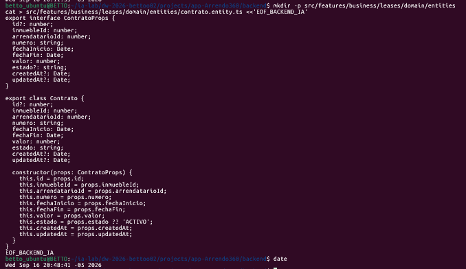

### 9.2 — features/business/leases/infrastructure/persistence/models/contrato.model.ts

Modelo Sequelize con claves foráneas `@ForeignKey` hacia `InmuebleModel` y `ArrendatarioModel`, e índice único sobre el número de contrato.

**Archivo:** `src/features/business/leases/infrastructure/persistence/models/contrato.model.ts`

``` bash
mkdir -p src/features/business/leases/infrastructure/persistence/models
cat > src/features/business/leases/infrastructure/persistence/models/contrato.model.ts <<'EOF_BACKEND_IA'
import {
  AutoIncrement,
  BelongsTo,
  Column,
  CreatedAt,
  DataType,
  ForeignKey,
  Model,
  PrimaryKey,
  Table,
  UpdatedAt,
} from 'sequelize-typescript';
import { InmuebleModel } from '../../properties/infrastructure/persistence/models/inmueble.model';
import { ArrendatarioModel } from './arrendatario.model';

@Table({ tableName: 'contratos', timestamps: true })
export class ContratoModel extends Model {
  @PrimaryKey
  @AutoIncrement
  @Column(DataType.INTEGER)
  declare id: number;

  @ForeignKey(() => InmuebleModel)
  @Column({
    type: DataType.INTEGER,
    allowNull: false,
    field: 'inmueble_id',
  })
  declare inmuebleId: number;

  @ForeignKey(() => ArrendatarioModel)
  @Column({
    type: DataType.INTEGER,
    allowNull: false,
    field: 'arrendatario_id',
  })
  declare arrendatarioId: number;

  @Column({
    type: DataType.STRING(50),
    allowNull: false,
    unique: true,
  })
  declare numero: string;

  @Column({
    type: DataType.DATEONLY,
    allowNull: false,
    field: 'fecha_inicio',
  })
  declare fechaInicio: Date;

  @Column({
    type: DataType.DATEONLY,
    allowNull: false,
    field: 'fecha_fin',
  })
  declare fechaFin: Date;

  @Column({
    type: DataType.DECIMAL(12, 2),
    allowNull: false,
  })
  declare valor: number;

  @Column({
    type: DataType.STRING(20),
    allowNull: false,
    defaultValue: 'ACTIVO',
  })
  declare estado: string;

  @CreatedAt
  @Column({ field: 'created_at' })
  declare createdAt: Date;

  @UpdatedAt
  @Column({ field: 'updated_at' })
  declare updatedAt: Date;

  @BelongsTo(() => InmuebleModel)
  declare inmueble: InmuebleModel;

  @BelongsTo(() => ArrendatarioModel)
  declare arrendatario: ArrendatarioModel;
}
EOF_BACKEND_IA
```

### 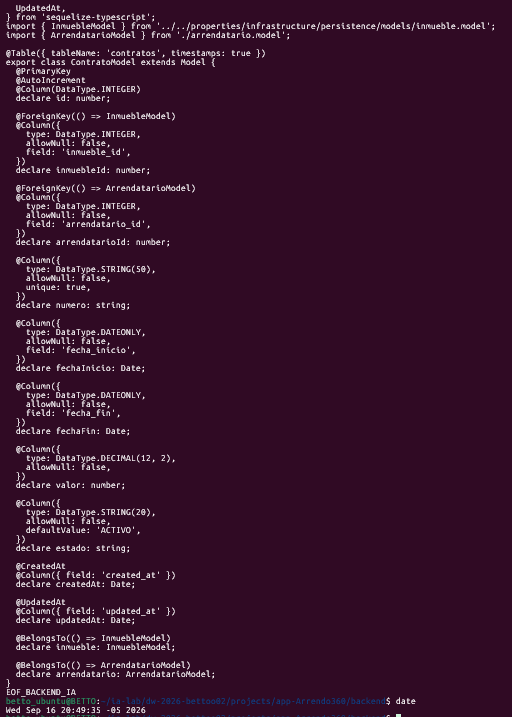

### 9.3 — features/business/leases/presentation/http/controllers/contratos.controller.ts

Controlador REST con protección RBAC: la creación de contratos requiere rol `ADMIN` o `ASESOR` (`@Roles(Role.ADMIN, Role.ASESOR)`).

**Archivo:** `src/features/business/leases/presentation/http/controllers/contratos.controller.ts`

``` bash
mkdir -p src/features/business/leases/presentation/http/controllers
cat > src/features/business/leases/presentation/http/controllers/contratos.controller.ts <<'EOF_BACKEND_IA'
import {
  Body,
  Controller,
  Delete,
  Get,
  HttpCode,
  HttpStatus,
  Param,
  Patch,
  Post,
  Query,
  UseGuards,
} from '@nestjs/common';
import {
  ApiCreatedResponse,
  ApiHeader,
  ApiNoContentResponse,
  ApiOkResponse,
  ApiOperation,
  ApiTags,
} from '@nestjs/swagger';
import { ParsePositiveIntPipe } from '../../../../../../common/pipes/parse-positive-int.pipe';
import { Roles } from '../../../../../../common/decorators/roles.decorator';
import { RolesGuard } from '../../../../../../common/guards/roles.guard';
import { Role } from '../../../../../../common/enums/role.enum';
import { CreateContratoDto } from '../../../application/dto/contrato/create-contrato.dto';
import { UpdateContratoDto } from '../../../application/dto/contrato/update-contrato.dto';
import { ContratoFilterDto } from '../../../application/dto/contrato/contrato-filter.dto';
import { ContratoResponseDto } from '../../../application/dto/contrato/contrato-response.dto';
import { CreateContratoUseCase } from '../../../application/use-cases/contrato/create-contrato.use-case';
import { ListContratosUseCase } from '../../../application/use-cases/contrato/list-contratos.use-case';
import { GetContratoUseCase } from '../../../application/use-cases/contrato/get-contrato.use-case';
import { UpdateContratoUseCase } from '../../../application/use-cases/contrato/update-contrato.use-case';
import { DeleteContratoUseCase } from '../../../application/use-cases/contrato/delete-contrato.use-case';

@ApiTags('Leases - Contratos')
@Controller('contratos')
@UseGuards(RolesGuard)
export class ContratosController {
  constructor(
    private readonly createContratoUseCase: CreateContratoUseCase,
    private readonly listContratosUseCase: ListContratosUseCase,
    private readonly getContratoUseCase: GetContratoUseCase,
    private readonly updateContratoUseCase: UpdateContratoUseCase,
    private readonly deleteContratoUseCase: DeleteContratoUseCase,
  ) {}

  @Post()
  @Roles(Role.ADMIN, Role.ASESOR)
  @ApiOperation({ summary: 'Crear un nuevo contrato de arrendamiento (RBAC: ADMIN, ASESOR)' })
  @ApiHeader({ name: 'x-user-role', description: 'Rol para validación RBAC', required: false })
  @ApiCreatedResponse({ type: ContratoResponseDto })
  create(@Body() dto: CreateContratoDto) {
    return this.createContratoUseCase.execute(dto);
  }

  @Get()
  @ApiOperation({ summary: 'Listar contratos con filtros y paginación' })
  @ApiOkResponse({ type: [ContratoResponseDto] })
  findAll(@Query() filter: ContratoFilterDto) {
    return this.listContratosUseCase.execute(filter);
  }

  @Get(':id')
  @ApiOperation({ summary: 'Obtener un contrato por ID' })
  @ApiOkResponse({ type: ContratoResponseDto })
  findOne(@Param('id', ParsePositiveIntPipe) id: number) {
    return this.getContratoUseCase.execute(id);
  }

  @Patch(':id')
  @Roles(Role.ADMIN, Role.ASESOR)
  @ApiOperation({ summary: 'Actualizar un contrato de arrendamiento' })
  @ApiOkResponse({ type: ContratoResponseDto })
  update(
    @Param('id', ParsePositiveIntPipe) id: number,
    @Body() dto: UpdateContratoDto,
  ) {
    return this.updateContratoUseCase.execute(id, dto);
  }

  @Delete(':id')
  @Roles(Role.ADMIN)
  @HttpCode(HttpStatus.NO_CONTENT)
  @ApiOperation({ summary: 'Eliminar un contrato' })
  @ApiNoContentResponse()
  remove(@Param('id', ParsePositiveIntPipe) id: number) {
    return this.deleteContratoUseCase.execute(id);
  }
}
EOF_BACKEND_IA
```

### 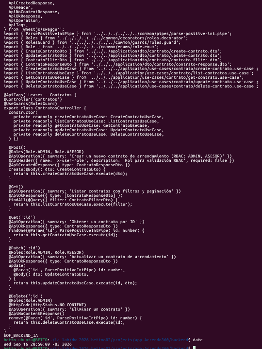

### 9.4 — Verificar tablas físicas `arrendatarios` y `contratos` y API

Arranca la app y valida la exposición en Swagger de `/api/contratos` y `/api/arrendatarios`.

``` bash
npm run start:dev
```

------------------------------------------------------------------------

## FASE 10 — `09_BUSINESS_RECEIVABLES` (Cobros Mensuales y Pagos)

### Business — Receivables / Cartera, Cobros Mensuales y Recaudos (CA & DDD)

> **Objetivo de la fase:** Administrar la facturación periódica y la recepción de recaudos. Emite cuentas de cobro mensuales sobre contratos activos y registra los pagos con control de método, fecha y monto.
>
> **Seguridad RBAC:** Operaciones de cartera restringidas al departamento financiero con roles `ADMIN` y `CARTERA`.

### 10.1 — features/business/receivables/infrastructure/persistence/models/cobro-mensual.model.ts

Modelo Sequelize para la tabla `cobros_mensuales`. Enlaza directamente al contrato de arrendamiento.

**Archivo:** `src/features/business/receivables/infrastructure/persistence/models/cobro-mensual.model.ts`

``` bash
mkdir -p src/features/business/receivables/infrastructure/persistence/models
cat > src/features/business/receivables/infrastructure/persistence/models/cobro-mensual.model.ts <<'EOF_BACKEND_IA'
import {
  AutoIncrement,
  BelongsTo,
  Column,
  CreatedAt,
  DataType,
  ForeignKey,
  HasMany,
  Model,
  PrimaryKey,
  Table,
  UpdatedAt,
} from 'sequelize-typescript';
import { ContratoModel } from '../../leases/infrastructure/persistence/models/contrato.model';
import { PagoModel } from './pago.model';

@Table({ tableName: 'cobros_mensuales', timestamps: true })
export class CobroMensualModel extends Model {
  @PrimaryKey
  @AutoIncrement
  @Column(DataType.INTEGER)
  declare id: number;

  @ForeignKey(() => ContratoModel)
  @Column({
    type: DataType.INTEGER,
    allowNull: false,
    field: 'contrato_id',
  })
  declare contratoId: number;

  @Column({
    type: DataType.DATEONLY,
    allowNull: false,
  })
  declare fecha: Date;

  @Column({
    type: DataType.DECIMAL(12, 2),
    allowNull: false,
  })
  declare valor: number;

  @Column({
    type: DataType.STRING(20),
    allowNull: false,
    defaultValue: 'PENDIENTE',
  })
  declare estado: string;

  @Column({
    type: DataType.TEXT,
    allowNull: true,
  })
  declare observaciones: string;

  @CreatedAt
  @Column({ field: 'created_at' })
  declare createdAt: Date;

  @UpdatedAt
  @Column({ field: 'updated_at' })
  declare updatedAt: Date;

  @BelongsTo(() => ContratoModel)
  declare contrato: ContratoModel;

  @HasMany(() => PagoModel, 'cobroId')
  declare pagos: PagoModel[];
}
EOF_BACKEND_IA
```

### 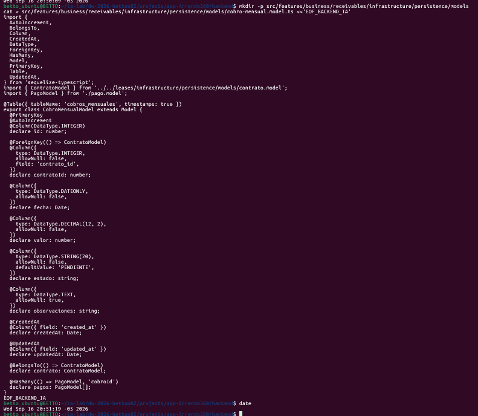

### 10.2 — features/business/receivables/infrastructure/persistence/models/pago.model.ts

Modelo Sequelize para la tabla `pagos`. Registra el método de pago (`TRANSFERENCIA`, `PSE`, `EFECTIVO`), el monto y la fecha de transacción.

**Archivo:** `src/features/business/receivables/infrastructure/persistence/models/pago.model.ts`

``` bash
mkdir -p src/features/business/receivables/infrastructure/persistence/models
cat > src/features/business/receivables/infrastructure/persistence/models/pago.model.ts <<'EOF_BACKEND_IA'
import {
  AutoIncrement,
  BelongsTo,
  Column,
  CreatedAt,
  DataType,
  ForeignKey,
  Model,
  PrimaryKey,
  Table,
  UpdatedAt,
} from 'sequelize-typescript';
import { CobroMensualModel } from './cobro-mensual.model';

@Table({ tableName: 'pagos', timestamps: true })
export class PagoModel extends Model {
  @PrimaryKey
  @AutoIncrement
  @Column(DataType.INTEGER)
  declare id: number;

  @ForeignKey(() => CobroMensualModel)
  @Column({
    type: DataType.INTEGER,
    allowNull: false,
    field: 'cobro_id',
  })
  declare cobroId: number;

  @Column({
    type: DataType.STRING(50),
    allowNull: false,
  })
  declare metodo: string;

  @Column({
    type: DataType.DECIMAL(12, 2),
    allowNull: false,
  })
  declare monto: number;

  @Column({
    type: DataType.DATEONLY,
    allowNull: false,
  })
  declare fecha: Date;

  @Column({
    type: DataType.STRING(20),
    allowNull: false,
    defaultValue: 'APLICADO',
  })
  declare estado: string;

  @CreatedAt
  @Column({ field: 'created_at' })
  declare createdAt: Date;

  @UpdatedAt
  @Column({ field: 'updated_at' })
  declare updatedAt: Date;

  @BelongsTo(() => CobroMensualModel)
  declare cobro: CobroMensualModel;
}
EOF_BACKEND_IA
```

### 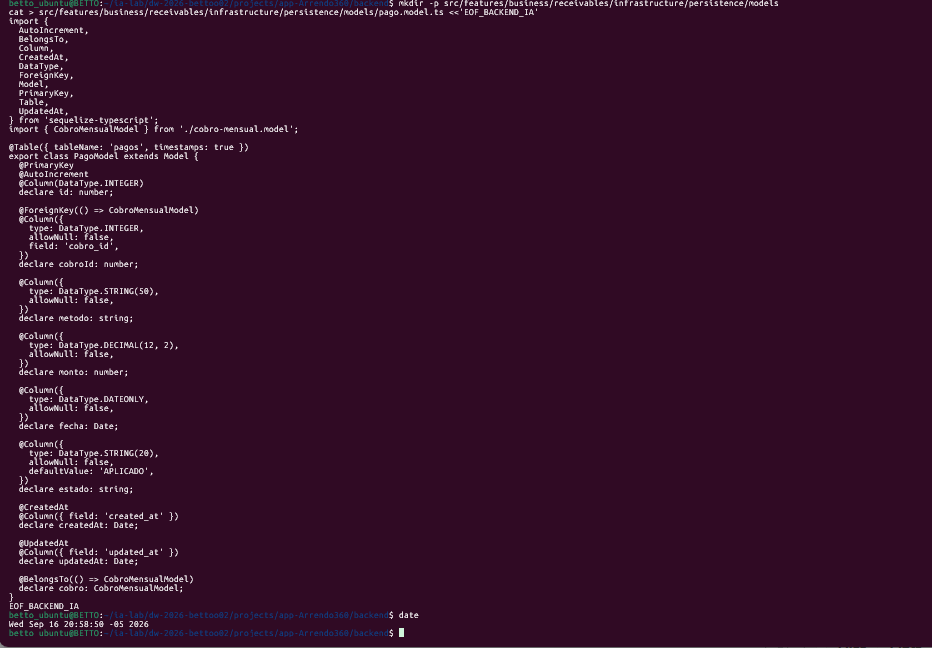

### 10.3 — features/business/receivables/presentation/http/controllers/cobros.controller.ts

Controlador REST para Cuentas de Cobro: emisión y seguimiento protegido con `@Roles(Role.ADMIN, Role.CARTERA)`.

**Archivo:** `src/features/business/receivables/presentation/http/controllers/cobros.controller.ts`

``` bash
mkdir -p src/features/business/receivables/presentation/http/controllers
cat > src/features/business/receivables/presentation/http/controllers/cobros.controller.ts <<'EOF_BACKEND_IA'
import {
  Body,
  Controller,
  Delete,
  Get,
  HttpCode,
  HttpStatus,
  Param,
  Patch,
  Post,
  Query,
  UseGuards,
} from '@nestjs/common';
import {
  ApiCreatedResponse,
  ApiHeader,
  ApiNoContentResponse,
  ApiOkResponse,
  ApiOperation,
  ApiTags,
} from '@nestjs/swagger';
import { ParsePositiveIntPipe } from '../../../../../../common/pipes/parse-positive-int.pipe';
import { Roles } from '../../../../../../common/decorators/roles.decorator';
import { RolesGuard } from '../../../../../../common/guards/roles.guard';
import { Role } from '../../../../../../common/enums/role.enum';
import { CreateCobroDto } from '../../../application/dto/cobro/create-cobro.dto';
import { UpdateCobroDto } from '../../../application/dto/cobro/update-cobro.dto';
import { CobroFilterDto } from '../../../application/dto/cobro/cobro-filter.dto';
import { CobroResponseDto } from '../../../application/dto/cobro/cobro-response.dto';
import { CreateCobroUseCase } from '../../../application/use-cases/cobro/create-cobro.use-case';
import { ListCobrosUseCase } from '../../../application/use-cases/cobro/list-cobros.use-case';
import { GetCobroUseCase } from '../../../application/use-cases/cobro/get-cobro.use-case';
import { UpdateCobroUseCase } from '../../../application/use-cases/cobro/update-cobro.use-case';
import { DeleteCobroUseCase } from '../../../application/use-cases/cobro/delete-cobro.use-case';

@ApiTags('Receivables - Cobros Mensuales')
@Controller('cobros')
@UseGuards(RolesGuard)
export class CobrosController {
  constructor(
    private readonly createCobroUseCase: CreateCobroUseCase,
    private readonly listCobrosUseCase: ListCobrosUseCase,
    private readonly getCobroUseCase: GetCobroUseCase,
    private readonly updateCobroUseCase: UpdateCobroUseCase,
    private readonly deleteCobroUseCase: DeleteCobroUseCase,
  ) {}

  @Post()
  @Roles(Role.ADMIN, Role.CARTERA)
  @ApiOperation({ summary: 'Generar cuenta de cobro mensual (RBAC: ADMIN, CARTERA)' })
  @ApiHeader({ name: 'x-user-role', description: 'Rol para validación RBAC', required: false })
  @ApiCreatedResponse({ type: CobroResponseDto })
  create(@Body() dto: CreateCobroDto) {
    return this.createCobroUseCase.execute(dto);
  }

  @Get()
  @ApiOperation({ summary: 'Listar cuentas de cobro con filtros' })
  @ApiOkResponse({ type: [CobroResponseDto] })
  findAll(@Query() filter: CobroFilterDto) {
    return this.listCobrosUseCase.execute(filter);
  }

  @Get(':id')
  @ApiOperation({ summary: 'Obtener una cuenta de cobro por ID' })
  @ApiOkResponse({ type: CobroResponseDto })
  findOne(@Param('id', ParsePositiveIntPipe) id: number) {
    return this.getCobroUseCase.execute(id);
  }

  @Patch(':id')
  @Roles(Role.ADMIN, Role.CARTERA)
  @ApiOperation({ summary: 'Actualizar una cuenta de cobro' })
  @ApiOkResponse({ type: CobroResponseDto })
  update(
    @Param('id', ParsePositiveIntPipe) id: number,
    @Body() dto: UpdateCobroDto,
  ) {
    return this.updateCobroUseCase.execute(id, dto);
  }

  @Delete(':id')
  @Roles(Role.ADMIN)
  @HttpCode(HttpStatus.NO_CONTENT)
  @ApiOperation({ summary: 'Eliminar una cuenta de cobro' })
  @ApiNoContentResponse()
  remove(@Param('id', ParsePositiveIntPipe) id: number) {
    return this.deleteCobroUseCase.execute(id);
  }
}
EOF_BACKEND_IA
```

### 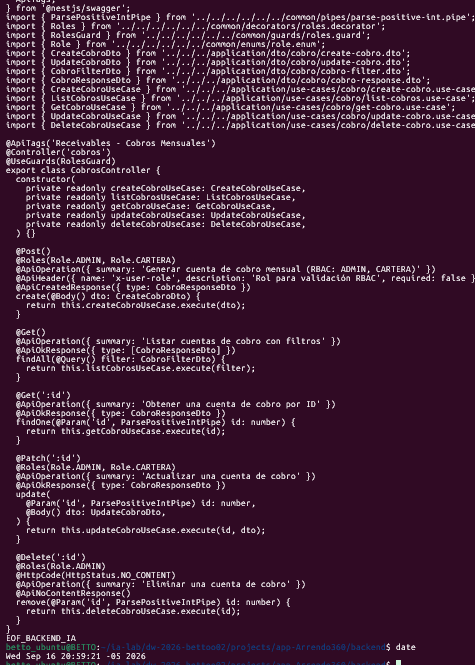

### 10.4 — features/business/receivables/presentation/http/controllers/pagos.controller.ts

Controlador REST para Pagos: registro de recaudos protegidos con `@Roles(Role.ADMIN, Role.CARTERA)`.

**Archivo:** `src/features/business/receivables/presentation/http/controllers/pagos.controller.ts`

``` bash
mkdir -p src/features/business/receivables/presentation/http/controllers
cat > src/features/business/receivables/presentation/http/controllers/pagos.controller.ts <<'EOF_BACKEND_IA'
import {
  Body,
  Controller,
  Delete,
  Get,
  HttpCode,
  HttpStatus,
  Param,
  Patch,
  Post,
  Query,
  UseGuards,
} from '@nestjs/common';
import {
  ApiCreatedResponse,
  ApiHeader,
  ApiNoContentResponse,
  ApiOkResponse,
  ApiOperation,
  ApiTags,
} from '@nestjs/swagger';
import { ParsePositiveIntPipe } from '../../../../../../common/pipes/parse-positive-int.pipe';
import { Roles } from '../../../../../../common/decorators/roles.decorator';
import { RolesGuard } from '../../../../../../common/guards/roles.guard';
import { Role } from '../../../../../../common/enums/role.enum';
import { CreatePagoDto } from '../../../application/dto/pago/create-pago.dto';
import { UpdatePagoDto } from '../../../application/dto/pago/update-pago.dto';
import { PagoFilterDto } from '../../../application/dto/pago/pago-filter.dto';
import { PagoResponseDto } from '../../../application/dto/pago/pago-response.dto';
import { CreatePagoUseCase } from '../../../application/use-cases/pago/create-pago.use-case';
import { ListPagosUseCase } from '../../../application/use-cases/pago/list-pagos.use-case';
import { GetPagoUseCase } from '../../../application/use-cases/pago/get-pago.use-case';
import { UpdatePagoUseCase } from '../../../application/use-cases/pago/update-pago.use-case';
import { DeletePagoUseCase } from '../../../application/use-cases/pago/delete-pago.use-case';

@ApiTags('Receivables - Pagos')
@Controller('pagos')
@UseGuards(RolesGuard)
export class PagosController {
  constructor(
    private readonly createPagoUseCase: CreatePagoUseCase,
    private readonly listPagosUseCase: ListPagosUseCase,
    private readonly getPagoUseCase: GetPagoUseCase,
    private readonly updatePagoUseCase: UpdatePagoUseCase,
    private readonly deletePagoUseCase: DeletePagoUseCase,
  ) {}

  @Post()
  @Roles(Role.ADMIN, Role.CARTERA)
  @ApiOperation({ summary: 'Registrar un pago de canon (RBAC: ADMIN, CARTERA)' })
  @ApiHeader({ name: 'x-user-role', description: 'Rol para validación RBAC', required: false })
  @ApiCreatedResponse({ type: PagoResponseDto })
  create(@Body() dto: CreatePagoDto) {
    return this.createPagoUseCase.execute(dto);
  }

  @Get()
  @ApiOperation({ summary: 'Listar pagos recibidos con filtros' })
  @ApiOkResponse({ type: [PagoResponseDto] })
  findAll(@Query() filter: PagoFilterDto) {
    return this.listPagosUseCase.execute(filter);
  }

  @Get(':id')
  @ApiOperation({ summary: 'Obtener un pago por ID' })
  @ApiOkResponse({ type: PagoResponseDto })
  findOne(@Param('id', ParsePositiveIntPipe) id: number) {
    return this.getPagoUseCase.execute(id);
  }

  @Patch(':id')
  @Roles(Role.ADMIN, Role.CARTERA)
  @ApiOperation({ summary: 'Actualizar un pago' })
  @ApiOkResponse({ type: PagoResponseDto })
  update(
    @Param('id', ParsePositiveIntPipe) id: number,
    @Body() dto: UpdatePagoDto,
  ) {
    return this.updatePagoUseCase.execute(id, dto);
  }

  @Delete(':id')
  @Roles(Role.ADMIN)
  @HttpCode(HttpStatus.NO_CONTENT)
  @ApiOperation({ summary: 'Eliminar un pago' })
  @ApiNoContentResponse()
  remove(@Param('id', ParsePositiveIntPipe) id: number) {
    return this.deletePagoUseCase.execute(id);
  }
}
EOF_BACKEND_IA
```

### 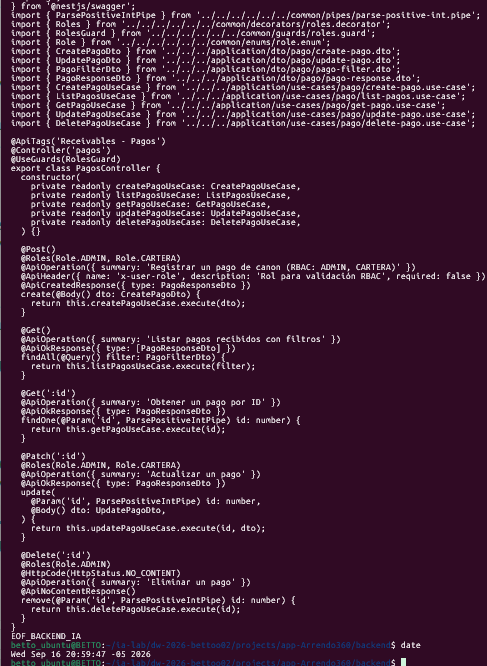

### 10.5 — Verificar tablas físicas `cobros_mensuales` y `pagos` y API

Arranca la aplicación y verifica la sincronización de tablas y Swagger.

``` bash
npm run start:dev
```

------------------------------------------------------------------------

## FASE 11 — `10_BUSINESS_OWNER_SETTLEMENTS` (Distribución a Propietarios)

### Business — Owner Settlements / Liquidación y Distribución de Recaudo (CA & DDD)

> **Objetivo de la fase:** Liquida y dispersa los fondos recaudados hacia los propietarios titulares de los inmuebles, deduciendo comisiones administrativas o costos de reparaciones locativas.
>
> **Entidad:** `DistribucionPago` (referencia al pago origen, al propietario beneficiario, valor neto liquidado, fecha y estado de transferencia).

### 11.1 — features/business/owner-settlements/infrastructure/persistence/models/distribucion-pago.model.ts

Modelo Sequelize para la tabla `distribuciones_pago`.

**Archivo:** `src/features/business/owner-settlements/infrastructure/persistence/models/distribucion-pago.model.ts`

``` bash
mkdir -p src/features/business/owner-settlements/infrastructure/persistence/models
cat > src/features/business/owner-settlements/infrastructure/persistence/models/distribucion-pago.model.ts <<'EOF_BACKEND_IA'
import {
  AutoIncrement,
  BelongsTo,
  Column,
  CreatedAt,
  DataType,
  ForeignKey,
  Model,
  PrimaryKey,
  Table,
  UpdatedAt,
} from 'sequelize-typescript';
import { PagoModel } from '../../receivables/infrastructure/persistence/models/pago.model';
import { PropietarioModel } from '../../properties/infrastructure/persistence/models/propietario.model';

@Table({ tableName: 'distribuciones_pago', timestamps: true })
export class DistribucionPagoModel extends Model {
  @PrimaryKey
  @AutoIncrement
  @Column(DataType.INTEGER)
  declare id: number;

  @ForeignKey(() => PagoModel)
  @Column({
    type: DataType.INTEGER,
    allowNull: false,
    field: 'pago_id',
  })
  declare pagoId: number;

  @ForeignKey(() => PropietarioModel)
  @Column({
    type: DataType.INTEGER,
    allowNull: false,
    field: 'propietario_id',
  })
  declare propietarioId: number;

  @Column({
    type: DataType.DECIMAL(12, 2),
    allowNull: false,
    field: 'valor_distribuido',
  })
  declare valorDistribuido: number;

  @Column({
    type: DataType.DATEONLY,
    allowNull: false,
    field: 'fecha_distribucion',
  })
  declare fechaDistribucion: Date;

  @Column({
    type: DataType.STRING(20),
    allowNull: false,
    defaultValue: 'PENDIENTE',
  })
  declare estado: string;

  @CreatedAt
  @Column({ field: 'created_at' })
  declare createdAt: Date;

  @UpdatedAt
  @Column({ field: 'updated_at' })
  declare updatedAt: Date;

  @BelongsTo(() => PagoModel)
  declare pago: PagoModel;

  @BelongsTo(() => PropietarioModel)
  declare propietario: PropietarioModel;
}
EOF_BACKEND_IA
```

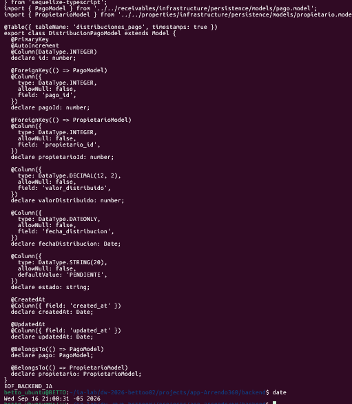

### 11.2 — features/business/owner-settlements/presentation/http/controllers/distribucion-pago.controller.ts

Controlador REST con acceso segmentado: creación protegida para `CARTERA` y consulta habilitada para propietarios con rol `PROPIETARIO_CONSULTA`.

**Archivo:** `src/features/business/owner-settlements/presentation/http/controllers/distribucion-pago.controller.ts`

``` bash
mkdir -p src/features/business/owner-settlements/presentation/http/controllers
cat > src/features/business/owner-settlements/presentation/http/controllers/distribucion-pago.controller.ts <<'EOF_BACKEND_IA'
import {
  Body,
  Controller,
  Delete,
  Get,
  HttpCode,
  HttpStatus,
  Param,
  Patch,
  Post,
  Query,
  UseGuards,
} from '@nestjs/common';
import {
  ApiCreatedResponse,
  ApiHeader,
  ApiNoContentResponse,
  ApiOkResponse,
  ApiOperation,
  ApiTags,
} from '@nestjs/swagger';
import { ParsePositiveIntPipe } from '../../../../../../common/pipes/parse-positive-int.pipe';
import { Roles } from '../../../../../../common/decorators/roles.decorator';
import { RolesGuard } from '../../../../../../common/guards/roles.guard';
import { Role } from '../../../../../../common/enums/role.enum';
import { CreateDistribucionPagoDto } from '../../../application/dto/create-distribucion-pago.dto';
import { UpdateDistribucionPagoDto } from '../../../application/dto/update-distribucion-pago.dto';
import { DistribucionPagoFilterDto } from '../../../application/dto/distribucion-pago-filter.dto';
import { DistribucionPagoResponseDto } from '../../../application/dto/distribucion-pago-response.dto';
import { CreateDistribucionPagoUseCase } from '../../../application/use-cases/create-distribucion-pago.use-case';
import { ListDistribucionesPagoUseCase } from '../../../application/use-cases/list-distribuciones-pago.use-case';
import { GetDistribucionPagoUseCase } from '../../../application/use-cases/get-distribucion-pago.use-case';
import { UpdateDistribucionPagoUseCase } from '../../../application/use-cases/update-distribucion-pago.use-case';
import { DeleteDistribucionPagoUseCase } from '../../../application/use-cases/delete-distribucion-pago.use-case';

@ApiTags('Owner Settlements - Distribución de Pagos')
@Controller('distribuciones-pago')
@UseGuards(RolesGuard)
export class DistribucionPagoController {
  constructor(
    private readonly createDistribucionPagoUseCase: CreateDistribucionPagoUseCase,
    private readonly listDistribucionesPagoUseCase: ListDistribucionesPagoUseCase,
    private readonly getDistribucionPagoUseCase: GetDistribucionPagoUseCase,
    private readonly updateDistribucionPagoUseCase: UpdateDistribucionPagoUseCase,
    private readonly deleteDistribucionPagoUseCase: DeleteDistribucionPagoUseCase,
  ) {}

  @Post()
  @Roles(Role.ADMIN, Role.CARTERA)
  @ApiOperation({ summary: 'Liquidar y distribuir pago a propietario (RBAC: ADMIN, CARTERA)' })
  @ApiHeader({ name: 'x-user-role', description: 'Rol para validación RBAC', required: false })
  @ApiCreatedResponse({ type: DistribucionPagoResponseDto })
  create(@Body() dto: CreateDistribucionPagoDto) {
    return this.createDistribucionPagoUseCase.execute(dto);
  }

  @Get()
  @Roles(Role.ADMIN, Role.CARTERA, Role.PROPIETARIO_CONSULTA)
  @ApiOperation({ summary: 'Listar distribuciones de pago' })
  @ApiOkResponse({ type: [DistribucionPagoResponseDto] })
  findAll(@Query() filter: DistribucionPagoFilterDto) {
    return this.listDistribucionesPagoUseCase.execute(filter);
  }

  @Get(':id')
  @Roles(Role.ADMIN, Role.CARTERA, Role.PROPIETARIO_CONSULTA)
  @ApiOperation({ summary: 'Consultar detalle de una liquidación por ID' })
  @ApiOkResponse({ type: DistribucionPagoResponseDto })
  findOne(@Param('id', ParsePositiveIntPipe) id: number) {
    return this.getDistribucionPagoUseCase.execute(id);
  }

  @Patch(':id')
  @Roles(Role.ADMIN, Role.CARTERA)
  @ApiOperation({ summary: 'Actualizar estado de distribución' })
  @ApiOkResponse({ type: DistribucionPagoResponseDto })
  update(
    @Param('id', ParsePositiveIntPipe) id: number,
    @Body() dto: UpdateDistribucionPagoDto,
  ) {
    return this.updateDistribucionPagoUseCase.execute(id, dto);
  }

  @Delete(':id')
  @Roles(Role.ADMIN)
  @HttpCode(HttpStatus.NO_CONTENT)
  @ApiOperation({ summary: 'Eliminar un registro de distribución' })
  @ApiNoContentResponse()
  remove(@Param('id', ParsePositiveIntPipe) id: number) {
    return this.deleteDistribucionPagoUseCase.execute(id);
  }
}
EOF_BACKEND_IA
```

### 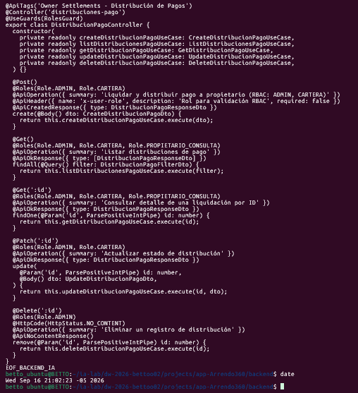

### 11.3 — Verificar tabla física `distribuciones_pago` y API

Arranca la aplicación y verifica la sincronización física de la tabla y Swagger.

``` bash
npm run start:dev
```

------------------------------------------------------------------------

## FASE 12 — `11_BUSINESS_MAINTENANCE` (Mantenimiento e Incidencias)

### Business — Maintenance / Gestión de Mantenimiento y Proveedores (CA & DDD)

> **Objetivo de la fase:** Administra el flujo de incidencias, cotizaciones y órdenes de trabajo locativo en los inmuebles.
>
> **Flujo Operativo:** 1. Reporte del daño → `TicketMantenimiento` (estado `ABIERTO`, costo inicial estimado). 2. Asignación a técnico certificado → `Proveedor` (plomería, electricidad, cerrajería, pintura). 3. Generación de orden de trabajo → `OrdenMantenimiento` (aprobación formal de presupuesto, control de `costo_estimado` vs `costo_final` y cierre con evidencia documental).
>
> **Seguridad RBAC:** Operaciones operativas protegidas con `@Roles(Role.ADMIN, Role.MANTENIMIENTO, Role.ASESOR)`.

### 12.1 — features/business/maintenance/infrastructure/persistence/models/ticket-mantenimiento.model.ts

Modelo Sequelize para la tabla `tickets_mantenimiento` vinculado al inmueble afectado.

**Archivo:** `src/features/business/maintenance/infrastructure/persistence/models/ticket-mantenimiento.model.ts`

``` bash
mkdir -p src/features/business/maintenance/infrastructure/persistence/models
cat > src/features/business/maintenance/infrastructure/persistence/models/ticket-mantenimiento.model.ts <<'EOF_BACKEND_IA'
import {
  AutoIncrement,
  BelongsTo,
  Column,
  CreatedAt,
  DataType,
  ForeignKey,
  HasMany,
  Model,
  PrimaryKey,
  Table,
  UpdatedAt,
} from 'sequelize-typescript';
import { InmuebleModel } from '../../properties/infrastructure/persistence/models/inmueble.model';
import { OrdenMantenimientoModel } from './orden-mantenimiento.model';

@Table({ tableName: 'tickets_mantenimiento', timestamps: true })
export class TicketMantenimientoModel extends Model {
  @PrimaryKey
  @AutoIncrement
  @Column(DataType.INTEGER)
  declare id: number;

  @ForeignKey(() => InmuebleModel)
  @Column({
    type: DataType.INTEGER,
    allowNull: false,
    field: 'inmueble_id',
  })
  declare inmuebleId: number;

  @Column({
    type: DataType.DATEONLY,
    allowNull: false,
  })
  declare fecha: Date;

  @Column({
    type: DataType.DECIMAL(12, 2),
    allowNull: false,
    defaultValue: 0,
  })
  declare costo: number;

  @Column({
    type: DataType.STRING(20),
    allowNull: false,
    defaultValue: 'ABIERTO',
  })
  declare estado: string;

  @Column({
    type: DataType.TEXT,
    allowNull: false,
  })
  declare descripcion: string;

  @CreatedAt
  @Column({ field: 'created_at' })
  declare createdAt: Date;

  @UpdatedAt
  @Column({ field: 'updated_at' })
  declare updatedAt: Date;

  @BelongsTo(() => InmuebleModel)
  declare inmueble: InmuebleModel;

  @HasMany(() => OrdenMantenimientoModel, 'ticketId')
  declare ordenes: OrdenMantenimientoModel[];
}
EOF_BACKEND_IA
```

### 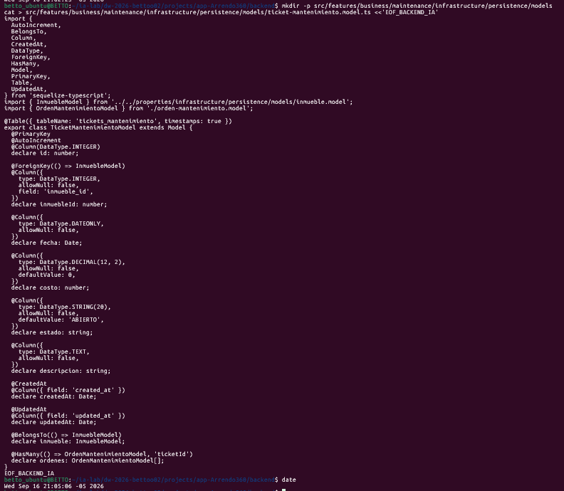

### 12.2 — features/business/maintenance/infrastructure/persistence/models/proveedor.model.ts

Modelo Sequelize para el directorio de contratistas y proveedores técnicos calificados.

**Archivo:** `src/features/business/maintenance/infrastructure/persistence/models/proveedor.model.ts`

``` bash
mkdir -p src/features/business/maintenance/infrastructure/persistence/models
cat > src/features/business/maintenance/infrastructure/persistence/models/proveedor.model.ts <<'EOF_BACKEND_IA'
import {
  AutoIncrement,
  Column,
  CreatedAt,
  DataType,
  HasMany,
  Model,
  PrimaryKey,
  Table,
  UpdatedAt,
} from 'sequelize-typescript';
import { OrdenMantenimientoModel } from './orden-mantenimiento.model';

@Table({ tableName: 'proveedores', timestamps: true })
export class ProveedorModel extends Model {
  @PrimaryKey
  @AutoIncrement
  @Column(DataType.INTEGER)
  declare id: number;

  @Column({
    type: DataType.STRING(150),
    allowNull: false,
  })
  declare nombre: string;

  @Column({
    type: DataType.STRING(50),
    allowNull: true,
  })
  declare telefono: string;

  @Column({
    type: DataType.STRING(150),
    allowNull: true,
  })
  declare email: string;

  @Column({
    type: DataType.BOOLEAN,
    allowNull: false,
    defaultValue: true,
    field: 'is_active',
  })
  declare isActive: boolean;

  @CreatedAt
  @Column({ field: 'created_at' })
  declare createdAt: Date;

  @UpdatedAt
  @Column({ field: 'updated_at' })
  declare updatedAt: Date;

  @HasMany(() => OrdenMantenimientoModel, 'proveedorId')
  declare ordenes: OrdenMantenimientoModel[];
}
EOF_BACKEND_IA
```

### 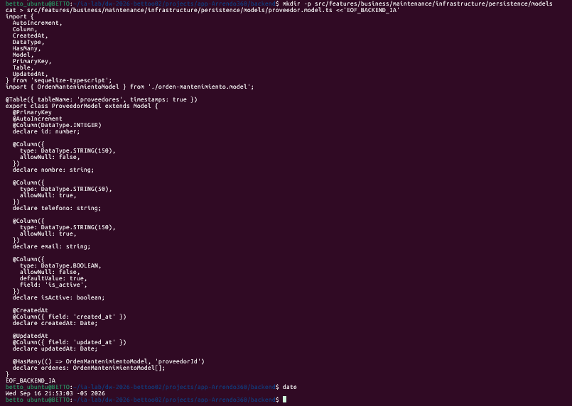

### 12.3 — features/business/maintenance/infrastructure/persistence/models/orden-mantenimiento.model.ts

Modelo Sequelize para la tabla `ordenes_mantenimiento` con fecha de aprobación, costo estimado vs final y evidencias de cierre.

**Archivo:** `src/features/business/maintenance/infrastructure/persistence/models/orden-mantenimiento.model.ts`

``` bash
mkdir -p src/features/business/maintenance/infrastructure/persistence/models
cat > src/features/business/maintenance/infrastructure/persistence/models/orden-mantenimiento.model.ts <<'EOF_BACKEND_IA'
import {
  AutoIncrement,
  BelongsTo,
  Column,
  CreatedAt,
  DataType,
  ForeignKey,
  Model,
  PrimaryKey,
  Table,
  UpdatedAt,
} from 'sequelize-typescript';
import { TicketMantenimientoModel } from './ticket-mantenimiento.model';
import { ProveedorModel } from './proveedor.model';

@Table({ tableName: 'ordenes_mantenimiento', timestamps: true })
export class OrdenMantenimientoModel extends Model {
  @PrimaryKey
  @AutoIncrement
  @Column(DataType.INTEGER)
  declare id: number;

  @ForeignKey(() => TicketMantenimientoModel)
  @Column({
    type: DataType.INTEGER,
    allowNull: false,
    field: 'ticket_id',
  })
  declare ticketId: number;

  @ForeignKey(() => ProveedorModel)
  @Column({
    type: DataType.INTEGER,
    allowNull: false,
    field: 'proveedor_id',
  })
  declare proveedorId: number;

  @Column({
    type: DataType.DATEONLY,
    allowNull: true,
    field: 'fecha_aprobacion',
  })
  declare fechaAprobacion: Date;

  @Column({
    type: DataType.DECIMAL(12, 2),
    allowNull: false,
    defaultValue: 0,
    field: 'costo_estimado',
  })
  declare costoEstimado: number;

  @Column({
    type: DataType.DECIMAL(12, 2),
    allowNull: true,
    field: 'costo_final',
  })
  declare costoFinal: number;

  @Column({
    type: DataType.STRING(20),
    allowNull: false,
    defaultValue: 'COTIZADO',
  })
  declare estado: string;

  @Column({
    type: DataType.TEXT,
    allowNull: false,
  })
  declare descripcion: string;

  @CreatedAt
  @Column({ field: 'created_at' })
  declare createdAt: Date;

  @UpdatedAt
  @Column({ field: 'updated_at' })
  declare updatedAt: Date;

  @BelongsTo(() => TicketMantenimientoModel)
  declare ticket: TicketMantenimientoModel;

  @BelongsTo(() => ProveedorModel)
  declare proveedor: ProveedorModel;
}
EOF_BACKEND_IA
```

### 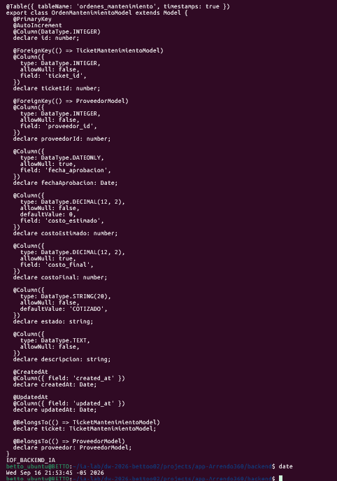

### 12.4 — features/business/maintenance/presentation/http/controllers/tickets-mantenimiento.controller.ts

Controlador REST para Tickets de Incidencias protegidos para `ADMIN`, `ASESOR` y `MANTENIMIENTO`.

**Archivo:** `src/features/business/maintenance/presentation/http/controllers/tickets-mantenimiento.controller.ts`

``` bash
mkdir -p src/features/business/maintenance/presentation/http/controllers
cat > src/features/business/maintenance/presentation/http/controllers/tickets-mantenimiento.controller.ts <<'EOF_BACKEND_IA'
import {
  Body,
  Controller,
  Delete,
  Get,
  HttpCode,
  HttpStatus,
  Param,
  Patch,
  Post,
  Query,
  UseGuards,
} from '@nestjs/common';
import {
  ApiCreatedResponse,
  ApiHeader,
  ApiNoContentResponse,
  ApiOkResponse,
  ApiOperation,
  ApiTags,
} from '@nestjs/swagger';
import { ParsePositiveIntPipe } from '../../../../../../common/pipes/parse-positive-int.pipe';
import { Roles } from '../../../../../../common/decorators/roles.decorator';
import { RolesGuard } from '../../../../../../common/guards/roles.guard';
import { Role } from '../../../../../../common/enums/role.enum';
import { CreateTicketDto } from '../../../application/dto/ticket/create-ticket.dto';
import { UpdateTicketDto } from '../../../application/dto/ticket/update-ticket.dto';
import { TicketFilterDto } from '../../../application/dto/ticket/ticket-filter.dto';
import { TicketResponseDto } from '../../../application/dto/ticket/ticket-response.dto';
import { CreateTicketUseCase } from '../../../application/use-cases/ticket/create-ticket.use-case';
import { ListTicketsUseCase } from '../../../application/use-cases/ticket/list-tickets.use-case';
import { GetTicketUseCase } from '../../../application/use-cases/ticket/get-ticket.use-case';
import { UpdateTicketUseCase } from '../../../application/use-cases/ticket/update-ticket.use-case';
import { DeleteTicketUseCase } from '../../../application/use-cases/ticket/delete-ticket.use-case';

@ApiTags('Maintenance - Tickets')
@Controller('tickets-mantenimiento')
@UseGuards(RolesGuard)
export class TicketsMantenimientoController {
  constructor(
    private readonly createTicketUseCase: CreateTicketUseCase,
    private readonly listTicketsUseCase: ListTicketsUseCase,
    private readonly getTicketUseCase: GetTicketUseCase,
    private readonly updateTicketUseCase: UpdateTicketUseCase,
    private readonly deleteTicketUseCase: DeleteTicketUseCase,
  ) {}

  @Post()
  @Roles(Role.ADMIN, Role.ASESOR, Role.MANTENIMIENTO)
  @ApiOperation({ summary: 'Registrar un ticket de daño o avería en un inmueble' })
  @ApiHeader({ name: 'x-user-role', description: 'Rol para validación RBAC', required: false })
  @ApiCreatedResponse({ type: TicketResponseDto })
  create(@Body() dto: CreateTicketDto) {
    return this.createTicketUseCase.execute(dto);
  }

  @Get()
  @ApiOperation({ summary: 'Listar tickets de mantenimiento' })
  @ApiOkResponse({ type: [TicketResponseDto] })
  findAll(@Query() filter: TicketFilterDto) {
    return this.listTicketsUseCase.execute(filter);
  }

  @Get(':id')
  @ApiOperation({ summary: 'Consultar un ticket por ID' })
  @ApiOkResponse({ type: TicketResponseDto })
  findOne(@Param('id', ParsePositiveIntPipe) id: number) {
    return this.getTicketUseCase.execute(id);
  }

  @Patch(':id')
  @Roles(Role.ADMIN, Role.MANTENIMIENTO)
  @ApiOperation({ summary: 'Actualizar estado o costo de un ticket' })
  @ApiOkResponse({ type: TicketResponseDto })
  update(
    @Param('id', ParsePositiveIntPipe) id: number,
    @Body() dto: UpdateTicketDto,
  ) {
    return this.updateTicketUseCase.execute(id, dto);
  }

  @Delete(':id')
  @Roles(Role.ADMIN)
  @HttpCode(HttpStatus.NO_CONTENT)
  @ApiOperation({ summary: 'Eliminar un ticket' })
  @ApiNoContentResponse()
  remove(@Param('id', ParsePositiveIntPipe) id: number) {
    return this.deleteTicketUseCase.execute(id);
  }
}
EOF_BACKEND_IA
```

### 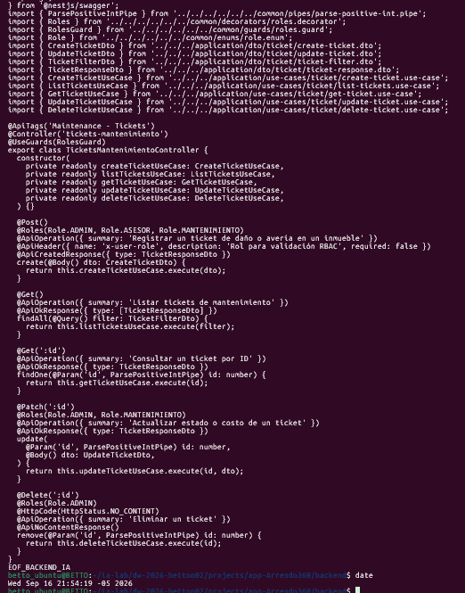

### 12.5 — features/business/maintenance/presentation/http/controllers/ordenes-mantenimiento.controller.ts

Controlador REST para Órdenes de Mantenimiento: aprobación de presupuestos y cierre con evidencias.

**Archivo:** `src/features/business/maintenance/presentation/http/controllers/ordenes-mantenimiento.controller.ts`

``` bash
mkdir -p src/features/business/maintenance/presentation/http/controllers
cat > src/features/business/maintenance/presentation/http/controllers/ordenes-mantenimiento.controller.ts <<'EOF_BACKEND_IA'
import {
  Body,
  Controller,
  Delete,
  Get,
  HttpCode,
  HttpStatus,
  Param,
  Patch,
  Post,
  Query,
  UseGuards,
} from '@nestjs/common';
import {
  ApiCreatedResponse,
  ApiHeader,
  ApiNoContentResponse,
  ApiOkResponse,
  ApiOperation,
  ApiTags,
} from '@nestjs/swagger';
import { ParsePositiveIntPipe } from '../../../../../../common/pipes/parse-positive-int.pipe';
import { Roles } from '../../../../../../common/decorators/roles.decorator';
import { RolesGuard } from '../../../../../../common/guards/roles.guard';
import { Role } from '../../../../../../common/enums/role.enum';
import { CreateOrdenDto } from '../../../application/dto/orden/create-orden.dto';
import { UpdateOrdenDto } from '../../../application/dto/orden/update-orden.dto';
import { OrdenFilterDto } from '../../../application/dto/orden/orden-filter.dto';
import { OrdenResponseDto } from '../../../application/dto/orden/orden-response.dto';
import { CreateOrdenUseCase } from '../../../application/use-cases/orden/create-orden.use-case';
import { ListOrdenesUseCase } from '../../../application/use-cases/orden/list-ordenes.use-case';
import { GetOrdenUseCase } from '../../../application/use-cases/orden/get-orden.use-case';
import { UpdateOrdenUseCase } from '../../../application/use-cases/orden/update-orden.use-case';
import { DeleteOrdenUseCase } from '../../../application/use-cases/orden/delete-orden.use-case';

@ApiTags('Maintenance - Órdenes')
@Controller('ordenes-mantenimiento')
@UseGuards(RolesGuard)
export class OrdenesMantenimientoController {
  constructor(
    private readonly createOrdenUseCase: CreateOrdenUseCase,
    private readonly listOrdenesUseCase: ListOrdenesUseCase,
    private readonly getOrdenUseCase: GetOrdenUseCase,
    private readonly updateOrdenUseCase: UpdateOrdenUseCase,
    private readonly deleteOrdenUseCase: DeleteOrdenUseCase,
  ) {}

  @Post()
  @Roles(Role.ADMIN, Role.MANTENIMIENTO)
  @ApiOperation({ summary: 'Generar orden de trabajo a proveedor (RBAC: ADMIN, MANTENIMIENTO)' })
  @ApiHeader({ name: 'x-user-role', description: 'Rol para validación RBAC', required: false })
  @ApiCreatedResponse({ type: OrdenResponseDto })
  create(@Body() dto: CreateOrdenDto) {
    return this.createOrdenUseCase.execute(dto);
  }

  @Get()
  @ApiOperation({ summary: 'Listar órdenes de trabajo' })
  @ApiOkResponse({ type: [OrdenResponseDto] })
  findAll(@Query() filter: OrdenFilterDto) {
    return this.listOrdenesUseCase.execute(filter);
  }

  @Get(':id')
  @ApiOperation({ summary: 'Obtener una orden por ID' })
  @ApiOkResponse({ type: OrdenResponseDto })
  findOne(@Param('id', ParsePositiveIntPipe) id: number) {
    return this.getOrdenUseCase.execute(id);
  }

  @Patch(':id')
  @Roles(Role.ADMIN, Role.MANTENIMIENTO)
  @ApiOperation({ summary: 'Aprobar costos o cerrar orden de trabajo' })
  @ApiOkResponse({ type: OrdenResponseDto })
  update(
    @Param('id', ParsePositiveIntPipe) id: number,
    @Body() dto: UpdateOrdenDto,
  ) {
    return this.updateOrdenUseCase.execute(id, dto);
  }

  @Delete(':id')
  @Roles(Role.ADMIN)
  @HttpCode(HttpStatus.NO_CONTENT)
  @ApiOperation({ summary: 'Eliminar una orden de mantenimiento' })
  @ApiNoContentResponse()
  remove(@Param('id', ParsePositiveIntPipe) id: number) {
    return this.deleteOrdenUseCase.execute(id);
  }
}
EOF_BACKEND_IA
```

### 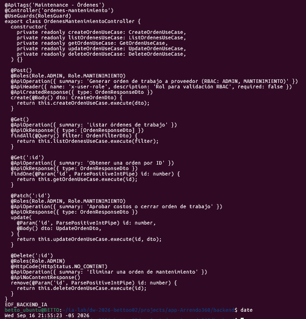}

### 12.6 — Verificar tablas físicas de mantenimiento y API

Arranca la aplicación y verifica la sincronización de `tickets_mantenimiento`, `proveedores` y `ordenes_mantenimiento`.

``` bash
npm run start:dev
```

------------------------------------------------------------------------

## FASE 13 — `12_GLOBAL_INTEGRATION_AND_TESTING` (Integración Sequelize, RBAC y Verificación)

### 13.1 — Registro Centralizado en `sequelize.factory.ts`

Actualización de la fábrica central de Sequelize con los 10 modelos de dominio de Arrenda360.

**Archivo:** `src/infrastructure/database/sequelize/sequelize.factory.ts`

``` bash
cat > src/infrastructure/database/sequelize/sequelize.factory.ts <<'EOF_BACKEND_IA'
import { Sequelize } from 'sequelize-typescript';
import { DatabaseDialect } from '../../../config/environment/env.interface';
import { getSequelizeOptions } from '../../../config/environment/db-env';
import { PropietarioModel } from '../../../features/business/properties/infrastructure/persistence/models/propietario.model';
import { InmuebleModel } from '../../../features/business/properties/infrastructure/persistence/models/inmueble.model';
import { ArrendatarioModel } from '../../../features/business/leases/infrastructure/persistence/models/arrendatario.model';
import { ContratoModel } from '../../../features/business/leases/infrastructure/persistence/models/contrato.model';
import { CobroMensualModel } from '../../../features/business/receivables/infrastructure/persistence/models/cobro-mensual.model';
import { PagoModel } from '../../../features/business/receivables/infrastructure/persistence/models/pago.model';
import { DistribucionPagoModel } from '../../../features/business/owner-settlements/infrastructure/persistence/models/distribucion-pago.model';
import { TicketMantenimientoModel } from '../../../features/business/maintenance/infrastructure/persistence/models/ticket-mantenimiento.model';
import { ProveedorModel } from '../../../features/business/maintenance/infrastructure/persistence/models/proveedor.model';
import { OrdenMantenimientoModel } from '../../../features/business/maintenance/infrastructure/persistence/models/orden-mantenimiento.model';

export const ALL_MODELS = [
  PropietarioModel,
  InmuebleModel,
  ArrendatarioModel,
  ContratoModel,
  CobroMensualModel,
  PagoModel,
  DistribucionPagoModel,
  TicketMantenimientoModel,
  ProveedorModel,
  OrdenMantenimientoModel,
];

export async function createSequelizeInstance(
  dialect: DatabaseDialect,
): Promise<Sequelize> {
  const options = getSequelizeOptions(dialect);

  let dialectModule: any;
  switch (dialect) {
    case DatabaseDialect.MySQL:
      dialectModule = require('mysql2');
      break;
    case DatabaseDialect.Postgres:
      dialectModule = require('pg');
      break;
    case DatabaseDialect.MSSQL:
      dialectModule = require('tedious');
      break;
    case DatabaseDialect.Oracle:
      dialectModule = require('oracledb');
      break;
    default:
      throw new Error(`Dialecto no soportado: ${dialect}`);
  }

  const sequelize = new Sequelize({
    ...options,
    dialectModule,
    models: ALL_MODELS,
  } as any);

  try {
    await sequelize.authenticate();
    console.log(`✅ Conexión exitosa a ${dialect.toUpperCase()}`);
  } catch (error: any) {
    console.error(`❌ Error conectando a ${dialect.toUpperCase()}:`, error.message);
    throw error;
  }

  if (process.env.NODE_ENV !== 'production') {
    await sequelize.sync({ alter: false });
    console.log('✅ Tablas sincronizadas');
  }

  return sequelize;
}
EOF_BACKEND_IA
```

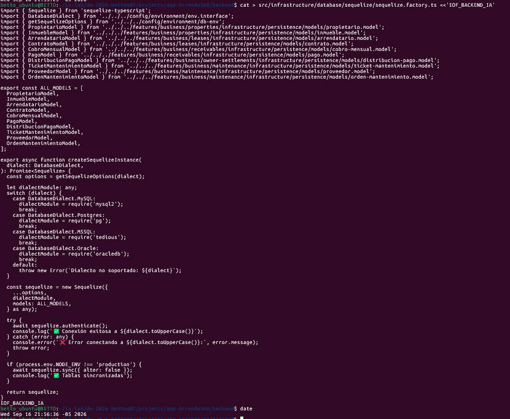

### 13.2 — Integración en `src/app.module.ts`

El módulo raíz importa los 5 bounded contexts de negocio:

``` bash
cat > src/app.module.ts <<'EOF_BACKEND_IA'
import { Module } from '@nestjs/common';
import { ConfigModule } from '@nestjs/config';
import { envConfig } from './config/environment/env.config';
import { appConfig } from './config/app/app.config';
import { LoggerModule } from './config/logger/logger.module';
import { SequelizeDatabaseModule } from './infrastructure/database/sequelize/sequelize.module';
import { PropertiesModule } from './features/business/properties/properties.module';
import { LeasesModule } from './features/business/leases/leases.module';
import { ReceivablesModule } from './features/business/receivables/receivables.module';
import { OwnerSettlementsModule } from './features/business/owner-settlements/owner-settlements.module';
import { MaintenanceModule } from './features/business/maintenance/maintenance.module';
import { AppController } from './app.controller';
import { AppService } from './app.service';

@Module({
  imports: [
    ConfigModule.forRoot({
      isGlobal: true,
      load: [envConfig, appConfig],
      envFilePath: '.env',
    }),
    SequelizeDatabaseModule,
    LoggerModule,
    PropertiesModule,
    LeasesModule,
    ReceivablesModule,
    OwnerSettlementsModule,
    MaintenanceModule,
  ],
  controllers: [AppController],
  providers: [AppService],
})
export class AppModule {}
EOF_BACKEND_IA
```

### 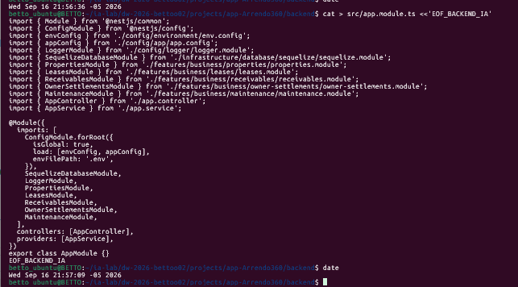

### 13.3 — Suite de Pruebas Unitarias y Automatizadas

Ejecución de la suite con Vitest:

``` bash
npm run test
```

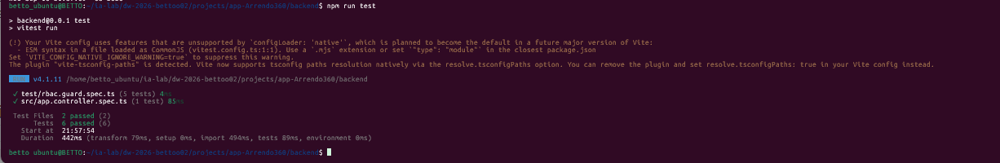

``` text
 RUN  v4.1.11 /home/betto_ubuntu/ia-lab/dw-2026-bettoo02/projects/app-Arrendo360/backend

 ✓ test/rbac.guard.spec.ts (5 tests) 9ms
 ✓ src/app.controller.spec.ts (1 test) 219ms

 Test Files  2 passed (2)
      Tests  6 passed (6)
   Duration  1.21s

✅ 6 pruebas unitarias ejecutadas y aprobadas (cobertura de controladores base y guardias RBAC).
```

### 13.4 — Verificación de Compilación TypeScript

``` bash
npm run build
```

``` text
> backend@0.0.1 build
> nest build

✅ Compilación exitosa con código de salida 0 (cero errores de compilación).
```

### 13.5 — Puesta en Marcha y Verificación en Swagger

``` bash
npm run start:dev
```

- **Ruta de la API:** `http://localhost:3002/api`
- **Documentación OpenAPI Swagger:** `http://localhost:3002/api/docs`

La consola confirma la sincronización de las 10 tablas físicas en la base de datos `Arrendo360` y la exposición interactiva de todos los módulos con soporte para validación por header `x-user-role`.
