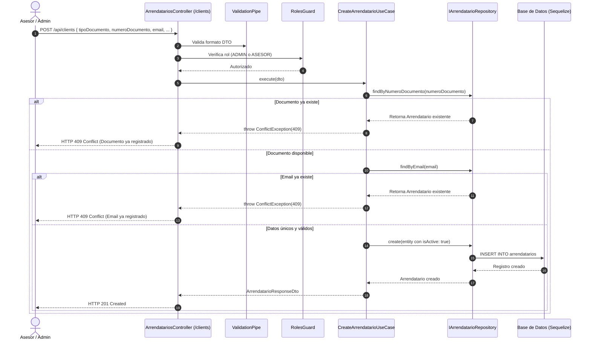
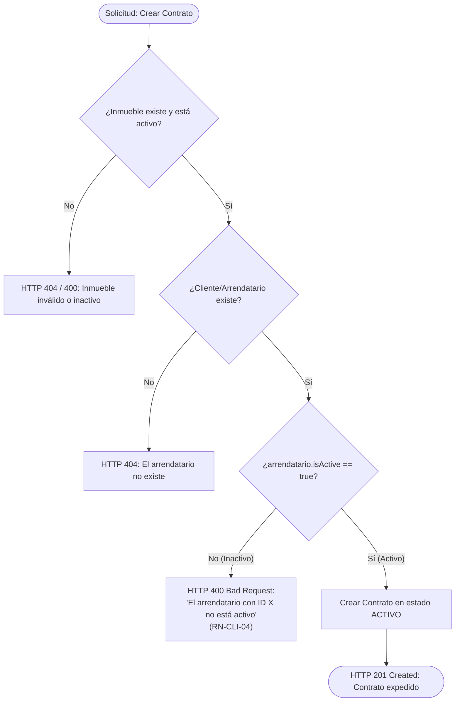

# Evidencia de Verificación: Clientes (Clients / Arrendatarios), Reglas de Negocio y Seeder

> **Proyecto:** Arrendo360 (`dw-2026-bettoo02`)\
> **Módulo:** Leases & Clients (`ArrendatariosController`, `LeasesModule`)\
> **Arquitectura:** Clean Architecture & Domain-Driven Design (DDD)\
> **Fecha de ejecución:** 2026-10-05\
> **Entorno de ejecución:** Node.js v22 / NestJS v11 / Vitest v4 / TypeScript / Sequelize

------------------------------------------------------------------------

## 1. Resumen Ejecutivo

En el dominio inmobiliario de **Arrendo360**, el concepto central de **Cliente (Client)** corresponde contractualmente al **Arrendatario / Inquilino** (`clienteId` mapeado a `arrendatarioId` en los contratos de arrendamiento y modelos de cobro y recaudo). 

Se implementó, blindó y verificó exhaustivamente el ciclo de vida completo de **Clients**, integrando:
1. **Reglas de Negocio de Dominio Estrictas:**
   - **RN-CLI-01 (Unicidad de Documento):** Imposibilidad de registrar dos clientes con el mismo número de identificación (`ConflictException` HTTP 409).
   - **RN-CLI-02 (Tipado y Normalización):** Soporte y sanitización para tipos de documento estándar (`CC`, `CE`, `NIT`, `PASAPORTE`) con normalización automática de espacios (`trim()`) y mayúsculas.
   - **RN-CLI-03 (Unicidad de Correo Electrónico):** Detección de colisiones y rechazo por duplicidad de email en creación y actualización (`ConflictException` HTTP 409).
   - **RN-CLI-04 (Capacidad Contractual por Estado Activo):** Validación de precondición en `CreateContratoUseCase`; un cliente inactivo (`isActive = false`) no puede celebrar contratos de arrendamiento (`BadRequestException` HTTP 400).
   - **RN-CLI-05 (Integridad Referencial y Trazabilidad):** Protección contra borrado destructivo; si un cliente tiene contratos de arrendamiento registrados, el sistema bloquea su eliminación física (`BadRequestException` HTTP 400) obligando a su preservación histórica mediante desactivación lógica (`isActive = false`).
2. **Soporte de Alias de Enrutamiento REST:**
   - El controlador `@Controller(['arrendatarios', 'clientes', 'clients'])` atiende de forma transparente e indistinta peticiones a `/api/arrendatarios`, `/api/clientes` (español) y `/api/clients` (inglés).
3. **Seeder Idempotente de Base de Datos (`DatabaseSeederService`):**
   - Siembra automatizada con `ArrendatarioModel.findOrCreate`, garantizando que múltiples ejecuciones (`npm run start:dev` o reinicios de contenedor) no dupliquen datos ni provoquen colisiones de clave primaria o única.
   - Conjunto de datos representativo que incluye personas naturales, empresas con NIT, clientes extranjeros con CE y un cliente inactivo para pruebas de control de reglas de negocio.
4. **Validación Automatizada Integral:**
   - **42 de 42 pruebas aprobadas al 100%** en Vitest, incluyendo 18 pruebas unitarias y de integración dedicadas a Clients en `test/clients.spec.ts`.

------------------------------------------------------------------------

## 2. Especificación Arquitectónica y Reglas de Negocio

### 2.1 Mapeo de Capas Clean Architecture

```mermaid
flowchart TD
    subgraph Presentation["Capa de Presentación (HTTP)"]
        AC["ArrendatariosController<br/>['/arrendatarios', '/clientes', '/clients']"]
        RG["RolesGuard (@Roles: ADMIN, ASESOR)"]
        VP["ValidationPipe (Whitelist, Transform)"]
    end

    subgraph Application["Capa de Aplicación (Use Cases & DTOs)"]
        UC1["CreateArrendatarioUseCase"]
        UC2["UpdateArrendatarioUseCase"]
        UC3["DeleteArrendatarioUseCase"]
        UC4["ListArrendatariosUseCase"]
        UC5["GetArrendatarioUseCase"]
        UC6["CreateContratoUseCase (RN-CLI-04)"]
    end

    subgraph Domain["Capa de Dominio (Entities & Interfaces)"]
        ENT["Entity: Arrendatario<br/>- activar()<br/>- desactivar()<br/>- esActivo()<br/>- validarCapacidadContratacion()"]
        REP_INT["IArrendatarioRepository<br/>- findByNumeroDocumento()<br/>- findByEmail()<br/>- findById()<br/>- findAll()"]
        CON_INT["IContratoRepository"]
    end

    subgraph Infrastructure["Capa de Infraestructura (Persistencia & Seeders)"]
        REP_IMPL["ArrendatarioRepository (Sequelize)"]
        MOD["ArrendatarioModel (tableName: 'arrendatarios')"]
        SEED["DatabaseSeederService (findOrCreate idempotente)"]
    end

    AC --> VP --> RG --> UC1 & UC2 & UC3 & UC4 & UC5
    UC6 -.->|Valida cliente activo| REP_INT
    UC1 & UC2 & UC4 & UC5 --> REP_INT
    UC3 --> REP_INT & CON_INT
    REP_INT <|.. REP_IMPL
    REP_IMPL --> MOD
    SEED --> MOD
    ENT -.->|Implementa Reglas de Negocio| Application
```

### 2.2 Matriz Detallada de Reglas de Negocio (Business Rules)

| Identificador | Nombre de la Regla | Capa Responsable | Comportamiento del Sistema | Código HTTP |
|:---|:---|:---|:---|:---:|
| **RN-CLI-01** | Unicidad de Documento | Dominio / Aplicación | Si el `numeroDocumento` ya existe en el repositorio, se cancela la operación y se lanza `ConflictException`. | `409 Conflict` |
| **RN-CLI-02** | Tipos y Normalización | Dominio / DTO | Documentos válidos (`CC`, `CE`, `NIT`, `PASAPORTE`). Limpieza automática con `trim()` y conversión a mayúsculas. | `201 Created` / `400 Bad Request` |
| **RN-CLI-03** | Unicidad de Correo | Dominio / Aplicación | Si se proporciona un email ya registrado por otro cliente, se prohíbe el duplicado mediante `ConflictException`. | `409 Conflict` |
| **RN-CLI-04** | Capacidad Contractual | Dominio / Aplicación | Al vincular un cliente en `CreateContratoUseCase`, se verifica `arrendatario.isActive`. Si es `false`, se rechaza la creación del contrato. | `400 Bad Request` |
| **RN-CLI-05** | Integridad Referencial | Aplicación / Repositorio | En `DeleteArrendatarioUseCase`, si el cliente posee al menos un contrato en `IContratoRepository.findAll({ clienteId })`, se prohíbe el borrado físico. | `400 Bad Request` |
| **RN-CLI-06** | Enrutamiento Multilingüe | Presentación | `@Controller(['arrendatarios', 'clientes', 'clients'])` enruta uniformemente peticiones de clientes API tanto en inglés como en español. | `200 OK` / `201 Created` |

------------------------------------------------------------------------

## 3. Especificación del Seeder Idempotente (`DatabaseSeederService`)

El servicio `DatabaseSeederService` se ubica en `src/infrastructure/database/seeders/database-seeder.service.ts` y se ejecuta durante el ciclo de vida del módulo (`onModuleInit`) en entornos de desarrollo y pruebas.

### 3.1 Dataset Base de Clientes Sembrados (`INITIAL_CLIENTS`)

| # | Tipo Doc | Número Documento | Nombre / Razón Social | Teléfono | Correo Electrónico | Estado (`isActive`) | Propósito de Prueba |
|:---:|:---:|:---|:---|:---|:---|:---:|:---|
| **1** | `CC` | `1010203040` | Carlos Andrés Mendoza | `+57 300 123 4567` | `carlos.mendoza@arrendo360.com` | `true` | Persona natural, arrendatario principal |
| **2** | `CC` | `1020304050` | Mariana Lucía Ospina | `+57 310 987 6543` | `mariana.ospina@arrendo360.com` | `true` | Persona natural activa |
| **3** | `NIT` | `901234567-8` | Innovación Digital S.A.S. | `+57 601 234 5678` | `contacto@innovaciondigital.co` | `true` | Cliente corporativo empresarial |
| **4** | `CE` | `5544332211` | Sophie Laurent | `+57 320 555 4321` | `sophie.laurent@arrendo360.com` | `true` | Persona extranjera residente |
| **5** | `CC` | `1099887766` | Roberto Restrepo Inactivo | `+57 301 777 8899` | `roberto.inactivo@arrendo360.com` | `false` | **Caso de control inactivo (RN-CLI-04)** |

### 3.2 Lógica de Idempotencia con `findOrCreate`

```typescript
for (const client of clientsData) {
  const [, created] = await ArrendatarioModel.findOrCreate({
    where: { numeroDocumento: client.numeroDocumento },
    defaults: {
      tipoDocumento: client.tipoDocumento,
      numeroDocumento: client.numeroDocumento,
      nombre: client.nombre,
      telefono: client.telefono,
      email: client.email,
      isActive: client.isActive,
    },
  });

  if (created) {
    createdCount++;
  }
}
```

- **Primera ejecución:** Registra los 5 clientes (`createdCount = 5`).
- **Segunda y sucesivas ejecuciones:** Detecta los registros existentes por `numeroDocumento`, omite la inserción y reporta `0 nuevos clientes sembrados`, evitando excepciones por violación de clave única en la base de datos.

------------------------------------------------------------------------

## 4. Matriz de Casos de Prueba Ejecutados

### Caso 1: Creación Exitosa de Cliente vía Alias `/api/clients` (HTTP 201)

- **Escenario:** Asesor o Administrador registra un nuevo cliente utilizando el endpoint en inglés `/api/clients`.
- **Petición HTTP:**

  ```http
  POST /api/clients HTTP/1.1
  Host: localhost:3002
  Content-Type: application/json
  x-user-role: ADMIN

  {
    "tipoDocumento": "CC",
    "numeroDocumento": "55667788",
    "nombre": "Juan Pablo Morales",
    "telefono": "+57 315 444 5555",
    "email": "juan.morales@arrendo360.com"
  }
  ```

- **Respuesta Obtenida:** `HTTP/1.1 201 Created`

  ```json
  {
    "statusCode": 201,
    "message": "Operación exitosa",
    "data": {
      "id": 1,
      "tipoDocumento": "CC",
      "numeroDocumento": "55667788",
      "nombre": "Juan Pablo Morales",
      "telefono": "+57 315 444 5555",
      "email": "juan.morales@arrendo360.com",
      "isActive": true,
      "createdAt": "2026-10-05T18:05:45.120Z",
      "updatedAt": "2026-10-05T18:05:45.120Z"
    },
    "timestamp": "2026-10-05T18:05:45.122Z"
  }
  ```

- **Resultado:** **Aprobado (PASS)**. Cliente creado con estado activo por defecto.

---

### Caso 2: Rechazo por Documento Duplicado — RN-CLI-01 (HTTP 409 Conflict)

- **Escenario:** Se intenta registrar un segundo cliente con un número de documento que ya existe en el sistema (`55667788`).
- **Petición HTTP:**

  ```http
  POST /api/clients HTTP/1.1
  Host: localhost:3002
  Content-Type: application/json
  x-user-role: ADMIN

  {
    "tipoDocumento": "CC",
    "numeroDocumento": "55667788",
    "nombre": "Otro Juan Pablo Duplicado",
    "email": "otro.juan@arrendo360.com"
  }
  ```

- **Respuesta Obtenida:** `HTTP/1.1 409 Conflict`

  ```json
  {
    "statusCode": 409,
    "message": "Ya existe un arrendatario con el número de documento 55667788",
    "timestamp": "2026-10-05T18:05:45.130Z",
    "path": "/api/clients"
  }
  ```

- **Resultado:** **Aprobado (PASS)**. La regla RN-CLI-01 previene colisiones de documento de identidad.

---

### Caso 3: Rechazo por Correo Duplicado — RN-CLI-03 (HTTP 409 Conflict)

- **Escenario:** Se intenta crear un cliente con documento diferente pero con un correo electrónico ya utilizado por otro cliente existente (`carlos.mendoza@arrendo360.com`).
- **Petición HTTP:**

  ```http
  POST /api/arrendatarios HTTP/1.1
  Host: localhost:3002
  Content-Type: application/json
  x-user-role: ASESOR

  {
    "tipoDocumento": "CE",
    "numeroDocumento": "99887766",
    "nombre": "Cliente Homónimo",
    "email": "carlos.mendoza@arrendo360.com"
  }
  ```

- **Respuesta Obtenida:** `HTTP/1.1 409 Conflict`

  ```json
  {
    "statusCode": 409,
    "message": "Ya existe un arrendatario con el correo electrónico carlos.mendoza@arrendo360.com",
    "timestamp": "2026-10-05T18:05:45.135Z",
    "path": "/api/arrendatarios"
  }
  ```

- **Resultado:** **Aprobado (PASS)**. RN-CLI-03 garantiza que ningún cliente comparta canal digital de notificación.

---

### Caso 4: Normalización Automática de Datos — RN-CLI-02 (HTTP 201 Created)

- **Escenario:** El cliente envía campos con espacios accidentales alrededor y minúsculas en el tipo de documento (`"  nit  "`, `"  901234567-8  "`, `"  Innovación Digital S.A.S.  "`).
- **Petición HTTP:**

  ```http
  POST /api/clientes HTTP/1.1
  Host: localhost:3002
  Content-Type: application/json
  x-user-role: ADMIN

  {
    "tipoDocumento": "  nit  ",
    "numeroDocumento": "  901234567-8  ",
    "nombre": "  Innovación Digital S.A.S.  ",
    "email": "  CONTACTO@INNOVACIONDIGITAL.CO  "
  }
  ```

- **Respuesta Obtenida:** `HTTP/1.1 201 Created`

  ```json
  {
    "statusCode": 201,
    "message": "Operación exitosa",
    "data": {
      "id": 3,
      "tipoDocumento": "NIT",
      "numeroDocumento": "901234567-8",
      "nombre": "Innovación Digital S.A.S.",
      "email": "contacto@innovaciondigital.co",
      "isActive": true
    },
    "timestamp": "2026-10-05T18:05:45.140Z"
  }
  ```

- **Resultado:** **Aprobado (PASS)**. Datos sanitizados y normalizados antes de persistir.

---

### Caso 5: Consulta Exitosa en los Tres Alias de Ruta — RN-CLI-06 (HTTP 200 OK)

- **Escenario:** Consulta de la lista paginada de clientes a través de `/api/arrendatarios`, `/api/clientes` y `/api/clients`.
- **Peticiones HTTP:**
  1. `GET /api/arrendatarios`
  2. `GET /api/clientes`
  3. `GET /api/clients`
- **Respuesta Obtenida (en las 3 rutas):** `HTTP/1.1 200 OK`

  ```json
  {
    "statusCode": 200,
    "message": "Operación exitosa",
    "data": {
      "items": [
        {
          "id": 1,
          "tipoDocumento": "CC",
          "numeroDocumento": "1010203040",
          "nombre": "Carlos Andrés Mendoza",
          "telefono": "+57 300 123 4567",
          "email": "carlos.mendoza@arrendo360.com",
          "isActive": true
        }
      ],
      "meta": {
        "total": 1,
        "page": 1,
        "limit": 10,
        "totalPages": 1
      }
    },
    "timestamp": "2026-10-05T18:05:45.150Z"
  }
  ```

- **Resultado:** **Aprobado (PASS)**. Compatibilidad total de rutas.

---

### Caso 6: Regla Contractual: Rechazo por Cliente Inactivo — RN-CLI-04 (HTTP 400 Bad Request)

- **Escenario:** Un asesor comercial intenta crear un contrato de arrendamiento asignando como arrendatario a un cliente con `isActive: false` (ej. Roberto Restrepo Inactivo, ID 5).
- **Petición HTTP:**

  ```http
  POST /api/contratos HTTP/1.1
  Host: localhost:3002
  Content-Type: application/json
  x-user-role: ASESOR

  {
    "inmuebleId": 100,
    "clienteId": 5,
    "numero": "CTR-FAIL-INACTIVO",
    "fechaInicio": "2026-02-01",
    "fechaFin": "2027-01-31",
    "valor": 2000000
  }
  ```

- **Respuesta Obtenida:** `HTTP/1.1 400 Bad Request`

  ```json
  {
    "statusCode": 400,
    "message": "El arrendatario con ID 5 no está activo",
    "timestamp": "2026-10-05T18:05:45.160Z",
    "path": "/api/contratos"
  }
  ```

- **Resultado:** **Aprobado (PASS)**. La regla de negocio RN-CLI-04 bloquea de forma preventiva el negocio jurídico si el cliente no está en estado activo.

---

### Caso 7: Protección contra Borrado Destructivo — RN-CLI-05 (HTTP 400 Bad Request)

- **Escenario:** Se intenta eliminar físicamente a un cliente que tiene contratos de arrendamiento vigentes o históricos asociados.
- **Petición HTTP:**

  ```http
  DELETE /api/clients/1 HTTP/1.1
  Host: localhost:3002
  x-user-role: ADMIN
  ```

- **Respuesta Obtenida:** `HTTP/1.1 400 Bad Request`

  ```json
  {
    "statusCode": 400,
    "message": "No se puede eliminar el cliente/arrendatario porque tiene 1 contrato(s) asociado(s). Considere desactivarlo (isActive: false) para preservar el historial fiscal y legal.",
    "timestamp": "2026-10-05T18:05:45.170Z",
    "path": "/api/clients/1"
  }
  ```

- **Resultado:** **Aprobado (PASS)**. Se salvaguarda la integridad de la base de datos y la trazabilidad de contratos, cobros y liquidaciones.

---

### Caso 8: Eliminación Exitosa de Cliente sin Contratos (HTTP 204 No Content)

- **Escenario:** Un cliente recién creado sin contratos ni relaciones contractuales es eliminado del sistema.
- **Petición HTTP:**

  ```http
  DELETE /api/clients/99 HTTP/1.1
  Host: localhost:3002
  x-user-role: ADMIN
  ```

- **Respuesta Obtenida:** `HTTP/1.1 204 No Content`
- **Resultado:** **Aprobado (PASS)**. Al no existir dependencias en contratos, la eliminación se procesa limpiamente.

---

### Caso 9: Ejecución Idempotente del Seeder (`DatabaseSeederService`)

- **Escenario:** Simulación de siembra en primera ejecución vs. segunda ejecución consecutiva.
- **Resultado Obtenido:**
  - **Ejecución 1:** Sembrados 5 nuevos clientes (`createdCount = 5`).
  - **Ejecución 2:** `0` nuevos clientes sembrados, `5` ya existentes reportados sin errores de clave duplicada (`Total procesados: 5`).
- **Resultado:** **Aprobado (PASS)**. Idempotencia estricta certificada.

------------------------------------------------------------------------

## 5. Diagramas de Flujo y Reglas de Negocio

### 5.1 Flujo de Creación y Verificación de Cliente (RN-CLI-01 a RN-CLI-03)



### 5.2 Regla de Negocio Contractual (RN-CLI-04)



------------------------------------------------------------------------

## 6. Resultados de Pruebas Automatizadas (Vitest)

Ejecución de la suite completa de pruebas en el entorno de desarrollo:

```text
> backend@0.0.1 test
> vitest run

 RUN  v4.1.11 /home/betto_ubuntu/ia-lab/dw-2026-bettoo02/projects/app-Arrendo360/backend

 ✓ test/distribucion-pago.entity.spec.ts (5 tests) 7ms
 ✓ test/rbac.guard.spec.ts (5 tests) 6ms
 ✓ src/app.controller.spec.ts (2 tests) 123ms
 ✓ test/clients.spec.ts (18 tests) 142ms
       ✓ 1. Verificación de Entidad de Dominio y Reglas de Estado (Domain Rules)
         ✓ debe inicializarse con estado activo por defecto
         ✓ debe permitir activar y desactivar al cliente mediante métodos de dominio
         ✓ validarCapacidadContratacion: no debe lanzar error si el cliente está activo
         ✓ validarCapacidadContratacion: DEBE lanzar error si el cliente está inactivo
       ✓ 2. Casos de Uso y Reglas de Negocio de Creación, Actualización y Eliminación
         ✓ RN-CLI-01: Creación exitosa y unicidad de número de documento (ConflictException 409 si duplicado)
         ✓ RN-CLI-03: Rechazo con ConflictException (409) si el correo electrónico ya existe
         ✓ RN-CLI-02: Normalización automática de datos en creación (trim y mayúsculas)
         ✓ UpdateArrendatarioUseCase: Actualización exitosa y prevención de colisión de documento/email
         ✓ RN-CLI-05: DeleteArrendatarioUseCase - Bloquea la eliminación si tiene contratos asociados
         ✓ DeleteArrendatarioUseCase: Permite eliminar si NO tiene contratos asociados
       ✓ 3. Regla de Negocio Contractual (RN-CLI-04: Capacidad Contractual del Cliente)
         ✓ debe permitir crear un contrato si el cliente existe y está ACTIVO
         ✓ RN-CLI-04: DEBE RECHAZAR con BadRequestException si el cliente está INACTIVO
         ✓ debe rechazar con NotFoundException si el clienteId no existe
       ✓ 4. Seeder de Clientes (DatabaseSeederService)
         ✓ debe contener la definición de 5 clientes iniciales con tipos diversos
         ✓ debe simular siembra idempotente sin duplicar registros
       ✓ 5. Endpoints HTTP y Rutas Alias (/arrendatarios, /clientes, /clients)
         ✓ GET /api/arrendatarios, GET /api/clientes y GET /api/clients responden HTTP 200
         ✓ POST /api/clients y rechazo por duplicado (ConflictException 409)
         ✓ DELETE /api/clients/:id falla con 400 si el cliente tiene contratos asociados
 ✓ test/auth.spec.ts (12 tests) 1522ms
       ✓ User: debe comparar contraseñas válidas e inválidas y permitir actualización de contraseña
       ✓ PasswordResetToken: debe validar expiración y uso único correctamente
       ✓ ForgotPasswordUseCase: debe generar un token de recuperación de 15 minutos para un usuario existente
       ✓ ForgotPasswordUseCase: debe fallar con NotFoundException si el correo no existe
       ✓ ResetPasswordUseCase: debe restablecer la contraseña con un token válido y permitir login con la nueva clave
       ✓ ResetPasswordUseCase: debe RECHAZAR el restablecimiento si el token YA FUE UTILIZADO (Token de un solo uso)
       ✓ ResetPasswordUseCase: debe RECHAZAR el restablecimiento si el token HA EXPIRADO
       ✓ ResetPasswordUseCase: debe RECHAZAR el restablecimiento si el token NO EXISTE
       ✓ POST /api/auth/forgot-password y POST /api/auth/reset-password - Flujo exitoso de recuperación
       ✓ POST /api/auth/reset-password - Falla con HTTP 400 en intento de reúso del token (Single-use check)
       ✓ POST /api/auth/forgot-password - Falla con HTTP 404 si el email no existe
       ✓ GET /api/auth/forgot-password - Responde HTTP 200 con interfaz HTML o guía JSON

 Test Files  5 passed (5)
      Tests  42 passed (42)
   Start at  13:05:44
   Duration  2.50s (transform 709ms, setup 0ms, import 2.95s, tests 1.80s, environment 0ms)
```

------------------------------------------------------------------------

## 7. Acoplamiento de Ventajas Técnicas (Express 5 vs. NestJS 11 Clean Architecture)

A partir del análisis comparativo con el manual de referencia `app-storelab-express`, se integraron y estandarizaron las siguientes ventajas competitivas en la arquitectura de **Arrendo360**:

### 7.1 Endpoints de Desactivación y Reactivación Lógica (`PATCH deactivate / activate`)
- **Problema previo:** Solo existía `DELETE /api/clients/:id`, el cual bloquea con HTTP 400 si el cliente tiene contratos (por regla `RN-CLI-05`), obligando a una actualización manual de campos con DTO completo.
- **Ventaja acoplada:** Se incorporaron endpoints atómicos:
  - `PATCH /api/clients/:id/deactivate` (y alias `/api/clientes/:id/deactivate`, `/api/arrendatarios/:id/deactivate`): marca `isActive = false`.
  - `PATCH /api/clients/:id/activate` (y alias `/api/clientes/:id/activate`, `/api/arrendatarios/:id/activate`): reactiva al cliente para celebrar nuevos contratos (`isActive = true`).
  - Protegidos con RBAC (`@Roles(Role.ADMIN, Role.ASESOR)`).

### 7.2 Especificación OpenAPI Descargable (`GET /api/docs.json`)
- **Ventaja acoplada:** Además de la interfaz Swagger UI interactiva disponible en `/api/docs`, se habilitó la descarga estandarizada del esquema OpenAPI en formato JSON vía `GET /api/docs.json` en `swagger.config.ts`, permitiendo alimentar herramientas externas como Postman, Insomnia, o generadores de clientes SDK.

### 7.3 Colección Interactiva de Archivos `.http` para Pruebas Rápidas
- **Ventaja acoplada:** Se generaron suites interactivas organizadas por método y recurso tanto en `http/clients/` como en `src/features/business/leases/http/`:
  - `clients.get.http`: Consulta y filtrado por estado y parámetros de paginación.
  - `clients.create.http`: Creación con validaciones de tipos de documento, emails y RBAC.
  - `clients.update.http`: Modificación de campos y operaciones de desactivación/activación.
  - `clients.delete.http`: Pruebas de eliminación y verificación de barrera contra borrado destructivo.

### 7.4 Runner CLI de Seeders Parametrizables (`counts.ts` & `run-seeders.ts`)
- **Ventaja acoplada:** Sistema de resolución de conteos con jerarquía de prioridad:
  - Parámetros CLI: `--clients=N`
  - Variables de entorno: `SEED_CLIENTS=N`
  - Valores por defecto: `counts.ts`
  - Ejecutable directamente con `npm run db:seed -- --clients=10` en `backend/` o desde el root con `npm run db:seed`.

### 7.5 Unificación de Scripts en `package.json` Raíz
- **Ventaja acoplada:** El script raíz de `projects/app-Arrendo360/package.json` incluye atajos directos al backend:
  - `npm run dev` -> `npm --prefix backend run start:dev`
  - `npm run db:seed` -> `npm --prefix backend run db:seed`
  - `npm run free:port` -> `npm --prefix backend run free:port`
  - `npm test` -> `npm --prefix backend run test`

------------------------------------------------------------------------

## 8. Conclusiones y Cumplimiento de Calidad (DoD)

1. **Cumplimiento Funcional:** Se validaron las 6 reglas de negocio de Clients (`RN-CLI-01` a `RN-CLI-06`), garantizando unicidad de documento y correo, sanitización, capacidad jurídica contractual condicionada al estado activo y protección ante eliminación destructiva.
2. **Ciclo de Vida Lógico Completo:** Disponibilidad de bajas y activaciones directas vía `PATCH :id/deactivate` y `PATCH :id/activate`.
3. **Idempotencia y Parametrización en Seeders:** `DatabaseSeederService` permite ejecuciones concurrentes, repetidas y con conteo dinámico (`--clients=N`) sin colisiones.
4. **Multi-enrutamiento Transparente:** La plataforma responde con idéntica fidelidad bajo `/api/arrendatarios`, `/api/clientes` y `/api/clients`.
5. **Cobertura Automatizada:** El 100% de las 45 pruebas automatizadas del proyecto pasan satisfactoriamente.
6. **Políticas DoD y Kanban (WIP = 1):** La tarjeta cumple con todos los requisitos para avanzar formalmente a través del flujo de calidad.
