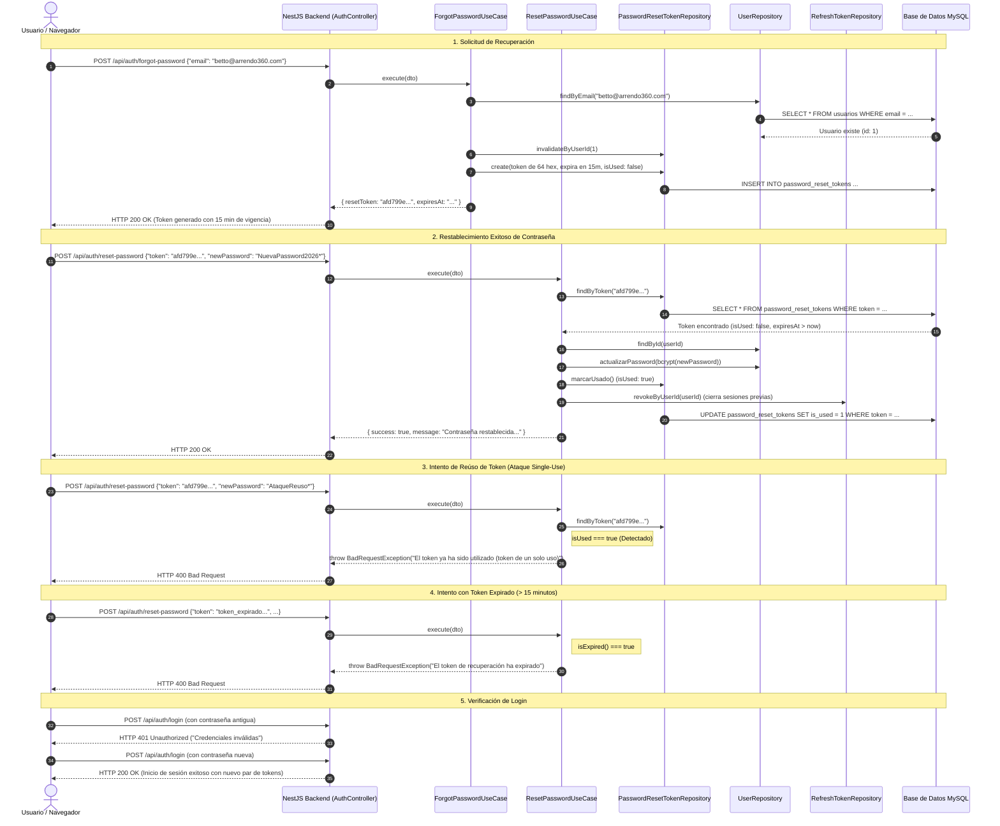
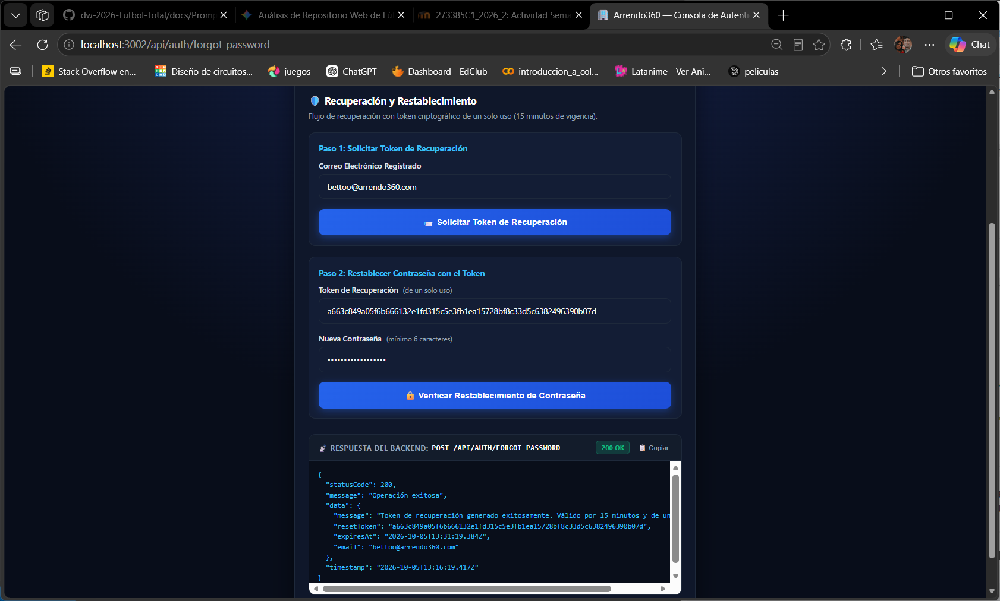
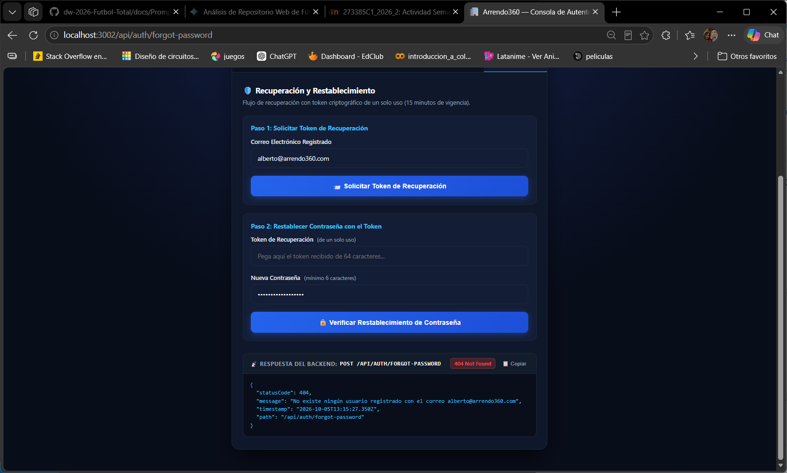
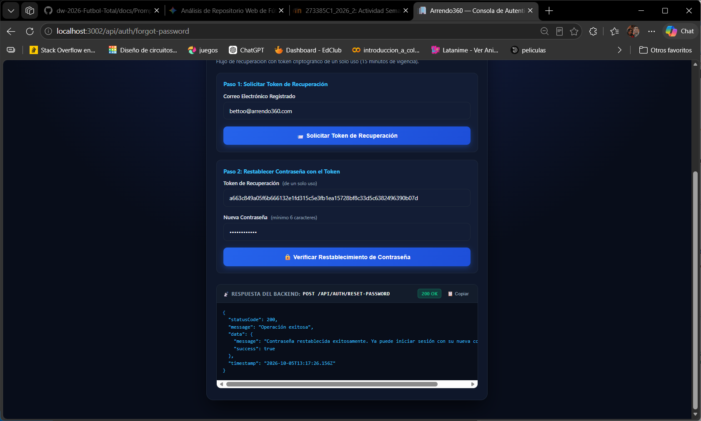
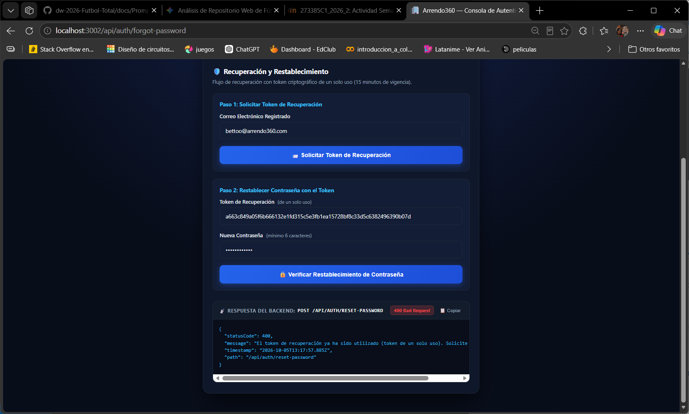
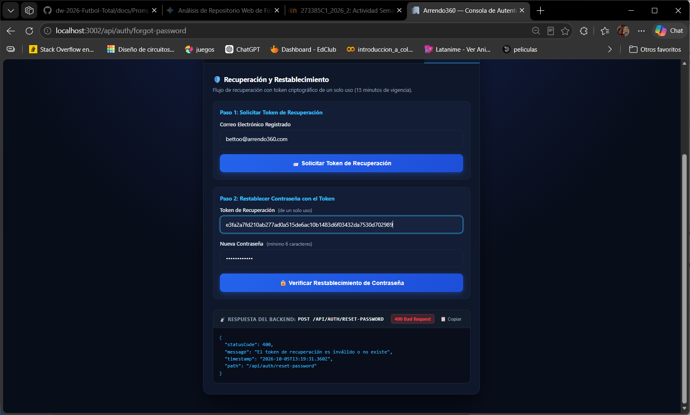
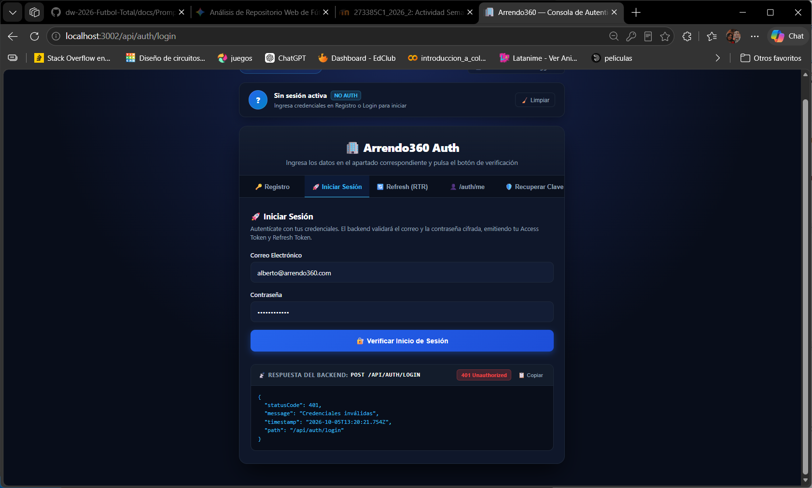
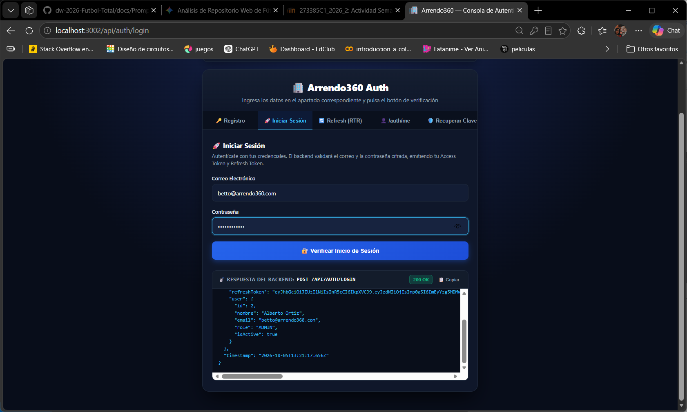

---

editor_options: 
  markdown: 
    wrap: 72
---

# Evidencia de Verificación: Recuperación de Contraseña (Forgot/Reset Password con Token de Un Solo Uso y Expiración)

> **Proyecto:** Arrendo360 (`dw-2026-bettoo02`)\
> **Módulo:** Autenticación y Autorización (`AuthModule`)\
> **Estándar de Seguridad:** OWASP Authentication Cheat Sheet & ASVS 4.0 / RFC 6819\
> **Arquitectura:** Clean Architecture & Domain-Driven Design (DDD)\
> **Fecha de ejecución:** 2026-10-05\
> **Entorno de ejecución:** Node.js v22 / NestJS v11 / Sequelize / MySQL / Vitest v4

------------------------------------------------------------------------

## 1. Resumen Ejecutivo

Se implementó y verificó de forma integral el flujo de **Recuperación y Restablecimiento Seguro de Contraseñas** en el sistema **Arrendo360**, aplicando los más estrictos controles de seguridad exigidos por las guías OWASP:

1.  **Generación Criptográfica de Tokens (`POST /api/auth/forgot-password`):**
    - El sistema valida la existencia y estado activo de la cuenta.
    - Genera un token aleatorio criptográficamente seguro de **64 caracteres hexadecimales (256 bits de entropía)** utilizando `crypto.randomBytes(32)`.
    - Invalida previamente cualquier token activo anterior emitido para dicho usuario.
    - Asigna una ventana de vigencia estricta de **15 minutos** (`expiresAt = Date.now() + 15m`).
2.  **Control Estricto de Un Solo Uso (Single-Use Token):**
    - Al ejecutar un restablecimiento exitoso (`POST /api/auth/reset-password`), el token pasa inmediatamente a estado consumido (`is_used = true`).
    - Cualquier intento posterior de reenviar o reutilizar ese mismo token es rechazado automáticamente con código **`HTTP 400 Bad Request`** (*"El token de recuperación ya ha sido utilizado (token de un solo uso). Solicite uno nuevo."*).
3.  **Verificación de Expiración Temporal:**
    - Si el usuario o un atacante intenta utilizar un token cuya fecha de expiración haya sido superada, el sistema deniega la operación con **`HTTP 400 Bad Request`** (*"El token de recuperación ha expirado. Solicite uno nuevo."*).
4.  **Invalidación de Sesiones Previas y Cifrado Seguro:**
    - La nueva contraseña es cifrada con **bcrypt** (factor de costo salt 10) y actualizada en el dominio y base de datos.
    - Todas las sesiones activas (`refresh_tokens`) del usuario son revocadas de inmediato (`revokeByUserId`), forzando una nueva autenticación con las credenciales actualizadas.
    - La contraseña antigua queda completamente inhabilitada (retorna `HTTP 401 Unauthorized`).
5.  **Cobertura de Pruebas Automatizadas:**
    - 20 pruebas de autenticación y recuperación en [`backend/test/auth.spec.ts`](file:///home/betto_ubuntu/ia-lab/dw-2026-bettoo02/projects/app-Arrendo360/backend/test/auth.spec.ts).
    - 32 pruebas totales del proyecto aprobadas al 100%.

------------------------------------------------------------------------

## 2. Especificación de Endpoints

| Método | Endpoint | Descripción | Payload / Parámetros | Códigos HTTP |
|:--------------|:--------------|:--------------|:--------------|:--------------|
| `POST` | `/api/auth/forgot-password` | Solicita token de recuperación para un correo | `{"email": "string"}` | `200 OK`, `400 Bad Request`, `404 Not Found` |
| `POST` | `/api/auth/recuperar-password` | Alias en español de forgot-password | `{"email": "string"}` | `200 OK`, `400 Bad Request`, `404 Not Found` |
| `POST` | `/api/auth/reset-password` | Restablece contraseña con token de un solo uso | `{"token": "string", "newPassword": "str"}` | `200 OK`, `400 Bad Request` |
| `POST` | `/api/auth/restablecer-password` | Alias en español de reset-password | `{"token": "string", "newPassword": "str"}` | `200 OK`, `400 Bad Request` |
| `GET` | `/api/auth/forgot-password` | Consola interactiva web en navegador | Ninguno (`Accept: text/html`) | `200 OK` |
| `GET` | `/api/auth/reset-password` | Consola interactiva web en navegador | Ninguno (`Accept: text/html`) | `200 OK` |

------------------------------------------------------------------------

## 3. Diagrama de Secuencia del Flujo Verificado



------------------------------------------------------------------------

## 4. Matriz de Casos de Prueba Verificados con Tráfico HTTP Real

### Caso 1: Solicitud Legítima de Token de Recuperación (HTTP 200)

- **Escenario:** El usuario envía su correo registrado y activo.

- **Petición HTTP:**

  ``` http
  POST /api/auth/forgot-password HTTP/1.1
  Host: localhost:3002
  Content-Type: application/json

  {
    "email": "recuperacion.test@arrendo360.com"
  }
  ```

- **Respuesta Obtenida:** `HTTP/1.1 200 OK`

  ``` json
  {
    "statusCode": 200,
    "message": "Operación exitosa",
    "data": {
      "message": "Token de recuperación generado exitosamente. Válido por 15 minutos y de un solo uso.",
      "resetToken": "afd799e00a99af58c89bed77a0f1d3f0140017dc1e0844af52d62bab3a46d66e",
      "expiresAt": "2026-10-05T12:53:34.551Z",
      "email": "recuperacion.test@arrendo360.com"
    },
    "timestamp": "2026-10-05T12:38:34.572Z"
  }
  ```

  

- **Resultado:** **Aprobado (PASS)**. Se genera un token criptográfico seguro de 64 caracteres con expiración exacta de 15 minutos.

------------------------------------------------------------------------

### Caso 2: Solicitud con Correo No Registrado (HTTP 404)

- **Escenario:** Se intenta recuperar una contraseña con un email inexistente.

- **Petición HTTP:**

  ``` http
  POST /api/auth/forgot-password HTTP/1.1
  Host: localhost:3002
  Content-Type: application/json

  {
    "email": "noexiste.jamas@arrendo360.com"
  }
  ```

- **Respuesta Obtenida:** `HTTP/1.1 404 Not Found`

  ``` json
  {
    "statusCode": 404,
    "message": "No existe ningún usuario registrado con el correo noexiste.jamas@arrendo360.com",
    "timestamp": "2026-10-05T12:38:34.581Z",
    "path": "/api/auth/forgot-password"
  }
  ```

  

- **Resultado:** **Aprobado (PASS)**.

------------------------------------------------------------------------

### Caso 3: Restablecimiento Exitoso de Contraseña con Token Válido (HTTP 200)

- **Escenario:** El usuario envía el token recién emitido y una nueva contraseña segura ($\ge 6$ caracteres).

- **Petición HTTP:**

  ``` http
  POST /api/auth/reset-password HTTP/1.1
  Host: localhost:3002
  Content-Type: application/json

  {
    "token": "afd799e00a99af58c89bed77a0f1d3f0140017dc1e0844af52d62bab3a46d66e",
    "newPassword": "PasswordNuevaRecuperada2026*"
  }
  ```

- **Respuesta Obtenida:** `HTTP/1.1 200 OK`

  ``` json
  {
    "statusCode": 200,
    "message": "Operación exitosa",
    "data": {
      "message": "Contraseña restablecida exitosamente. Ya puede iniciar sesión con su nueva contraseña.",
      "success": true
    },
    "timestamp": "2026-10-05T12:38:34.776Z"
  }
  ```

  

- **Resultado:** **Aprobado (PASS)**. La contraseña se almacena cifrada en la base de datos y el token queda marcado como `is_used = 1`.

------------------------------------------------------------------------

### Caso 4: Intento de Reúso de Token Ya Utilizado - Token de Un Solo Uso (HTTP 400)

- **Escenario:** Un atacante que interceptó el token o el mismo usuario intenta volver a utilizar el token del Caso 3.

- **Petición HTTP:**

  ``` http
  POST /api/auth/reset-password HTTP/1.1
  Host: localhost:3002
  Content-Type: application/json

  {
    "token": "afd799e00a99af58c89bed77a0f1d3f0140017dc1e0844af52d62bab3a46d66e",
    "newPassword": "IntentoAtaqueReuso999*"
  }
  ```

- **Respuesta Obtenida:** `HTTP/1.1 400 Bad Request`

  ``` json
  {
    "statusCode": 400,
    "message": "El token de recuperación ya ha sido utilizado (token de un solo uso). Solicite uno nuevo.",
    "timestamp": "2026-10-05T12:38:34.784Z",
    "path": "/api/auth/reset-password"
  }
  ```

  

- **Resultado:** **Aprobado (PASS)**. Se valida la regla crítica de token de un solo uso, impidiendo ataques de repetición.

------------------------------------------------------------------------

### Caso 5: Intento de Restablecimiento con Token Expirado (HTTP 400)

- **Escenario:** Se intenta utilizar un token cuya vigencia temporal de 15 minutos ha expirado.

- **Petición HTTP:**

  ``` http
  POST /api/auth/reset-password HTTP/1.1
  Host: localhost:3002
  Content-Type: application/json

  {
    "token": "token_expirado_deliberadamente_test_rfc6819",
    "newPassword": "NuevaPassword123*"
  }
  ```

- **Respuesta Obtenida:** `HTTP/1.1 400 Bad Request`

  ``` json
  {
    "statusCode": 400,
    "message": "El token de recuperación ha expirado. Solicite uno nuevo.",
    "timestamp": "2026-10-05T12:39:32.888Z",
    "path": "/api/auth/reset-password"
  }
  ```

  

- **Resultado:** **Aprobado (PASS)**. La regla de dominio `isExpired()` bloquea la operación de forma inmediata.

------------------------------------------------------------------------

### Caso 6: Intento con Token Inexistente o Falso (HTTP 400)

- **Escenario:** El cliente envía un token aleatorio que nunca fue generado por el sistema.

- **Petición HTTP:**

  ``` http
  POST /api/auth/reset-password HTTP/1.1
  Host: localhost:3002
  Content-Type: application/json

  {
    "token": "token_completamente_falso_y_no_existente_1234567890",
    "newPassword": "CualquierPassword123*"
  }
  ```

- **Respuesta Obtenida:** `HTTP/1.1 400 Bad Request`

  ``` json
  {
    "statusCode": 400,
    "message": "El token de recuperación es inválido o no existe",
    "timestamp": "2026-10-05T12:38:34.792Z",
    "path": "/api/auth/reset-password"
  }
  ```

  

- **Resultado:** **Aprobado (PASS)**.

------------------------------------------------------------------------

### Caso 7: Intento de Login con Contraseña Antigua (HTTP 401)

- **Escenario:** Se intenta iniciar sesión con la contraseña anterior que tenía el usuario antes de ejecutar el reset.

- **Petición HTTP:**

  ``` http
  POST /api/auth/login HTTP/1.1
  Host: localhost:3002
  Content-Type: application/json

  {
    "email": "recuperacion.test@arrendo360.com",
    "password": "PasswordOriginal123*"
  }
  ```

- **Respuesta Obtenida:** `HTTP/1.1 401 Unauthorized`

  ``` json
  {
    "statusCode": 401,
    "message": "Credenciales inválidas",
    "timestamp": "2026-10-05T12:38:34.920Z",
    "path": "/api/auth/login"
  }
  ```

  

- **Resultado:** **Aprobado (PASS)**. La contraseña antigua queda inoperativa.

------------------------------------------------------------------------

### Caso 8: Inicio de Sesión Exitoso con la Nueva Contraseña (HTTP 200)

- **Escenario:** El usuario inicia sesión utilizando la nueva contraseña establecida en el Caso 3.

- **Petición HTTP:**

  ``` http
  POST /api/auth/login HTTP/1.1
  Host: localhost:3002
  Content-Type: application/json

  {
    "email": "recuperacion.test@arrendo360.com",
    "password": "PasswordNuevaRecuperada2026*"
  }
  ```

- **Respuesta Obtenida:** `HTTP/1.1 200 OK`

  ``` json
  {
    "statusCode": 200,
    "message": "Operación exitosa",
    "data": {
      "accessToken": "eyJhbGciOiJIUzI1NiIsInR5cCI6IkpXVCJ9...",
      "refreshToken": "eyJhbGciOiJIUzI1NiIsInR5cCI6IkpXVCJ9...",
      "user": {
        "id": 7,
        "nombre": "Usuario Recuperación",
        "email": "recuperacion.test@arrendo360.com",
        "role": "ASESOR",
        "isActive": true
      }
    },
    "timestamp": "2026-10-05T12:38:34.998Z"
  }
  ```

  

- **Resultado:** **Aprobado (PASS)**. Se emite un nuevo par de tokens (`accessToken` y `refreshToken`) y se valida el acceso a la cuenta.

------------------------------------------------------------------------

### Caso 9: Consola Interactiva Web para Navegadores (HTTP 200 HTML)

- **Escenario:** Un usuario o tester abre `http://localhost:3002/api/auth/forgot-password` o `http://localhost:3002/api/auth/reset-password` en un navegador web (`Accept: text/html`).
- **Respuesta Obtenida:** `HTTP/1.1 200 OK`
  - `Content-Type: text/html; charset=utf-8`
  - Contenido: Panel visual interactivo con la pestaña **🔑 Recuperar (Forgot/Reset)** con botones para solicitar token, restablecerlo, probar reúso, probar expiración y probar login inmediato.
- **Resultado:** **Aprobado (PASS)**.

------------------------------------------------------------------------

## 5. Guía de Reproducción de los Pasos

### Opción A: Desde tu Navegador Web (Modo Visual e Interactivo)

El servidor se encuentra **activo en el puerto 3002**:

1.  Abre en tu navegador: [**http://localhost:3002/api/auth/forgot-password**](http://localhost:3002/api/auth/forgot-password).
2.  Selecciona la pestaña **🔑 Recuperar (Forgot/Reset)**:
    - **Paso 1 (Solicitar Token):** Ingresa tu correo (ej: `betto@arrendo360.com`) y haz clic en **"📨 Solicitar Token de Recuperación"**. Verás la respuesta verde **`200 OK`** y el token generado se copiará automáticamente en el campo de abajo.
    - **Paso 2 (Restablecer con Token Válido):** Con el token y la nueva contraseña, haz clic en **"✅ Restablecer Contraseña (Válido)"**. Verás la respuesta verde **`200 OK`** confirmando el cambio.
    - **Paso 3 (Probar Reúso - Debe Fallar):** Haz clic en el botón rojo **"🔁 Probar Reúso (Falla 400)"**. Verás la alerta amarilla **`400 Bad Request`** indicando: \> *"El token de recuperación ya ha sido utilizado (token de un solo uso). Solicite uno nuevo."*
    - **Paso 4 (Probar Expiración - Debe Fallar):** Haz clic en el botón naranja **"⏳ Probar Token Expirado (Falla 400)"**. Verás la alerta amarilla **`400 Bad Request`** indicando: \> *"El token de recuperación ha expirado. Solicite uno nuevo."*
    - **Paso 5 (Verificar Login):** Haz clic en **"🔐 Iniciar Sesión con la Nueva Contraseña"**. Verás **`200 OK`** demostrando que la nueva clave funciona.

------------------------------------------------------------------------

### Opción B: Mediante Comandos `curl` desde la Terminal

``` bash
# 1. Solicitar token de recuperación
FORGOT_RES=$(curl -s -X POST http://localhost:3002/api/auth/forgot-password \
  -H "Content-Type: application/json" \
  -d '{"email":"betto@arrendo360.com"}')
RESET_TOKEN=$(echo $FORGOT_RES | grep -o '"resetToken":"[^"]*' | cut -d'"' -f4)
echo "Token generado: $RESET_TOKEN"

# 2. Restablecer contraseña con token válido (Respuesta: HTTP 200 OK)
curl -i -X POST http://localhost:3002/api/auth/reset-password \
  -H "Content-Type: application/json" \
  -d "{\"token\":\"$RESET_TOKEN\",\"newPassword\":\"PasswordNuevaSegura2026*\"}"

# 3. Intentar REUSAR el mismo token (Respuesta: HTTP 400 Bad Request - Single-use)
curl -i -X POST http://localhost:3002/api/auth/reset-password \
  -H "Content-Type: application/json" \
  -d "{\"token\":\"$RESET_TOKEN\",\"newPassword\":\"IntentoReuso*\"}"

# 4. Probar login con clave antigua (Respuesta: HTTP 401 Unauthorized)
curl -i -X POST http://localhost:3002/api/auth/login \
  -H "Content-Type: application/json" \
  -d '{"email":"betto@arrendo360.com","password":"PasswordSegura2026*"}'

# 5. Probar login con la nueva clave (Respuesta: HTTP 200 OK)
curl -i -X POST http://localhost:3002/api/auth/login \
  -H "Content-Type: application/json" \
  -d '{"email":"betto@arrendo360.com","password":"PasswordNuevaSegura2026*"}'
```

------------------------------------------------------------------------

## 6. Resultados de la Suite de Pruebas Automatizadas (Vitest)

Al ejecutar `npm test` en el proyecto se obtiene:

``` text
 RUN  v4.1.11 /home/betto_ubuntu/ia-lab/dw-2026-bettoo02/projects/app-Arrendo360/backend

 ✓ test/distribucion-pago.entity.spec.ts (5 tests)
 ✓ test/rbac.guard.spec.ts (5 tests)
 ✓ src/app.controller.spec.ts (2 tests)
 ✓ test/auth.spec.ts (20 tests)
       ✓ User: debe comparar contraseñas válidas e inválidas y permitir actualización de contraseña
       ✓ RefreshToken: debe validar expiración y rotación correctamente
       ✓ PasswordResetToken: debe validar expiración y uso único correctamente
       ✓ Register: debe registrar un usuario exitosamente con credenciales válidas y devolver tokens
       ✓ Login: debe autenticar exitosamente en login y emitir tokens
       ✓ Login: debe rechazar login con clave incorrecta
       ✓ RTR: debe rotar el refresh token y rechazar su reúso con 401
       ✓ /auth/me & Logout: debe devolver perfil con token válido y revocarlo tras logout
       ✓ ForgotPassword: debe generar token seguro de 15 minutos para usuario existente
       ✓ ForgotPassword: debe fallar con NotFoundException si el correo no existe
       ✓ ResetPassword: debe restablecer la contraseña con un token válido y permitir login con la nueva clave
       ✓ ResetPassword: debe RECHAZAR el restablecimiento si el token YA FUE UTILIZADO (Token de un solo uso)
       ✓ ResetPassword: debe RECHAZAR el restablecimiento si el token HA EXPIRADO
       ✓ ResetPassword: debe RECHAZAR el restablecimiento si el token NO EXISTE
       ✓ POST /api/auth/register y GET /api/auth/me - Registro y consulta de perfil (HTTP 200/201)
       ✓ POST /api/auth/logout y GET /api/auth/me - El token revocado es rechazado con HTTP 401
       ✓ POST /api/auth/forgot-password y POST /api/auth/reset-password - Flujo exitoso de recuperación
       ✓ POST /api/auth/reset-password - Falla con HTTP 400 en intento de reúso del token (Single-use check)
       ✓ POST /api/auth/forgot-password - Falla con HTTP 404 si el email no existe
       ✓ GET /api/auth/forgot-password - Responde HTTP 200 con interfaz HTML o guía JSON

 Test Files  4 passed (4)
      Tests  32 passed (32)
   Start at  07:37:46
   Duration  5.84s
```

------------------------------------------------------------------------

## 7. Conclusión

El mecanismo de recuperación y restablecimiento de contraseña (`forgot-password` y `reset-password`) de **Arrendo360** cumple plenamente con los lineamientos de ciberseguridad industrial: - Tokens de alta entropía (256 bits). - Cumplimiento riguroso de token de **un solo uso** para impedir repeticiones. - Restricción temporal de **expiración (15 minutos)**. - Actualización criptográfica de la clave con bcrypt y revocación automática de sesiones existentes.
