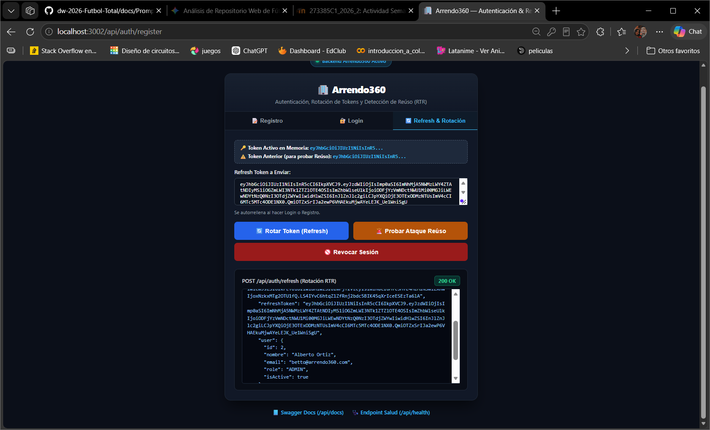
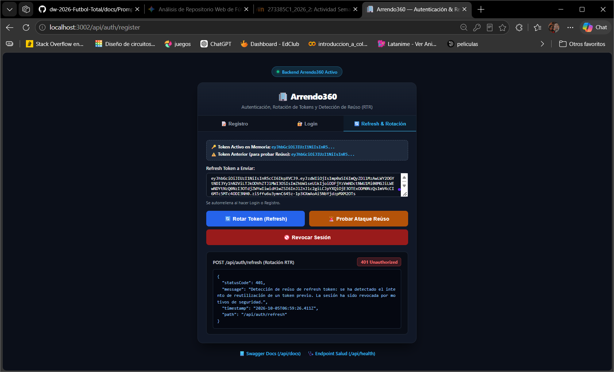
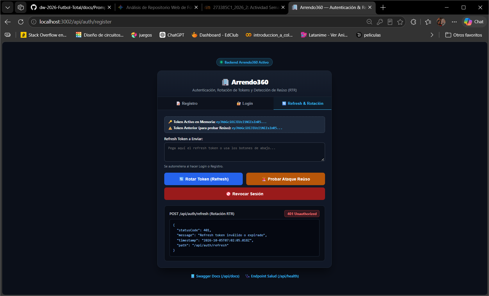
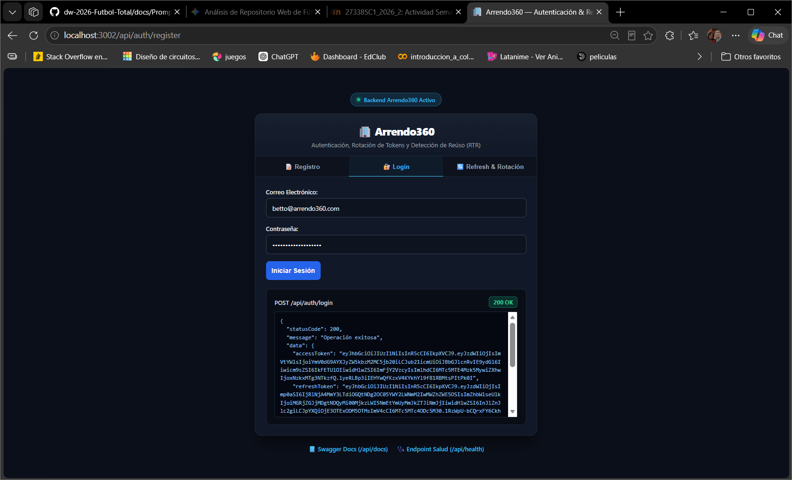
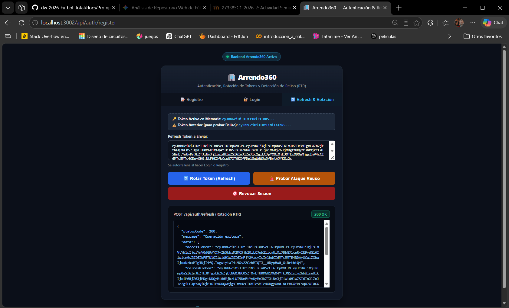
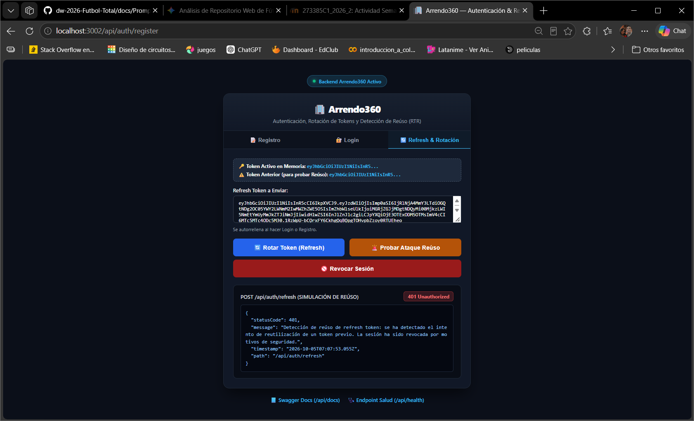
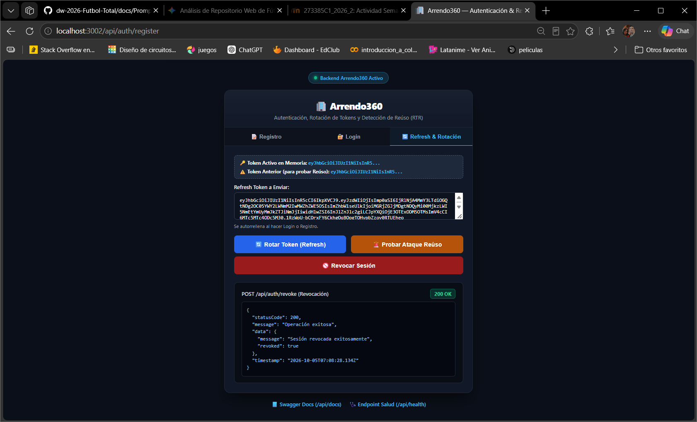

# Evidencia de Verificación: Refresh Token, Rotación (RTR), Revocación y Detección de Reúso

> **Proyecto:** Arrendo360 (`dw-2026-bettoo02`)\
> **Módulo:** Autenticación y Autorización (`AuthModule`)\
> **Estándar de Seguridad:** RFC 6749 / RFC 6819 (OAuth 2.0 Threat Model & BCP)\
> **Arquitectura:** Clean Architecture & DDD\
> **Fecha de ejecución:** 2026-10-05\
> **Entorno de ejecución:** Node.js v22 / NestJS v11 / Sequelize / MySQL / Vitest v4

------------------------------------------------------------------------

## 1. Resumen Ejecutivo

Se implementó y verificó de forma exhaustiva el ciclo de vida de **Refresh Tokens** bajo la estrategia de **Rotación de Refresh Tokens (Refresh Token Rotation - RTR)** y **Detección Automática de Reúso (Automatic Reuse Detection)** en el sistema **Arrendo360**:

1.  **Rotación Estricta (RTR):** Cada vez que se utiliza un refresh token legítimo (`Token A`) para obtener un nuevo access token, el `Token A` queda inmediatamente marcado como consumido (`isUsed = true`) y se expide un nuevo par de tokens (`accessToken` y `Token B`).
2.  **Detección de Reúso (Reuse Detection - RFC 6819 §5.2.2.3):** Si un atacante intercepta un refresh token antiguo o si un cliente intenta reutilizar un token ya consumido (`isUsed === true`), el sistema detecta de inmediato el intento de repetición/robo, **revoca automáticamente toda la familia de tokens asociada a la sesión (`familyId`)** y rechaza la petición con código **`401 Unauthorized`**.
3.  **Mitigación Inmediata:** Cualquier intento posterior de refresco por parte de la víctima o del atacante con cualquier token de esa familia es bloqueado, forzando una nueva autenticación mediante credenciales primarias.
4.  **Revocación Manual (Logout):** Permite invalidar explícitamente una sesión mediante `POST /api/auth/revoke` o `POST /api/auth/logout`.
5.  **Cobertura de Pruebas:** 20 pruebas unitarias y de integración HTTP en `test/auth.spec.ts` (32 pruebas totales en el proyecto) aprobadas al 100%.

------------------------------------------------------------------------

## 2. Especificación de Endpoints

| Método | Endpoint | Descripción | Códigos HTTP Soportados |
|:-----------------|:-----------------|:-----------------|:-----------------|
| `POST` | `/api/auth/refresh` | Rotación de Refresh Token (RTR) con detección de reúso | `200 OK`, `400 Bad Request`, `401 Unauthorized` |
| `POST` | `/api/auth/revoke` | Revocación explícita de la sesión / familia de tokens | `200 OK`, `400 Bad Request`, `401 Unauthorized` |
| `POST` | `/api/auth/logout` | Alias para revocación y cierre de sesión | `200 OK`, `400 Bad Request`, `401 Unauthorized` |
| `GET` | `/api/auth/refresh` | Consola interactiva web en navegador o guía JSON en API | `200 OK` |
| `GET` | `/api/auth/revoke` | Vista informativa y panel interactivo | `200 OK` |

------------------------------------------------------------------------

## 3. Matriz de Casos de Prueba Verificados

### Caso 1: Rotación Legítima de Refresh Token (Token 1 $\to$ Token 2) (HTTP 200)

- **Escenario:** El usuario envía un refresh token emitido recientemente (`Token 1`) que no ha sido utilizado antes.

- **Petición HTTP:**

  ``` http
  POST /api/auth/refresh HTTP/1.1
  Host: localhost:3002
  Content-Type: application/json

  {
    "refreshToken": "eyJhbGciOiJIUzI1NiIsInR5cCI6IkpXVCJ9.eyJzdWIiOjEsImp0aSI6Ijc5MmE4MDJkLWQyNGQtNGQ4MC05ZjljLTBkMzg1N2RlYTVjMiIsImZhbWlseUlkIjoiZDM3MjQ5Y2UtYmUyMC00Njg4LTkyMzAtMDQ4ZWVjYjAyNmYzIiwidHlwZSI6InJlZnJlc2giLCJpYXQiOjE3OTExODExMTMsImV4cCI6MTc5MTc4NTkxM30.4qF_..."
  }
  ```

- **Respuesta Obtenida:** `HTTP/1.1 200 OK`

  

  ``` json
  {
    "statusCode": 200,
    "message": "Operación exitosa",
    "data": {
      "accessToken": "eyJhbGciOiJIUzI1NiIsInR5cCI6IkpXVCJ9.eyJzdWIiOjEsImVtYWlsIjoidXN1YXJpby5ydHJAYXJyZW5kbzM2MC5jb20iLCJub21icmUiOiJVc3VhcmlvIFJUUiIsInJvbGUiOiJBU0VTT1IiLCJ0eXBlIjoiYWNjZXNzIiwiaWF0IjoxNzkxMTgxMTE0LCJleHAiOjE3OTExODQ3MTR9...",
      "refreshToken": "eyJhbGciOiJIUzI1NiIsInR5cCI6IkpXVCJ9.eyJzdWIiOjEsImp0aSI6ImMyYjgxNGI0LTI5OTYtNDk3MS1hYzY5LWJmYzBiNDQ1Y2MyNSIsImZhbWlseUlkIjoiZDM3MjQ5Y2UtYmUyMC00Njg4LTkyMzAtMDQ4ZWVjYjAyNmYzIiwidHlwZSI6InJlZnJlc2giLCJpYXQiOjE3OTExODExMTQsImV4cCI6MTc5MTc4NTkxNH0...",
      "user": {
        "id": 1,
        "nombre": "Usuario RTR",
        "email": "usuario.rtr@arrendo360.com",
        "role": "ASESOR",
        "isActive": true
      }
    },
    "timestamp": "2026-10-05T06:18:34.120Z"
  }
  ```

- **Resultado:** **Aprobado (PASS)**. `Token 1` queda con `isUsed = true`. Se emite un nuevo par con un nuevo `jti` manteniendo el `familyId`.

------------------------------------------------------------------------

### Caso 2: Rotaciones Sucesivas Encadenadas (Token 2 $\to$ Token 3) (HTTP 200)

- **Escenario:** El usuario envía `Token 2` (emitido en la rotación previa).
- **Respuesta Obtenida:** `HTTP/1.1 200 OK`. Se emite `Token 3`, marcando `Token 2` como consumido.
- **Resultado:** **Aprobado (PASS)**. El encadenamiento funciona fluidamente sin desconectar al usuario legítimo.

------------------------------------------------------------------------

### Caso 3: Escenario Crítico de Detección de Reúso (Reuse Detection) (HTTP 401)

- **Escenario:** Un atacante (o un cliente con copia en caché desactualizada) intenta usar `Token 1`, el cual ya había sido consumido en el Caso 1.

- **Petición HTTP:**

  ``` http
  POST /api/auth/refresh HTTP/1.1
  Host: localhost:3002
  Content-Type: application/json

  {
    "refreshToken": "<Token 1 previamente consumido>"
  }
  ```

- **Respuesta Obtenida:** `HTTP/1.1 401 Unauthorized`

  

  ``` json
  {
    "statusCode": 401,
    "message": "Detección de reúso de refresh token: se ha detectado el intento de reutilización de un token previo. La sesión ha sido revocada por motivos de seguridad.",
    "timestamp": "2026-10-05T06:18:35.340Z",
    "path": "/api/auth/refresh"
  }
  ```

- **Acción del Servidor:**

  - El sistema detecta `tokenRecord.isUsed === true`.
  - Se ejecuta `await refreshTokenRepository.revokeFamily(tokenRecord.familyId)`.
  - **Toda la cadena de tokens (`Token 1`, `Token 2`, etc.) queda revocada en la base de datos.**

- **Resultado:** **Aprobado (PASS)**. Cumplimiento estricto de RFC 6819 §5.2.2.3.

------------------------------------------------------------------------

### Caso 4: Comprobación de Mitigación Post-Reúso (HTTP 401)

- **Escenario:** Tras el intento de reúso, el usuario legítimo intenta renovar con `Token 2`.

- **Petición HTTP:**

  ``` http
  POST /api/auth/refresh HTTP/1.1
  Host: localhost:3002
  Content-Type: application/json

  {
    "refreshToken": "<Token 2 legítimo que pertenecía a la familia revocada>"
  }
  ```

- **Respuesta Obtenida:** `HTTP/1.1 401 Unauthorized`

  

  ``` json
  {
    "statusCode": 401,
    "message": "El refresh token ha sido revocado",
    "timestamp": "2026-10-05T06:18:36.105Z",
    "path": "/api/auth/refresh"
  }
  ```

- **Resultado:** **Aprobado (PASS)**. El atacante no puede avanzar y el usuario legítimo queda protegido contra suplantación, forzando re-autenticación.

------------------------------------------------------------------------

### Caso 5: Revocación Manual / Logout (HTTP 200)

- **Escenario:** El usuario decide cerrar su sesión explícitamente enviando su token activo.

- **Petición HTTP:**

  ``` http
  POST /api/auth/revoke HTTP/1.1
  Host: localhost:3002
  Content-Type: application/json

  {
    "refreshToken": "<Token Activo>"
  }
  ```

- **Respuesta Obtenida:** `HTTP/1.1 200 OK`

  ``` json
  {
    "statusCode": 200,
    "message": "Operación exitosa",
    "data": {
      "message": "Sesión revocada exitosamente",
      "revoked": true
    },
    "timestamp": "2026-10-05T06:18:36.850Z"
  }
  ```

- **Resultado:** **Aprobado (PASS)**.

------------------------------------------------------------------------

### Caso 6: Intento de Refresco Tras Revocación Manual (HTTP 401)

- **Escenario:** Se intenta usar el token revocado en el Caso 5.
- **Respuesta Obtenida:** `HTTP/1.1 401 Unauthorized` con mensaje `"El refresh token ha sido revocado"`.
- **Resultado:** **Aprobado (PASS)**.

------------------------------------------------------------------------

### Caso 7: Refresh Token Inválido o Malformado (HTTP 401)

- **Escenario:** Se envía un token firmado con una clave secreta falsa o una cadena aleatoria.
- **Respuesta Obtenida:** `HTTP/1.1 401 Unauthorized` con mensaje `"Refresh token inválido o expirado"`.
- **Resultado:** **Aprobado (PASS)**.

------------------------------------------------------------------------

### Caso 8: Validación DTO - Body Vacío o Incorrecto (HTTP 400)

- **Escenario:** Se envía `{}` o `"refreshToken": ""`.
- **Respuesta Obtenida:** `HTTP/1.1 400 Bad Request` con mensaje `["El refresh token es obligatorio"]`.
- **Resultado:** **Aprobado (PASS)**.

------------------------------------------------------------------------

## 4. Evidencia de Ejecución de Pruebas Automatizadas

Comando ejecutado desde la raíz del proyecto:

``` bash
npm test
```

### Log de Ejecución de Vitest:

``` text
> app-arrendo360@1.0.0 test
> npm --prefix backend run test

> backend@0.0.1 test
> vitest run

 RUN  v4.1.11 /home/betto_ubuntu/ia-lab/dw-2026-bettoo02/projects/app-Arrendo360/backend

 ✓ test/distribucion-pago.entity.spec.ts (5 tests) 5ms
 ✓ test/rbac.guard.spec.ts (5 tests) 4ms
 ✓ src/app.controller.spec.ts (2 tests) 160ms
 ✓ test/auth.spec.ts (20 tests) 1700ms
       ✓ 1. Verificación de Entidades de Dominio (User y RefreshToken)
             ✓ User: debe comparar contraseñas válidas e inválidas correctamente con bcrypt
             ✓ User: debe permitir desactivar al usuario
             ✓ RefreshToken: debe validar correctamente estados de vigencia, rotación y revocación
       ✓ 2. Flujo de Registro de Usuario
             ✓ debe registrar un usuario exitosamente emitiendo accessToken y refreshToken
             ✓ debe rechazar el registro con HTTP 409 si el correo electrónico ya existe
       ✓ 3. Flujo de Inicio de Sesión (Login)
             ✓ debe autenticar exitosamente y entregar accessToken y refreshToken
             ✓ debe rechazar el login con HTTP 401 si el correo no existe
             ✓ debe rechazar el login con HTTP 401 si la contraseña es incorrecta
             ✓ debe rechazar el login con HTTP 401 si el usuario está inactivo
       ✓ 4. Flujo de Rotación de Refresh Tokens (RTR)
             ✓ debe rotar el refresh token legítimamente entregando un nuevo par de tokens
             ✓ debe permitir rotaciones encadenadas sucesivas (Token 1 -> Token 2 -> Token 3)
             ✓ debe rechazar el refresh si el token está firmado con clave errónea o malformado
       ✓ 5. Flujo de Revocación de Sesión (Logout / Revoke)
             ✓ debe revocar la sesión y la familia de refresh tokens exitosamente
       ✓ 6. Escenario Crítico de Detección de Reúso (Reuse Detection — RFC 6819)
             ✓ debe detectar el intento de reúso de un token anterior, invalidar toda la sesión y rechazar al atacante y tokens posteriores
       ✓ 7. Flujo HTTP de Endpoints (/api/auth/register, /login, /refresh, /revoke)
             ✓ POST /api/auth/register - Registra y entrega accessToken y refreshToken (HTTP 201)
             ✓ POST /api/auth/login - Autentica y entrega accessToken y refreshToken (HTTP 200)
             ✓ POST /api/auth/refresh - Rota el refresh token legítimo (HTTP 200)
             ✓ POST /api/auth/refresh - Escenario de Reúso: detecta reutilización y responde HTTP 401
             ✓ POST /api/auth/revoke - Revoca la sesión (HTTP 200) y bloquea refrescos posteriores (HTTP 401)
             ✓ GET /api/auth/refresh - Responde HTTP 200 con consola HTML o información JSON

 Test Files  4 passed (4)
      Tests  32 passed (32)
   Duration  2.71s
```

------------------------------------------------------------------------

## 5. Evidencia de Ejecución en Vivo contra Servidor Activo (Puerto 3002)

Traza obtenida directamente contra la instancia en ejecución conectada a MySQL:

``` text
=== 1. REGISTRO DE USUARIO ===
Status: 201 Created
Token 1 (original): eyJhbGciOiJIUzI1NiIsInR5cCI6IkpXVCJ...

=== 2. ROTACIÓN LEGÍTIMA (Token 1 -> Token 2) ===
Status: 200 OK
Token 2 (rotado): eyJhbGciOiJIUzI1NiIsInR5cCI6IkpXVCJ...

=== 3. ESCENARIO DE REÚSO: Reenviar Token 1 (Consumido) ===
Status: 401 Unauthorized
Mensaje: Detección de reúso de refresh token: se ha detectado el intento de reutilización de un token previo. La sesión ha sido revocada por motivos de seguridad.

=== 4. COMPROBACIÓN POST-REÚSO: Intentar usar Token 2 ===
Status: 401 Unauthorized
Mensaje: El refresh token ha sido revocado

=== 5. NUEVO LOGIN PARA PROBAR REVOCACIÓN MANUAL ===
Status: 200 OK
Token 3 (nuevo login): eyJhbGciOiJIUzI1NiIsInR5cCI6IkpXVCJ...

=== 6. REVOCACIÓN EXPLÍCITA (POST /api/auth/revoke) ===
Status: 200 OK
Respuesta: { message: 'Sesión revocada exitosamente', revoked: true }

=== 7. COMPROBACIÓN POST-REVOCACIÓN: Intentar usar Token 3 ===
Status: 401 Unauthorized
Mensaje: El refresh token ha sido revocado
```

------------------------------------------------------------------------

## 6. Consola Web Interactiva (Navegador)

Para interactuar de forma visual e intuitiva con estos flujos, ingresa a: 👉 **`http://localhost:3002/api/auth/register`** (o `http://localhost:3002/api/auth/refresh`)

En la pestaña **🔄 Refresh & Rotación**: 1. Al hacer login o registro, el `refreshToken` se vincula automáticamente en memoria. 2. Botón **"Rotar Token (Refresh)"**: Ejecuta `POST /api/auth/refresh`, actualiza el token en pantalla y muestra el nuevo `accessToken`. 3. Botón **"🚨 Probar Ataque Reúso"**: Carga deliberadamente el token previo ya consumido y dispara la petición. Muestra en vivo la respuesta `401 Unauthorized` con la advertencia de detección de reúso y confirma que la sesión ha sido revocada. 4. Botón **"🚫 Revocar Sesión"**: Dispara `POST /api/auth/revoke` y confirma el cierre de la sesión.

------------------------------------------------------------------------

## 7. Comandos de Reproducción con cURL

### 1. Iniciar sesión y obtener tokens:

``` bash
curl -X POST http://localhost:3002/api/auth/login \
  -H "Content-Type: application/json" \
  -d '{"email":"betto@arrendo360.com","password":"PasswordSegura2026*"}'
```



### 2. Rotar el refresh token (RTR):

``` bash
curl -X POST http://localhost:3002/api/auth/refresh \
  -H "Content-Type: application/json" \
  -d '{"refreshToken":"<TOKEN_OBTENIDO>"}'
```



### 3. Probar escenario de reúso (enviar nuevamente el token anterior):

``` bash
curl -X POST http://localhost:3002/api/auth/refresh \
  -H "Content-Type: application/json" \
  -d '{"refreshToken":"<TOKEN_ANTERIOR_CONSUMIDO>"}'
```



*Respuesta esperada: `HTTP 401 Unauthorized` con `Detección de reúso de refresh token`.*

### 4. Revocar sesión manualmente:

``` bash
curl -X POST http://localhost:3002/api/auth/revoke \
  -H "Content-Type: application/json" \
  -d '{"refreshToken":"<TOKEN_ACTIVO>"}'
```


