## Empecemos con el Paso 1: **ISS-00 — Requisitos previos y reconocimiento del entorno**

#### **1. ¿Qué buscamos en el ISS-00?**

En el **ISS-00** no escribimos código de aplicación todavía; nos aseguramos de que las herramientas base estén listas y que el backend de **Arrendo360 (mi proyecto)** responda correctamente para que Angular no falle al conectarse más adelante.

**2. Tarea paso a paso para completar el ISS-00**

Abre tu terminal y realiza estos **3 pasos**:

**Paso A: Instalar Angular CLI de forma global** Ejecuta en tu terminal:

```         

npm install -g @angular/cli
```

*(Si en Linux pide permisos o se prefiere no usar `sudo`, también podremos usar `npx @angular/cli` en el ISS-01, pero prueba primero si te permite instalarlo o verifica con `npx @angular/cli version`).*


**Paso B: Verificar dónde crearemos la carpeta `frontend`** Mi proyecto tiene la ruta raíz `/home/betto_ubuntu/ia-lab/dw-2026-bettoo02/projects/app-Arrendo360/`, donde hoy está la carpeta `backend/`. La idea es que `frontend/` quede como carpeta hermana al mismo nivel:

```         
text
app-Arrendo360/

├── backend/    <-- Tu API NestJS + Express + Sequelize (puerto 3002)

└── frontend/   <-- Aquí crearemos tu app Angular en el ISS-01 (puerto 4200)
```


**Paso C: Verificar que tu Backend está vivo y responde al Healthcheck** En una terminal dentro de `/home/betto_ubuntu/ia-lab/dw-2026-bettoo02/projects/app-Arrendo360/backend`, inicia el servidor (si no lo tienes corriendo):

```         
bash
npm run start:dev
```


Y comprueba en otra terminal o navegador que responde:

```         
bash
curl http://localhost:3002/api/health
```

Deberías recibir `{"statusCode":200,"data":{"status":"ok"}}`.


## **ISS-01 · Capa 2: Construir (Paso a paso manual)**

Sigue estos **5 pasos** desde tu terminal.

### **Paso 1: Crear el proyecto `frontend` al lado de `backend`**

Ubícate en la carpeta raíz de tu proyecto (`app-Arrendo360`) y genera el proyecto Angular:

```{bash}
cd /home/betto_ubuntu/ia-lab/dw-2026-bettoo02/projects/app-Arrendo360
npx @angular/cli@latest new frontend --style=css --routing=true --ssr=false --zoneless=true --skip-git=true
```

> **¿Por qué estos flags?**
>
> - `--style=css`: Necesario para la integración limpia con Tailwind CSS 4 (`@import "tailwindcss";`).
>
> - `--routing=true`: Crea `app.routes.ts` para navegar entre los módulos de Arrendo360.
>
> - `--ssr=false`: Crea una SPA pura en el navegador.
>
> - `--zoneless=true`: Configura la reactividad moderna basada en Signals sin `zone.js`


### **Paso 2: Entrar a `frontend` e instalar PrimeNG, PrimeIcons y Tailwind CSS 4**

Una vez termine de crearse la carpeta `frontend`, entra en ella e instala las dependencias de diseño:

```{bash}
cd /home/betto_ubuntu/ia-lab/dw-2026-bettoo02/projects/app-Arrendo360/frontend

# 1. Instalar PrimeNG, el tema Aura y los iconos PrimeIcons

npm install primeng @primeuix/themes primeicons

# 2. Instalar Tailwind CSS v4 y su plugin PostCSS

npm install -D tailwindcss @tailwindcss/postcss postcss
```


### **Paso 3: Configurar PostCSS para que Angular procese Tailwind CSS 4**

En la raíz de `frontend/` (`/home/betto_ubuntu/ia-lab/dw-2026-bettoo02/projects/app-Arrendo360/frontend/.postcssrc.json`), crea un archivo llamado **`.postcssrc.json`** con este contenido exacto:

```         
json
```

{

"plugins": {

"\@tailwindcss/postcss": {}

}

}

### **Paso 4: Configurar las capas de estilos globales en `src/styles.css`**

Abre el archivo `frontend/src/styles.css` y reemplaza su contenido por este bloque:

```         
css
```

[\@layer tailwind-base, primeng, tailwind-utilities;]{.underline}

[\@import "tailwindcss";]{.underline}

[\@import "primeicons/primeicons.css";]{.underline}

> 
>
> **Nota pedagógica:** Fíjate en la primera línea (`@layer ...`) y en que importamos `primeicons.css` para poder usar íconos como `pi pi-home`, `pi pi-building`, `pi pi-users` o `pi pi-key` en todo Arrendo360.

### **Paso 5: Configurar el Composition Root en `src/app/app.config.ts`**

Abre `frontend/src/app/app.config.ts` y configúralo para activar **Zoneless**, el **Router** y **PrimeNG con el tema Aura**:

```         
typescript
```

import { ApplicationConfig, provideZonelessChangeDetection } from '\@angular/core';

import { provideRouter } from '\@angular/router';

import { provideAnimationsAsync } from '\@angular/platform-browser/animations/async';

import { providePrimeNG } from 'primeng/config';

import Aura from '\@primeuix/themes/aura';

import { routes } from './app.routes';

export const appConfig: ApplicationConfig = {

providers: [

provideZonelessChangeDetection(),

provideRouter(routes),

provideAnimationsAsync(),

providePrimeNG({

ripple: true,

theme: {

preset: Aura,

options: {

darkModeSelector: '.app-dark',

cssLayer: {

name: 'primeng',

order: 'tailwind-base, primeng, tailwind-utilities',

},

},

},

}),

],

};

*(Nota: Si tu versión de Angular 21/22 te marca que `provideAnimationsAsync()` ya está deprecado o no es necesario en las últimas versiones de PrimeNG, me avisas o podemos omitir `provideAnimationsAsync()` ya que PrimeNG 20+ usa animaciones CSS nativas).*

## **ISS-01 · Capa 3: Criterio de Verificación**

Para comprobar que tu **ISS-01** quedó sin errores:

1.  

2.  Abre temporalmente `frontend/src/app/app.html` (o `app.component.html`), borra la plantilla de bienvenida de Angular y pon una prueba rápida de **Tailwind + PrimeNG + PrimeIcons**:

    ```         
    html
    ```

    \<div class="min-h-screen bg-slate-50 flex flex-col items-center justify-center gap-4 p-6"\>

    \<h1 class="text-3xl font-bold text-emerald-700 flex items-center gap-2"\>

    \<i class="pi pi-building text-3xl"\>\</i\>

    Arrendo360 — Frontend 2026

    \</h1\>

    \<p class="text-slate-600"\>ISS-01: Angular + Tailwind CSS 4 + PrimeNG Aura listos\</p\>

    \</div\>

3.  

4.  Ejecuta en la terminal dentro de `frontend/`:

    ```         
    bash
    ```

    npm start

5.  

6.  Abre [`http://localhost:4200`](http://localhost:4200) en tu navegador.


La terminal muestra advertencias de npm (`npm warn install-scripts`) indicando que se bloquearon los scripts de instalación automáticos de cuatro paquetes porque no están autorizados en la configuración `allowScripts`:

- `@parcel/watcher@2.6.0` (`node-gyp rebuild`)

- `esbuild@0.28.2` (`node install.js`)

- `lmdb@3.5.6` (`node-gyp rebuild`)

- `msgpackr-extract@3.0.4` (`node-gyp rebuild`)

Muchos paquetes como `esbuild` o dependencias nativas requieren ejecutar estos scripts tras la instalación para compilar o descargar binarios necesarios para su correcto funcionamiento.

### Opciones para resolverlo

**1. Permitir y compilar los paquetes bloqueados (Recomendado)**

Ejecuta el comando para aprobar individualmente cada dependencia legítima:

```{bash}
npm install-scripts approve esbuild
npm install-scripts approve @parcel/watcher
npm install-scripts approve lmdb
npm install-scripts approve msgpackr-extract
```


Luego vuelve a ejecutar la instalación o reconstruye los scripts:

```{bash}
npm rebuild
```


### **Paso 3: Configurar PostCSS para que Angular procese Tailwind CSS 4**

En la raíz de `frontend/` (`/home/betto_ubuntu/ia-lab/dw-2026-bettoo02/projects/app-Arrendo360/frontend/.postcssrc.json`), crea un archivo llamado **`.postcssrc.json`** con este contenido exacto:

``` json
{

  "plugins": {

    "@tailwindcss/postcss": {}

  }

}
```


### **Paso 4: Configurar las capas de estilos globales en `src/styles.css`**

Abre el archivo `frontend/src/styles.css` y reemplaza su contenido por este bloque:

``` css
css
@layer tailwind-base, primeng, tailwind-utilities;

@import "tailwindcss";

@import "primeicons/primeicons.css";
```

>  **Nota pedagógica:** Fíjate en la primera línea (`@layer ...`) y en que importamos `primeicons.css` para poder usar íconos como `pi pi-home`, `pi pi-building`, `pi pi-users` o `pi pi-key` en todo Arrendo360.


### **Paso 5: Configurar el Composition Root en `src/app/app.config.ts`**

Abre `frontend/src/app/app.config.ts` y configúralo para activar **Zoneless**, el **Router** y **PrimeNG con el tema Aura**:

``` typescript
import { ApplicationConfig, provideZonelessChangeDetection } from '@angular/core';

import { provideRouter } from '@angular/router';

import { provideAnimationsAsync } from '@angular/platform-browser/animations/async';

import { providePrimeNG } from 'primeng/config';

import Aura from '@primeuix/themes/aura';

import { routes } from './app.routes';

export const appConfig: ApplicationConfig = {

  providers: [

    provideZonelessChangeDetection(),

    provideRouter(routes),

    provideAnimationsAsync(),

    providePrimeNG({

      ripple: true,

      theme: {

        preset: Aura,

        options: {

          darkModeSelector: '.app-dark',

          cssLayer: {

            name: 'primeng',

            order: 'tailwind-base, primeng, tailwind-utilities',

          },

        },

      },

    }),

  ],

};
```

*(Nota: Si tu versión de Angular 21/22 te marca que `provideAnimationsAsync()` ya está deprecado o no es necesario en las últimas versiones de PrimeNG, me avisas o podemos omitir `provideAnimationsAsync()` ya que PrimeNG 20+ usa animaciones CSS nativas).*


## **ISS-01 · Capa 3: Criterio de Verificación**

Para comprobar que tu **ISS-01** quedó sin errores:

1.  Abre temporalmente `frontend/src/app/app.html` (o `app.component.html`), borra la plantilla de bienvenida de Angular y pon una prueba rápida de **Tailwind + PrimeNG + PrimeIcons**:

    ``` html
    <div class="min-h-screen bg-slate-50 flex flex-col items-center justify-center gap-4 p-6">

      <h1 class="text-3xl font-bold text-emerald-700 flex items-center gap-2">

        <i class="pi pi-building text-3xl"></i>

        Arrendo360 — Frontend 2026

      </h1>

      <p class="text-slate-600">ISS-01: Angular + Tailwind CSS 4 + PrimeNG Aura listos</p>

    </div>
    ```

    

2.  Ejecuta en la terminal dentro de `frontend/`:

    ``` bash
    npm start
    ```

3.  Abre [`http://localhost:4200`](http://localhost:4200) en tu navegador.


## **ISS-01A · Capa 2: Construir**

Abre una terminal en `frontend/` (`/home/betto_ubuntu/ia-lab/dw-2026-bettoo02/projects/app-Arrendo360/frontend`) y sigue estos **5 pasos**:

### **Paso 1: Generar los 3 componentes del Layout con Angular CLI**

Ejecuta estos comandos para que el CLI cree la carpeta `core/layout/` con los tres componentes:

``` bash
npx ng g c core/layout/header --skip-tests

npx ng g c core/layout/aside --skip-tests

npx ng g c core/layout/footer --skip-tests
```

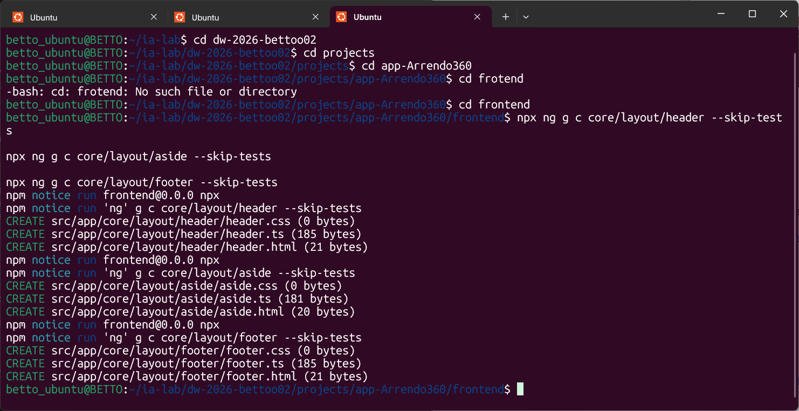

### **Paso 2: Maquetar el componente `Header`**

Abre el archivo `frontend/src/app/core/layout/header/header.html` y coloca este diseño con Tailwind + PrimeIcons:

``` html
<header class="h-16 bg-white border-b border-slate-200 px-6 flex items-center justify-between shadow-xs">

  <!-- Marca Arrendo360 -->

  <div class="flex items-center gap-3">

    <div class="w-10 h-10 rounded-lg bg-emerald-600 text-white flex items-center justify-center shadow-xs">

      <i class="pi pi-building text-xl"></i>

    </div>

    <div>

      <h1 class="text-lg font-bold text-slate-800 leading-tight">Arrendo360</h1>

      <p class="text-xs text-slate-500">Plataforma de Gestión Inmobiliaria</p>

    </div>

  </div>

  <!-- Estado / Usuario (estático en ISS-01A) -->

  <div class="flex items-center gap-4">

    <span class="inline-flex items-center gap-1.5 px-3 py-1 rounded-full text-xs font-medium bg-emerald-50 text-emerald-700 border border-emerald-200">

      <span class="w-2 h-2 rounded-full bg-emerald-500"></span>

      API Local :3002

    </span>

    <div class="flex items-center gap-2 text-sm text-slate-700 font-medium">

      <i class="pi pi-user text-slate-500"></i>

      <span>Administrador</span>

    </div>

  </div>

</header>
```

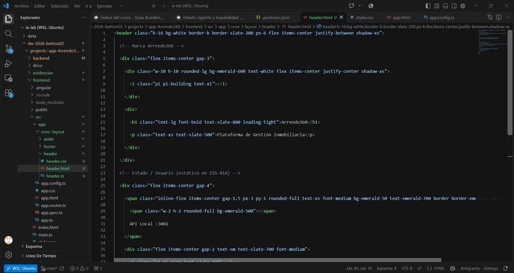

### **Paso 3: Maquetar el componente `Aside` (Menú lateral inmobiliario)**

Abre el archivo `frontend/src/app/core/layout/aside/aside.html` y escribe la estructura del menú de navegación de **Arrendo360**:

``` html
<aside class="w-64 bg-slate-900 text-slate-200 h-full flex flex-col justify-between p-4 select-none">

  <div class="space-y-6">

    <!-- Grupo 1: General -->

    <div>

      <p class="px-3 text-xs font-semibold uppercase tracking-wider text-slate-400 mb-2">

        Principal

      </p>

      <ul class="space-y-1 text-sm">

        <li>

          <a class="flex items-center gap-3 px-3 py-2 rounded-lg bg-emerald-600 text-white font-medium cursor-pointer">

            <i class="pi pi-chart-bar"></i>

            <span>Dashboard</span>

          </a>

        </li>

      </ul>

    </div>

    <!-- Grupo 2: Negocio Inmobiliario (Fase I) -->

    <div>

      <p class="px-3 text-xs font-semibold uppercase tracking-wider text-slate-400 mb-2">

        Gestión Inmobiliaria

      </p>

      <ul class="space-y-1 text-sm">

        <li>

          <a class="flex items-center gap-3 px-3 py-2 rounded-lg hover:bg-slate-800 text-slate-300 cursor-pointer transition-colors">

            <i class="pi pi-users"></i>

            <span>Arrendatarios (Clientes)</span>

          </a>

        </li>

        <li>

          <a class="flex items-center gap-3 px-3 py-2 rounded-lg hover:bg-slate-800 text-slate-300 cursor-pointer transition-colors">

            <i class="pi pi-id-card"></i>

            <span>Propietarios</span>

          </a>

        </li>

        <li>

          <a class="flex items-center gap-3 px-3 py-2 rounded-lg hover:bg-slate-800 text-slate-300 cursor-pointer transition-colors">

            <i class="pi pi-home"></i>

            <span>Inmuebles</span>

          </a>

        </li>

        <li>

          <a class="flex items-center gap-3 px-3 py-2 rounded-lg hover:bg-slate-800 text-slate-300 cursor-pointer transition-colors">

            <i class="pi pi-file-edit"></i>

            <span>Contratos</span>

          </a>

        </li>

        <li>

          <a class="flex items-center gap-3 px-3 py-2 rounded-lg hover:bg-slate-800 text-slate-300 cursor-pointer transition-colors">

            <i class="pi pi-wallet"></i>

            <span>Cobros y Pagos</span>

          </a>

        </li>

        <li>

          <a class="flex items-center gap-3 px-3 py-2 rounded-lg hover:bg-slate-800 text-slate-300 cursor-pointer transition-colors">

            <i class="pi pi-percentage"></i>

            <span>Liquidaciones</span>

          </a>

        </li>

        <li>

          <a class="flex items-center gap-3 px-3 py-2 rounded-lg hover:bg-slate-800 text-slate-300 cursor-pointer transition-colors">

            <i class="pi pi-wrench"></i>

            <span>Mantenimiento</span>

          </a>

        </li>

      </ul>

    </div>

  </div>

  <!-- Pie del Aside -->

  <div class="pt-4 border-t border-slate-800 text-xs text-slate-400 px-3">

    <p class="font-medium text-slate-300">Arrendo360 v1.0</p>

    <p>Universidad de La Guajira</p>

  </div>

</aside>
```

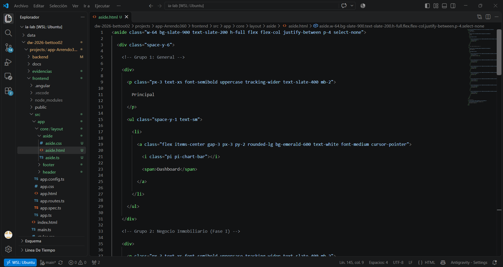

### **Paso 4: Maquetar el componente `Footer`**

Abre el archivo `frontend/src/app/core/layout/footer/footer.html` y coloca este contenido:

``` html
<footer class="h-12 bg-white border-t border-slate-200 px-6 flex items-center justify-between text-xs text-slate-500">

  <span>© 2026 <strong>Arrendo360</strong> — Ingeniería de Sistemas · Universidad de La Guajira</span>

  <span>Stack: Angular 22 · PrimeNG 22 · Tailwind 4 · Express/NestJS</span>

</footer>
```

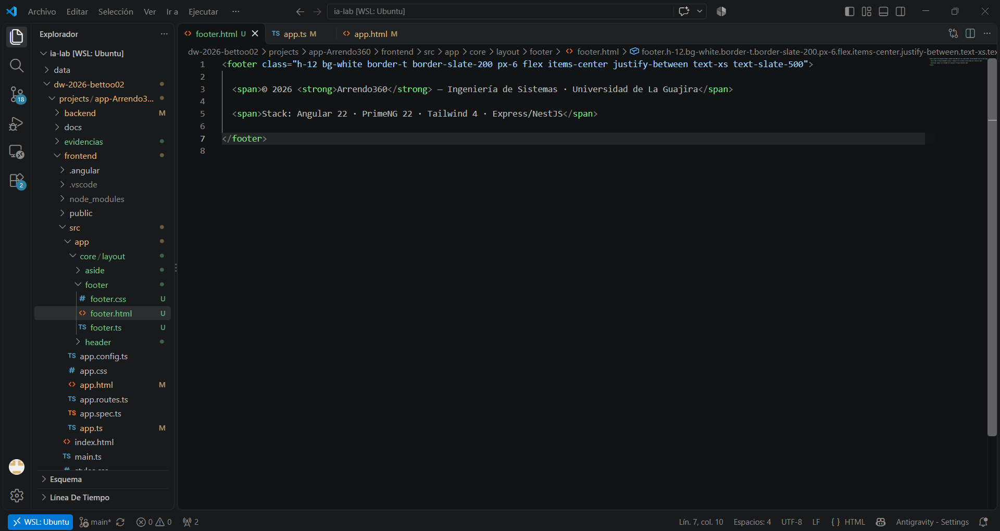

### **Paso 5: Ensamblar el Layout en `src/app/app.ts` y `src/app/app.html`**

Ahora conectamos los 3 componentes dentro del componente raíz `src/app/app.ts`:

1.  En `frontend/src/app/app.ts`, importa `Header`, `Aside` y `Footer`:

``` typescript
import { Component, signal } from '@angular/core';

import { RouterOutlet } from '@angular/router';

import { Header } from './core/layout/header/header';

import { Aside } from './core/layout/aside/aside';

import { Footer } from './core/layout/footer/footer';

@Component({

  imports: [RouterOutlet, Header, Aside, Footer],

  selector: 'app-root',

  styleUrl: './app.css',

  templateUrl: './app.html',

})

export class App {

  protected readonly title = signal('Arrendo360');

}
```

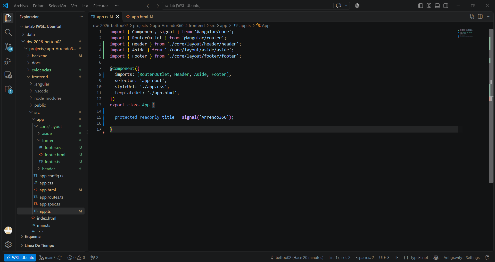

2.   En `frontend/src/app/app.html`, arma el esqueleto completo (Shell) de la aplicación:

``` html
<div class="min-h-screen flex flex-col bg-slate-50 text-slate-800">

  <!-- Cabecera superior -->

  <app-header />

  <!-- Cuerpo principal: Aside izquierdo + Contenido central -->

  <div class="flex flex-1 overflow-hidden">

    <app-aside />

    <main class="flex-1 p-6 overflow-y-auto">

      <div class="max-w-7xl mx-auto">

        <!-- Tarjeta de bienvenida temporal mientras creamos las rutas en ISS-01B -->

        <div class="bg-white rounded-xl border border-slate-200 p-6 shadow-xs">

          <h2 class="text-xl font-bold text-slate-800 mb-2">

            Bienvenido a {{ title() }}

          </h2>

          <p class="text-sm text-slate-600">

            ISS-01A completado: Composición visual de Header, Aside y Footer lista.

          </p>

        </div>

        <router-outlet />

      </div>

    </main>

  </div>

  <!-- Pie de página -->

  <app-footer />

</div>
```

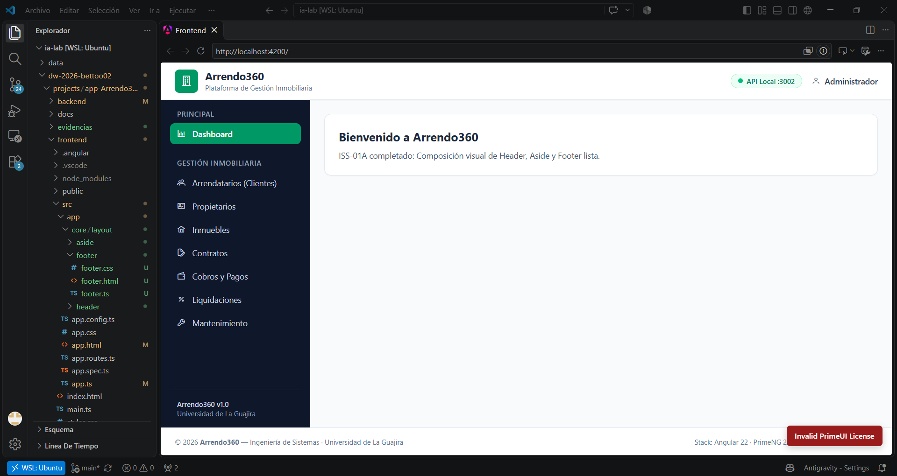](images/clipboard-380746271.png)

## **ISS-01B · Capa 2: Construir**

Realiza estos **4 pasos** en tus archivos de `frontend/src/app/`:

### **Paso 1: Hacer interactivo el `Header` (`header.ts` y `header.html`)** 

1.  Abre `frontend/src/app/core/layout/header/header.ts` y añade `output` y `ButtonModule` de PrimeNG para emitir el evento de abrir/cerrar el menú lateral:

``` typescript
import { Component, input, output } from '@angular/core';

import { ButtonModule } from 'primeng/button';

@Component({

  selector: 'app-header',

  imports: [ButtonModule],

  templateUrl: './header.html',

  styleUrl: './header.css',

})

export class Header {

  // Recibe del padre si el sidebar está abierto (para cambiar el ícono si queremos)

  readonly sidebarOpen = input<boolean>(true);

  // Emite al padre cuando el usuario presiona el botón de menú

  readonly toggleSidebar = output<void>();

}
```

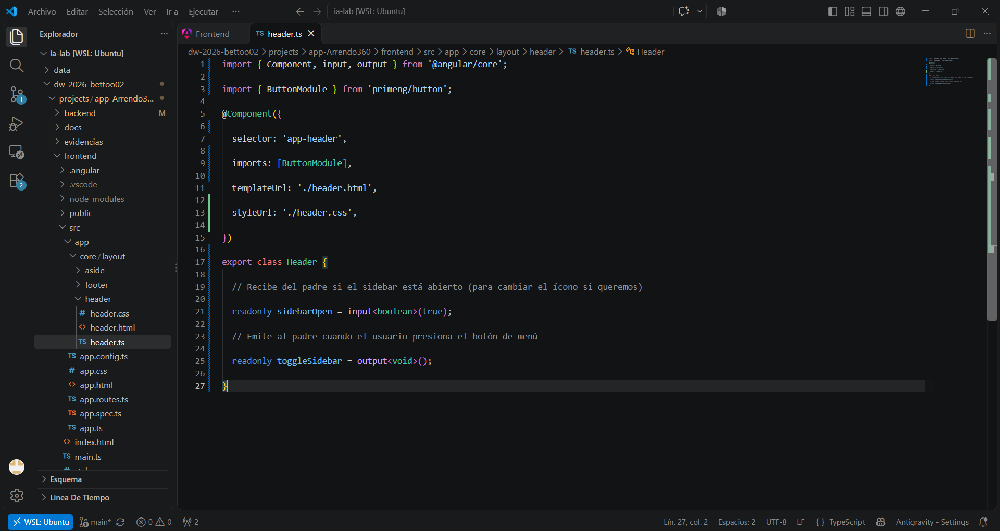

2.  Abre `frontend/src/app/core/layout/header/header.html` y añade el botón `<p-button>` de PrimeNG al lado del logo de **Arrendo360**:

``` html
<header class="h-16 bg-white border-b border-slate-200 px-6 flex items-center justify-between shadow-xs">

  <div class="flex items-center gap-3">

    <!-- Botón PrimeNG que dispara el output toggleSidebar -->

    <p-button

      [icon]="sidebarOpen() ? 'pi pi-bars' : 'pi pi-align-left'"

      [rounded]="true"

      [text]="true"

      severity="secondary"

      (onClick)="toggleSidebar.emit()"

      title="Mostrar / ocultar menú lateral"

    />

    <div class="w-10 h-10 rounded-lg bg-emerald-600 text-white flex items-center justify-center shadow-xs">

      <i class="pi pi-building text-xl"></i>

    </div>

    <div>

      <h1 class="text-lg font-bold text-slate-800 leading-tight">Arrendo360</h1>

      <p class="text-xs text-slate-500">Plataforma de Gestión Inmobiliaria</p>

    </div>

  </div>

  <!-- Estado / Usuario -->

  <div class="flex items-center gap-4">

    <span class="inline-flex items-center gap-1.5 px-3 py-1 rounded-full text-xs font-medium bg-emerald-50 text-emerald-700 border border-emerald-200">

      <span class="w-2 h-2 rounded-full bg-emerald-500 animate-pulse"></span>

      API Local :3002

    </span>

    <div class="flex items-center gap-2 text-sm text-slate-700 font-medium">

      <i class="pi pi-user text-slate-500"></i>

      <span>Administrador</span>

    </div>

  </div>

</header>
```

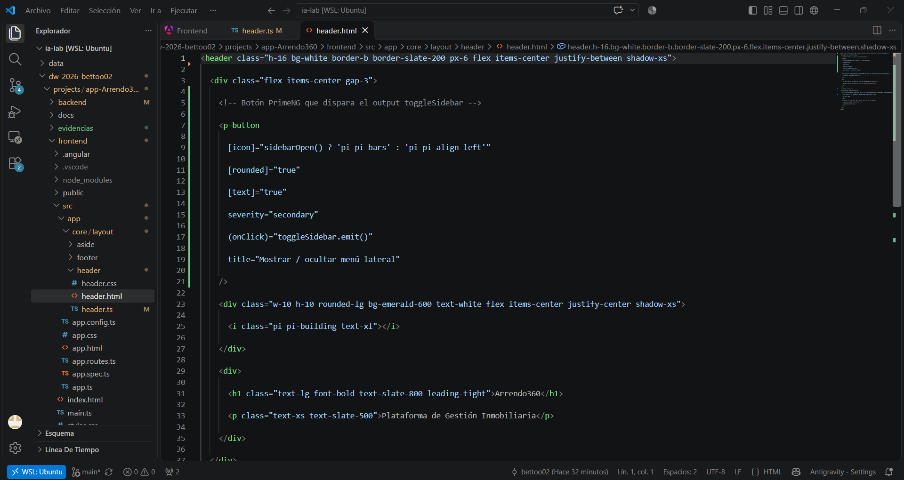

### **Paso 2: Convertir el `Aside` en un menú reactivo basado en datos (`aside.ts` y `aside.html`)**

1.   Abre `frontend/src/app/core/layout/aside/aside.ts` y define las secciones y enlaces del menú usando `signal()` y `RouterLink` / `RouterLinkActive`:

``` typescript
import { Component, signal } from '@angular/core';

import { RouterLink, RouterLinkActive } from '@angular/router';

export interface NavItem {

  label: string;

  icon: string;

  route: string;

}

export interface NavGroup {

  title: string;

  items: NavItem[];

}

@Component({

  selector: 'app-aside',

  imports: [RouterLink, RouterLinkActive],

  templateUrl: './aside.html',

  styleUrl: './aside.css',

})

export class Aside {

  protected readonly navGroups = signal<NavGroup[]>([

    {

      title: 'Principal',

      items: [

        { label: 'Dashboard', icon: 'pi pi-chart-bar', route: '/dashboard' },

      ],

    },

    {

      title: 'Gestión Inmobiliaria',

      items: [

        { label: 'Arrendatarios (Clientes)', icon: 'pi pi-users', route: '/clients' },

        { label: 'Propietarios', icon: 'pi pi-id-card', route: '/propietarios' },

        { label: 'Inmuebles', icon: 'pi pi-home', route: '/inmuebles' },

        { label: 'Contratos', icon: 'pi pi-file-edit', route: '/contratos' },

        { label: 'Cobros y Pagos', icon: 'pi pi-wallet', route: '/cobros' },

        { label: 'Liquidaciones', icon: 'pi pi-percentage', route: '/liquidaciones' },

        { label: 'Mantenimiento', icon: 'pi pi-wrench', route: '/mantenimiento' },

      ],

    },

    {

      title: 'Catálogo Comercial',

      items: [

        { label: 'Tipos de Producto', icon: 'pi pi-tags', route: '/product-types' },

        { label: 'Productos', icon: 'pi pi-box', route: '/products' },

        { label: 'Ventas', icon: 'pi pi-shopping-cart', route: '/sales' },

      ],

    },

  ]);

}
```

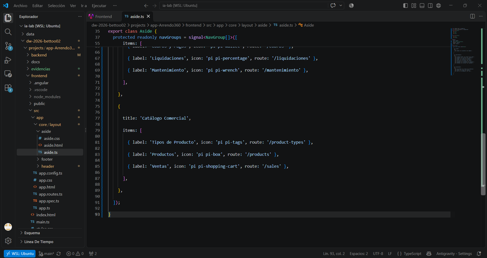

2.  Abre `frontend/src/app/core/layout/aside/aside.html` y usa el bloque moderno `@for` de Angular para renderizar los grupos y marcar en verde (`bg-emerald-600 text-white`) la ruta activa automáticamente:

``` html
<aside class="w-64 bg-slate-900 text-slate-200 h-full flex flex-col justify-between p-4 select-none shrink-0">

  <div class="space-y-6 overflow-y-auto">

    @for (group of navGroups(); track group.title) {

      <div>

        <p class="px-3 text-xs font-semibold uppercase tracking-wider text-slate-400 mb-2">

          {{ group.title }}

        </p>

        <ul class="space-y-1 text-sm">

          @for (item of group.items; track item.route) {

            <li>

              <a

                [routerLink]="item.route"

                routerLinkActive="bg-emerald-600 text-white font-medium shadow-xs"

                class="flex items-center gap-3 px-3 py-2 rounded-lg hover:bg-slate-800 text-slate-300 cursor-pointer transition-colors"

              >

                <i [class]="item.icon"></i>

                <span>{{ item.label }}</span>

              </a>

            </li>

          }

        </ul>

      </div>

    }

  </div>

  <div class="pt-4 border-t border-slate-800 text-xs text-slate-400 px-3">

    <p class="font-medium text-slate-300">Arrendo360 v1.0</p>

    <p>Universidad de La Guajira</p>

  </div>

</aside>
```

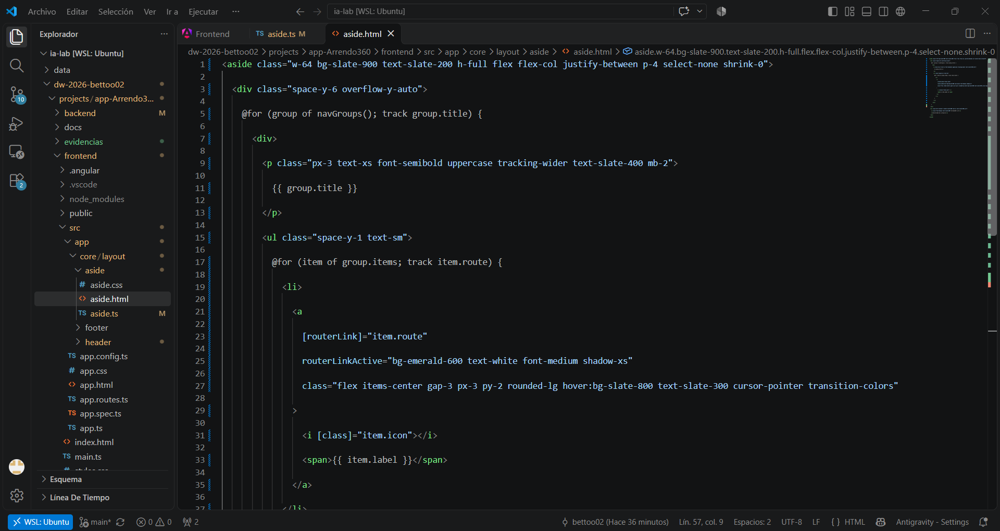

### **Paso 3: Conectar el estado `sidebarOpen` en `src/app/app.ts` y `src/app/app.html`**

1.   Abre `frontend/src/app/app.ts` y agrega el signal `sidebarOpen` junto con el método `onToggleSidebar()`:

``` typescript
import { Component, signal } from '@angular/core';

import { RouterOutlet } from '@angular/router';

import { Header } from './core/layout/header/header';

import { Aside } from './core/layout/aside/aside';

import { Footer } from './core/layout/footer/footer';

@Component({

  imports: [RouterOutlet, Header, Aside, Footer],

  selector: 'app-root',

  styleUrl: './app.css',

  templateUrl: './app.html',

})

export class App {

  protected readonly title = signal('Arrendo360');

  protected readonly sidebarOpen = signal(true);

  protected onToggleSidebar(): void {

    this.sidebarOpen.update((open) => !open);

  }

}
```

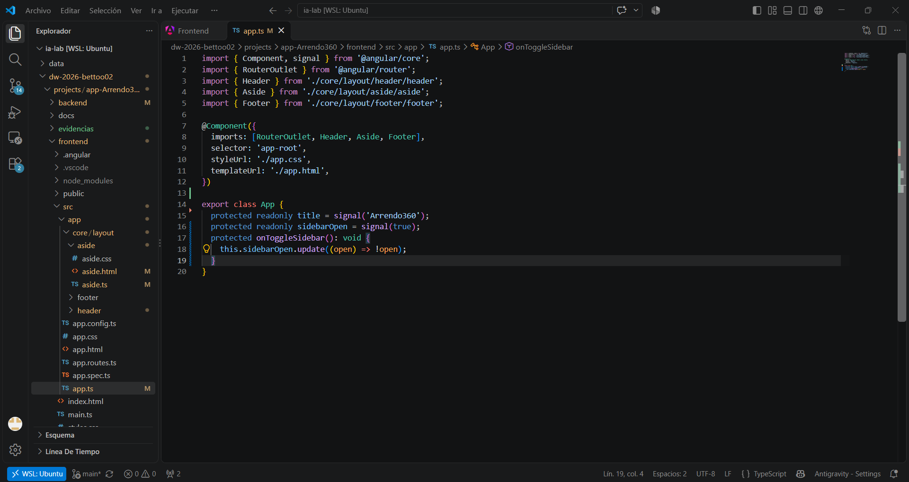

2.   Abre `frontend/src/app/app.html` y conecta `[sidebarOpen]` y `(toggleSidebar)` en `<app-header>`, y envuelve `<app-aside />` en un bloque `@if (sidebarOpen())`:

``` html
<div class="min-h-screen flex flex-col bg-slate-50 text-slate-800">

  <!-- Cabecera con input y output conectados -->

  <app-header

    [sidebarOpen]="sidebarOpen()"

    (toggleSidebar)="onToggleSidebar()"

  />

  <!-- Cuerpo principal -->

  <div class="flex flex-1 overflow-hidden">

    @if (sidebarOpen()) {

      <app-aside />

    }

    <main class="flex-1 p-6 overflow-y-auto">

      <div class="max-w-7xl mx-auto">

        <router-outlet />

      </div>

    </main>

  </div>

  <app-footer />

</div>
```

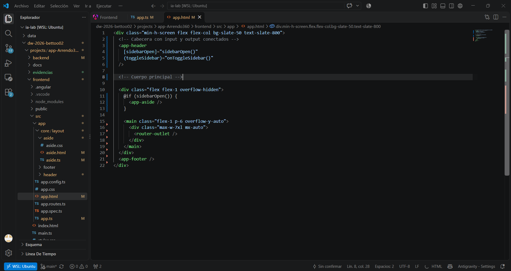

### **Paso 4: Configurar redirección inicial en `src/app/app.routes.ts`**

Para que al entrar a [`http://localhost:4200`](http://localhost:4200) no quede vacío el `<router-outlet />`, abre `frontend/src/app/app.routes.ts` y define la redirección por defecto a `/dashboard` (en el ISS-02 crearemos el layout/páginas y servicios):

``` typescript
import { Routes } from '@angular/router';

export const routes: Routes = [

  {

    path: '',

     pathMatch: 'full',

    redirectTo: 'dashboard',

  },

  {

    path: '**',

    redirectTo: 'dashboard',

  },

];
```

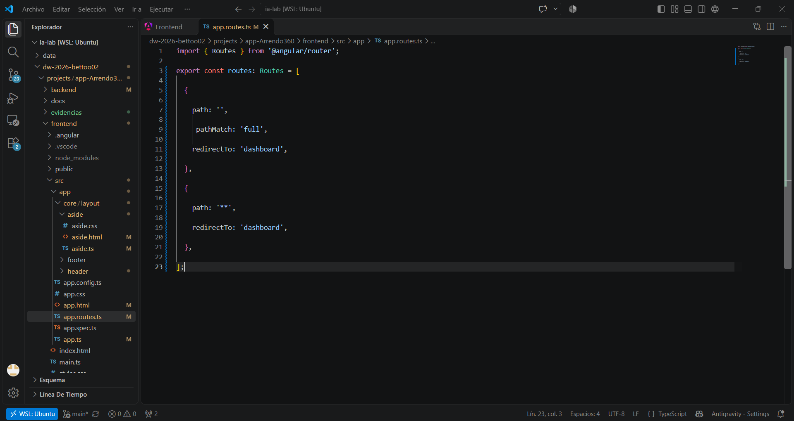

### **ISS-02 · Capa 2**

Sigue estos **6 pasos**:

#### **Paso 1: Generar los archivos de `environments`**

En tu terminal dentro de `frontend/`, ejecuta:

``` bash
npx ng g environments
```

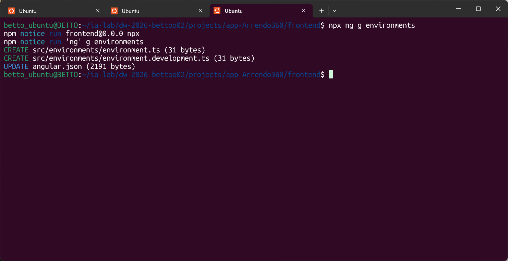

Esto creará `src/environments/environment.ts` y `src/environments/environment.development.ts`. Abre **ambos archivos** (`environment.ts` y `environment.development.ts`) y ponles este contenido apuntando al puerto `3002` de tu backend Arrendo360:

``` typescript
export const environment = {

  production: false,

  apiUrl: 'http://localhost:3002/api',

  appName: 'Arrendo360',

};
```

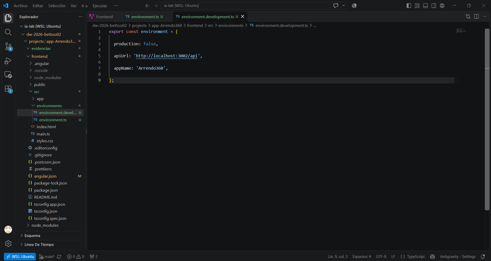

#### **Paso 2: Habilitar `provideHttpClient` en `src/app/app.config.ts`**

Abre `frontend/src/app/app.config.ts`, importa `provideHttpClient` y `withFetch` desde `@angular/common/http` y agrégalo al arreglo `providers`:

``` typescript
import { ApplicationConfig, provideZonelessChangeDetection } from '@angular/core';

import { provideRouter } from '@angular/router';

import { provideHttpClient, withFetch } from '@angular/common/http';

import { providePrimeNG } from 'primeng/config';

import Aura from '@primeuix/themes/aura';

import { routes } from './app.routes';

export const appConfig: ApplicationConfig = {

  providers: [

    provideZonelessChangeDetection(),

    provideRouter(routes),

    provideHttpClient(withFetch()),

    providePrimeNG({

      ripple: true,

      theme: {

        preset: Aura,

        options: {

          darkModeSelector: '.app-dark',

          cssLayer: {

            name: 'primeng',

            order: 'tailwind-base, primeng, tailwind-utilities',

          },

        },

      },

    }),

  ],

};
```

#### 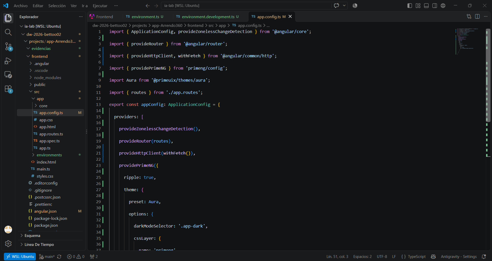

#### **Paso 3: Crear el modelo espejo del contrato REST (`src/app/core/models/api-response.model.ts`)**

Crea la carpeta `src/app/core/models/` y dentro el archivo `api-response.model.ts`:

``` typescript
/**

 * Espejo exacto de ResponseInterceptor del backend Arrendo360

 */

export interface ApiResponse<T> {

  statusCode: number;

  message: string;

  data: T;

  timestamp?: string;

}

/**

 * Estructura estándar para respuestas paginadas del backend

 */

export interface PaginatedResponse<T> {

  items?: T[];

  rows?: T[];

  total: number;

  page: number;

  limit: number;

}

export interface HealthStatus {

  status: string;

}
```

#### 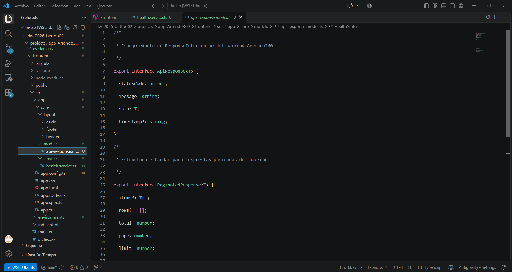

#### **Paso 4: Crear el servicio de verificación de salud (`src/app/core/services/health.service.ts`)**

Genera o crea el archivo `frontend/src/app/core/services/health.service.ts` para probar nuestro primer flujo `Service → HttpClient → API`:

``` typescript
import { Injectable, inject, signal } from '@angular/core';

import { HttpClient } from '@angular/common/http';

import { environment } from '../../../environments/environment';

import { ApiResponse, HealthStatus } from '../models/api-response.model';

@Injectable({

  providedIn: 'root',

})

export class HealthService {

  private readonly http = inject(HttpClient);

  private readonly apiUrl = `${environment.apiUrl}/health`;

  // Signals reactivos para saber si el backend en :3002 está en línea

  readonly isOnline = signal<boolean>(false);

  readonly checking = signal<boolean>(false);

  readonly lastChecked = signal<string | null>(null);

  checkHealth(): void {

    this.checking.set(true);

    this.http.get<ApiResponse<HealthStatus>>(this.apiUrl).subscribe({

      next: (res) => {

        this.isOnline.set(res?.data?.status === 'ok');

        this.lastChecked.set(res?.timestamp ?? new Date().toISOString());

        this.checking.set(false);

      },

      error: () => {

        this.isOnline.set(false);

        this.checking.set(false);

      },

    });

  }

}
```

#### 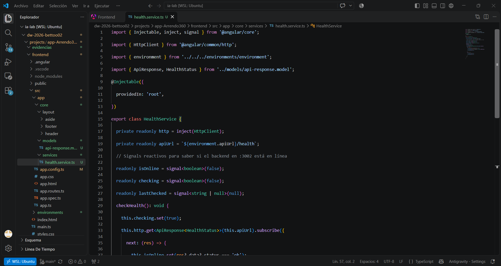

#### **Paso 5: Crear el componente `Dashboard` inicial para resolver las rutas**

Ejecuta en la terminal dentro de `frontend/`:

``` bash
npx ng g c features/dashboard/dashboard --skip-tests
```

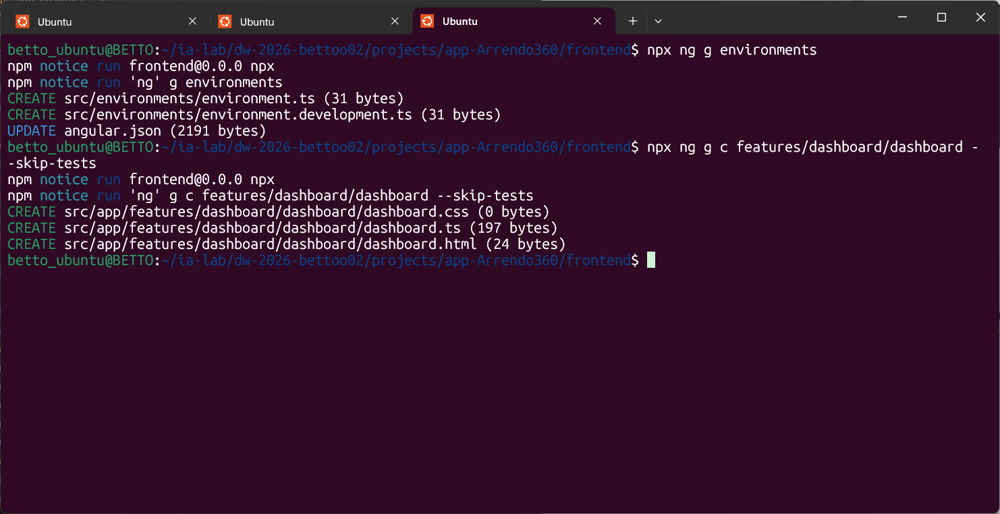

1.  Abre `frontend/src/app/features/dashboard/dashboard/dashboard.ts` (o `features/dashboard/dashboard.ts` según la ruta que cree el CLI) y conéctalo con `HealthService`:

``` typescript
import { Component, OnInit, inject } from '@angular/core';

import { ButtonModule } from 'primeng/button';

import { HealthService } from '../../core/services/health.service'; // Ajusta ../ según la profundidad de carpeta

@Component({

  selector: 'app-dashboard',

  imports: [ButtonModule],

  templateUrl: './dashboard.html',

  styleUrl: './dashboard.css',

})

export class Dashboard implements OnInit {

  protected readonly healthService = inject(HealthService);

  ngOnInit(): void {

    this.healthService.checkHealth();

  }

}
```

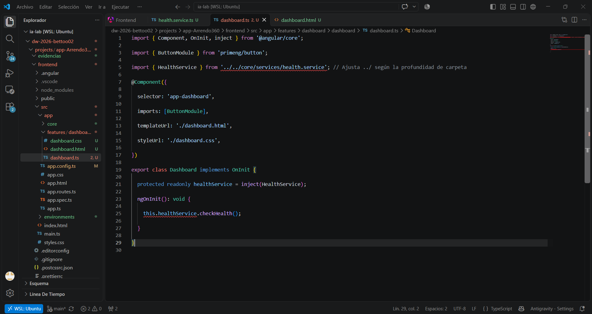

2.  Abre `dashboard.html` y muestra el estado en vivo de la conexión con el backend:

``` html
<div class="space-y-6">

  <div class="bg-white rounded-xl border border-slate-200 p-6 shadow-xs flex items-center justify-between">

    <div>

      <h2 class="text-xl font-bold text-slate-800">Panel Principal — Arrendo360</h2>

      <p class="text-sm text-slate-500 mt-1">

        ISS-02: Núcleo de servicios HTTP, environments y contrato ApiResponse conectados.

      </p>

    </div>

    <p-button

      label="Verificar API"

      icon="pi pi-refresh"

      severity="success"

      [loading]="healthService.checking()"

      (onClick)="healthService.checkHealth()"

    />

  </div>

  <!-- Tarjeta de estado de conexión con el Backend -->

  <div class="bg-white rounded-xl border border-slate-200 p-6 shadow-xs">

    <h3 class="text-sm font-semibold uppercase tracking-wider text-slate-400 mb-4">

      Estado de Conexión con Backend (:3002/api/health)

    </h3>

    <div class="flex items-center gap-3">

      @if (healthService.isOnline()) {

        <span class="inline-flex items-center gap-2 px-3 py-1.5 rounded-lg bg-emerald-50 text-emerald-700 font-medium text-sm border border-emerald-200">

          <i class="pi pi-check-circle text-emerald-600"></i>

          Backend Conectado (status: ok)

        </span>

      } @else {

        <span class="inline-flex items-center gap-2 px-3 py-1.5 rounded-lg bg-red-50 text-red-700 font-medium text-sm border border-red-200">

          <i class="pi pi-times-circle text-red-600"></i>

          Backend Desconectado (Verifica que el backend corra en puerto 3002)

        </span>

      }

    </div>

  </div>

</div>
```

#### 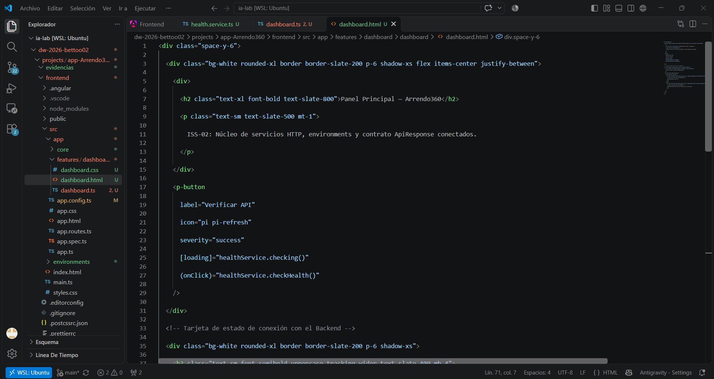

#### **Paso 6: Registrar la ruta `/dashboard` en `src/app/app.routes.ts`**

Abre `frontend/src/app/app.routes.ts` y agrega la ruta `'dashboard'` antes de las redirecciones:

``` typescript
import { Routes } from '@angular/router';

import { Dashboard } from './features/dashboard/dashboard'; // Ajusta si quedó en ./features/dashboard/dashboard/dashboard

export const routes: Routes = [

  {

    path: 'dashboard',

    component: Dashboard,

  },

  {

    path: '',

    pathMatch: 'full',

    redirectTo: 'dashboard',

  },

  {

    path: '**',

    redirectTo: 'dashboard',

  },

];
```

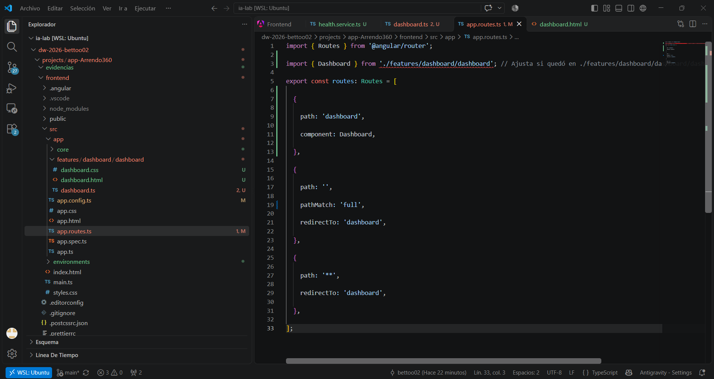

### **ISS-03 · Capa 2:** 

Vamos a construir este módulo en **4 piezas limpias**: `Model` → `Service` → `Component` → `Route`.

#### **Paso 1: Crear el modelo `src/app/features/clients/models/client.model.ts`**

Crea la carpeta `frontend/src/app/features/clients/models/` y dentro el archivo `client.model.ts` (espejo exacto de tu `ArrendatarioResponseDto` del backend):

``` typescript
export interface Client {

  id: number;

  tipoDocumento: string;

  numeroDocumento: string;

  nombre: string;

  telefono: string;

  email: string;

  isActive: boolean;

  createdAt?: string;

  updatedAt?: string;

}

export interface CreateClientDto {

  tipoDocumento: string;

  numeroDocumento: string;

  nombre: string;

  telefono?: string;

  email?: string;

}

export type UpdateClientDto = Partial<CreateClientDto> & {

  isActive?: boolean;

};
```

#### **Paso 2: Crear el servicio `src/app/features/clients/services/clients.service.ts`**

Crea la carpeta `frontend/src/app/features/clients/services/` y dentro el archivo `clients.service.ts`:

``` typescript
import { Injectable, inject, signal } from '@angular/core';

import { HttpClient, HttpHeaders } from '@angular/common/http';

import { Observable, tap } from 'rxjs';

import { environment } from '../../../../environments/environment';

import { ApiResponse, PaginatedResponse } from '../../../core/models/api-response.model';

import { Client, CreateClientDto, UpdateClientDto } from '../models/client.model';

@Injectable({

  providedIn: 'root',

})

export class ClientsService {

  private readonly http = inject(HttpClient);

  private readonly apiUrl = `${environment.apiUrl}/clients`;

  // Header de rol para operaciones de escritura en Fase I (antes de JWT en ISS-08)

  private readonly headers = new HttpHeaders({ 'x-user-role': 'ADMIN' });

  // Estado reactivo con Signals

  readonly clients = signal<Client[]>([]);

  readonly total = signal<number>(0);

  readonly loading = signal<boolean>(false);

  loadClients(): void {

    this.loading.set(true);

    this.http

      .get<ApiResponse<PaginatedResponse<Client>>>(`${this.apiUrl}?limit=100`)

      .subscribe({

        next: (res) => {

          const list = res.data?.items ?? res.data?.rows ?? [];

          this.clients.set(list);

          this.total.set(res.data?.total ?? list.length);

          this.loading.set(false);

        },

        error: () => {

          this.loading.set(false);

        },

      });

  }

  create(dto: CreateClientDto): Observable<ApiResponse<Client>> {

    return this.http

      .post<ApiResponse<Client>>(this.apiUrl, dto, { headers: this.headers })

      .pipe(tap(() => this.loadClients()));

  }

  update(id: number, dto: UpdateClientDto): Observable<ApiResponse<Client>> {

    return this.http

      .patch<ApiResponse<Client>>(`${this.apiUrl}/${id}`, dto, { headers: this.headers })

      .pipe(tap(() => this.loadClients()));

  }

  toggleStatus(client: Client): Observable<ApiResponse<Client>> {

    const action = client.isActive ? 'deactivate' : 'activate';

    return this.http

      .patch<ApiResponse<Client>>(

        `${this.apiUrl}/${client.id}/${action}`,

        {},

        { headers: this.headers },

      )

      .pipe(tap(() => this.loadClients()));

  }

}
```

#### **Paso 3: Crear el componente de página `ClientsPage`**

En tu terminal dentro de `frontend/`, genera el componente con `--flat` para que no te cree carpetas repetidas:

``` bash
npx ng g c features/clients/pages/clients-page --flat --skip-tests
```

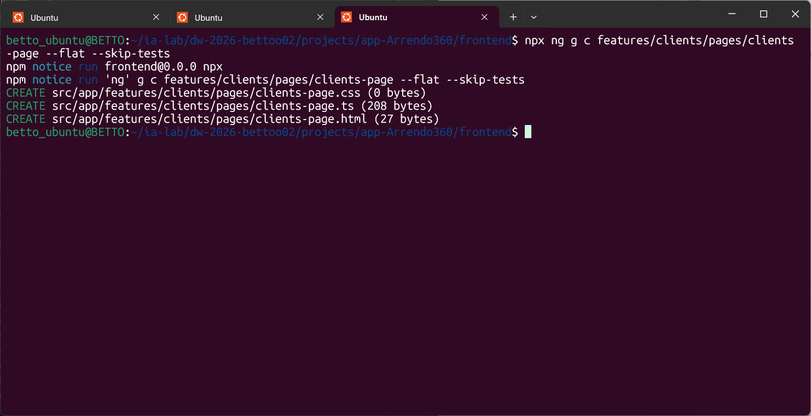

1.  Abre `frontend/src/app/features/clients/pages/clients-page.ts` y escribe la lógica del listado, diálogo modal de creación/edición con **ReactiveForms** y cambio de estado:

``` typescript
import { Component, OnInit, inject, signal } from '@angular/core';

import { FormBuilder, ReactiveFormsModule, Validators } from '@angular/forms';

import { TableModule } from 'primeng/table';

import { ButtonModule } from 'primeng/button';

import { DialogModule } from 'primeng/dialog';

import { InputTextModule } from 'primeng/inputtext';

import { SelectModule } from 'primeng/select';

import { TagModule } from 'primeng/tag';

import { ClientsService } from '../services/clients.service';

import { Client } from '../models/client.model';

@Component({

  selector: 'app-clients-page',

  imports: [

    ReactiveFormsModule,

    TableModule,

    ButtonModule,

    DialogModule,

    InputTextModule,

    SelectModule,

    TagModule,

  ],

  templateUrl: './clients-page.html',

  styleUrl: './clients-page.css',

})

export class ClientsPage implements OnInit {

  protected readonly clientsService = inject(ClientsService);

  private readonly fb = inject(FormBuilder);

  protected readonly dialogVisible = signal(false);

  protected readonly editingClient = signal<Client | null>(null);

  protected readonly saving = signal(false);

  protected readonly errorMsg = signal<string | null>(null);

  protected readonly documentTypes = [

    { label: 'Cédula de Ciudadanía (CC)', value: 'CC' },

    { label: 'Cédula de Extranjería (CE)', value: 'CE' },

    { label: 'NIT', value: 'NIT' },

    { label: 'Pasaporte (PAS)', value: 'PAS' },

  ];

  protected readonly form = this.fb.nonNullable.group({

    tipoDocumento: ['CC', [Validators.required]],

    numeroDocumento: ['', [Validators.required, Validators.minLength(5)]],

    nombre: ['', [Validators.required, Validators.minLength(3)]],

    telefono: [''],

    email: ['', [Validators.email]],

  });

  ngOnInit(): void {

    this.clientsService.loadClients();

  }

  protected openNew(): void {

    this.editingClient.set(null);

    this.errorMsg.set(null);

    this.form.reset({

      tipoDocumento: 'CC',

      numeroDocumento: '',

      nombre: '',

      telefono: '',

      email: '',

    });

    this.dialogVisible.set(true);

  }

  protected openEdit(client: Client): void {

    this.editingClient.set(client);

    this.errorMsg.set(null);

    this.form.reset({

      tipoDocumento: client.tipoDocumento,

      numeroDocumento: client.numeroDocumento,

      nombre: client.nombre,

      telefono: client.telefono ?? '',

      email: client.email ?? '',

    });

    this.dialogVisible.set(true);

  }

  protected save(): void {

    if (this.form.invalid) {

      this.form.markAllAsTouched();

      return;

    }

    this.saving.set(true);

    this.errorMsg.set(null);

    const payload = this.form.getRawValue();

    const current = this.editingClient();

    const request$ = current

      ? this.clientsService.update(current.id, payload)

      : this.clientsService.create(payload);

    request$.subscribe({

      next: () => {

        this.saving.set(false);

        this.dialogVisible.set(false);

      },

      error: (err) => {

        this.saving.set(false);

        this.errorMsg.set(

          err?.error?.message ?? 'Error al guardar el arrendatario/cliente.',

        );

      },

    });

  }

  protected onToggleStatus(client: Client): void {

    this.clientsService.toggleStatus(client).subscribe();

  }

}
```

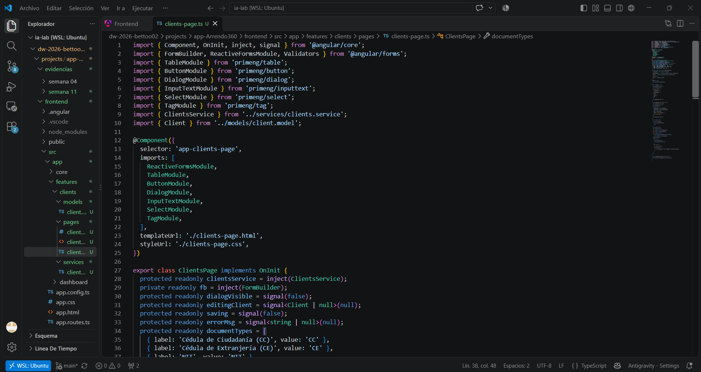

2.   Abre `frontend/src/app/features/clients/pages/clients-page.html` y maqueta la tabla `<p-table>` y el modal `<p-dialog>` de PrimeNG:

``` html
<div class="space-y-6">

  <!-- Encabezado de página -->

  <div class="bg-white rounded-xl border border-slate-200 p-6 shadow-xs flex items-center justify-between">

    <div>

      <h2 class="text-xl font-bold text-slate-800">Arrendatarios (Clientes)</h2>

      <p class="text-sm text-slate-500 mt-1">

        ISS-03: Gestión de clientes titulares de contratos de arrendamiento (/api/clients)

      </p>

    </div>

    <div class="flex items-center gap-2">

      <p-button

        label="Recargar"

        icon="pi pi-refresh"

        severity="secondary"

        [outlined]="true"

        (onClick)="clientsService.loadClients()"

      />

      <p-button

        label="Nuevo Arrendatario"

        icon="pi pi-plus"

        severity="success"

        (onClick)="openNew()"

      />

    </div>

  </div>

  <!-- Tabla PrimeNG -->

  <div class="bg-white rounded-xl border border-slate-200 p-4 shadow-xs">

    <p-table

      [value]="clientsService.clients()"

      [loading]="clientsService.loading()"

      [paginator]="true"

      [rows]="10"

      [rowHover]="true"

      dataKey="id"

    >

      <ng-template #header>

        <tr>

          <th>ID</th>

          <th>Documento</th>

          <th>Nombre Completo</th>

          <th>Teléfono</th>

          <th>Correo Electrónico</th>

          <th>Estado</th>

          <th class="text-right">Acciones</th>

        </tr>

      </ng-template>

      <ng-template #body let-client>

        <tr>

          <td class="font-mono text-xs text-slate-500">#{{ client.id }}</td>

          <td>

            <span class="font-semibold text-slate-700">{{ client.tipoDocumento }}</span>

            {{ client.numeroDocumento }}

          </td>

          <td class="font-medium text-slate-800">{{ client.nombre }}</td>

          <td>{{ client.telefono || '—' }}</td>

          <td>{{ client.email || '—' }}</td>

          <td>

            <p-tag

              [value]="client.isActive ? 'Activo' : 'Inactivo'"

              [severity]="client.isActive ? 'success' : 'danger'"

            />

          </td>

          <td class="text-right space-x-1">

            <p-button

              icon="pi pi-pencil"

              [rounded]="true"

              [text]="true"

              severity="info"

              title="Editar"

              (onClick)="openEdit(client)"

            />

            <p-button

              [icon]="client.isActive ? 'pi pi-ban' : 'pi pi-check'"

              [rounded]="true"

              [text]="true"

              [severity]="client.isActive ? 'danger' : 'success'"

              [title]="client.isActive ? 'Desactivar' : 'Reactivar'"

              (onClick)="onToggleStatus(client)"

            />

          </td>

        </tr>

      </ng-template>

      <ng-template #emptymessage>

        <tr>

          <td colspan="7" class="text-center py-8 text-slate-500">

            No hay arrendatarios registrados aún.

          </td>

        </tr>

      </ng-template>

    </p-table>

  </div>

  <!-- Modal Crear / Editar -->

  <p-dialog

    [header]="editingClient() ? 'Editar Arrendatario' : 'Nuevo Arrendatario'"

    [visible]="dialogVisible()"

    (visibleChange)="dialogVisible.set($event)"

    [modal]="true"

    [style]="{ width: '32rem' }"

  >

    <form [formGroup]="form" (ngSubmit)="save()" class="space-y-4 pt-2">

      @if (errorMsg()) {

        <div class="p-3 rounded-lg bg-red-50 border border-red-200 text-red-700 text-sm">

          {{ errorMsg() }}

        </div>

      }

      <div class="grid grid-cols-2 gap-4">

        <div class="flex flex-col gap-1">

          <label class="text-xs font-semibold text-slate-600">Tipo Documento *</label>

          <p-select

            formControlName="tipoDocumento"

            [options]="documentTypes"

            optionLabel="label"

            optionValue="value"

            appendTo="body"

          />

        </div>

        <div class="flex flex-col gap-1">

          <label class="text-xs font-semibold text-slate-600">Número Documento *</label>

          <input pInputText formControlName="numeroDocumento" placeholder="Ej. 1098765432" />

        </div>

      </div>

      <div class="flex flex-col gap-1">

        <label class="text-xs font-semibold text-slate-600">Nombre Completo *</label>

        <input pInputText formControlName="nombre" placeholder="Ej. María Fernanda Gómez" />

      </div>

      <div class="grid grid-cols-2 gap-4">

        <div class="flex flex-col gap-1">

          <label class="text-xs font-semibold text-slate-600">Teléfono</label>

          <input pInputText formControlName="telefono" placeholder="Ej. +57 300 123 4567" />

        </div>

        <div class="flex flex-col gap-1">

          <label class="text-xs font-semibold text-slate-600">Correo Electrónico</label>

          <input pInputText formControlName="email" placeholder="correo@ejemplo.com" />

        </div>

      </div>

      <div class="flex justify-end gap-2 pt-4 border-t border-slate-200">

        <p-button

          label="Cancelar"

          severity="secondary"

          [text]="true"

          (onClick)="dialogVisible.set(false)"

        />

        <p-button

          label="Guardar"

          icon="pi pi-check"

          severity="success"

          type="submit"

          [loading]="saving()"

        />

      </div>

    </form>

  </p-dialog>

</div>
```

#### 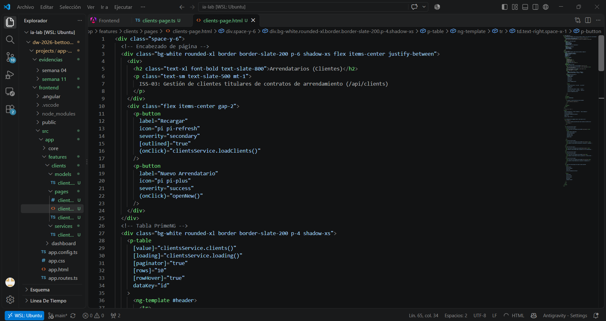

#### **Paso 4: Registrar la ruta `/clients` en `src/app/app.routes.ts`**

Abre `frontend/src/app/app.routes.ts` y añade la ruta `'clients'`:

``` typescript
import { Routes } from '@angular/router';

import { Dashboard } from './features/dashboard/dashboard/dashboard';

import { ClientsPage } from './features/clients/pages/clients-page';

export const routes: Routes = [

  {

    path: 'dashboard',

    component: Dashboard,

  },

  {

    path: 'clients',

    component: ClientsPage,

  },

  {

    path: '',

    pathMatch: 'full',

    redirectTo: 'dashboard',

  },

  {

    path: '**',

    redirectTo: 'dashboard',

  },

];
```

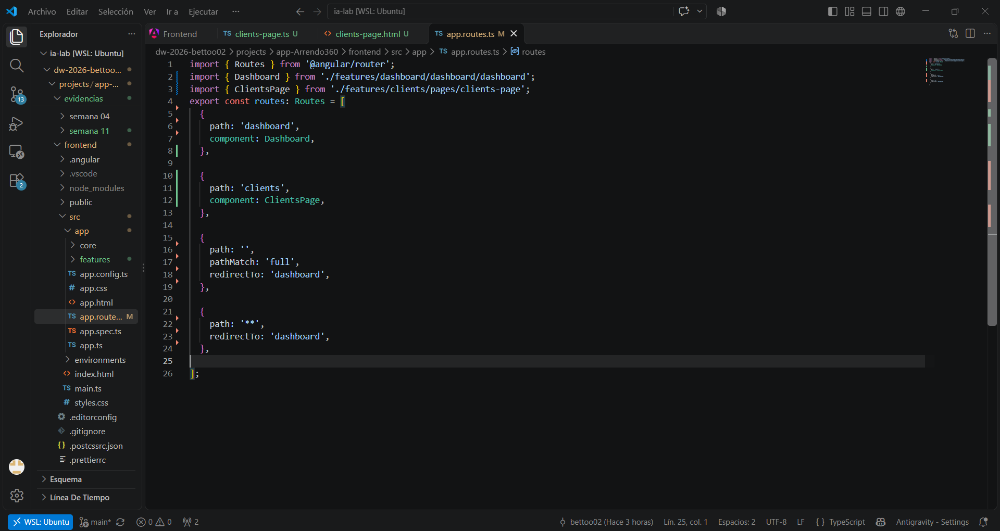

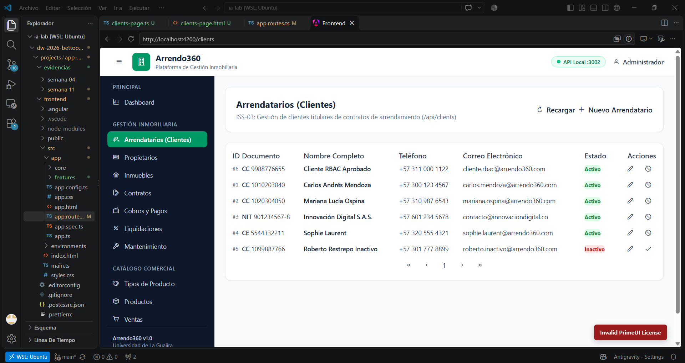

### **ISS-04 · Capa 2**

Hagamos primero el módulo de **Tipos de Producto / Inmueble (`/api/product-types`)** y enseguida el de **Propietarios (`/api/propietarios`)**.

#### **Parte A: Módulo `ProductTypes` (`/api/product-types`)**

##### **Paso 1: Crear el modelo `src/app/features/product-types/models/product-type.model.ts`**

Crea la carpeta `frontend/src/app/features/product-types/models/` y dentro el archivo `product-type.model.ts`:

``` typescript
export interface ProductType {

  id: number;

  name: string;

  description: string | null;

  status: 'active' | 'inactive';

  createdAt?: string;

  updatedAt?: string;

}

export interface CreateProductTypeDto {

  name: string;

  description?: string | null;

}

export type UpdateProductTypeDto = Partial<CreateProductTypeDto> & {

  status?: 'active' | 'inactive';

};
```

##### 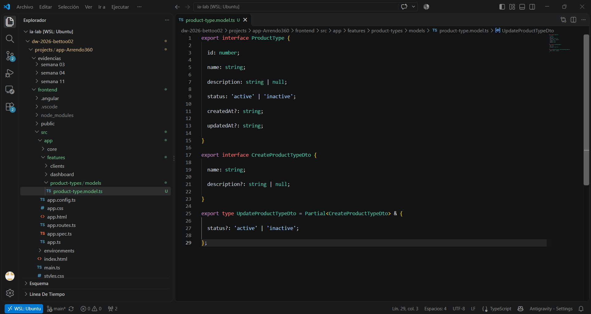

##### **Paso 2: Crear el servicio `src/app/features/product-types/services/product-types.service.ts`**

Crea la carpeta `frontend/src/app/features/product-types/services/` y dentro el archivo `product-types.service.ts`:

``` typescript
import { Injectable, inject, signal } from '@angular/core';

import { HttpClient } from '@angular/common/http';

import { Observable, tap } from 'rxjs';

import { environment } from '../../../../environments/environment';

import { ApiResponse, PaginatedResponse } from '../../../core/models/api-response.model';

import {

  CreateProductTypeDto,

  ProductType,

  UpdateProductTypeDto,

} from '../models/product-type.model';

@Injectable({

  providedIn: 'root',

})

export class ProductTypesService {

  private readonly http = inject(HttpClient);

  private readonly apiUrl = `${environment.apiUrl}/product-types`;

  readonly productTypes = signal<ProductType[]>([]);

  readonly loading = signal<boolean>(false);

  loadProductTypes(): void {

    this.loading.set(true);

    this.http

      .get<ApiResponse<PaginatedResponse<ProductType> | ProductType[]>>(

        `${this.apiUrl}?limit=100`,

      )

      .subscribe({

        next: (res) => {

          const data = res.data;

          const list = Array.isArray(data)

            ? data

            : (data?.items ?? data?.rows ?? []);

          this.productTypes.set(list);

          this.loading.set(false);

        },

        error: () => {

          this.loading.set(false);

        },

      });

  }

  create(dto: CreateProductTypeDto): Observable<ApiResponse<ProductType>> {

    return this.http

      .post<ApiResponse<ProductType>>(this.apiUrl, dto)

      .pipe(tap(() => this.loadProductTypes()));

  }

  update(id: number, dto: UpdateProductTypeDto): Observable<ApiResponse<ProductType>> {

    return this.http

      .patch<ApiResponse<ProductType>>(`${this.apiUrl}/${id}`, dto)

      .pipe(tap(() => this.loadProductTypes()));

  }

  toggleStatus(item: ProductType): Observable<ApiResponse<ProductType>> {

    const action = item.status === 'active' ? 'deactivate' : 'activate';

    return this.http

      .patch<ApiResponse<ProductType>>(`${this.apiUrl}/${item.id}/${action}`, {})

      .pipe(tap(() => this.loadProductTypes()));

  }

}
```

##### 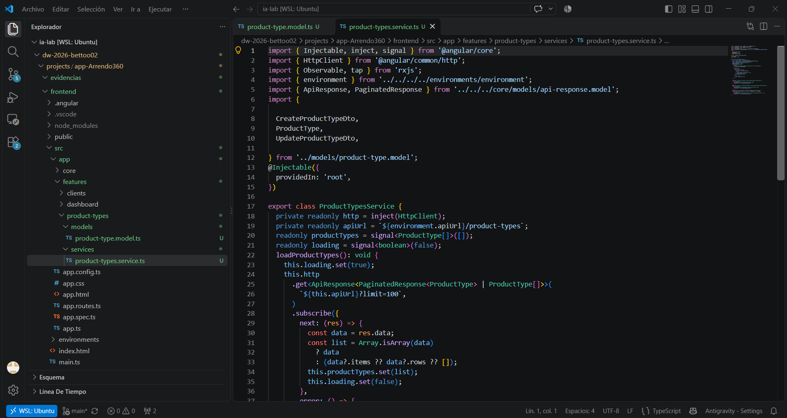

##### **Paso 3: Generar el componente `ProductTypesPage`**

En tu terminal dentro de `frontend/`, ejecuta:

``` bash
npx ng g c features/product-types/pages/product-types-page --flat --skip-tests
```

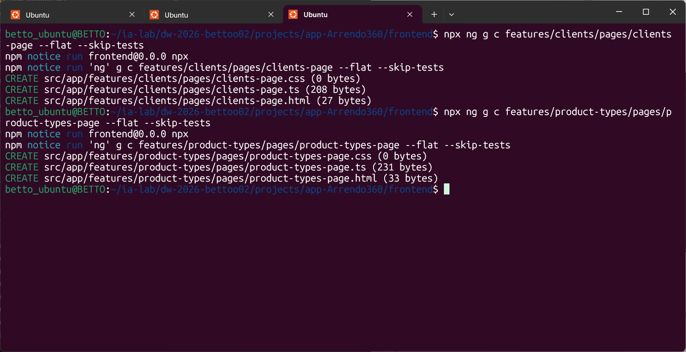

1.  Abre `frontend/src/app/features/product-types/pages/product-types-page.ts` y coloca su lógica:

``` typescript
import { Component, OnInit, inject, signal } from '@angular/core';

import { FormBuilder, ReactiveFormsModule, Validators } from '@angular/forms';

import { TableModule } from 'primeng/table';

import { ButtonModule } from 'primeng/button';

import { DialogModule } from 'primeng/dialog';

import { InputTextModule } from 'primeng/inputtext';

import { TextareaModule } from 'primeng/textarea';

import { TagModule } from 'primeng/tag';

import { ProductTypesService } from '../services/product-types.service';

import { ProductType } from '../models/product-type.model';

@Component({

  selector: 'app-product-types-page',

  imports: [

    ReactiveFormsModule,

    TableModule,

    ButtonModule,

    DialogModule,

    InputTextModule,

    TextareaModule,

    TagModule,

  ],

  templateUrl: './product-types-page.html',

  styleUrl: './product-types-page.css',

})

export class ProductTypesPage implements OnInit {

  protected readonly productTypesService = inject(ProductTypesService);

  private readonly fb = inject(FormBuilder);

  protected readonly dialogVisible = signal(false);

  protected readonly editingItem = signal<ProductType | null>(null);

  protected readonly saving = signal(false);

  protected readonly errorMsg = signal<string | null>(null);

  protected readonly form = this.fb.nonNullable.group({

    name: ['', [Validators.required, Validators.minLength(3)]],

    description: [''],

  });

  ngOnInit(): void {

    this.productTypesService.loadProductTypes();

  }

  protected openNew(): void {

    this.editingItem.set(null);

    this.errorMsg.set(null);

    this.form.reset({ name: '', description: '' });

    this.dialogVisible.set(true);

  }

  protected openEdit(item: ProductType): void {

    this.editingItem.set(item);

    this.errorMsg.set(null);

    this.form.reset({

      name: item.name,

      description: item.description ?? '',

    });

    this.dialogVisible.set(true);

  }

  protected save(): void {

    if (this.form.invalid) {

      this.form.markAllAsTouched();

      return;

    }

    this.saving.set(true);

    this.errorMsg.set(null);

    const payload = this.form.getRawValue();

    const current = this.editingItem();

    const request$ = current

      ? this.productTypesService.update(current.id, payload)

      : this.productTypesService.create(payload);

    request$.subscribe({

      next: () => {

        this.saving.set(false);

        this.dialogVisible.set(false);

      },

      error: (err) => {

        this.saving.set(false);

        this.errorMsg.set(

          err?.error?.message ?? 'Error al guardar el tipo de producto/inmueble.',

        );

      },

    });

  }

  protected onToggleStatus(item: ProductType): void {

    this.productTypesService.toggleStatus(item).subscribe();

  }

}
```

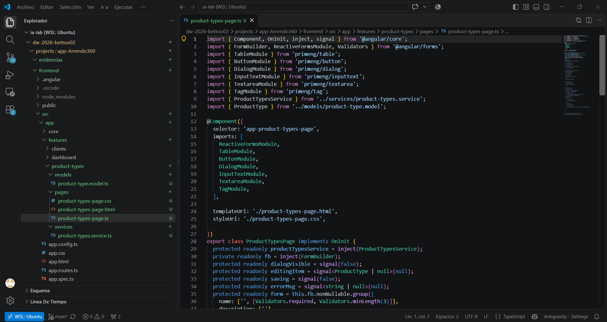

2.  Abre `frontend/src/app/features/product-types/pages/product-types-page.html` y escribe su plantilla:

``` html
<div class="space-y-6">

  <div class="bg-white rounded-xl border border-slate-200 p-6 shadow-xs flex items-center justify-between">

    <div>

      <h2 class="text-xl font-bold text-slate-800">Tipos de Producto / Categorías Inmobiliarias</h2>

      <p class="text-sm text-slate-500 mt-1">

        ISS-04: Catálogo maestro de clasificación (/api/product-types)

      </p>

    </div>

    <div class="flex items-center gap-2">

      <p-button

        label="Recargar"

        icon="pi pi-refresh"

        severity="secondary"

        [outlined]="true"

        (onClick)="productTypesService.loadProductTypes()"

      />

      <p-button

        label="Nuevo Tipo"

        icon="pi pi-plus"

        severity="success"

        (onClick)="openNew()"

      />

    </div>

  </div>

  <div class="bg-white rounded-xl border border-slate-200 p-4 shadow-xs">

    <p-table

      [value]="productTypesService.productTypes()"

      [loading]="productTypesService.loading()"

      [paginator]="true"

      [rows]="10"

      [rowHover]="true"

      dataKey="id"

    >

      <ng-template #header>

        <tr>

          <th style="width: 5rem">ID</th>

          <th>Nombre de Categoría</th>

          <th>Descripción</th>

          <th style="width: 8rem">Estado</th>

          <th style="width: 8rem" class="text-right">Acciones</th>

        </tr>

      </ng-template>

      <ng-template #body let-item>

        <tr>

          <td class="font-mono text-xs text-slate-500">#{{ item.id }}</td>

          <td class="font-semibold text-slate-800">{{ item.name }}</td>

          <td class="text-slate-600">{{ item.description || 'Sin descripción' }}</td>

          <td>

            <p-tag

              [value]="item.status === 'active' ? 'Activo' : 'Inactivo'"

              [severity]="item.status === 'active' ? 'success' : 'danger'"

            />

          </td>

          <td class="text-right space-x-1">

            <p-button

              icon="pi pi-pencil"

              [rounded]="true"

              [text]="true"

              severity="info"

              title="Editar"

              (onClick)="openEdit(item)"

            />

            <p-button

              [icon]="item.status === 'active' ? 'pi pi-ban' : 'pi pi-check'"

              [rounded]="true"

              [text]="true"

              [severity]="item.status === 'active' ? 'danger' : 'success'"

              [title]="item.status === 'active' ? 'Desactivar' : 'Reactivar'"

              (onClick)="onToggleStatus(item)"

            />

          </td>

        </tr>

      </ng-template>

      <ng-template #emptymessage>

        <tr>

          <td colspan="5" class="text-center py-8 text-slate-500">

            No hay tipos de producto registrados aún.

          </td>

        </tr>

      </ng-template>

    </p-table>

  </div>

  <p-dialog

    [header]="editingItem() ? 'Editar Tipo de Producto' : 'Nuevo Tipo de Producto'"

    [visible]="dialogVisible()"

    (visibleChange)="dialogVisible.set($event)"

    [modal]="true"

    [style]="{ width: '30rem' }"

  >

    <form [formGroup]="form" (ngSubmit)="save()" class="space-y-4 pt-2">

      @if (errorMsg()) {

        <div class="p-3 rounded-lg bg-red-50 border border-red-200 text-red-700 text-sm">

          {{ errorMsg() }}

        </div>

      }

      <div class="flex flex-col gap-1">

        <label class="text-xs font-semibold text-slate-600">Nombre *</label>

        <input pInputText formControlName="name" placeholder="Ej. Apartamento Residencial" />

      </div>

      <div class="flex flex-col gap-1">

        <label class="text-xs font-semibold text-slate-600">Descripción</label>

        <textarea

          pTextarea

          formControlName="description"

          rows="3"

          placeholder="Descripción opcional de la categoría..."

        ></textarea>

      </div>

      <div class="flex justify-end gap-2 pt-4 border-t border-slate-200">

        <p-button

          label="Cancelar"

          severity="secondary"

          [text]="true"

          (onClick)="dialogVisible.set(false)"

        />

        <p-button

          label="Guardar"

          icon="pi pi-check"

          severity="success"

          type="submit"

          [loading]="saving()"

        />

      </div>

    </form>

  </p-dialog>

</div>
```

#### 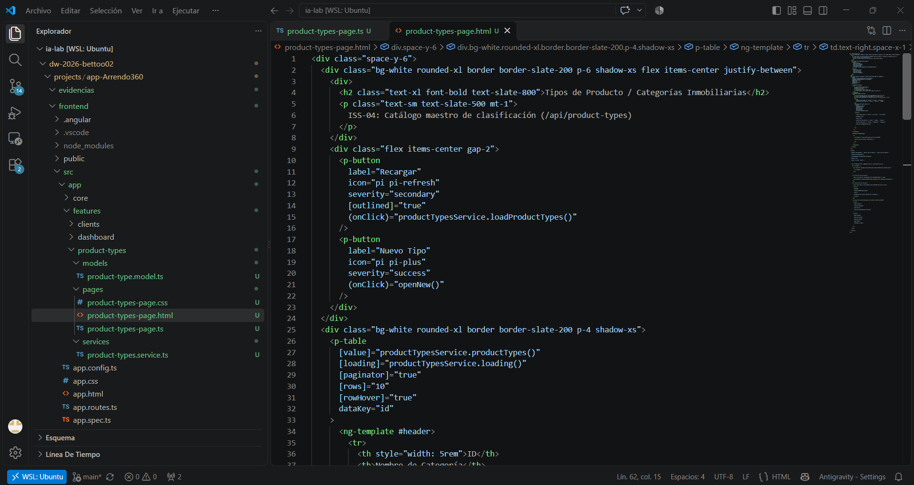

#### **Parte B: Módulo `Propietarios` (`/api/propietarios`) — Necesario para crear Inmuebles en el ISS-05**

Como en **Arrendo360** todo inmueble pertenece a un **Propietario**, creemos de una vez su servicio y página (tiene exactamente los mismos campos que `Client`: `tipoDocumento`, `numeroDocumento`, `nombre`, `telefono`, `email`, `isActive`).

##### **Paso 4: Crear modelo y servicio de Propietarios**

1.  Crea `frontend/src/app/features/propietarios/models/propietario.model.ts`:

``` typescript
export interface Propietario {

  id: number;

  tipoDocumento: string;

  numeroDocumento: string;

  nombre: string;

  telefono: string;

  email: string;

  isActive: boolean;

  createdAt?: string;

  updatedAt?: string;

}

export interface CreatePropietarioDto {

  tipoDocumento: string;

  numeroDocumento: string;

  nombre: string;

  telefono?: string;

  email?: string;

}

export type UpdatePropietarioDto = Partial<CreatePropietarioDto> & {

  isActive?: boolean;

};
```

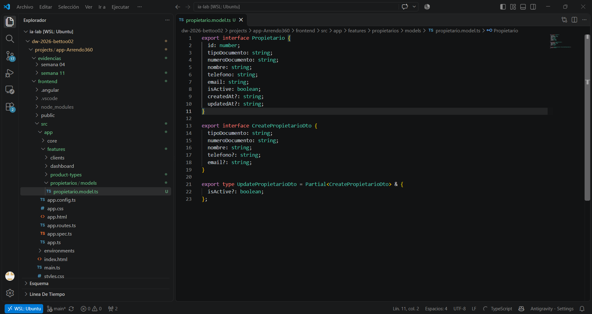

2.  Crea `frontend/src/app/features/propietarios/services/propietarios.service.ts`:

``` typescript
import { Injectable, inject, signal } from '@angular/core';

import { HttpClient, HttpHeaders } from '@angular/common/http';

import { Observable, tap } from 'rxjs';

import { environment } from '../../../../environments/environment';

import { ApiResponse, PaginatedResponse } from '../../../core/models/api-response.model';

import {

  CreatePropietarioDto,

  Propietario,

  UpdatePropietarioDto,

} from '../models/propietario.model';

@Injectable({

  providedIn: 'root',

})

export class PropietariosService {

  private readonly http = inject(HttpClient);

  private readonly apiUrl = `${environment.apiUrl}/propietarios`;

  private readonly headers = new HttpHeaders({ 'x-user-role': 'ADMIN' });

  readonly propietarios = signal<Propietario[]>([]);

  readonly loading = signal<boolean>(false);

  loadPropietarios(): void {

    this.loading.set(true);

    this.http

      .get<ApiResponse<PaginatedResponse<Propietario>>>(`${this.apiUrl}?limit=100`)

      .subscribe({

        next: (res) => {

          const list = res.data?.items ?? res.data?.rows ?? [];

          this.propietarios.set(list);

          this.loading.set(false);

        },

        error: () => {

          this.loading.set(false);

        },

      });

  }

  create(dto: CreatePropietarioDto): Observable<ApiResponse<Propietario>> {

    return this.http

      .post<ApiResponse<Propietario>>(this.apiUrl, dto, { headers: this.headers })

      .pipe(tap(() => this.loadPropietarios()));

  }

  update(id: number, dto: UpdatePropietarioDto): Observable<ApiResponse<Propietario>> {

    return this.http

      .patch<ApiResponse<Propietario>>(`${this.apiUrl}/${id}`, dto, { headers: this.headers })

      .pipe(tap(() => this.loadPropietarios()));

  }

}
```

##### 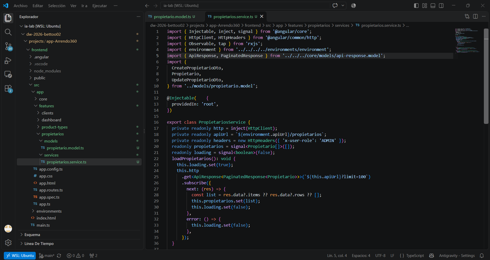

##### **Paso 5: Generar el componente `PropietariosPage`**

En tu terminal dentro de `frontend/`:

``` bash
npx ng g c features/propietarios/pages/propietarios-page --flat --skip-tests
```

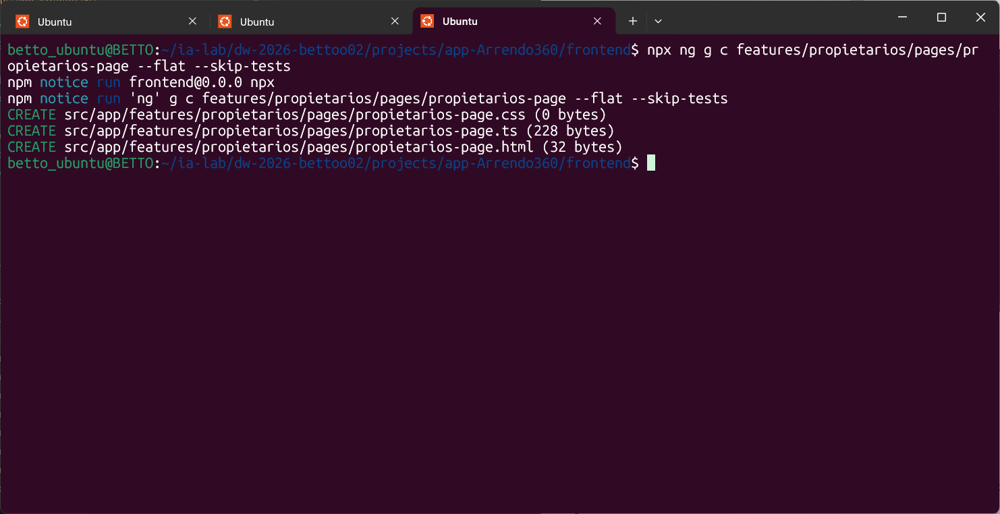

1.  En `frontend/src/app/features/propietarios/pages/propietarios-page.ts`:

``` typescript
import { Component, OnInit, inject, signal } from '@angular/core';

import { FormBuilder, ReactiveFormsModule, Validators } from '@angular/forms';

import { TableModule } from 'primeng/table';

import { ButtonModule } from 'primeng/button';

import { DialogModule } from 'primeng/dialog';

import { InputTextModule } from 'primeng/inputtext';

import { SelectModule } from 'primeng/select';

import { TagModule } from 'primeng/tag';

import { PropietariosService } from '../services/propietarios.service';

import { Propietario } from '../models/propietario.model';

@Component({

  selector: 'app-propietarios-page',

  imports: [

    ReactiveFormsModule,

    TableModule,

    ButtonModule,

    DialogModule,

    InputTextModule,

    SelectModule,

    TagModule,

  ],

  templateUrl: './propietarios-page.html',

  styleUrl: './propietarios-page.css',

})

export class PropietariosPage implements OnInit {

  protected readonly propietariosService = inject(PropietariosService);

  private readonly fb = inject(FormBuilder);

  protected readonly dialogVisible = signal(false);

  protected readonly editingItem = signal<Propietario | null>(null);

  protected readonly saving = signal(false);

  protected readonly errorMsg = signal<string | null>(null);

  protected readonly documentTypes = [

    { label: 'Cédula de Ciudadanía (CC)', value: 'CC' },

    { label: 'Cédula de Extranjería (CE)', value: 'CE' },

    { label: 'NIT', value: 'NIT' },

  ];

  protected readonly form = this.fb.nonNullable.group({

    tipoDocumento: ['CC', [Validators.required]],

    numeroDocumento: ['', [Validators.required, Validators.minLength(5)]],

    nombre: ['', [Validators.required, Validators.minLength(3)]],

    telefono: [''],

    email: ['', [Validators.email]],

  });

  ngOnInit(): void {

    this.propietariosService.loadPropietarios();

  }

  protected openNew(): void {

    this.editingItem.set(null);

    this.errorMsg.set(null);

    this.form.reset({

      tipoDocumento: 'CC',

      numeroDocumento: '',

      nombre: '',

      telefono: '',

      email: '',

    });

    this.dialogVisible.set(true);

  }

  protected openEdit(item: Propietario): void {

    this.editingItem.set(item);

    this.errorMsg.set(null);

    this.form.reset({

      tipoDocumento: item.tipoDocumento,

      numeroDocumento: item.numeroDocumento,

      nombre: item.nombre,

      telefono: item.telefono ?? '',

      email: item.email ?? '',

    });

    this.dialogVisible.set(true);

  }

  protected save(): void {

    if (this.form.invalid) {

      this.form.markAllAsTouched();

      return;

    }

    this.saving.set(true);

    this.errorMsg.set(null);

    const payload = this.form.getRawValue();

    const current = this.editingItem();

    const request$ = current

      ? this.propietariosService.update(current.id, payload)

      : this.propietariosService.create(payload);

    request$.subscribe({

      next: () => {

        this.saving.set(false);

        this.dialogVisible.set(false);

      },

      error: (err) => {

        this.saving.set(false);

        this.errorMsg.set(err?.error?.message ?? 'Error al guardar el propietario.');

      },

    });

  }

}
```

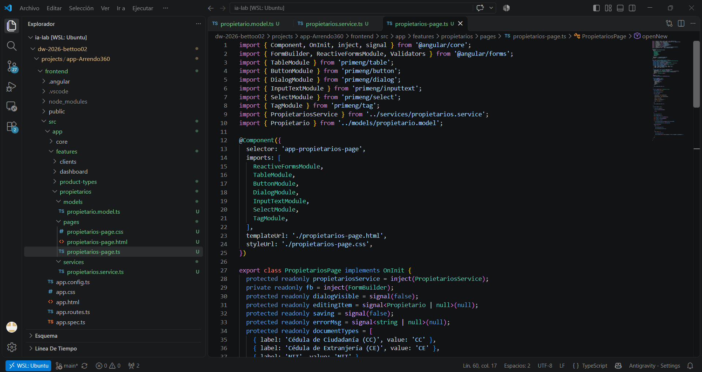

2.  En `frontend/src/app/features/propietarios/pages/propietarios-page.html`:

``` html
<div class="space-y-6">

  <div class="bg-white rounded-xl border border-slate-200 p-6 shadow-xs flex items-center justify-between">

    <div>

      <h2 class="text-xl font-bold text-slate-800">Propietarios de Inmuebles</h2>

      <p class="text-sm text-slate-500 mt-1">

        ISS-04: Gestión de titulares de inmuebles para dispersión de pagos (/api/propietarios)

      </p>

    </div>

    <div class="flex items-center gap-2">

      <p-button

        label="Recargar"

        icon="pi pi-refresh"

        severity="secondary"

        [outlined]="true"

        (onClick)="propietariosService.loadPropietarios()"

      />

      <p-button

        label="Nuevo Propietario"

        icon="pi pi-plus"

        severity="success"

        (onClick)="openNew()"

      />

    </div>

  </div>

  <div class="bg-white rounded-xl border border-slate-200 p-4 shadow-xs">

    <p-table

      [value]="propietariosService.propietarios()"

      [loading]="propietariosService.loading()"

      [paginator]="true"

      [rows]="10"

      [rowHover]="true"

      dataKey="id"

    >

      <ng-template #header>

        <tr>

          <th>ID</th>

          <th>Documento</th>

          <th>Nombre Completo</th>

          <th>Teléfono</th>

          <th>Correo Electrónico</th>

          <th>Estado</th>

          <th class="text-right">Acciones</th>

        </tr>

      </ng-template>

      <ng-template #body let-item>

        <tr>

          <td class="font-mono text-xs text-slate-500">#{{ item.id }}</td>

          <td>

            <span class="font-semibold text-slate-700">{{ item.tipoDocumento }}</span>

            {{ item.numeroDocumento }}

          </td>

          <td class="font-medium text-slate-800">{{ item.nombre }}</td>

          <td>{{ item.telefono || '—' }}</td>

          <td>{{ item.email || '—' }}</td>

          <td>

            <p-tag

              [value]="item.isActive ? 'Activo' : 'Inactivo'"

              [severity]="item.isActive ? 'success' : 'danger'"

            />

          </td>

          <td class="text-right">

            <p-button

              icon="pi pi-pencil"

              [rounded]="true"

              [text]="true"

              severity="info"

              title="Editar"

              (onClick)="openEdit(item)"

            />

          </td>

        </tr>

      </ng-template>

    </p-table>

  </div>

  <p-dialog

    [header]="editingItem() ? 'Editar Propietario' : 'Nuevo Propietario'"

    [visible]="dialogVisible()"

    (visibleChange)="dialogVisible.set($event)"

    [modal]="true"

    [style]="{ width: '32rem' }"

  >

    <form [formGroup]="form" (ngSubmit)="save()" class="space-y-4 pt-2">

      @if (errorMsg()) {

        <div class="p-3 rounded-lg bg-red-50 border border-red-200 text-red-700 text-sm">

          {{ errorMsg() }}

        </div>

      }

      <div class="grid grid-cols-2 gap-4">

        <div class="flex flex-col gap-1">

          <label class="text-xs font-semibold text-slate-600">Tipo Documento *</label>

          <p-select

            formControlName="tipoDocumento"

            [options]="documentTypes"

            optionLabel="label"

            optionValue="value"

            appendTo="body"

          />

        </div>

        <div class="flex flex-col gap-1">

          <label class="text-xs font-semibold text-slate-600">Número Documento *</label>

          <input pInputText formControlName="numeroDocumento" placeholder="Ej. 1020304050" />

        </div>

      </div>

      <div class="flex flex-col gap-1">

        <label class="text-xs font-semibold text-slate-600">Nombre Completo *</label>

        <input pInputText formControlName="nombre" placeholder="Ej. Carlos Rodríguez" />

      </div>

      <div class="grid grid-cols-2 gap-4">

        <div class="flex flex-col gap-1">

          <label class="text-xs font-semibold text-slate-600">Teléfono</label>

          <input pInputText formControlName="telefono" placeholder="Ej. +57 300 123 4567" />

        </div>

        <div class="flex flex-col gap-1">

          <label class="text-xs font-semibold text-slate-600">Correo Electrónico</label>

          <input pInputText formControlName="email" placeholder="carlos@ejemplo.com" />

        </div>

      </div>

      <div class="flex justify-end gap-2 pt-4 border-t border-slate-200">

        <p-button

          label="Cancelar"

          severity="secondary"

          [text]="true"

          (onClick)="dialogVisible.set(false)"

        />

        <p-button

          label="Guardar"

          icon="pi pi-check"

          severity="success"

          type="submit"

          [loading]="saving()"

        />

      </div>

    </form>

  </p-dialog>

</div>
```

#### 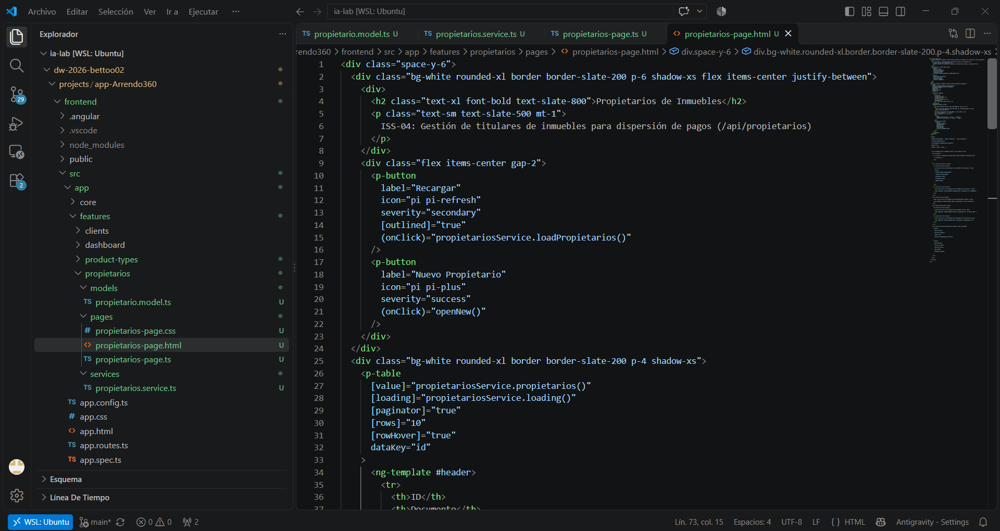

#### **Paso 6: Registrar ambas rutas en `src/app/app.routes.ts`**

Abre `frontend/src/app/app.routes.ts` y agrega `'product-types'` y `'propietarios'`:

``` typescript
import { Routes } from '@angular/router';

import { Dashboard } from './features/dashboard/dashboard/dashboard';

import { ClientsPage } from './features/clients/pages/clients-page';

import { ProductTypesPage } from './features/product-types/pages/product-types-page';

import { PropietariosPage } from './features/propietarios/pages/propietarios-page';

export const routes: Routes = [

  {

    path: 'dashboard',

    component: Dashboard,

  },

  {

    path: 'clients',

    component: ClientsPage,

  },

  {

    path: 'propietarios',

    component: PropietariosPage,

  },

  {

    path: 'product-types',

    component: ProductTypesPage,

  },

  {

    path: '',

    pathMatch: 'full',

    redirectTo: 'dashboard',

  },

  {

    path: '**',

    redirectTo: 'dashboard',

  },

];
```

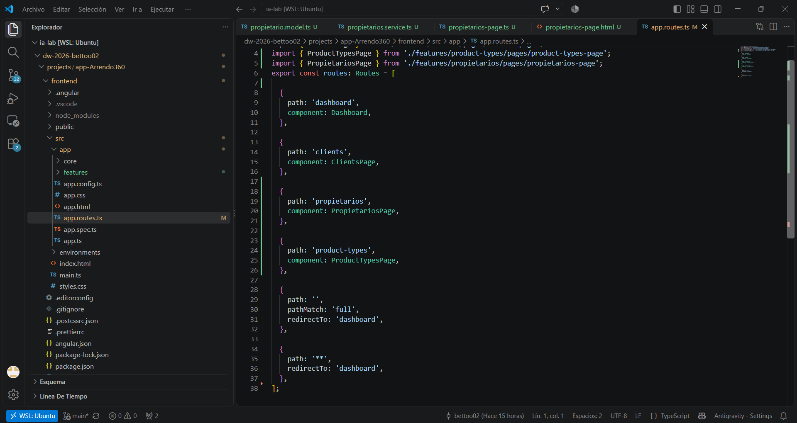

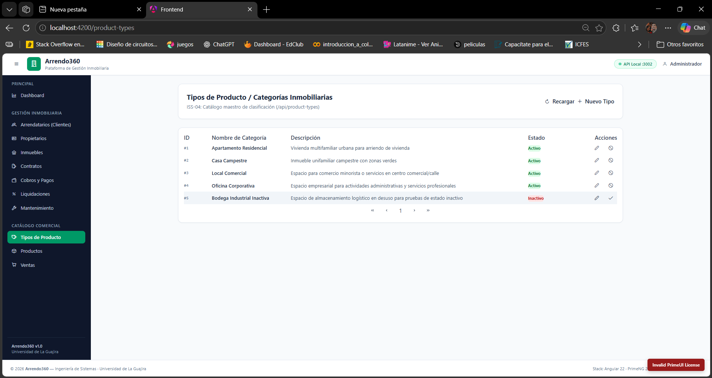

**PROPETARIOS**

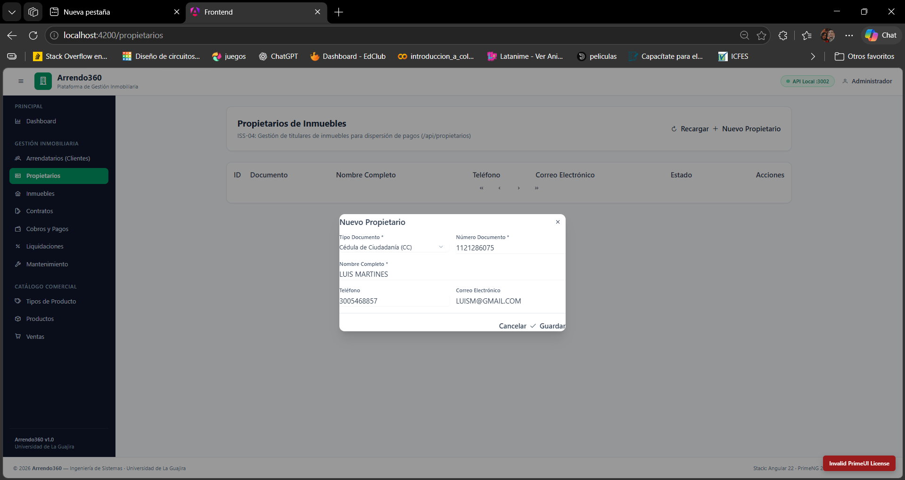

### **ISS-05 · Capa 2**

Construyamos las dos pantallas de este hito: **Inmuebles (`/api/inmuebles`)** y **Productos (`/api/products`)**.

#### **Parte A: Módulo `Inmuebles` (`/api/inmuebles`) vinculado a `Propietarios`**

##### **Paso 1: Crear el modelo `src/app/features/inmuebles/models/inmueble.model.ts`**

Crea la carpeta `frontend/src/app/features/inmuebles/models/` y dentro el archivo `inmueble.model.ts` (espejo de `InmuebleResponseDto`):

``` typescript
export interface Inmueble {

  id: number;

  propietarioId: number;

  nombre: string;

  descripcion: string;

  isActive: boolean;

  createdAt?: string;

  updatedAt?: string;

}

export interface CreateInmuebleDto {

  propietarioId: number;

  nombre: string;

  descripcion?: string;

}

export type UpdateInmuebleDto = Partial<CreateInmuebleDto> & {

  isActive?: boolean;

};
```

##### 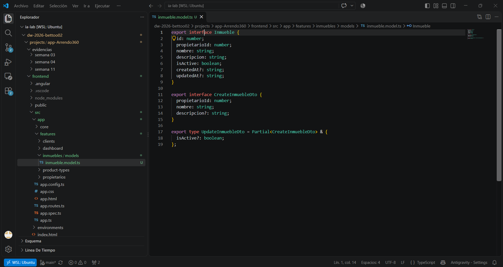

##### **Paso 2: Crear el servicio `src/app/features/inmuebles/services/inmuebles.service.ts`**

Crea `frontend/src/app/features/inmuebles/services/inmuebles.service.ts`:

``` typescript
import { Injectable, inject, signal } from '@angular/core';

import { HttpClient, HttpHeaders } from '@angular/common/http';

import { Observable, tap } from 'rxjs';

import { environment } from '../../../../environments/environment';

import { ApiResponse, PaginatedResponse } from '../../../core/models/api-response.model';

import { CreateInmuebleDto, Inmueble, UpdateInmuebleDto } from '../models/inmueble.model';

@Injectable({

  providedIn: 'root',

})

export class InmueblesService {

  private readonly http = inject(HttpClient);

  private readonly apiUrl = `${environment.apiUrl}/inmuebles`;

  private readonly headers = new HttpHeaders({ 'x-user-role': 'ADMIN' });

  readonly inmuebles = signal<Inmueble[]>([]);

  readonly loading = signal<boolean>(false);

  loadInmuebles(): void {

    this.loading.set(true);

    this.http

      .get<ApiResponse<PaginatedResponse<Inmueble>>>(`${this.apiUrl}?limit=100`)

      .subscribe({

        next: (res) => {

          const list = res.data?.items ?? res.data?.rows ?? [];

          this.inmuebles.set(list);

          this.loading.set(false);

        },

        error: () => {

          this.loading.set(false);

        },

      });

  }

  create(dto: CreateInmuebleDto): Observable<ApiResponse<Inmueble>> {

    return this.http

      .post<ApiResponse<Inmueble>>(this.apiUrl, dto, { headers: this.headers })

      .pipe(tap(() => this.loadInmuebles()));

  }

  update(id: number, dto: UpdateInmuebleDto): Observable<ApiResponse<Inmueble>> {

    return this.http

      .patch<ApiResponse<Inmueble>>(`${this.apiUrl}/${id}`, dto, { headers: this.headers })

      .pipe(tap(() => this.loadInmuebles()));

  }

}
```

##### 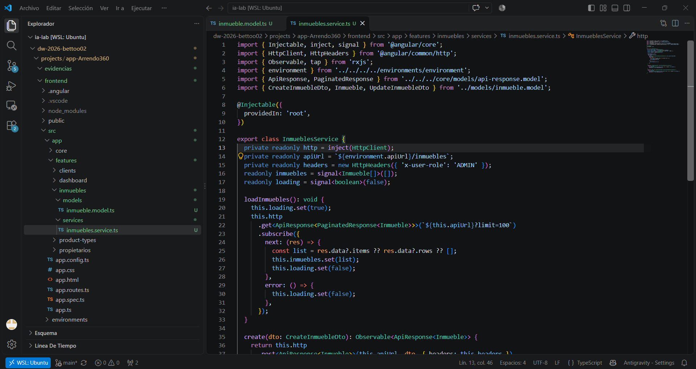

##### **Paso 3: Generar el componente `InmueblesPage`**

En tu terminal dentro de `frontend/`:

``` bash
npx ng g c features/inmuebles/pages/inmuebles-page --flat --skip-tests
```

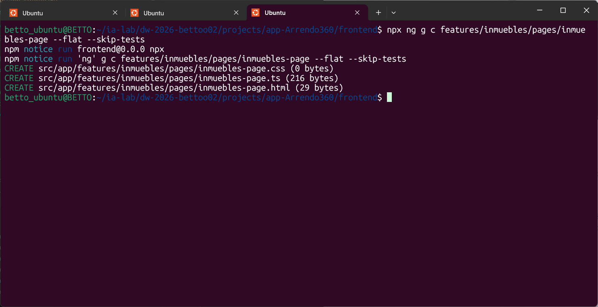

1.  En `frontend/src/app/features/inmuebles/pages/inmuebles-page.ts`, inyectamos tanto `InmueblesService` como `PropietariosService` para poblar el selector `<p-select>` y resolver el nombre del propietario:

``` typescript
import { Component, OnInit, inject, signal } from '@angular/core';

import { FormBuilder, ReactiveFormsModule, Validators } from '@angular/forms';

import { TableModule } from 'primeng/table';

import { ButtonModule } from 'primeng/button';

import { DialogModule } from 'primeng/dialog';

import { InputTextModule } from 'primeng/inputtext';

import { TextareaModule } from 'primeng/textarea';

import { SelectModule } from 'primeng/select';

import { TagModule } from 'primeng/tag';

import { InmueblesService } from '../services/inmuebles.service';

import { PropietariosService } from '../../propietarios/services/propietarios.service';

import { Inmueble } from '../models/inmueble.model';

@Component({

  selector: 'app-inmuebles-page',

  imports: [

    ReactiveFormsModule,

    TableModule,

    ButtonModule,

    DialogModule,

    InputTextModule,

    TextareaModule,

    SelectModule,

    TagModule,

  ],

  templateUrl: './inmuebles-page.html',

  styleUrl: './inmuebles-page.css',

})

export class InmueblesPage implements OnInit {

  protected readonly inmueblesService = inject(InmueblesService);

  protected readonly propietariosService = inject(PropietariosService);

  private readonly fb = inject(FormBuilder);

  protected readonly dialogVisible = signal(false);

  protected readonly editingItem = signal<Inmueble | null>(null);

  protected readonly saving = signal(false);

  protected readonly errorMsg = signal<string | null>(null);

  protected readonly form = this.fb.nonNullable.group({

    propietarioId: [0, [Validators.required, Validators.min(1)]],

    nombre: ['', [Validators.required, Validators.minLength(3)]],

    descripcion: [''],

  });

  ngOnInit(): void {

    this.inmueblesService.loadInmuebles();

    this.propietariosService.loadPropietarios();

  }

  protected getPropietarioNombre(propietarioId: number): string {

    const found = this.propietariosService

      .propietarios()

      .find((p) => p.id === propietarioId);

    return found ? `${found.nombre} (${found.numeroDocumento})` : `ID #${propietarioId}`;

  }

  protected openNew(): void {

    this.editingItem.set(null);

    this.errorMsg.set(null);

    const firstOwner = this.propietariosService.propietarios()[0]?.id ?? 0;

    this.form.reset({

      propietarioId: firstOwner,

      nombre: '',

      descripcion: '',

    });

    this.dialogVisible.set(true);

  }

  protected openEdit(item: Inmueble): void {

    this.editingItem.set(item);

    this.errorMsg.set(null);

    this.form.reset({

      propietarioId: item.propietarioId,

      nombre: item.nombre,

      descripcion: item.descripcion ?? '',

    });

    this.dialogVisible.set(true);

  }

  protected save(): void {

    if (this.form.invalid) {

      this.form.markAllAsTouched();

      return;

    }

    this.saving.set(true);

    this.errorMsg.set(null);

    const payload = this.form.getRawValue();

    const current = this.editingItem();

    const request$ = current

      ? this.inmueblesService.update(current.id, payload)

      : this.inmueblesService.create(payload);

    request$.subscribe({

      next: () => {

        this.saving.set(false);

        this.dialogVisible.set(false);

      },

      error: (err) => {

        this.saving.set(false);

        this.errorMsg.set(err?.error?.message ?? 'Error al guardar el inmueble.');

      },

    });

  }

}
```

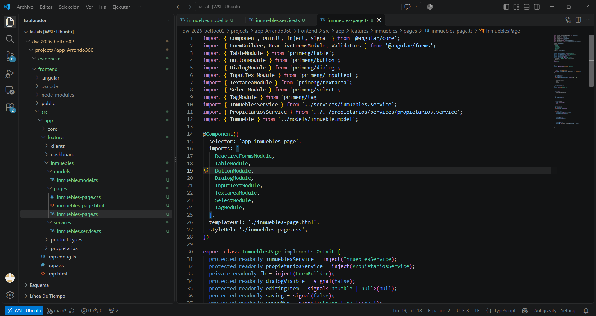

2.  En `frontend/src/app/features/inmuebles/pages/inmuebles-page.html`:

``` html
<div class="space-y-6">

  <div class="bg-white rounded-xl border border-slate-200 p-6 shadow-xs flex items-center justify-between">

    <div>

      <h2 class="text-xl font-bold text-slate-800">Catálogo de Inmuebles</h2>

      <p class="text-sm text-slate-500 mt-1">

        ISS-05: Propiedades registradas y vinculadas a su Propietario titular (/api/inmuebles)

      </p>

    </div>

    <div class="flex items-center gap-2">

      <p-button

        label="Recargar"

        icon="pi pi-refresh"

        severity="secondary"

        [outlined]="true"

        (onClick)="inmueblesService.loadInmuebles()"

      />

      <p-button

        label="Nuevo Inmueble"

        icon="pi pi-plus"

        severity="success"

        (onClick)="openNew()"

      />

    </div>

  </div>

  <div class="bg-white rounded-xl border border-slate-200 p-4 shadow-xs">

    <p-table

      [value]="inmueblesService.inmuebles()"

      [loading]="inmueblesService.loading()"

      [paginator]="true"

      [rows]="10"

      [rowHover]="true"

      dataKey="id"

    >

      <ng-template #header>

        <tr>

          <th style="width: 5rem">ID</th>

          <th>Inmueble</th>

          <th>Descripción</th>

          <th>Propietario Titular</th>

          <th>Estado</th>

          <th class="text-right">Acciones</th>

        </tr>

      </ng-template>

      <ng-template #body let-item>

        <tr>

          <td class="font-mono text-xs text-slate-500">#{{ item.id }}</td>

          <td class="font-semibold text-slate-800">{{ item.nombre }}</td>

          <td class="text-slate-600 text-sm">{{ item.descripcion || '—' }}</td>

          <td>

            <span class="inline-flex items-center gap-1.5 px-2.5 py-1 rounded-md bg-slate-100 text-slate-700 text-xs font-medium">

              <i class="pi pi-id-card text-slate-500"></i>

              {{ getPropietarioNombre(item.propietarioId) }}

            </span>

          </td>

          <td>

            <p-tag

              [value]="item.isActive ? 'Disponible / Activo' : 'Inactivo'"

              [severity]="item.isActive ? 'success' : 'danger'"

            />

          </td>

          <td class="text-right">

            <p-button

              icon="pi pi-pencil"

              [rounded]="true"

              [text]="true"

              severity="info"

              title="Editar"

              (onClick)="openEdit(item)"

            />

          </td>

        </tr>

      </ng-template>

      <ng-template #emptymessage>

        <tr>

          <td colspan="6" class="text-center py-8 text-slate-500">

            No hay inmuebles registrados aún.

          </td>

        </tr>

      </ng-template>

    </p-table>

  </div>

  <p-dialog

    [header]="editingItem() ? 'Editar Inmueble' : 'Nuevo Inmueble'"

    [visible]="dialogVisible()"

    (visibleChange)="dialogVisible.set($event)"

    [modal]="true"

    [style]="{ width: '32rem' }"

  >

    <form [formGroup]="form" (ngSubmit)="save()" class="space-y-4 pt-2">

      @if (errorMsg()) {

        <div class="p-3 rounded-lg bg-red-50 border border-red-200 text-red-700 text-sm">

          {{ errorMsg() }}

        </div>

      }

      <div class="flex flex-col gap-1">

        <label class="text-xs font-semibold text-slate-600">Propietario Titular *</label>

        <p-select

          formControlName="propietarioId"

          [options]="propietariosService.propietarios()"

          optionLabel="nombre"

          optionValue="id"

          placeholder="Seleccione un propietario"

          appendTo="body"

        />

      </div>

      <div class="flex flex-col gap-1">

        <label class="text-xs font-semibold text-slate-600">Nombre / Identificador del Inmueble *</label>

        <input pInputText formControlName="nombre" placeholder="Ej. Apartamento 302 Edificio Los Sauces" />

      </div>

      <div class="flex flex-col gap-1">

        <label class="text-xs font-semibold text-slate-600">Descripción y Características</label>

        <textarea

          pTextarea

          formControlName="descripcion"

          rows="3"

          placeholder="Ej. 3 habitaciones, 2 baños, parqueadero privado..."

        ></textarea>

      </div>

      <div class="flex justify-end gap-2 pt-4 border-t border-slate-200">

        <p-button

          label="Cancelar"

          severity="secondary"

          [text]="true"

          (onClick)="dialogVisible.set(false)"

        />

        <p-button

          label="Guardar"

          icon="pi pi-check"

          severity="success"

          type="submit"

          [loading]="saving()"

        />

      </div>

    </form>

  </p-dialog>

</div>
```

#### 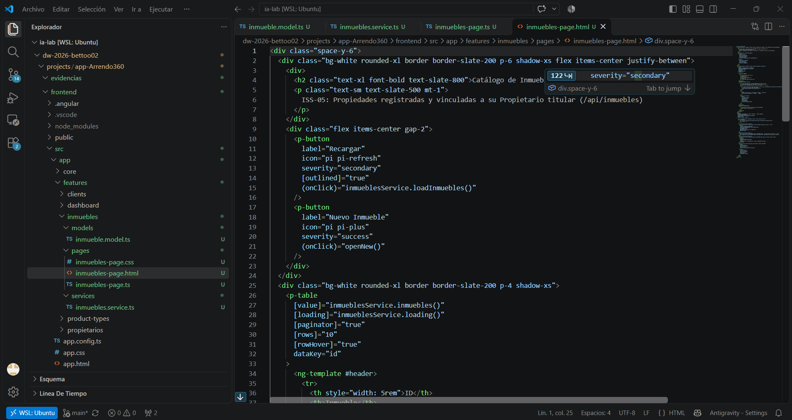

#### **Parte B: Módulo `Products` (`/api/products`) vinculado a `ProductTypes`**

Fíjate en un detalle muy interesante de tu `products.controller.ts`: Cuando haces `GET /api/products`, el backend devuelve `{ products: [...], total, page, limit }` dentro de `res.data`. ¡Lo contemplaremos en el servicio!

##### **Paso 4: Crear el modelo `src/app/features/products/models/product.model.ts`**

Crea `frontend/src/app/features/products/models/product.model.ts`:

``` typescript
import { ProductType } from '../../product-types/models/product-type.model';

export interface Product {

  id: number;

  name: string;

  brand: string;

  price: number;

  min_stock: number;

  quantity: number;

  product_type_id: number;

  status: 'active' | 'inactive';

  product_type?: ProductType;

  createdAt?: string;

  updatedAt?: string;

}

export interface CreateProductDto {

  name: string;

  brand: string;

  price: number;

  min_stock?: number;

  quantity?: number;

  product_type_id: number;

  status?: 'active' | 'inactive';

}

export type UpdateProductDto = Partial<CreateProductDto>;
```

##### 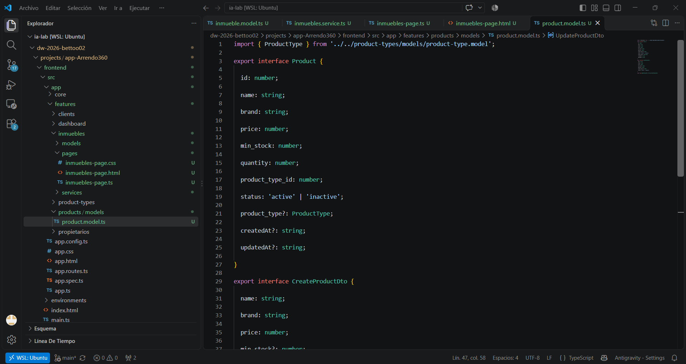

##### **Paso 5: Crear el servicio `src/app/features/products/services/products.service.ts`**

Crea `frontend/src/app/features/products/services/products.service.ts`:

``` typescript
import { Injectable, inject, signal } from '@angular/core';

import { HttpClient } from '@angular/common/http';

import { Observable, tap } from 'rxjs';

import { environment } from '../../../../environments/environment';

import { ApiResponse } from '../../../core/models/api-response.model';

import { CreateProductDto, Product, UpdateProductDto } from '../models/product.model';

interface ProductsListPayload {

  products?: Product[];

  items?: Product[];

  total: number;

  page: number;

  limit: number;

}

@Injectable({

  providedIn: 'root',

})

export class ProductsService {

  private readonly http = inject(HttpClient);

  private readonly apiUrl = `${environment.apiUrl}/products`;

  readonly products = signal<Product[]>([]);

  readonly loading = signal<boolean>(false);

  loadProducts(): void {

    this.loading.set(true);

    this.http

      .get<ApiResponse<ProductsListPayload>>(`${this.apiUrl}?limit=100`)

      .subscribe({

        next: (res) => {

          const list = res.data?.products ?? res.data?.items ?? [];

          this.products.set(list);

          this.loading.set(false);

        },

        error: () => {

          this.loading.set(false);

        },

      });

  }

  create(dto: CreateProductDto): Observable<ApiResponse<{ product: Product }>> {

    return this.http

      .post<ApiResponse<{ product: Product }>>(this.apiUrl, dto)

      .pipe(tap(() => this.loadProducts()));

  }

  update(id: number, dto: UpdateProductDto): Observable<ApiResponse<{ product: Product }>> {

    return this.http

      .patch<ApiResponse<{ product: Product }>>(`${this.apiUrl}/${id}`, dto)

      .pipe(tap(() => this.loadProducts()));

  }

  toggleStatus(item: Product): Observable<ApiResponse<{ product: Product }>> {

    const action = item.status === 'active' ? 'deactivate' : 'activate';

    return this.http

      .patch<ApiResponse<{ product: Product }>>(`${this.apiUrl}/${item.id}/${action}`, {})

      .pipe(tap(() => this.loadProducts()));

  }

}
```

##### 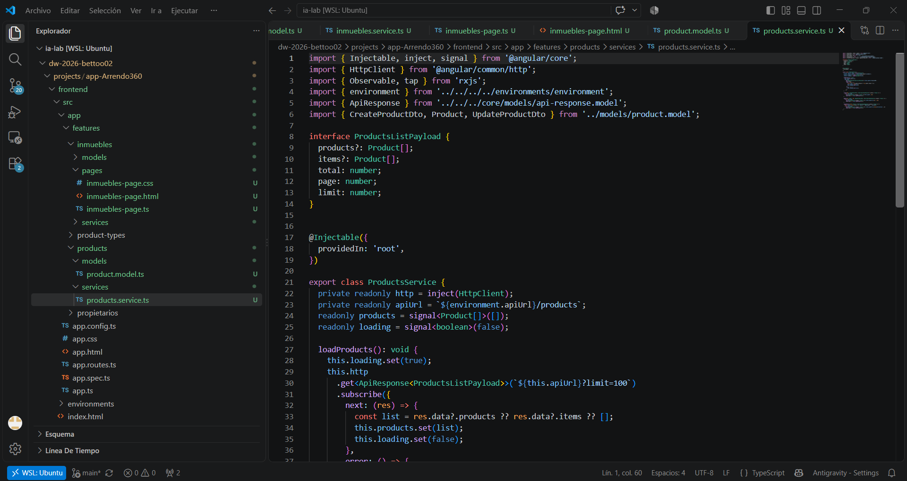

##### **Paso 6: Generar el componente `ProductsPage`**

En tu terminal dentro de `frontend/`:

``` bash
npx ng g c features/products/pages/products-page --flat --skip-tests
```

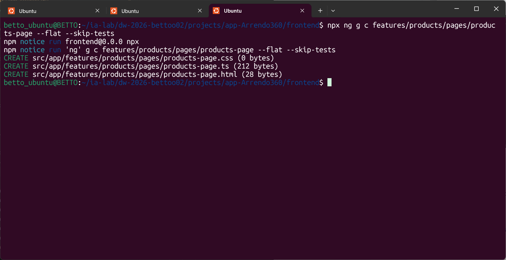

1.  En `frontend/src/app/features/products/pages/products-page.ts`, usamos `computed()` para filtrar solo los `ProductTypes` activos:

``` typescript
import { Component, OnInit, computed, inject, signal } from '@angular/core';

import { DecimalPipe } from '@angular/common';

import { FormBuilder, ReactiveFormsModule, Validators } from '@angular/forms';

import { TableModule } from 'primeng/table';

import { ButtonModule } from 'primeng/button';

import { DialogModule } from 'primeng/dialog';

import { InputTextModule } from 'primeng/inputtext';

import { InputNumberModule } from 'primeng/inputnumber';

import { SelectModule } from 'primeng/select';

import { TagModule } from 'primeng/tag';

import { ProductsService } from '../services/products.service';

import { ProductTypesService } from '../../product-types/services/product-types.service';

import { Product } from '../models/product.model';

@Component({

  selector: 'app-products-page',

  imports: [

    DecimalPipe,

    ReactiveFormsModule,

    TableModule,

    ButtonModule,

    DialogModule,

    InputTextModule,

    InputNumberModule,

    SelectModule,

    TagModule,

  ],

  templateUrl: './products-page.html',

  styleUrl: './products-page.css',

})

export class ProductsPage implements OnInit {

  protected readonly productsService = inject(ProductsService);

  protected readonly productTypesService = inject(ProductTypesService);

  private readonly fb = inject(FormBuilder);

  // Signal computado: solo permite elegir tipos de producto activos al crear/editar

  protected readonly activeProductTypes = computed(() =>

    this.productTypesService.productTypes().filter((t) => t.status === 'active'),

  );

  protected readonly dialogVisible = signal(false);

  protected readonly editingItem = signal<Product | null>(null);

  protected readonly saving = signal(false);

  protected readonly errorMsg = signal<string | null>(null);

  protected readonly form = this.fb.nonNullable.group({

    name: ['', [Validators.required, Validators.minLength(2)]],

    brand: ['', [Validators.required, Validators.minLength(2)]],

    price: [0, [Validators.required, Validators.min(0.01)]],

    quantity: [0, [Validators.required, Validators.min(0)]],

    min_stock: [5, [Validators.required, Validators.min(0)]],

    product_type_id: [0, [Validators.required, Validators.min(1)]],

  });

  ngOnInit(): void {

    this.productsService.loadProducts();

    this.productTypesService.loadProductTypes();

  }

  protected getTypeName(item: Product): string {

    if (item.product_type?.name) return item.product_type.name;

    const found = this.productTypesService

      .productTypes()

      .find((t) => t.id === item.product_type_id);

    return found ? found.name : `Tipo #${item.product_type_id}`;

  }

  protected openNew(): void {

    this.editingItem.set(null);

    this.errorMsg.set(null);

    const firstType = this.activeProductTypes()[0]?.id ?? 0;

    this.form.reset({

      name: '',

      brand: '',

      price: 100000,

      quantity: 10,

      min_stock: 2,

      product_type_id: firstType,

    });

    this.dialogVisible.set(true);

  }

  protected openEdit(item: Product): void {

    this.editingItem.set(item);

    this.errorMsg.set(null);

    this.form.reset({

      name: item.name,

      brand: item.brand,

      price: Number(item.price),

      quantity: Number(item.quantity),

      min_stock: Number(item.min_stock),

      product_type_id: item.product_type_id,

    });

    this.dialogVisible.set(true);

  }

  protected save(): void {

    if (this.form.invalid) {

      this.form.markAllAsTouched();

      return;

    }

    this.saving.set(true);

    this.errorMsg.set(null);

    const payload = this.form.getRawValue();

    const current = this.editingItem();

    const request$ = current

      ? this.productsService.update(current.id, payload)

      : this.productsService.create(payload);

    request$.subscribe({

      next: () => {

        this.saving.set(false);

        this.dialogVisible.set(false);

      },

      error: (err) => {

        this.saving.set(false);

        this.errorMsg.set(err?.error?.message ?? 'Error al guardar el producto.');

      },

    });

  }

  protected onToggleStatus(item: Product): void {

    this.productsService.toggleStatus(item).subscribe();

  }

}
```

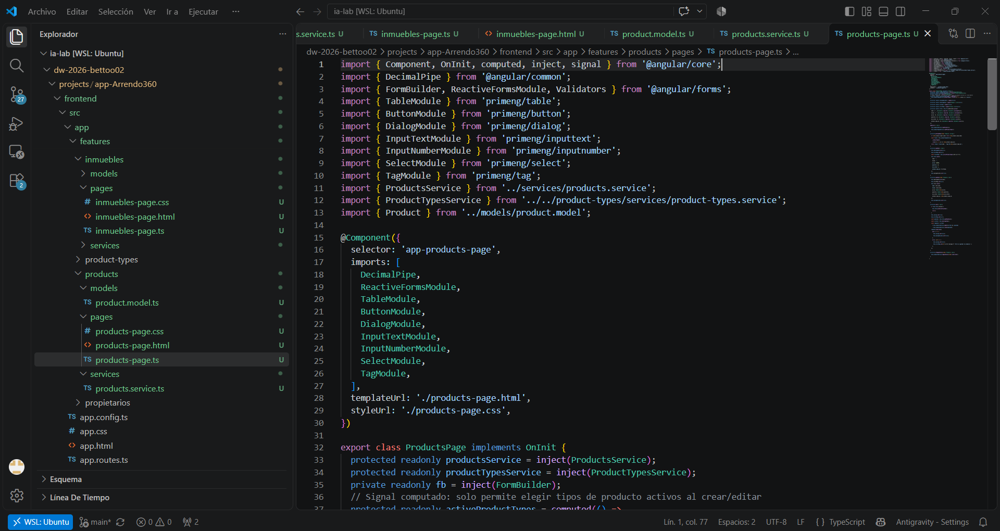

2.  En `frontend/src/app/features/products/pages/products-page.html`:

``` html
<div class="space-y-6">

  <div class="bg-white rounded-xl border border-slate-200 p-6 shadow-xs flex items-center justify-between">

    <div>

      <h2 class="text-xl font-bold text-slate-800">Catálogo de Productos e Inventario</h2>

      <p class="text-sm text-slate-500 mt-1">

        ISS-05: Gestión de productos, precios, control de stock mínimo y categoría (/api/products)

      </p>

    </div>

    <div class="flex items-center gap-2">

      <p-button

        label="Recargar"

        icon="pi pi-refresh"

        severity="secondary"

        [outlined]="true"

        (onClick)="productsService.loadProducts()"

      />

      <p-button

        label="Nuevo Producto"

        icon="pi pi-plus"

        severity="success"

        (onClick)="openNew()"

      />

    </div>

  </div>

  <div class="bg-white rounded-xl border border-slate-200 p-4 shadow-xs">

    <p-table

      [value]="productsService.products()"

      [loading]="productsService.loading()"

      [paginator]="true"

      [rows]="10"

      [rowHover]="true"

      dataKey="id"

    >

      <ng-template #header>

        <tr>

          <th>ID</th>

          <th>Producto</th>

          <th>Marca</th>

          <th>Categoría</th>

          <th>Precio</th>

          <th>Stock Actual / Mín.</th>

          <th>Estado</th>

          <th class="text-right">Acciones</th>

        </tr>

      </ng-template>

      <ng-template #body let-item>

        <tr>

          <td class="font-mono text-xs text-slate-500">#{{ item.id }}</td>

          <td class="font-semibold text-slate-800">{{ item.name }}</td>

          <td>{{ item.brand }}</td>

          <td>

            <span class="px-2.5 py-1 rounded-md bg-slate-100 text-slate-700 text-xs font-medium">

              {{ getTypeName(item) }}

            </span>

          </td>

          <td class="font-mono font-medium text-emerald-700">

            ${{ item.price | number: '1.0-2' }}

          </td>

          <td>

            <div class="flex items-center gap-2">

              <span class="font-semibold">{{ item.quantity }}</span>

              <span class="text-xs text-slate-400">/ mín {{ item.min_stock }}</span>

              @if (item.quantity <= item.min_stock) {

                <p-tag value="Stock Bajo" severity="warn" />

              }

            </div>

          </td>

          <td>

            <p-tag

              [value]="item.status === 'active' ? 'Activo' : 'Inactivo'"

              [severity]="item.status === 'active' ? 'success' : 'danger'"

            />

          </td>

          <td class="text-right space-x-1">

            <p-button

              icon="pi pi-pencil"

              [rounded]="true"

              [text]="true"

              severity="info"

              title="Editar"

              (onClick)="openEdit(item)"

            />

            <p-button

              [icon]="item.status === 'active' ? 'pi pi-ban' : 'pi pi-check'"

              [rounded]="true"

              [text]="true"

              [severity]="item.status === 'active' ? 'danger' : 'success'"

              [title]="item.status === 'active' ? 'Desactivar' : 'Reactivar'"

              (onClick)="onToggleStatus(item)"

            />

          </td>

        </tr>

      </ng-template>

      <ng-template #emptymessage>

        <tr>

          <td colspan="8" class="text-center py-8 text-slate-500">

            No hay productos registrados aún.

          </td>

        </tr>

      </ng-template>

    </p-table>

  </div>

  <p-dialog

    [header]="editingItem() ? 'Editar Producto' : 'Nuevo Producto'"

    [visible]="dialogVisible()"

    (visibleChange)="dialogVisible.set($event)"

    [modal]="true"

    [style]="{ width: '34rem' }"

  >

    <form [formGroup]="form" (ngSubmit)="save()" class="space-y-4 pt-2">

      @if (errorMsg()) {

        <div class="p-3 rounded-lg bg-red-50 border border-red-200 text-red-700 text-sm">

          {{ errorMsg() }}

        </div>

      }

      <div class="flex flex-col gap-1">

        <label class="text-xs font-semibold text-slate-600">Tipo de Producto (Solo Activos) *</label>

        <p-select

          formControlName="product_type_id"

          [options]="activeProductTypes()"

          optionLabel="name"

          optionValue="id"

          placeholder="Seleccione una categoría activa"

          appendTo="body"

        />

      </div>

      <div class="grid grid-cols-2 gap-4">

        <div class="flex flex-col gap-1">

          <label class="text-xs font-semibold text-slate-600">Nombre del Producto *</label>

          <input pInputText formControlName="name" placeholder="Ej. Kit Mantenimiento Eléctrico" />

        </div>

        <div class="flex flex-col gap-1">

          <label class="text-xs font-semibold text-slate-600">Marca / Proveedor *</label>

          <input pInputText formControlName="brand" placeholder="Ej. HomePro" />

        </div>

      </div>

      <div class="grid grid-cols-3 gap-4">

        <div class="flex flex-col gap-1">

          <label class="text-xs font-semibold text-slate-600">Precio Unitario *</label>

          <p-inputnumber formControlName="price" mode="decimal" [min]="0.01" />

        </div>

        <div class="flex flex-col gap-1">

          <label class="text-xs font-semibold text-slate-600">Cantidad Stock *</label>

          <p-inputnumber formControlName="quantity" [min]="0" />

        </div>

        <div class="flex flex-col gap-1">

          <label class="text-xs font-semibold text-slate-600">Stock Mínimo *</label>

          <p-inputnumber formControlName="min_stock" [min]="0" />

        </div>

      </div>

      <div class="flex justify-end gap-2 pt-4 border-t border-slate-200">

        <p-button

          label="Cancelar"

          severity="secondary"

          [text]="true"

          (onClick)="dialogVisible.set(false)"

        />

        <p-button

          label="Guardar"

          icon="pi pi-check"

          severity="success"

          type="submit"

          [loading]="saving()"

        />

      </div>

    </form>

  </p-dialog>

</div>
```

#### 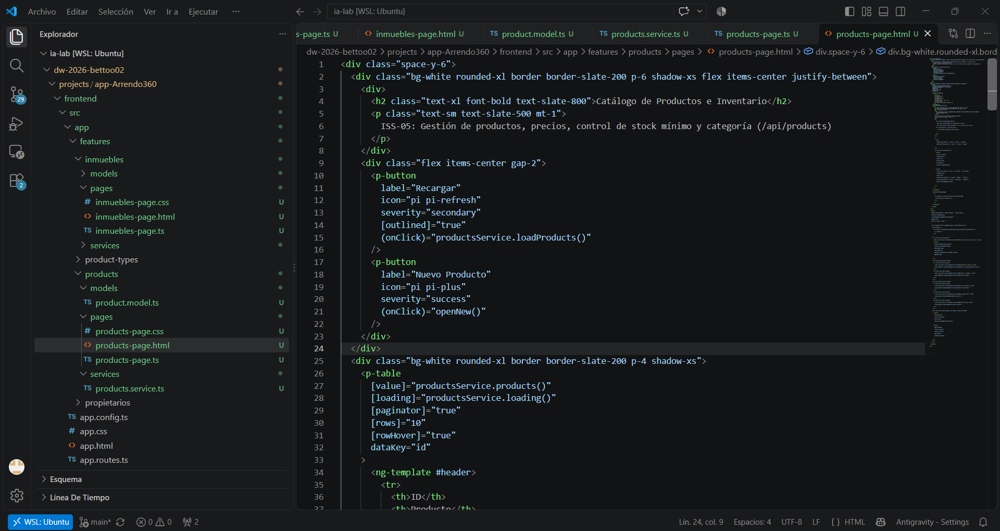

#### **Paso 7: Registrar `/inmuebles` y `/products` en `src/app/app.routes.ts`**

Abre `frontend/src/app/app.routes.ts` y añade las dos rutas nuevas:

``` typescript
import { Routes } from '@angular/router';

import { Dashboard } from './features/dashboard/dashboard/dashboard';

import { ClientsPage } from './features/clients/pages/clients-page';

import { ProductTypesPage } from './features/product-types/pages/product-types-page';

import { PropietariosPage } from './features/propietarios/pages/propietarios-page';

import { InmueblesPage } from './features/inmuebles/pages/inmuebles-page';

import { ProductsPage } from './features/products/pages/products-page';

export const routes: Routes = [

  { path: 'dashboard', component: Dashboard },

  { path: 'clients', component: ClientsPage },

  { path: 'propietarios', component: PropietariosPage },

  { path: 'inmuebles', component: InmueblesPage },

  { path: 'product-types', component: ProductTypesPage },

  { path: 'products', component: ProductsPage },

  { path: '', pathMatch: 'full', redirectTo: 'dashboard' },

  { path: '**', redirectTo: 'dashboard' },

];
```

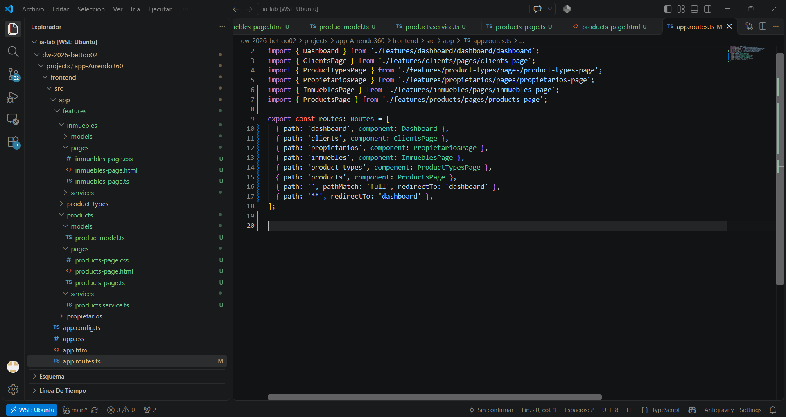

**INMUEBLE**

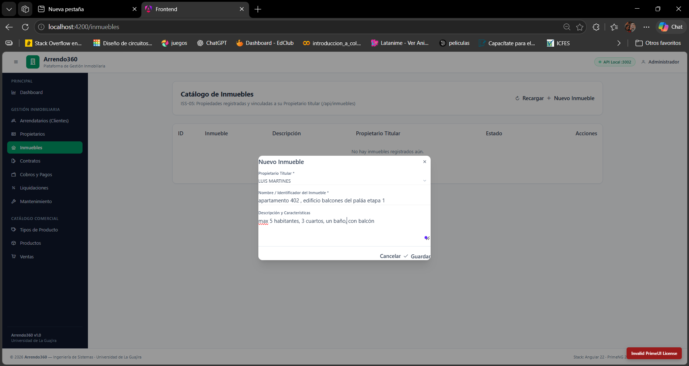

**PRODUCTOS**

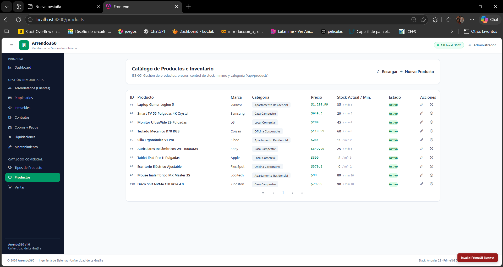
